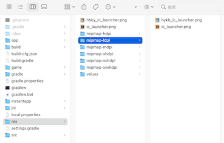
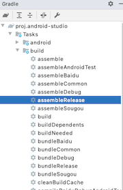
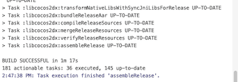
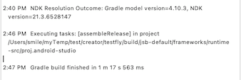
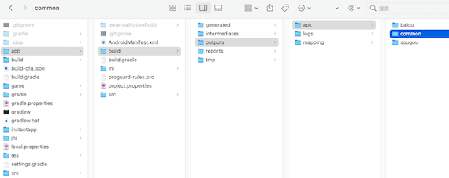
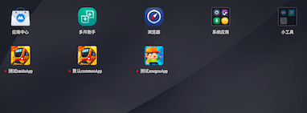
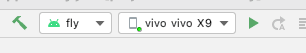

之前的文章都是讲Cocos Creator 如何在原生上通信和踩坑以及一些小技巧的，这篇文章简单的说说如何多渠道打包，由于学习时间有限，这篇文章简单的说说如何多渠道配置包名和更改app名字和App图标样式。
<!--more-->
首先，我们需要用Cocos Creator 正常出安卓包，然后才能进行下面操作

## 环境

- Cocos Creator 2.4.3
- Gradle 4.1.10 （cocos 默认构建输出）
- gradle 插件版本 3.2.0 （cocos 默认构建输出）

## 步骤

### 配置Gradle 文件

在项目的 `gradle` 文件的`android`对象添加 多渠道配置

```groovy
android {
    compileSdkVersion PROP_COMPILE_SDK_VERSION.toInteger()
    buildToolsVersion PROP_BUILD_TOOLS_VERSION

    defaultConfig {
        applicationId "org.cocos2d.demo"
        minSdkVersion PROP_MIN_SDK_VERSION
        targetSdkVersion PROP_TARGET_SDK_VERSION
        versionCode 1
        versionName "1.0"

    // 渠道的维度，支持不同维度的渠道
    flavorDimensions "app"
    productFlavors {
        common {
            manifestPlaceholders = [
                    youmi_channel: "common",
                    app_name     : "默认commonApp",
                    app_icon     : "@mipmap/ic_launcher"]
            dimension "app"
        }
        baidu {
            applicationId "org.cocos2d.demo.baidu"
            //这样最终的包名是 org.cocos2d.demo.baidu
            manifestPlaceholders = [
                    youmi_channel: "baidu",
                    app_name     : "测试baiduApp",
                    app_icon     : "@mipmap/ic_launcher"]
            dimension "app"
        }
        sougou {
            applicationId "org.cocos2d.demo.sougou"
            //这样最终的包名是 org.cocos2d.demo.sougou
            manifestPlaceholders = [
                    youmi_channel: "sougou",
                    app_name     : "测试sougouApp",
                    app_icon     : "@mipmap/hykb_ic_launcher"]
            dimension "app"
        }
    } 
}

```

其中值得注意的是 `youmi_channe`、`app_name`、`app_icon` 这三个都分别是三个变量名字，因为是变量，所以会跟随渠道不同而变成不同的值。

ic_launcher 和 hykb_ic_launcher 是图标素材 默认生成了一份 ic_launcher的图标 我们在 生成 hykb_ic_launcher 一套这样素材 放到 对应目录，比如我的：



### 配置AndroidManifest.xml

根据前面我们的配置 接下来配置AndroidManifest.xml

```xml
    <application
        android:allowBackup="true"
        android:label="${app_name}"
        android:usesCleartextTraffic="true"
        android:icon="${app_icon}"
        tools:replace="android:label">
        <!-- Tell Cocos2dxActivity the name of our .so -->
        <meta-data android:name="android.app.lib_name"
            android:value="cocos2djs" />
        <meta-data
            android:name="youmi_channel"
            android:value="${youmi_channel}"/>
        <meta-data
            android:name="app_name"
            android:value="${app_name}"/>
        <meta-data
            android:name="app_icon"
            android:value="${app_icon}"/>
        <activity
            android:name="org.cocos2dx.javascript.AppActivity"
            android:screenOrientation="portrait"
            android:configChanges="orientation|keyboardHidden|screenSize|screenLayout"
            android:label="${app_name}"
            android:theme="@android:style/Theme.NoTitleBar.Fullscreen"
            android:launchMode="singleTask"
            android:taskAffinity="" >
            <intent-filter>
                <action android:name="android.intent.action.MAIN" />

                <category android:name="android.intent.category.LAUNCHER" />
            </intent-filter>
        </activity>
    </application>
```

其中核心代码是

```xml
 				<meta-data
            android:name="youmi_channel"
            android:value="${youmi_channel}"/>
        <meta-data
            android:name="app_name"
            android:value="${app_name}"/>
        <meta-data
            android:name="app_icon"
            android:value="${app_icon}"/>
```

```xml
 				android:label="${app_name}"
        android:icon="${app_icon}"
				tools:replace="android:label"//如果报错 Suggestion: add 'tools:replace="android:label"' to <application> element at AndroidManifest.xml 加上这一行
```

上面说了 把对应的变量在这个文件读取的时候 赋值即可，`youmi_channe` 这个属性暂时没有用到，先做保留使用。

## 构建App

我们打开Android Studio 的右侧 Gradle 窗口 选择自己要的构建类型 这里 我们选择的 release 类型




等待打包结果。这个过程根据渠道多少和 项目大小以及电脑性能有关，一般是5-30分钟不等。





上面这样就是打包成功了！

打包好的路径是`jsb-default/frameworks/runtime-src/proj.android-studio/app/build/outputs/apk/渠道`



## 安装照验证



## 项目代码里获取渠道信息

### 先运行一下项目



这样才能生成 `BuildConfig.java`信息

### AppActivity写代码

```java
import org.cocos2d.demo.BuildConfig;

Log.e("TEST",this.getPackageName());
       
Log.e("TEST", BuildConfig.APPLICATION_ID);
       
Log.e("TEST->FLAVOR", BuildConfig.FLAVOR);
```

我们也可以查看其他信息

```java
package org.cocos2d.demo;

public final class BuildConfig {
  public static final boolean DEBUG = Boolean.parseBoolean("true");
  public static final String APPLICATION_ID = "org.cocos2d.demo.baidu";
  public static final String BUILD_TYPE = "debug";
  public static final String FLAVOR = "baidu";
  public static final int VERSION_CODE = 1;
  public static final String VERSION_NAME = "1.0.0";
}
```

## 踩坑记录

### 记录一 Error:Execution failed for task ':app:processXXXDebugManifest'.

```
Error:Execution failed for task ':app:processXXXDebugManifest'.
> Manifest merger failed with multiple errors, see logs
```

**解决办法**： app的module里面的AndroidManifest.xml文件有冲突的地方，排查一下冲突的字段删除

### 记录二 Execution failed for task ':CnMetro:processCczsReleaseManifest'

```
Execution failed for task ':CnMetro:processCczsReleaseManifest'.
> Manifest merger failed : Attribute application@label value=(进站请刷卡) from AndroidManifest.xml:32:13-40
  	is also present at [GameSdk.aar] AndroidManifest.xml:34:9-41 value=(@string/app_name).
  	Suggestion: add 'tools:replace="android:label"' to <application> element at AndroidManifest.xml:30:5-80:19 to override.
```

**解决办法**：根据提示 添加 `tools:replace="android:label`到<application>元素内

### 报Entry name 'res/layout/notification_action.xml' collided错

**解决办法**： 进入build菜单，clear project 清除一下缓存就好了！

## 参考

- [Gradle多渠道打包(动态设定App名称，应用图标，背景图片，状态栏颜色)](https://blog.csdn.net/u012551350/article/details/62041833)

- [Android 多渠道打包实操（更改包名、图标、主题资源 、替换常量、第三方SDK Appkey配置](https://blog.csdn.net/a23006239/article/details/84977279?utm_medium=distribute.pc_relevant.none-task-blog-BlogCommendFromMachineLearnPai2-1.control&depth_1-utm_source=distribute.pc_relevant.none-task-blog-BlogCommendFromMachineLearnPai2-1.control)

- [Android Studio Gradle多渠道打包(动态设定App名称，应用图标，背景图片，状态栏颜色)、配置签名文件](https://blog.csdn.net/u013474104/article/details/62445309)

  

