春节后，Cocos 团队发力，发布了Cocos Creator 新版本，看了一下更新日志，发现这次修复了很多问题，改善和提升了效率，特别是对于原生平台改善了不少，恰逢项目要出安卓包，正好凑个机会升级一下引擎。下面就是这次升级的步骤和遇到的问题，以及解决办法。
<!--more-->
官方给出了一长串 修复和改进策略 我们重点查看 和 2d 相关的部分：

> ###### **提升网页预览时的加载速度**
>
> 为了进一步提升开发效率，我们优化了网页预览时的脚本加载速度。不论是对引擎还是项目中的代码，载入速度都获得了提升。特别是在开启自定义引擎，或者使用手机扫码预览时，开发者都能得到更顺畅的体验。
>
> ###### 新增 Cocos 小秘书服务
>
> 小秘书是由 Cocos 官方面向开发者推出的在线即时付费技术支持服务， 您可以采用 IM 即时沟通的方式，在 Cocos Creator 中直接连线引擎官方技术支持团队。小秘书服务旨在快速解答您在开发过中遇到的各种技术和商务问题，具有以下特点：官方专业团队、高效和私密性。[服务申请入口>](https://www.cocos.com/7373)
>
> .........(省略 查看详细 去 官方文档)
>
> - [Tween] Tween 增加 stopAll、stopAllByTag、stopAllByTarget 等接口，方便对播放进行控制 [#6338](https://github.com/cocos-creator/engine/pull/6338)
> - [Tween] 增加 bezierTo、bezierBy、flipX、flipY、blink 接口 [#6327](https://github.com/cocos-creator/engine/pull/6327)
> - [Tween] 优化 Tween.to、Tween.by 的 API 代码智能提示，可以智能展示 target 属性
> - [3D] 增加 Node.forward、Node.right、Node.up API 用于获取节点在世界坐标系中的各个方向 [#6287](https://github.com/cocos-creator/engine/pull/6287)
>
> .........(省略 查看详细 去 官方文档)
>
> 从 2.3.0 开始，定制安卓原生工程时，需注意 **Android** 与 **Android Instant** 使用了同一个构建模板。
>
> - 如果是 Android 平台单独使用的代码请放入 app/src 目录,  单独使用的第三方库请放入 app/libs 目录。
> - 如果是 Android Instant 单独使用的代码和第三方库请分别放入 game/src, game/libs 目录。
> - 如果是 Android 和 Android Instant 共用的代码和第三方库，请分别放入 proj.android-studio 根目录底下的 src 目录和 libs 目录。
> - proj.android-studio 根目录底下 jni/CocosAndroid.mk , jni/CocosApplication.mk，主要用于配置引擎相关的配置，开发者的配置，建议 Android 放到 app/jni/Android.mk 和 app/jni/Application.mk中，Android Instant 请放入 game/jni/Android.mk 和 game/jni/Application.mk 中。
> - 此外，在 Cocos Creator 编译 Android 时会默认执行 assembleRelease/Debug，编译 Android Instant 时会执行 instant:assembleRelease/Debug。
>
> **如自定义了音频前后台切换时的暂停逻辑，升级到 2.3.0 后请移除。**
>
> 目前 Creator 游戏在所有平台上前后台互相切换时，都会在内部自动暂停和恢复音频。如果开发者之前有对这一块进行过定制，监听并执行了 cc.audioEngine.pause()/resume() 之类的音频操作，可能会和引擎默认行为冲突。如果有遇到相关的音频问题，只需移除相应的定制代码即可。

看了这么多，选择升级是势在必行了，说干就干开始吧。

### 具体步骤

1. 去官网下载：https://www.cocos.com/creator


1. 下载后 安装 文件：

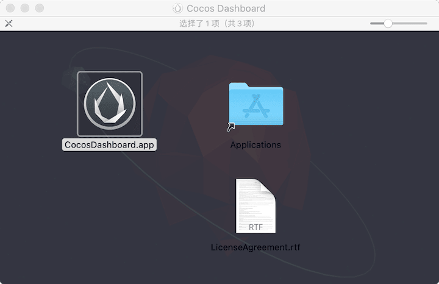

1. 安装成功后 大概长这样：

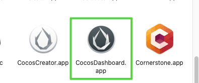

1. 然后我们打开 登录以及设置：

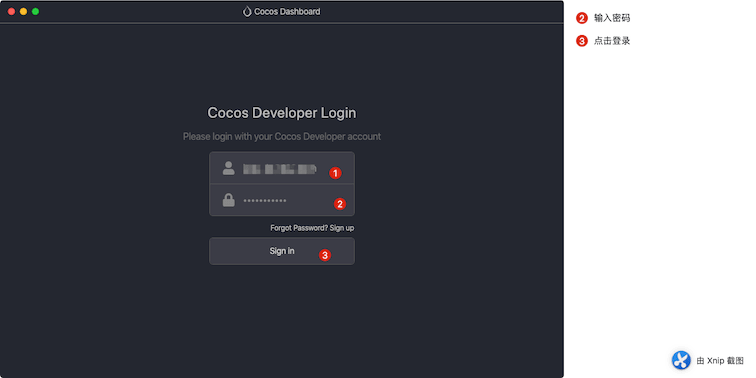

1. 如果打开 显示英文，不习惯英文的 可以设置语言为 中文简体

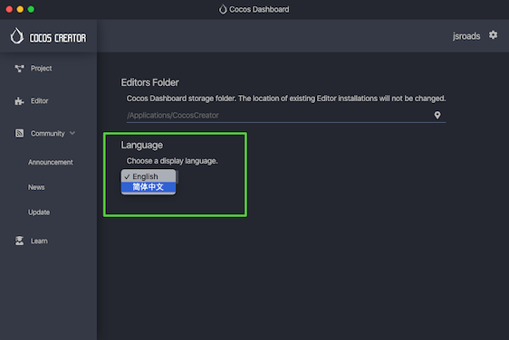

1. 可以设置 下载的编辑器的存放目录

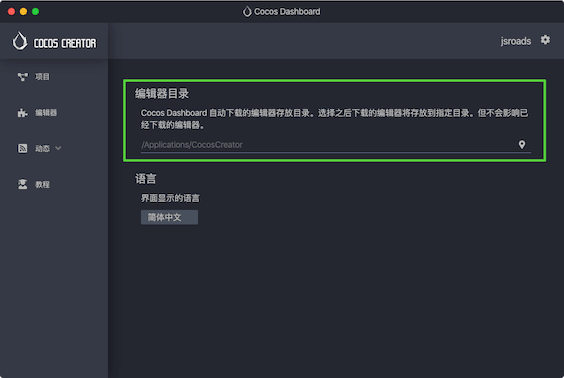

如果 找不到，点击 右上角的 小齿轮 即可设置

1. 左边的Tab切换栏 分别是项目 和编辑器的管理 已经新闻动态（社区宣传和功能更新）以及一个新手入门的教程目录
2. 开始下载我们的编辑器

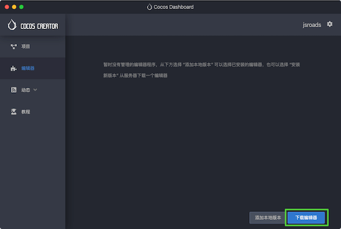

9.选择我们需要的编辑器版本 开始下载 成功后 

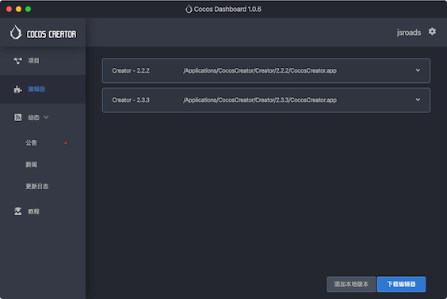

同样 如果我们已经下载好了引擎，可以选择添加本地版本即可。

10.新的版本 变成了这样

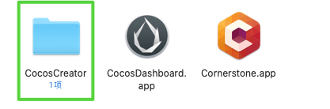

里面 囊括了我们下载的引擎，然后 就可以 打开我们的引擎了。

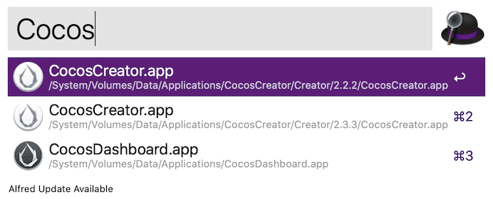

至此，版本成功升级完毕。

### 遇到的问题

代码编辑器，使用Webstorm 习惯了，这次升级带来了一个问题是：打印log的时候 不显示 文件路径了

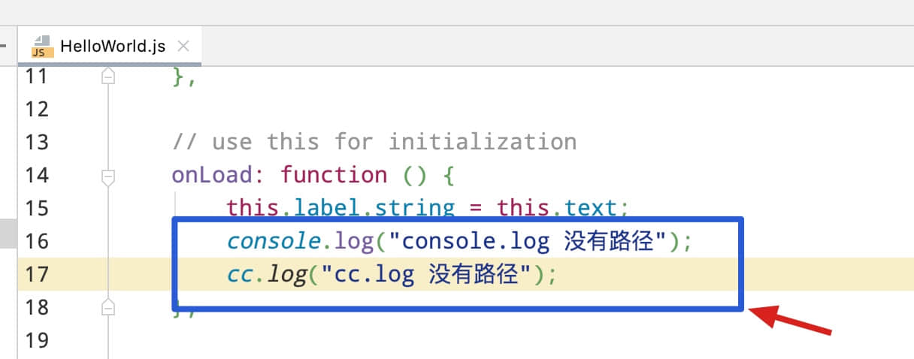


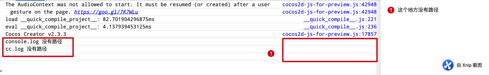

发现 日志记录不在了，但是 用 Cocos Creator 或者 VSCode 甚至 Webstorm 打开的Chome 均显示正常

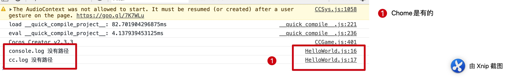

这个 问题 在论坛求助大佬，官方给出了解决方案：

修改 .CocosCreator/profiles/features.json 文件 添加 "bundle-quick-compiler-project": false 即可

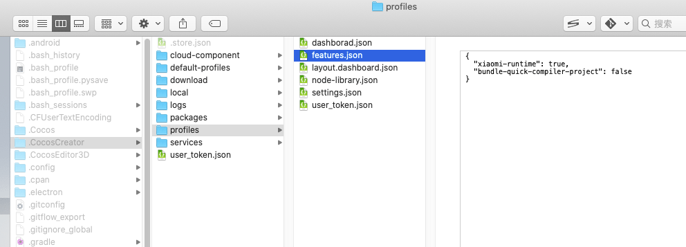

```json
{
  "xiaomi-runtime": true,
  "bundle-quick-compiler-project": false
}
```

最后 感谢Cocos Creator 团队大佬！

### 参考链接

- [Cocos Creator 官网](https://www.cocos.com/creator)
- [Cocos Creator 2.3.3 Webstorm console 控制面板无法输出文件路径](https://forum.cocos.org/t/cocos-creator-2-3-3-webstorm-console/91986)

