Cocos Creator 构建Android项目后，打包时修改版本号, 所以就想着如果版本号不需要每次修改，手动修改版本号 和 版本名字，很是麻烦，于是就想到了能不能自动打包的时候递增版本，于是网上找了一下，还真有这样的方法，下面就说说如何操作的。
<!--more-->

Android 应用的版本管理是依赖 AndroidManifest.xml 中的两个属性：

- `android:versionCode`：版本号，是一个大于 0 的整数，相当于 Build Number，随着版本的更新，这个必须是递增的。大的版本号，覆盖更新小的版本号；
- `android:versionName`：版本名，是一个字符串，例如 `"1.2.0"`，这个是给人看的版本名，系统并不关心这个值，但是合理的版本名，对后期的维护和 bug 修复也非常重要。

Android 应用的版本管理是依赖 AndroidManifest.xml 中的两个属性，通常是在 build.gradle 里面定义这两个值，如下：

```groovy
android {  
    ...
    defaultConfig {
        ...
        versionCode 1
        versionName "1.0"
    }
}
```

`Gradle`基于`Groovy`, 是可以执行一些代码获取数据, 然后再用返回值作为配置属性的。下面说说详细步骤：

## 步骤

### 创建项目并构建安卓版本

1. 新建一个项目，这里我们起名字叫做 `androiddemo`，并构建安卓平台

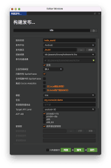


2. 我们使用签名命令生成一个测试密钥 密码为 ：`123456`    alias key 为：`alias_test`  此步骤为后面的记录账号密码用的如果 仅仅是递增版本号码可以跳过

```shell
keytool -genkey -v -keystore test-key.jks -keyalg RSA -keysize 2048 -validity 36500 -alias alias_test -deststoretype pkcs12
```

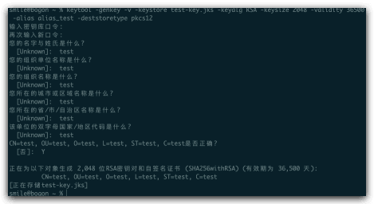

### 配置Android Studio

3. 在app 文件夹新建一个`build.properties` 和 `version.gradle`文件

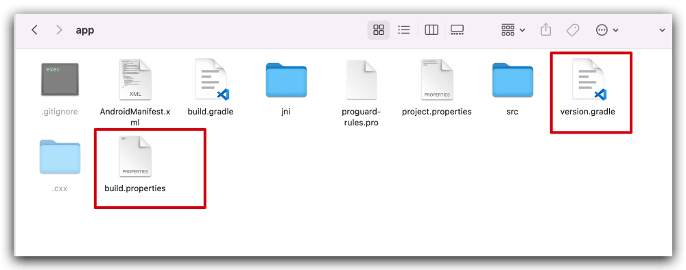

内容分别如下：

`build.properties`：

```groovy
#Build Properties
#Tue Jan 28 09:53:51 CST 2022
app_name=hello_world
version_name=100
version_code=100
version_build=0
```

`version.gradle`：

```groovy
// ---------  version -------------------------------------------------
updateVersion()

def updateVersion() {
    def propertiesFile = file("build.properties")
    Properties properties = readProperties(propertiesFile)

    def versionCode = properties["version_code"].toString().toInteger()
    def versionName = properties["version_name"].toString().toInteger()
    def appName = properties["app_name"].toString()

    if (isReleaseTask(appName)) {
        System.out.println(">>> Building Release...")
        versionCode++
        versionName++
        properties["version_code"] = versionCode.toString()
        properties["version_name"] = versionName.toString()
        writeProperties(propertiesFile, properties)
    }

    android.defaultConfig.versionCode = versionCode
    android.defaultConfig.versionName = versionName + getDateTime()

    System.out.println(">>> " + project.parent.name + "   versionName:" + android.defaultConfig.versionName)

}


def isReleaseTask(appName) {
    def tasks = gradle.getStartParameter().getTaskNames()
    return ":app:assembleRelease" in tasks ||
            "ass" in tasks ||
            "assemble" in tasks ||
            "assembleRelease" in tasks ||
            ":app:bundleRelease" in tasks ||
            "bundleRelease" in tasks||
            ":"+appName+":assembleRelease" in tasks
}

static Properties readProperties(propertiesFile) {
    if (propertiesFile.canRead()) {
        Properties properties = new Properties()
        def inputStream = new FileInputStream(propertiesFile)
        properties.load(inputStream)
        inputStream.close()
        return properties
    } else {
        def message = ">>> Could not read " + propertiesFile.name + " file!"
        System.err.println(message)
        throw new GradleException(message)
    }
}

def static writeProperties(propertiesFile, properties) {
    def writer = propertiesFile.newWriter()
    properties.store(writer, "Build Properties")
    writer.close()
}

def getDateTime(){
    return new Date().format(".YYYYMMddHH", TimeZone.getTimeZone("GMT+08:00"))
}

// ---------  version -------------------------------------------------

```

原有的 `build.gradle` 文件 修改为：

```groovy
apply from: '../config/sign.gradle'
apply from: './version.gradle'
```

```groovy
 defaultConfig {
        applicationId "org.cocos2d.demo"
        minSdkVersion PROP_MIN_SDK_VERSION
        targetSdkVersion PROP_TARGET_SDK_VERSION
        versionCode android.defaultConfig.versionCode
        versionName android.defaultConfig.versionName
          
         //........     
                
 }
```

```groovy
signingConfigs {

       release {
            if (project.hasProperty("RELEASE_STORE_FILE")) {
                storeFile file(RELEASE_STORE_FILE)
                storePassword RELEASE_STORE_PASSWORD
                keyAlias RELEASE_KEY_ALIAS
                keyPassword RELEASE_KEY_PASSWORD
            }
           keyAlias propertyKeyAliasStr
           keyPassword propertyKeyPwdStr
           storeFile file(propertyStoreFileStr)
           storePassword propertyStorePwdStr
        }
    }

```

### 打开构建面板

新版本  目录有变化 `assembleDebug`或`assembleRelease`被放置到other目录下

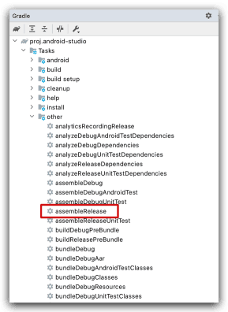

如果没有找到Task 选项 需要 取消勾选 下面的选项

`Android Studio`->`Preferences`..->`Experimental`->[gradle](https://so.csdn.net/so/search?q=gradle&spm=1001.2101.3001.7020)->`Do not build Gradle task list during Gradle sync` 这个勾选去掉

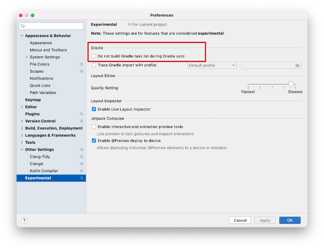

### 配置我们的密钥

1. 新建一个 和 `app` 同级文件夹 `config` 

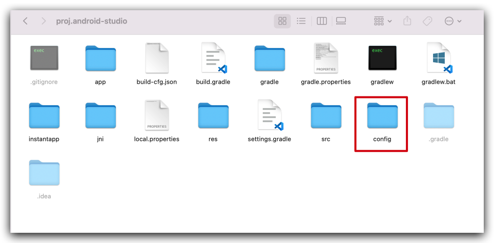

2. 内容如下：

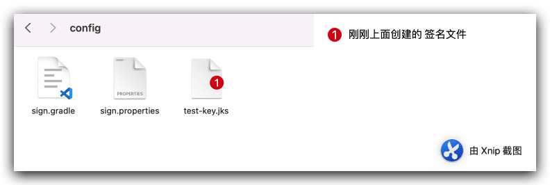

`sign.gradle` 内容：

```groovy
def signingConfigFile='config/sign.properties'
Properties localProperties = new Properties()
localProperties.load(project.rootProject.file(signingConfigFile).newDataInputStream())

def keyAliasStr = localProperties.getProperty("signing.keyAlias",null)
def keyPasswordStr = localProperties.getProperty("signing.keyPassword",null)
def storeFileStr = localProperties.getProperty("signing.storeFile",null)
def storePasswordStr = localProperties.getProperty("signing.storePassword",null)

ext{
    propertyHaveSigningConfigs = (keyAliasStr != null && keyPasswordStr != null && storeFileStr != null && storePasswordStr != null)
    propertyStoreFileStr = storeFileStr
    propertyStorePwdStr = storePasswordStr
    propertyKeyAliasStr = keyAliasStr
    propertyKeyPwdStr = keyPasswordStr
}
```

sign.properties

```groovy
signing.keyAlias=alias_test
signing.keyPassword=123456
signing.storeFile=../config/test-key.jks
signing.storePassword=123456
```

### 构建项目

1. 然后点击 `Tasks` 下面的 `assembleRelease`选项构建项目

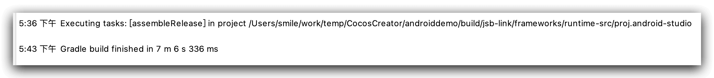

2. 构建结果如下：

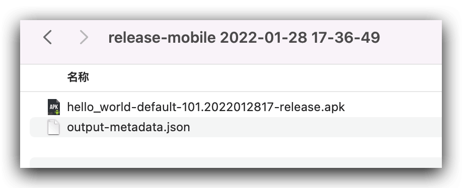

```json
{
  "version": 2,
  "artifactType": {
    "type": "APK",
    "kind": "Directory"
  },
  "applicationId": "org.cocos2d.demo",
  "variantName": "release",
  "elements": [
    {
      "type": "SINGLE",
      "filters": [],
      "versionCode": 101,
      "versionName": "101.2022012817",
      "outputFile": "hello_world-default-101.2022012817-release.apk"
    }
  ]
}

```

 解压`apk` 查看密钥信息

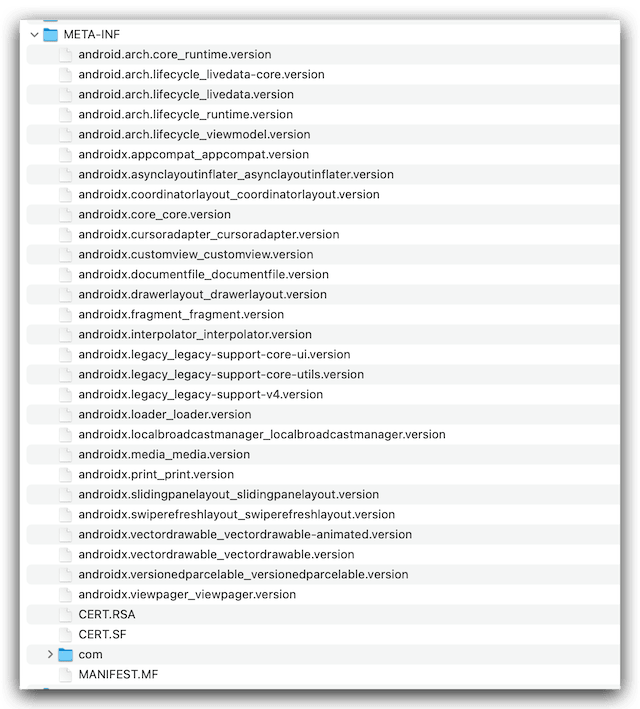

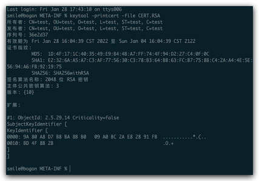

3. 构建文件已经被正常修改

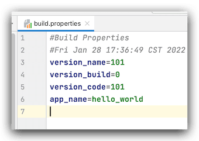

最后 奉上源码地址：[点击进入](https://github.com/jsroads/mylibs/tree/main/androiddemo)

## 总结

其实简单的配置 可以优化我们的构建步骤，让构建更简单，更智能。

## 参考

- [Android Studio的gradle找不到assembleDebug选项解决](https://www.twblogs.net/a/5d735f6fbd9eee5327ff7dc0/?lang=zh-cn)
- [Android Studio 4.2之后不显示 gradle tasks list 问题](https://blog.csdn.net/jiangshanghuai/article/details/120993018)
- [Android gradle 正式编译自动修改版本号](https://juejin.cn/post/7045160712276017160)
- [Gradle动态修改版本号](https://blog.imlushen.com/android-gradle-change-version-automatically/)

