前面一篇文章简单的介绍了，Cocos Creator 开发Android APK 过程中遇到的一些坑，然后通过网上搜索，自己摸索找到了一些解惑和理解的东西，这篇文章再次带大家继续填坑之路，这些是我后面重新为开发项目中遇到的一些问题。
<!--more-->

下面是这几天遇到的问题：

### 错误：

#### 1. ScriptEngine::onGetStringFromFile ./jsb-dragonbones.js not found, possible missing file.

**原因：**很多做了小游戏的同学，在切换版本的时候很容易入坑，这个其实是开发的时候，导入模块不够的问题，在开发web的时候一般为了包体或者游戏主文件更小，采取了用到哪些，勾选哪些，这样如果照搬到安卓平台，就有了这个报错。

**现象：**

```javascript
2020-03-05 17:30:31.640 7446-7475/org.mykj.train E/jswrapper: ScriptEngine::onGetStringFromFile ./jsb-dragonbones.js not found, possible missing file.
2020-03-05 17:30:31.640 7446-7475/org.mykj.train E/jswrapper: ScriptEngine::runScript script ./jsb-dragonbones.js, buffer is empty!
2020-03-05 17:30:31.640 7446-7475/org.mykj.train E/jswrapper: [ERROR] Failed to invoke require, location: /Users/smile/my/build/train/tt/jsb-default/frameworks/cocos2d-x/cocos/scripting/js-bindings/manual/jsb_global.cpp:292

```

或者：

```javascript
2020-03-06 18:51:27.935 28462-28469/? E/os2d.helloworl: Unable to peek into adb socket due to error. Closing socket.: Connection reset by peer
2020-03-06 18:51:28.584 28462-28497/? E/jswrapper: ScriptEngine::onGetStringFromFile ./assemblers/motion-streak.js not found, possible missing file.
2020-03-06 18:51:28.584 28462-28497/? E/jswrapper: ScriptEngine::runScript script ./assemblers/motion-streak.js, buffer is empty!
2020-03-06 18:51:28.584 28462-28497/? E/jswrapper: [ERROR] Failed to invoke require, location: /Users/smile/my/build/ysx/android/jsb-default/frameworks/cocos2d-x/cocos/scripting/js-bindings/manual/jsb_global.cpp:292
2020-03-06 18:51:28.585 28462-28497/? E/jswrapper: ScriptEngine::onGetStringFromFile ./jsb-dragonbones.js not found, possible missing file.
2020-03-06 18:51:28.585 28462-28497/? E/jswrapper: ScriptEngine::runScript script ./jsb-dragonbones.js, buffer is empty!
2020-03-06 18:51:28.585 28462-28497/? E/jswrapper: [ERROR] Failed to invoke require, location: /Users/smile/my/build/ysx/android/jsb-default/frameworks/cocos2d-x/cocos/scripting/js-bindings/manual/jsb_global.cpp:292

```

图片这样的

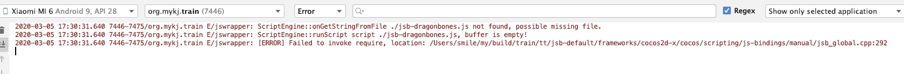


**解决办法：**


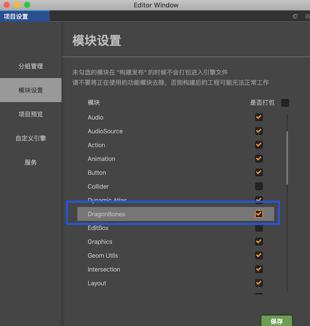

勾选 对应报错 缺失的 模块即可。

#### Android Studio升级3.5后，Instant Run不见了？

有时候看到软件或者编辑器新版本出来了，忍不住要更新尝试新版本的优化成果和新功能，顺便熟悉一波新版本带来的困惑。

打开设置 -> Build,Execution,Deployment -> Debugger -> HotSwap 选中右面的 Enable hot-swap agent for Groovy code

直接搜Instant Run是搜不到的，用HotSwap代替了

参考链接：[Android Studio升级3.5后，Instant Run去哪了？](https://www.jianshu.com/p/bf1c1c594cfa)

#### 安卓签名文件 报警告：

```bash
生成后会提示:
JKS 密钥库使用专用格式。建议使用 "keytool -importkeystore -srckeystore jhy-release-key.jks -destkeystore jhy-release-key.jks -deststoretype pkcs12" 迁移到行业标准格式 PKCS12。
```

签名 生成步骤：

1. 生成签名文件

   ```bash
   keytool -genkey -v -keystore jhy-release-key.jks -keyalg RSA -keysize 2048 -validity 10000 -alias alias_jhy
   ```

   > 输入的密码要记住，其他姓名地区等信息随便填吧，最好还是记住，成功之后在主目录下就生成了`jhy-release-key.keystore`文件，命令中jhy-release-key.keystore是生成文件的名字，`alias_jhy`是别名，随便起但是要记住，一会签名要用到，其他信息如加密、有效日期等就不说了，无需改动。
   >
   > 生成后会提示:
   >  `JKS 密钥库使用专用格式。建议使用 "keytool -importkeystore -srckeystore jhy-release-key.jks -destkeystore jhy-release-key.jks -deststoretype pkcs12" 迁移到行业标准格式 PKCS12。`

2.  执行命令：

   ```bash
   keytool -importkeystore -srckeystore jhy-release-key.jks -destkeystore jhy-release-key.jks -deststoretype pkcs12
   ```

   > 执行结果：`Warning: 已将 "jhy-release-key.jks" 迁移到 Non JKS/JCEKS。将 JKS 密钥库作为 "jhy-release-key.jks.old" 进行了备份。`

   参考链接：[Android打包流程](https://www.jianshu.com/p/7d2def9b93a8)

### 安卓禁止分屏

由于游戏是竖屏玩的，安卓是可以分屏的，在分屏的时候，游戏布局就变了，在某些机器上面 还会引发一些问题，最好的办法就行禁止分屏：

在AndroidManifest.xml文件中的application节点或者activity节点中添加如下：

```xml
android:resizeableActivity="false"
```

### Android Studio 手动安装 插件

有时候 Android Studio 升级后，插件升级 404 失败，我们需要自己下载后 解压手动安装：

安装目录：`/Applications/Android\ Studio.app/Contents/plugins/xxxx(xxxx是你的插件名字)`

### 断网情况下 XMLHttpRequest 在原生端没有 网络错误回调

需要代码监听 onerror 和 ontimeout 这俩

```javascript
				let xhr = new XMLHttpRequest();
        xhr.timeout = 10 * 1000;
        xhr.ontimeout = (ev) => {
            console.log('http_post: request time out.....');
        };
        xhr.onabort = (ev)=>{
            console.log('http_post: request onabort......');
        }
        xhr.onerror = (ev)=>{
            console.log('http_post: request onerror......');
        }
        xhr.onreadystatechange = (ev) => {
            if(xhr.readyState === 4){

            }
        };
```

### 编译报错Cannot fit requested classes in a single dex file (# methods: 74288 > 65536)

添加了 新的 依赖包 就报了这个错误

**问题分析**：当Android App中的方法数超过65535时，如果往下兼容到低版本设备时，就会报编译错误：

原因是Android系统定义总方法数是一个short int，short int 最大值为65536。解决这个问题的方案是：

在Android的模块gradle文件的defaultConfig默认配置里面增加：

```
multiDexEnabled true
```

如果 还报错继续同时在dependencies里面增加：

```
implementation 'com.android.support:multidex:1.0.3'
```

另外需要把AndroidMainfest.xml里面添加自定义的App继承自MultiDexApplication。

### Android 游戏播放视频安卓后台会出现两个app页面

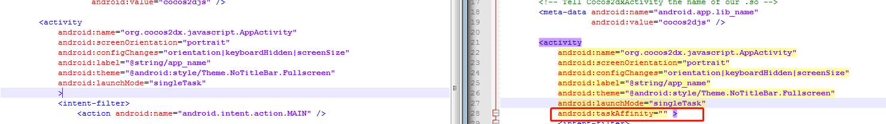

左边是解决答案

```xml
        <activity
            android:name="org.cocos2dx.javascript.AppActivity"
            android:screenOrientation="portrait"
            android:configChanges="orientation|keyboardHidden|screenSize|screenLayout"
            android:label="@string/app_name"
            android:theme="@android:style/Theme.NoTitleBar.Fullscreen"
            android:resizeableActivity="false"
            android:launchMode="singleTask">
            <!--          android:taskAffinity="" >-->
            <intent-filter>
                <action android:name="android.intent.action.MAIN" />

                <category android:name="android.intent.category.LAUNCHER" />
            </intent-filter>
        </activity>
```

#### Android 安装包没有签名文件问题

内容简介：当使用Android studio 打好一个release 包，上传到市场平台的时候，却被提示解析失败，没有签名文件，把打好的包改成zip格式，解压看了一下

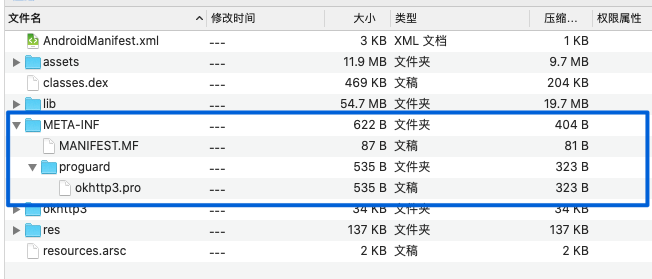

确实签名文件应该在META-INF文件夹下，后缀名是.RSA的文件，确实是没有。

查看了一下自己的打包过程，发现了一个小问题

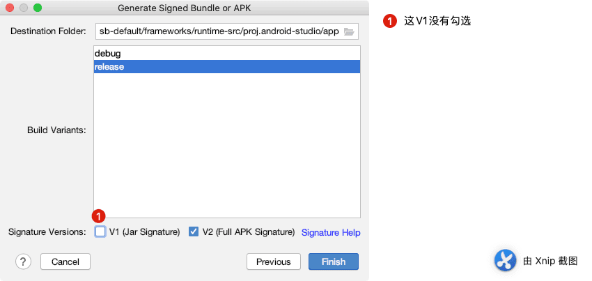

V2这种签名方案是 [Android](http://www.codercto.com/category/android.html) 7.0引入的，它能提供更快的应用安装时间和更多针对未授权 APK 文件更改的保护。具体请看 [这里](https://developer.android.google.cn/about/versions/nougat/android-7.0#apk_signature_v2) 。V1适用于所有android版本的机型，但在Android7.0及以上会缺少针对未授权 APK 文件更改的保护；只勾选V2，Android7.0以下的机型会报错，所以这里建议同时勾选V1，V2，以适用所有机型。

发现问题所在，重新打包，发现还是不可以，再从网上搜索了一下，发现自己的build.gradle 文件有问题：

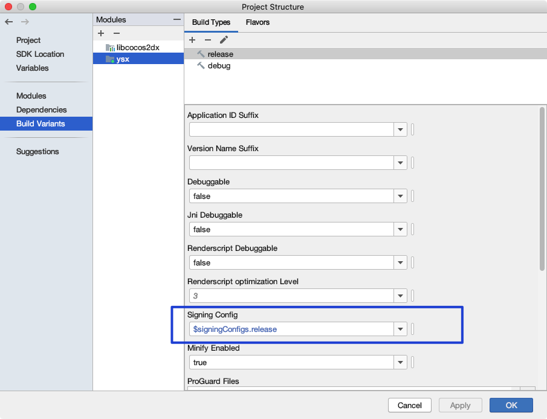

或者修改：`build.gradle`文件


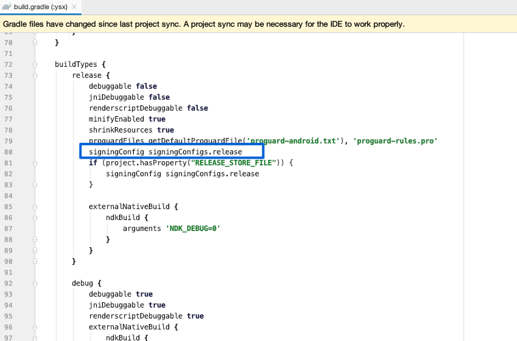

再重新打包上传，一切OK。

#### 添加全局文件

比如我需要添加两个全局文件

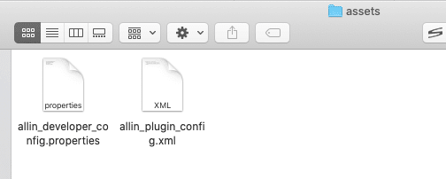

此时需要在 build.gradle 配置 assets.srcDir "assets"

```yaml
    sourceSets.main {
        java.srcDir "src"
        res.srcDir "res"
        jniLibs.srcDir "libs"
        manifest.srcFile "AndroidManifest.xml"
        assets.srcDir "assets"
    }
```

#### 本地预览和debug的apk激励视频广告正常 release 包不能播放

之前一直以为release 包不能看日志，搜索后得知是可以的。只需要  debuggable true  加入 buildTypes {} 

```yaml
buildTypes {
    release {
        minifyEnabled false
        debuggable true  //true代表开启  false 关闭
        proguardFiles getDefaultProguardFile('proguard-android.txt'), 'proguard-rules.pro'
        signingConfig signingConfigs.config
    }
    debug {
        signingConfig signingConfigs.config
    }
}

```

原文链接：[android studio release版本下打印输出日志](https://blog.csdn.net/suyimin2010/java/article/details/96472922)

有了日志，基本定位就快了，于是很快找到了报错  J`avaScriptJavaBridge: Classloader failed to find class of xxxxx(我的包名)`  再次查找后，得知是release 打包的时候混淆代码，后面调用的时候，不认识了。

在项目下的 混淆配置文件  proguard-rules.pro 里面 最后加上 ：


```yaml
# 自己游戏的包名 否则release 版本 有时候找不到 类的方法
-keep class com.my.trainkwai.** {*;}
```

原文链接:[creator 安卓release包 js调java找不到该java文件的问题](https://forum.cocos.org/t/creator-release-js-java-java/73081)

这样 打出的包，就能顺利找到 方法。

#### 安卓平台 游戏高度适配不正确 上下游黑边

游戏发布了新版本后，在AndroidManifest.xml中设置android:screenOrientation="portrait"，升级gradle后这里会有警告，在有些手机上 会出现上下黑边

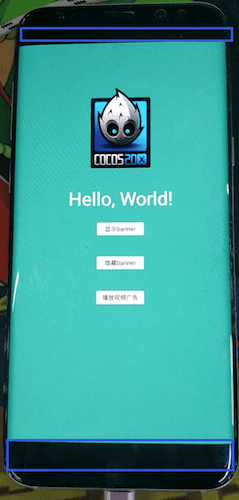

设置

```xml
<manifest xmlns:android="http://schemas.android.com/apk/res/android"
    package="com.my.trainkwai"
    xmlns:tools="http://schemas.android.com/tools"
    android:installLocation="auto">
    <uses-feature android:glEsVersion="0x00020000" />
```

和 application 标签

```xml
 <application
        android:allowBackup="true"
        android:label="@string/app_name"
        android:usesCleartextTraffic="true"
        tools:ignore="LockedOrientationActivity"
        android:icon="@mipmap/ic_launcher">

```

在application标签里，加入`tool:ignore="LockedOrientationActivity"`这句话，manifest标签里引入tool`xmlns:tool="http://schemas.android.com/tools"`

参考链接：[android:screenOrientation="portrait" 一直警告报红](https://www.jianshu.com/p/400f62002784)

#### ScriptEngine::onGetStringFromFile ./jsb-dragonbones.js not found, possible missing file.

**原因：**很多做了小游戏的同学，在切换版本的时候很容易入坑，这个其实是开发的时候，导入模块不够的问题，在开发web的时候一般为了包体或者游戏主文件更小，采取了用到哪些，勾选哪些，这样如果照搬到安卓平台，就有了这个报错。

解决办法：把对应的类库 勾选 再次打包 即可

#### 断网情况下 XMLHttpRequest 在原生端没有 网络错误回调

需要代码监听 onerror 和 ontimeout 这俩

```javascript
				let xhr = new XMLHttpRequest();
        xhr.timeout = 10 * 1000;
        xhr.ontimeout = (ev) => {
            console.log('http_post: request time out.....');
        };
        xhr.onabort = (ev)=>{
            console.log('http_post: request onabort......');
        }
        xhr.onerror = (ev)=>{
            console.log('http_post: request onerror......');
        }
        xhr.onreadystatechange = (ev) => {
            if(xhr.readyState === 4){

            }
        };
```

#### 优化 更改Cocos Creator apk 默认输出的名字

这个网上有很多方法：

我这边 最后验证成功的是：需要在 `build.gradle`文件内的 `android.applicationVariants.all` 里面配置

大概结构：

```yaml
android.applicationVariants.all { variant ->
    // delete previous files first
    delete "${buildDir}/intermediates/merged_assets/${variant.dirName}"

    variant.mergeAssets.doLast {
        def sourceDir = "${buildDir}/../../../../.."

        copy {
            from "${sourceDir}/assets"
            into "${outputDir}/assets"
        }

        copy {
            from "${sourceDir}/src"
            into "${outputDir}/src"
        }

        copy {
            from "${sourceDir}/jsb-adapter"
            into "${outputDir}/jsb-adapter"
        }

        copy {
            from "${sourceDir}/main.js"
            from "${sourceDir}/project.json"
            into outputDir
        }
    }
    if (variant.buildType.name == 'release') {
        def buildTypeName = variant.buildType.name
        def createTime = new Date().format("YYYY-MM-dd HH-mm-ss", TimeZone.getTimeZone("GMT+08:00"))
        def releaseFileName = "${buildTypeName}-mobile ${createTime}"
        //def releaseApkName = "${project.name}-${android.defaultConfig.versionName}-${android.defaultConfig.versionCode}-${buildTypeName}.apk"
        def releaseApkName = "${project.name}-${android.defaultConfig.versionName}-${buildTypeName}.apk"
        println("版本名称--->" + android.defaultConfig.versionName + " 版本号--->" + android.defaultConfig.versionCode)
        //println(project.name)
        //println(rootProject.name)
        //新建一个文件夹 然后把输出app 放到新建的文件夹内
        variant.getPackageApplication().outputDirectory = new File(variant.getPackageApplication().outputDirectory,releaseFileName)
        variant.getPackageApplication().outputScope.apkDatas.forEach { apkData ->
            //这个修改输出APK的文件名
            println(apkData.outputFileName)
            apkData.outputFileName = releaseApkName
            println(apkData.outputFileName)
        }
    }
}
```

### 报错：Error while Uploading and launching Instant App

错误现象

```bash
Error while Uploading and launching Instant App  
```

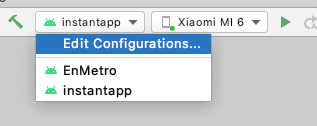

找到问题，启动时应该选择自己的游戏 app，以前选成了instantapp

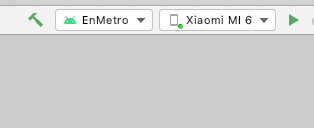

### 报错：Program type already present: com.amazing.media.AudioPlayer

```bash
Program type already present: com.amazing.media.AudioPlayer
```

解决办法:


```yaml
 //在你app的依赖项里如下配置即可依赖所有
implementation(name: 'VESdk', ext: 'aar')//VE SDK依赖
implementation(name: 'GameSdk', ext: 'aar')
implementation(name: 'alipaySdk-15.6.8-20191021122514', ext: 'aar')//VE SDK依赖
implementation "pl.droidsonroids.gif:android-gif-drawable:1.2.6"

implementation 'com.android.support:cardview-v7:28.0.0'
implementation 'com.android.support:support-v4:28.0.0'
implementation "com.android.support:appcompat-v7:28.0.0"
implementation "com.android.support:recyclerview-v7:28.0.0"
implementation 'com.google.code.gson:gson:2.8.6'
configurations {
    compile.exclude module: 'GameSdk'
}
```
GameSdk 是冲突的 类库或者依赖


### 参考

- [cocosCreator 构建IOS,j s调用原生方法没有问题！jsb-webview.js not found](https://forum.cocos.org/t/cocoscreator-ios-j-s-jsb-webview-js-not-found/83662)
- [Android Studio升级3.5后，Instant Run去哪了？](https://www.jianshu.com/p/bf1c1c594cfa)
- [Android打包流程](https://www.jianshu.com/p/7d2def9b93a8)
- [安卓应用禁止分屏模式方法](https://blog.csdn.net/xiangzaixiansheng/article/details/83007411)
- [多窗口支持](https://developer.android.com/guide/topics/ui/multi-window?hl=zh-cn)
- [AndroidStudio 安装 ButterKnife插件 （手动安装）](https://blog.csdn.net/shanshan_1117/article/details/80333715)
- [Android方法数methods超过65536](https://blog.csdn.net/zhangphil/article/details/803063)
- [Android开发之——依赖冲突Program type already present](https://blog.csdn.net/Calvin_zhou/article/details/80880501)

