前面已经简单的介绍了如何配置Cocos Creator 原生平台环境，顺便简单的聊了聊导出包后的采坑，已经部分解决方案，接下来说说一些常见的游戏开发操作，记下来便于后续开发的时候查找。
<!--more-->
首先关于如何配置原生环境和导出包的可以参考另外两篇文章：

- [Mac系统Cocos Creator Native 原生Android和ios打包](http://blog.asroads.com/post/d130eaa6.html)
- [CocosCreator导出Android项目采坑指南](http://blog.asroads.com/post/d5575747.html)

其实最好的学习文档莫过于官方文档：

- [Android Gradle 插件版本说明](https://developer.android.com/studio/releases/gradle-plugin?hl=zh-cn)
- [NDK 下载](https://developer.android.google.cn/ndk/downloads/)
- [探索 Android Studio](https://developer.android.com/studio/intro?hl=zh-cn)

虽然官网写了很详细，但有时候我们只是用常见的几种，而且对于 Cocos Creator 生成的项目，最好是有关于 Cocos Creator 定制的 操作 前面介绍的知识点 本文不再赘述，下面介绍一些常见的操作。

### 构建项目-日志查看-更换图标&名字

首先我们假设Cocos Creator 环境已经配置好 我们开始 构建项目。

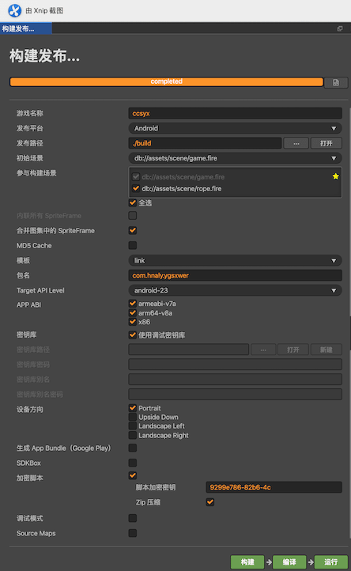


项目构建成功后 我们使用 Android Studio 打开 项目 项目路径是 build/jsb-link/frameworks/runtime-src/proj.android-studio


一般来说 打开项目 后 会自动构建一次 

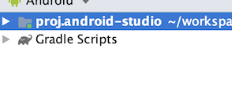

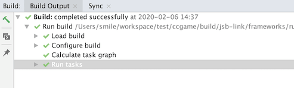

如果 没有出现构建 这个进程  可以自己选择 File ->Sync Project With Gradle Files

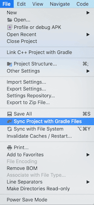

此时 我们连上 我们的设备后 （需要开始开发者模式 USB调试 ）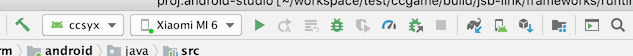

这个时候 我们可以点击 debug  或者 运行游戏 此时 我们可以简单的预览游戏效果

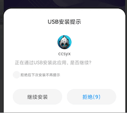

如果 出现这个 安装提示 点击 继续安装 即可 


此时 我们可以看到 我们打出的 日志 Log 显示出来了

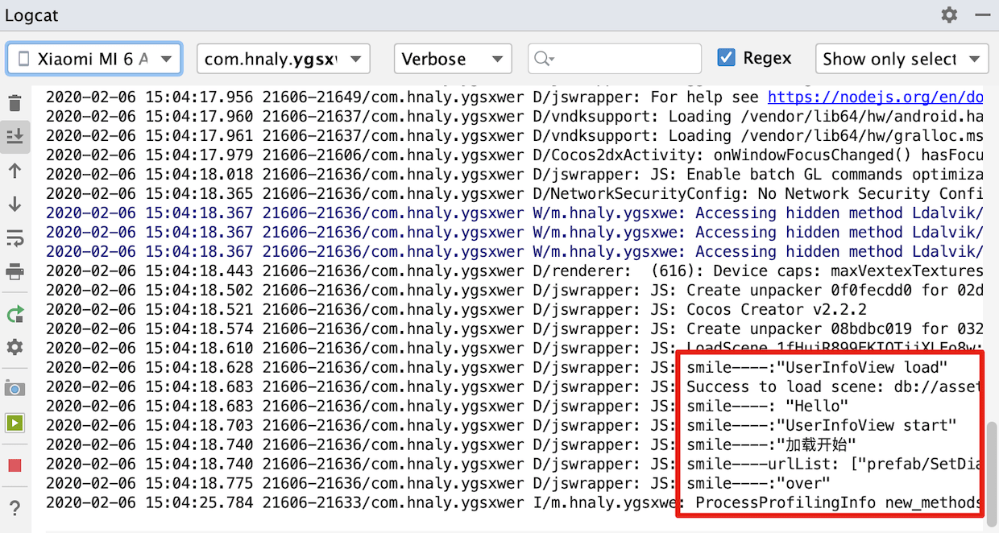

此时 游戏 可以正常预览。但是 此时 我们游戏 在 安装的后的图标是 

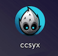

接下来 我们要修改一下我们的游戏的名字，比如我的游戏叫指南针 我们需要更换自定义的

### 更换 图标&名字

#### 图标更换

首先我们自己准备一张 1024X1024 的png 图片 然后打开这个网站 一键生成我们的图标

[图标工厂](http://icon.wuruihong.com/)    网站 [点击进入](http://icon.wuruihong.com/)

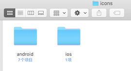

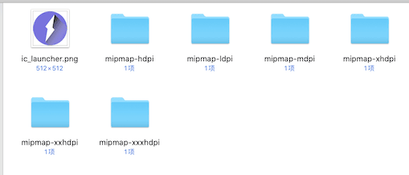

此时 我们这个 android 的文件夹 里面就是我们的图标

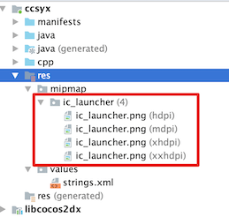

这个是我们项目原来的图标文件 我们选择替换即可

#### 更换游戏名字

首先 原来 游戏的名字是在这里配置的

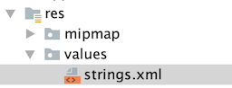

```xml
<resources>
    <string name="app_name" translatable="false">ccsyx</string>
</resources>
```

我们修改 "ccsyx" 即可 比如：

```xml
<resources>
    <string name="app_name" translatable="false">指南针</string>
</resources>
```

### 卸载原来安装的 app 重新构建 运行


以上我们成功的 更换了自定义的 游戏名字 和游戏图标。

### 更改Cocos Creator apk 默认输出的名字

这个网上有很多方法：

我这边 最后验证成功的是：需要在 `build.gradle`文件内的 `android.applicationVariants.all` 里面配置

大概结构：

```groovy
android.applicationVariants.all { variant ->
    // delete previous files first
    delete "${buildDir}/intermediates/merged_assets/${variant.dirName}"

    variant.mergeAssets.doLast {
        def sourceDir = "${buildDir}/../../../../.."
        .........
        .........
        if (variant.buildType.name == 'release') {
        ..........
        }
    }
}
```

具体细节：

```groovy
 if (variant.buildType.name == 'release') {
        def buildTypeName = variant.buildType.name
        def createTime = new Date().format("YYYY-MM-dd HH-mm-ss", TimeZone.getTimeZone("GMT+08:00"))
        def releaseFileName = "${buildTypeName}-mobile ${createTime}"
//        def releaseApkName = "${project.name}-${android.defaultConfig.versionName}-${android.defaultConfig.versionCode}-${buildTypeName}.apk"
        def releaseApkName = "${project.name}-${android.defaultConfig.versionName}-${buildTypeName}.apk"
        println("版本名称--->" + android.defaultConfig.versionName + " 版本号--->" + android.defaultConfig.versionCode)
//        println(variant.getPackageApplication().outputDirectory)
//        println(createTime)
//        println(project.name)
//        println(rootProject.name)
        //新建一个文件夹 然后把输出app 放到新建的文件夹内
        variant.getPackageApplication().outputDirectory = new File(variant.getPackageApplication().outputDirectory,releaseFileName)
        variant.getPackageApplication().outputScope.apkDatas.forEach { apkData ->
            //这个修改输出APK的文件名
            println(apkData.outputFileName)
            apkData.outputFileName = releaseApkName
            println(apkData.outputFileName)
        }
    }
```

最初的输出路径：是在原有的  “release”目录下新建一个带时间 目录 （参考Xcode）然后修改APK 名字

效果如下：

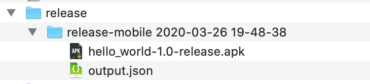

### 参考

- [【cocos2dx】改安装包名、app名、图标、包名](https://blog.csdn.net/hqq39/article/details/49821607)
- [gradle脚本配置 记录](https://www.jianshu.com/p/b6c3f951b281)
- [使用Gradle管理你的Android Studio工程](https://www.flysnow.org/2015/03/30/manage-your-android-project-with-gradle.html)
- [android studio 打包自动生成版本号与日期，apk输入路径](https://blog.csdn.net/swer0808/article/details/78999949)
- [gradle 3.3 修改打包apk路径](https://www.jianshu.com/p/e088b6f1a59a)

