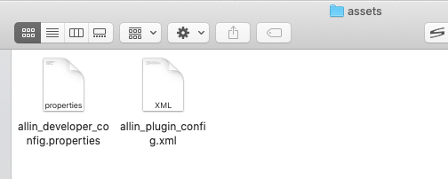
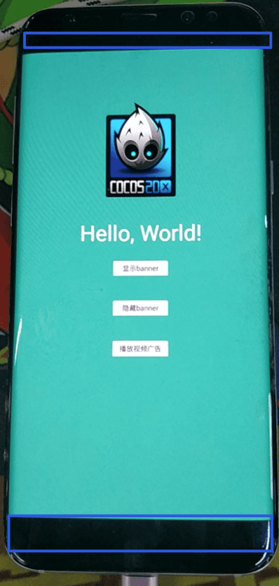

前面写了关于Cocos Cretor游戏导出Android平台后的一些采坑，本节内容继续采坑和填坑，其实我们发布游戏后，往往不能算是结束，一般需要接入一些原生的语法，比如写一些Java类或者引入一些第三方库，二者结合才算结束。这些我们后续都会一一说明。
<!--more-->

### 常用操作

先说说一般来讲 我们常用的一些操作文件夹和文件

#### 文件夹

- frameworks/runtime-src/proj.android-studio/app/res
- frameworks/runtime-src/proj.android-studio/app/src

1. 文件夹 res 是放置 资源 比如头像，修改app 名字 布局 等的一些操作修改的地方
2. 文件夹 src 是写代码的地方，一般来讲，我们新增的代码会放到这个文件夹里面
3. 此外可能会 添加新的文件夹，比如 libs 和 assets 这样的文件夹

#### 文件

- frameworks/runtime-src/proj.android-studio/app/AndroidManifest.xml
- frameworks/runtime-src/proj.android-studio/app/build.gradle
- frameworks/runtime-src/proj.android-studio/app/proguard-rules.pro

1. AndroidManifest.xml这个文件里面 会配置权限 全局的设置，屏幕等一些常见信息
2. build.gradle 这个文件配置，主要是帮着配置打包信息的，比如SDK 版本，签名文件，打包的版本号，方式诸多信息
3.  proguard-rules.pro 这个文件是 如果我们打包的时候，启用了混淆，那么这里面可以设置 混淆白名单

### 添加全局文件

比如我需要添加两个全局文件



此时需要在 build.gradle 配置 assets.srcDir "assets"

```json
    sourceSets.main {
        java.srcDir "src"
        res.srcDir "res"
        jniLibs.srcDir "libs"
        manifest.srcFile "AndroidManifest.xml"
        assets.srcDir "assets"
    }
```

### 本地预览和debug的apk激励视频广告正常 release 包不能播放

前些时候一直以为release 包不能看日志，后面查找后得知是可以的。只需要  debuggable true  加入 buildTypes {} 

```
buildTypes {
    release {
        minifyEnabled false
        debuggable true  //true代表开启  false 关闭
        proguardFiles getDefaultProguardFile('proguard-android.txt'), 'proguard-rules.pro'
        signingConfig signingConfigs.config
    }
    debug {
        signingConfig signingConfigs.config
    }
}

```

原文链接：[android studio release版本下打印输出日志](https://blog.csdn.net/suyimin2010/java/article/details/96472922)

有了日志，基本定位就快了，于是很快找到了报错  J`avaScriptJavaBridge: Classloader failed to find class of xxxxx(我的包名)`  再次查找后，得知是release 打包的时候混淆代码，后面调用的时候，不认识了。

在项目下的 混淆配置文件  proguard-rules.pro 里面 最后加上 ：

```
# 自己游戏的包名 否则release 版本 有时候找不到 类的方法
-keep class com.my.trainkwai.** {*;}
```

原文链接:[creator 安卓release包 js调java找不到该java文件的问题](https://forum.cocos.org/t/creator-release-js-java-java/73081)

这样 打出的包，就能顺利找到 方法。

### 安卓平台 游戏高度适配不正确 上下游黑边

游戏发布了新版本后，在AndroidManifest.xml中设置android:screenOrientation="portrait"，升级gradle后这里会有警告，在有些手机上 会出现上下黑边



设置

```xml
<manifest xmlns:android="http://schemas.android.com/apk/res/android"
    package="com.my.trainkwai"
    xmlns:tools="http://schemas.android.com/tools"
    android:installLocation="auto">
    <uses-feature android:glEsVersion="0x00020000" />
```

和 application 标签

```xml
 <application
        android:allowBackup="true"
        android:label="@string/app_name"
        android:usesCleartextTraffic="true"
        tools:ignore="LockedOrientationActivity"
        android:icon="@mipmap/ic_launcher">

```

在application标签里，加入`tool:ignore="LockedOrientationActivity"`这句话，manifest标签里引入tool`xmlns:tool="http://schemas.android.com/tools"`


### 2022-06-22 更新

编译报错：

```bash
NDK was located by using ndk.dir property. This method is deprecated and will be removed in a future release. Please delete ndk.dir from local.properties and set android.ndkVersion to [21.4.7075529] in all native modules in the project. https://developer.android.com/r/studio-ui/ndk-dir
```

解决：

1. 当您安装 NDK 时，Android Studio 会选择可用的最新 NDK 版本。对于大多数项目，安装此默认版本的 NDK 已经足够。不过，如果您的项目需要一个或多个特定版本的 NDK，您可以下载并配置特定版本。当多个项目各自依赖于特定版本的 NDK 时，这样做有助于确保各个项目的 build 都可重现。Android Studio 会将所有版本的 NDK 安装在 android-sdk/ndk/ 目录中
2. 在项目中配置特定版本的 NDK

### 参考

- [android:screenOrientation="portrait" 一直警告报红](https://www.jianshu.com/p/400f62002784)