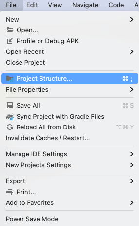
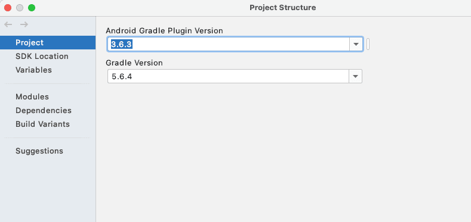
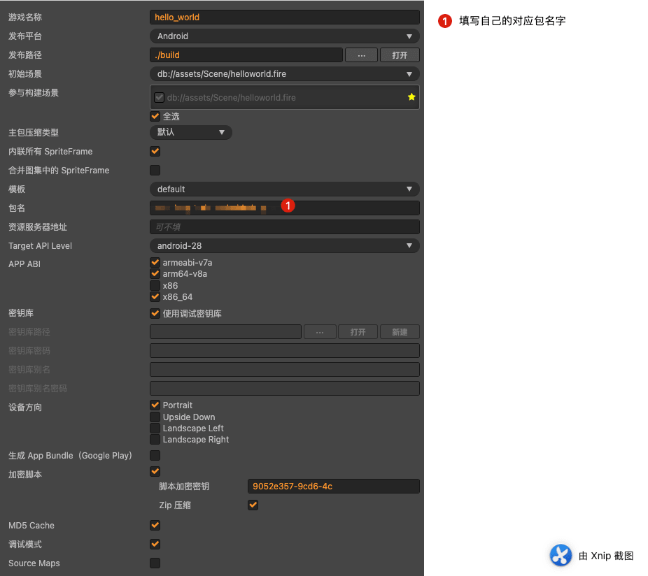
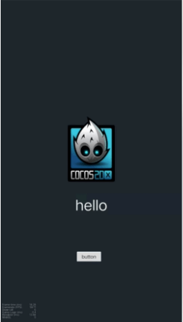
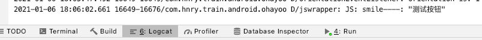

Cocos Creator 默认打出的安卓原生包 gradle 版本是`4.10.3`，gradle插件版本是`3.2.0`，官网文档写了不要升级版本，但是很多第三方sdk 推荐的gradle 版本都比这个高，现在已经升级到2.4.3官方一直也没有升级，那么只能自己升级，当然了，正如官网文档说的，升级报错，接下来就说说如何修改，才能正确的解决这个问题。
<!--more-->

## 开发环境

- Cocos Creator 2.4.3
-  Android Studio 4.1
- Mac环境

## gradle 版本

原来版本 ：`4.10.3`（插件`3.2.0`）

升级后版本： `5.6.4`（插件`3.6.3`）

gradle路径：`jsb-default/frameworks/runtime-src/proj.android-studio/gradle/wrapper/gradle-wrapper.properties`

插件路径：`jsb-default/frameworks/runtime-src/proj.android-studio/build.gradle`

```json
#Fri Oct 27 10:18:28 CST 2017
distributionBase=GRADLE_USER_HOME
distributionPath=wrapper/dists
zipStoreBase=GRADLE_USER_HOME
zipStorePath=wrapper/dists
distributionUrl=https\://services.gradle.org/distributions/gradle-5.6.4-all.zip
```

插件路径：jsb-default/frameworks/runtime-src/proj.android-studio/build.gradle

```json
dependencies {
    classpath 'com.android.tools.build:gradle:3.6.3'


    // NOTE: Do not place your application dependencies here; they belong
    // in the individual module build.gradle files
}
```

修改后 可以通过 File-->Project Structure 查看







## 修改文件

### setting.gradle 修改

原因：构建失败

路径：

```
jsb-default/frameworks/runtime-src/proj.android-studio/setting.gradle
```

修改前 ：

```
include ':libcocos2dx',':game', ':instantapp'
```

修改后：

```
include ':libcocos2dx'
```

修改原因：不需要game，用不到 这个模块是给Google Instant使用的，也可以直接屏蔽对应模块

### CocosAndroid.mk 修改

原因：构建失败

路径：

```
jsb-default/frameworks/runtime-src/proj.android-studio/jni/CocosAndroid.mk
```

修改前 ：

```
LOCAL_MODULE := cocos2djs_shared
```

修改后：

```
LOCAL_MODULE := cocos2djs
```

修改原因：构架报错，找不到target “cocos2djs”

### app/build.gradle（资源复制丢失）

原因：构建失败

路径：

```
jsb-default/frameworks/runtime-src/proj.android-studio/app/build.gradle
```

修改前 ：

```json
android.applicationVariants.all { variant ->
    // delete previous files first
    delete "${buildDir}/intermediates/merged_assets/${variant.dirName}"

    variant.mergeAssets.doLast {
        def sourceDir = "${buildDir}/../../../../.."

        copy {
            from "${sourceDir}/assets"
            into "${outputDir}/assets"
        }

        copy {
            from "${sourceDir}/src"
            into "${outputDir}/src"
        }

        copy {
            from "${sourceDir}/jsb-adapter"
            into "${outputDir}/jsb-adapter"
        }

        copy {
            from "${sourceDir}/main.js"
            from "${sourceDir}/project.json"
            into outputDir
        }
    }
}
```

修改后：

```json
android.applicationVariants.all { variant ->
    // delete previous files first
    delete "${buildDir}/intermediates/merged_assets/${variant.dirName}"

    variant.mergeAssets.doLast {
        def sourceDir = "${buildDir}/../../../../.."

        copy {
            from "${sourceDir}/assets"
            into outputDir.dir("assets")
        }

        copy {
            from "${sourceDir}/src"
            into "${outputDir}/src"
            into outputDir.dir("src")
        }

        copy {
            from "${sourceDir}/jsb-adapter"
            into "${outputDir}/jsb-adapter"
            into outputDir.dir("jsb-adapter")
        }

        copy {
            from "${sourceDir}/main.js"
            from "${sourceDir}/project.json"
            into outputDir
        }
    }
}
```

修改原因：基本上就是把 into “${outputDir}/x” 改成 into outputDir.dir(“x”)


## 测试效果

### App构建设置



### App预览效果



### 按钮点击输出日志




PS 如果 gradle 下载失败 可以参考我的另外一篇博客：[CocosCreator导出Android项目采坑指南](https://blog.asroads.com/post/d5575747.html)

## 参考

- [Cocos Creator 原生项目升级gradle版本 - 简书](https://www.jianshu.com/p/866f2798b98c)
- [Android Gradle 插件版本说明-官网](https://developer.android.com/studio/releases/gradle-plugin?hl=zh-cn)
- [原生安卓gradle plugin版本问题-cocos论坛](https://forum.cocos.org/t/topic/101121)
- [cocos creator 编译android失败-cocos论坛](https://forum.cocos.org/t/topic/101121/6)

