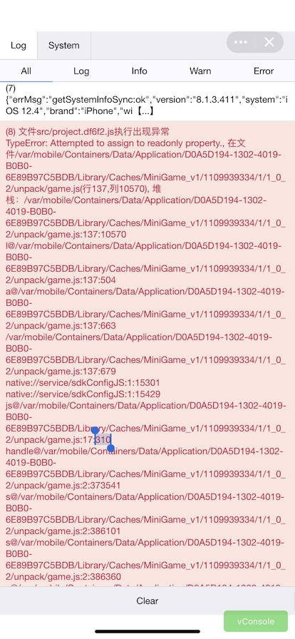
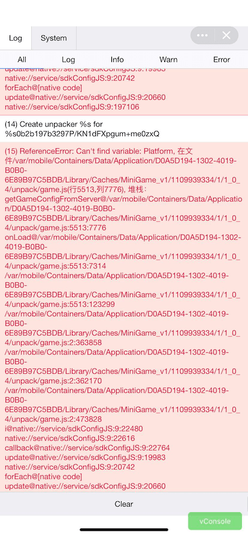
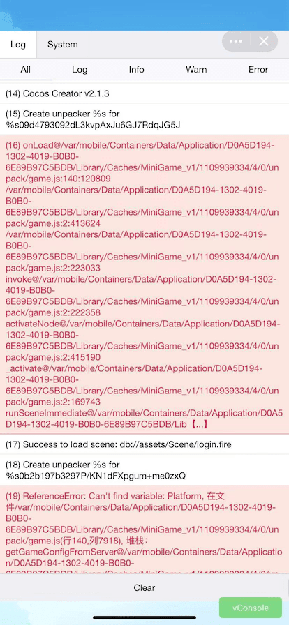
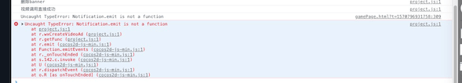

从今年开始，国内大厂纷纷对小游戏发力，除了微信，其他平台相继推出了小游戏的发布，这个对于游戏开发来说，研发一款游戏，上不同的平台，有更多的用户进入是好事，虽然大厂之间默契的语法风格个项目结构，已经让小游戏发布在不同平台很轻松了，但不同平台之间还是有一些细微的差异，之前游戏上了微信平台和头条平台（字节跳动）如今腾讯再次发力，开放了QQ小游戏平台，作为开发者自然不会放过这个入口，下面简述一下本次发布遇到的坑
<!--more-->
因为项目是用JavaScript写的，遇到了这些问题，我自己用Typescript另外一个项目测试是好的，总的来讲，Typescript是未来开发H5小游戏和小程序的趋势。

### 问题

- 现象环境：QQ小游戏ios平台
- 语言 JavaScript
- 系统：安卓正常 ios 异常

错误内容

- 
- 
- 

```javascript
(28) onLoad@/var/mobile/Containers/Data/Application/D0A5D194-1302-4019-B0B0-6E89B97C5BDB/Library/Caches/MiniGame_v1/1109939334/4/0/unpack/game.js:5989:157154
/var/mobile/Containers/Data/Application/D0A5D194-1302-4019-B0B0-6E89B97C5BDB/Library/Caches/MiniGame_v1/1109939334/4/0/unpack/game.js:2:413624
/var/mobile/Containers/Data/Application/D0A5D194-1302-4019-B0B0-6E89B97C5BDB/Library/Caches/MiniGame_v1/1109939334/4/0/unpack/game.js:2:223033
invoke@/var/mobile/Containers/Data/Application/D0A5D194-1302-4019-B0B0-6E89B97C5BDB/Library/Caches/MiniGame_v1/1109939334/4/0/unpack/game.js:2:222358
activateNode@/var/mobile/Containers/Data/Application/D0A5D194-1302-4019-B0B0-6E89B97C5BDB/Library/Caches/MiniGame_v1/1109939334/4/0/unpack/game.js:2:415190
_onHierarchyChanged@/var/mobile/Containers/Data/Application/D0A5D194-1302-4019-B0B0-6E89B97C5BDB/Library/Caches/
```

```javascript
(9) 文件src/project.js执行出现异常
TypeError: Attempted to assign to readonly property., 在文件/var/mobile/Containers/Data/Application/3CD0E0A2-117D-4501-9AA6-B4596A056BC4/Library/Caches/MiniGame_v1/1109939334/4/0/unpack/game.js(行140,列10632), 堆栈：/var/mobile/Containers/Data/Application/3CD0E0A2-117D-4501-9AA6-B4596A056BC4/Library/Caches/MiniGame_v1/1109939334/4/0/unpack/game.js:140:10632
l@/var/mobile/Containers/Data/Application/3CD0E0A2-117D-4501-9AA6-B4596A056BC4/Library/Caches/MiniGame_v1/1109939334/4/0/unpack/game.js:140:504
a@/var/mobile/Containers/Data/Application/3CD0E0A2-117D-4501-9AA6-B4596A056BC4/Library/Caches/MiniGame_v1/1109939334/4/0/unpack/game.js:140:663
/var/mobile/Containers/Data/Application/3CD0E0A2-117D-4501-9AA6-B4596A056BC4/Library/Caches/MiniGame_v1/1109939334/4/0/unpack/game.js:140:679
native://service/sdkConfigJS:1:15705
native://service/sdkConfigJS:1:15833
js@/var/mobile/Containers/Data/Application/3CD0E0A2-117D-4501-9AA6-B4596A056BC4/Library/Caches/MiniGame_v1/1109939334/4/0/unpack/game.js:20:901
handle@/var/mobile/Containers/Data/Application/3CD0E0A2-117D-4501-9AA6-B4596A056BC4/Library/Caches/MiniGame_v1/1109939334/4/0/unpack/game.js:2:392874
s@/var/mobile/Containers/Data/Application/3CD0E0A2-117D-4501-9AA6-B4596A056BC4/Library/Caches/MiniGame_v1/1109939334/4/0/unpack/game.js:2:405979
s@/var/mobile/Containers/Data/Application/3CD0E0A2-117D-4501-9AA6-B4596A056BC4/Library/Caches/MiniGame_v1/1109939334/4/0/unpack/game.js:2:406238
s@/var/mobile/Containers/Data/Application/3CD0E0A2-117D-4501-9AA6-B4596A056BC4/Library/Caches/MiniGame_v1/1109939334/4/0/unpack/game.js:2:406238
s@/var/mobile/Containers/Data/Application/3CD0E0A2-117D-4501-9AA6-B4596A056BC4/Library/Caches/MiniGame_v1/1109939334/4/0/unpack/game.js:2:406238
flowIn@/var/mobile/Containers/Data/Application/3CD0E0A2-117D-4501-9AA6-B4596A056BC4/Library/Caches/MiniGame_v1/1109939334/4/0/unpack/game.js:2:407126
append@/var/mobile/Containers/Data/Application/3CD0E0A2-117D-4501-9AA6-B4596A056BC4/Library/Caches/MiniGame_v1/1109939334/4/0/unpack/game.js:2:401377
load@/var/mobile/Containers/Data/Application/3CD0E0A2-117D-4501-9AA6-B4596A056BC4/Library/Caches/MiniGame_v1/1109939334/4/0/unpack/game.js:2:381201
prepare@/var/mobile/Containers/Data/Application/3CD0E0A2-117D-4501-9AA6-B4596A056BC4/Library/Caches/MiniGame_v1/1109939334/4/0/unpack/game.js:2:135102
run@/var/mobile/Containers/Data/Application/3CD0E0A2-117D-4501-9AA6-B4596A056BC4/Library/Caches/MiniGame_v1/1109939334/4/0/unpack/game.js:2:135280
boot@/var/mobile/Containers/Data/Application/3CD0E0A2-117D-4501-9AA6-B4596A056BC4/Library/Caches/MiniGame_v1/1109939334/4/0/unpack/game.js:137:1103
/var/mobile/Containers/Data/Application/3CD0E0A2-117D-4501-9AA6-B4596A056BC4/Library/Caches/MiniGame_v1/1109939334/4/0/unpack/game.js:152:854
native://service/sdkConfigJS:1:15705
native://service/sdkConfigJS:1:15833
/var/mobile/Containers/Data/Application/3CD0E0A2-117D-4501-9AA6-B4596A056BC4/Library/Caches/MiniGame_v1/1109939334/4/0/unpack/game.js:153:13
native://service/sdkConfigJS:1:15705
native://service/sdkConfigJS:1:15833
native://service/sdkConfigJS:9:205007
u@native://service/sdkConfigJS:9:22638
c@native://service/sdkConfigJS:9:22812
native://service/sdkConfigJS:9:23015
callback@native://service/sdkConfigJS:9:23194
update@native://service/sdkConfigJS:9:20162
native://service/sdkConfigJS:9:20921
forEach@[native code]
update@native://service/sdkConfigJS:9:20839
native://service/sdkConfigJS:9:204232
```

```javascript
(49) TypeError: null is not an object (evaluating 'this._components.push'), 在文件/var/mobile/Containers/Data/Application/3CD0E0A2-117D-4501-9AA6-B4596A056BC4/Library/Caches/MiniGame_v1/1109939334/4/0/unpack/game.js(行2,列597691), 堆栈：addComponent@/var/mobile/Containers/Data/Application/3CD0E0A2-117D-4501-9AA6-B4596A056BC4/Library/Caches/MiniGame_v1/1109939334/4/0/unpack/game.js:2:597691
/var/mobile/Containers/Data/Application/3CD0E0A2-117D-4501-9AA6-B4596A056BC4/Library/Caches/MiniGame_v1/1109939334/4/0/unpack/game.js:5989:102365
/var/mobile/Containers/Data/Application/3CD0E0A2-117D-4501-9AA6-B4596A056BC4/Library/Caches/MiniGame_v1/1109939334/4/0/unpack/game.js:2:382879
/var/mobile/Containers/Data/Application/3CD0E0A2-117D-4501-9AA6-B4596A056BC4/Library/Caches/MiniGame_v1/1109939334/4/0/unpack/game.js:2:381108
/var/mobile/Containers/Data/Application/3CD0E0A2-117D-4501-9AA6-B4596A056BC4/Library/Caches/MiniGame_v1/1109939334/4/0/unpack/game.js:2:495697
```



### 原因查找

> (9) 文件src/project.js执行出现异常
> TypeError: Attempted to assign to readonly property., 在文件/game.js(行137,列33533), 堆栈：/game.js:137:33533
> r@/game.js:137:290
> l@/game.js:137:449
> /game.js:137:465
>
> js@/game.js:11:310
> handle@/game.js:2:391721
> a@/game.js:2:404282
> a@/game.js:2:404541
> a@/game.js:2:404541
> a@/game.js:2:404541
> flowIn@/game.js:2:405429
> append@/game.js:2:399485
> load@/game.js:2:380443
> prepare@/game.js:2:131288
> run@/game.js:2:131466
> boot@/game.js:134:1103
> /game.js:143:802
>
> /game.js:144:13
>
> i
>
> callback
> update
>
> forEach@[native code]
> update
> creator打包微信小游戏发布到QQ平台上，开发者工具没有报错，网页和模拟器也没有报错，ios真机都会报这种错误，无法进入游戏，请问是什么原因？
>
> 
>
> **已解决，QQ平台不支持window.Gobal={}的全局写法**
>
> 请问你怎么改的？（window. 这种写法怎么改？）
>
> 模块化脚本module.exports={},使用之前先在引用的脚本之前require

### 参考地址

- [TypeError: Attempted to assign to readonly](https://forum.cocos.com/t/typeerror-attempted-to-assign-to-readonly/81682)
- [模块化脚本](https://docs.cocos.com/creator/manual/zh/scripting/modular-script.html)

### 修改实例

- 报错文件

```javascript
var Global= {};
// window.Global = Global;

Global.BigNumber = require("BigNumber");

Global.Https = require("Https");

// Global.Notification = require("Notification");

Global.Const = require("Const");

Global.Tools = require("Tools");

// window.Platform = new Platform();
Global.Platform = require("platform");
module.exports = Global;
```

- 引用实例

```javascript
var Platform = require('platform'); // 平台引入
var Global = require('Global'); // 全局
var Notification = require('Notification'); // 消息池
```

### 注意事项

1.确保提审服游戏登陆加载，核心玩法、匹配功能能正常进行。（无此功能可忽略）
2.接入脏字接口（无用户输入，可忽略）
https://q.qq.com/wiki/develop/miniprogram/server/open_port/port_safe.html#security-imgseccheck
3.ios屏蔽任何与充值相关界面和引导。
4.ios和安卓同个账号不同数据。（纯广告变现的产品不需要区分）
5.不要有q群，公众号，论坛等引导出现。
6.检查游戏内新素材是否有违规。

### 总结

使用兼容性比较好，规范的写法，现在小程序小游戏越来越多，感觉和安卓手机在国内的发展很像，开发人员要不断的去兼容和适配每个平台。后面发现其实小游戏有个GameGlobal的属性