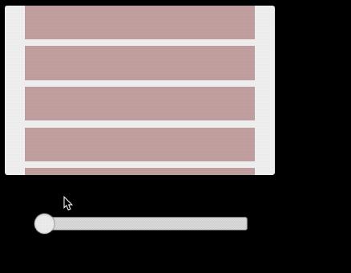
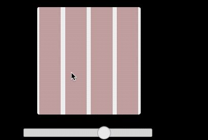
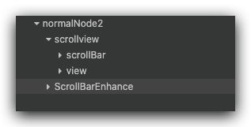
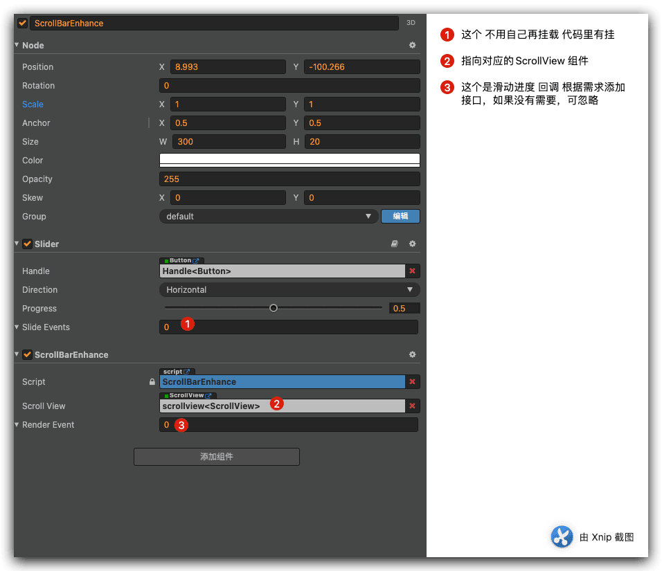

众所周知，Cocos Creator自带的`cc.ScrollView`组件中的`ScrollBar`组件是无法拖动实现进度的，于是乎论坛就有人自己研发了这个功能，进来需求里有这个功能，于是就用到了，这里对前辈们的功能加以修改和整合，实现自己的需求，下面细说一下。
<!--more-->
首先我们看看实现后的效果

横向`ScrollView`列表：



纵向`ScrollView`列表：



## 项目结构

管理器节点结构





### 原理

1. 实现借鉴了论坛两位大佬的思路结合，依赖 cc.Slider组件实现。
2. 然后设置对应的进度
3. 如果是列表滑动，添加滑动监听函数，实现同步进度。

### 源码如下：

```typescript
/**
 * Created by jsroads on 2022/1/10  5:51 PM
 * Note:滑动按钮增强
 */
const {ccclass, property, requireComponent, menu} = cc._decorator;
@ccclass
@requireComponent(cc.Slider)
@menu("组件库/ScrollBarEnhance")
export class ScrollBarEnhance extends cc.Component {
    @property({
        tooltip: "对应的（ScrollView）滑动列表",
        type: cc.ScrollView
    })
    private scrollView: cc.ScrollView = null!;
    //滑动事件改变事件
    @property({
        type: [cc.Component.EventHandler],
        tooltip: CC_DEV && "滑动事件改变事件",
    })
    private renderEvent: cc.Component.EventHandler[] = [];

    private vSlider: cc.Slider = null!;

    private static creatEventHandler(target: cc.Node, component: string, handler: string) {
        const e = new cc.Component.EventHandler();
        e.target = target;
        e.component = component;
        e.handler = handler;
        return e;
    }

    /**
     * 外部修改进度
     * @param p
     */
    public refresh(p: number) {
        let progress, slider = this.vSlider || this.node.getComponent(cc.Slider);
        progress = Math.min(p, 1);
        progress = Math.max(p, 0);
        slider.progress = progress;
        this.onSliderEvent(slider, "");
        console.log("slider.progress----:" + JSON.stringify(slider.progress));
    }

    protected start() {
        this.addScrollChildIndex();
    }

    /** 增加scroll子节点区间功能 */
    private addScrollChildIndex() {
        /** 禁用鼠标滚轮，滚轮在移动区间时ScrollEvent返回很怪异，没有SCROLL_ENDED事件回调 */
            // this.node.off(cc.Node.EventType.MOUSE_WHEEL);
        const scroll = this.scrollView;
        this.vSlider = this.node.getComponent(cc.Slider);
        let className = cc.js.getClassName(this);
        /** Slider 事件监听 */
        this.vSlider.slideEvents.push(ScrollBarEnhance.creatEventHandler(this.node, className, 'onSliderEvent'));
        /** ScrollView 事件监听 */
        scroll.scrollEvents.push(ScrollBarEnhance.creatEventHandler(this.node, className, 'onScrollEvent'));
        /** 初始化进度 */
        this.scrollMoveEvent();
    }

    /**
     * 滚动列表事件回调
     * @param scroll
     * @param eventType
     * @param customEventData
     * @private
     */
    private onScrollEvent(scroll: cc.ScrollView, eventType: cc.ScrollView.EventType, customEventData: string) {
        switch (eventType) {
            case cc.ScrollView.EventType.SCROLL_BEGAN:
                break;
            case cc.ScrollView.EventType.SCROLL_ENDED:
                break;
            case cc.ScrollView.EventType.SCROLLING:
                this.scrollMoveEvent();
                break;
        }
    }

    //滑动列表--滚动条改变
    private scrollMoveEvent() {
        let vertical = this.scrollView.vertical, maxScrollOffset, getScrollOffset;
        if (vertical) {
            maxScrollOffset = this.scrollView.getMaxScrollOffset().y;
            getScrollOffset = this.scrollView.getScrollOffset().y;
        } else {
            maxScrollOffset = this.scrollView.getMaxScrollOffset().x;
            getScrollOffset = this.scrollView.getScrollOffset().x * (-1);
        }
        // console.log("maxScrollOffset", maxScrollOffset);
        // console.log("getScrollOffset", getScrollOffset);
        if (getScrollOffset / maxScrollOffset > 0 && getScrollOffset / maxScrollOffset < 1) {
            this.vSlider.progress = getScrollOffset / maxScrollOffset;
        } else if (getScrollOffset / maxScrollOffset <= 0) {
            this.vSlider.progress = 0;
        } else {
            this.vSlider.progress = 1;
        }
        // console.log(this.vSlider.progress);
        console.log("scrollMoveEvent", this.vSlider.progress);
        if (this.renderEvent && this.renderEvent.length) {
            cc.Component.EventHandler.emitEvents(this.renderEvent, this.vSlider.progress);
        }
    }

    /**
     * 滑动按钮 回调
     * @param slider
     * @param customEventData
     * @private
     */
    private onSliderEvent(slider, customEventData: string) {
        // console.log("onSliderEvent", slider.progress);
        let vertical = this.scrollView.vertical, maxScrollOffsetX = 0, maxScrollOffsetY = 0;
        if (vertical) {
            maxScrollOffsetX = this.scrollView.getScrollOffset().x;
            maxScrollOffsetY = this.scrollView.getMaxScrollOffset().y * slider.progress;
        } else {
            maxScrollOffsetX = this.scrollView.getMaxScrollOffset().x * slider.progress;
            maxScrollOffsetY = this.scrollView.getScrollOffset().y;
        }
        this.scrollView.scrollToOffset(cc.v2(maxScrollOffsetX, maxScrollOffsetY), 0.05);
    }
}

```

注意： `getScrollOffset = this.scrollView.getScrollOffset().x * (-1);`

是否乘以-1 根据自己的`scrollView`的`content`的`anchorX` 等因素决定，这里是从左到右 `anchorX` 是`0` 所以这样写。

源码地址 [点击进入](https://github.com/jsroads/mylibs/tree/main/ScrollBarExtra)

## 参考

- [Cocos creator scrollbar支持拖动滑块来滚动scrollview吗](https://forum.cocos.org/t/cocos-creator-scrollbar-scrollview/39333)
- [CocosCreatorExtra](https://github.com/dengxiaochun/CocosCreatorExtra)
- 3.x 实现 [cccscrollbar.zip](https://forum.cocos.org/uploads/short-url/jcEvb835DsRG8vnMkS2DxhlzOrG.zip) 