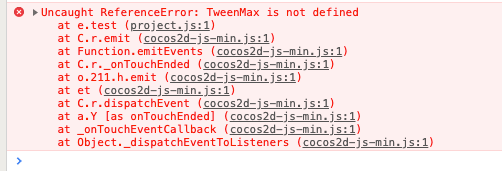
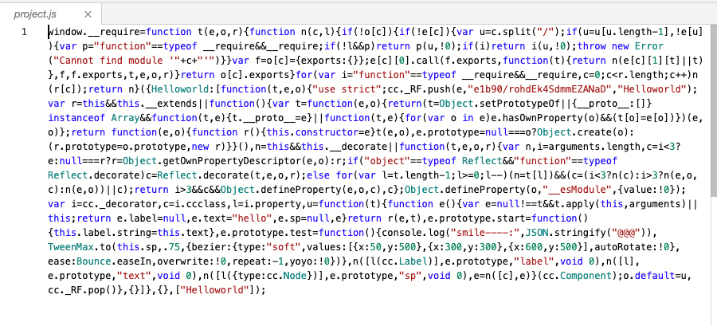
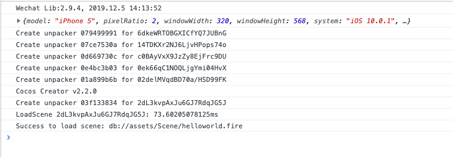

之前的文章里写过关于Layabox如何引入TweenMax类库的，对于Cocos Creator来讲基本大同小异，不同是是可以作为插件导入，直接使用，很是方便，只是在发布小游戏的时候，突然就冒出一个 TweenMax is not defined，于是查找了各方资料，得以解决。
<!--more-->

### 问题描述



文章描述：在Web和模拟器下都是好的，发布小游戏后，报错显示 `TweenMax is not defined`

### 类库导入

关于TweenMax如何导入 可以参考两篇文章，一个是Cocos Creator官方的 插件导入

- [插件脚本](https://docs.cocos.com/creator/manual/zh/scripting/plugin-scripts.html)
- [Layabox2.0贝塞尔曲线运动引入TweenMax](http://blog.asroads.com/post/b0aa25e3.html)
- [Cocos Creator 引入TweenMax Uncaught TypeError: container.appendChild 解决方法](http://blog.asroads.com/post/2376105a.html)

### 修复问题

- 第一种办法是在小游戏里面通过Require 引入文件，这样就能解决问题

  

  我们发现 此时 我们的 TweenMax类库 不在我们打包的代码里面


我们通过文件路径 找到了我们的 TweenMax 文件 然后通过 require方式进行导入 选择导入：方法是 在 game.js 前面添加

```javascript
window.TweenMax = global.TweenMax = require('./src/assets/Script/libs/TweenMax');
```


- 第二种办法是 在代码里追加几行代码：

  - A 方案

  ```javascript
  window.TweenMax = _gsScope._gsDefine.globals.TweenMax;
  window.Back = _gsScope._gsDefine.globals.Back;
  window.Bounce = _gsScope._gsDefine.globals.Bounce;
  window.Circ = _gsScope._gsDefine.globals.Circ;
  window.Cubic = _gsScope._gsDefine.globals.Cubic;
  window.Elastic = _gsScope._gsDefine.globals.Elastic;
  window.Expo = _gsScope._gsDefine.globals.Expo;
  window.Linear = _gsScope._gsDefine.globals.Linear;
  window.Quad = _gsScope._gsDefine.globals.Quad;
  window.Quart = _gsScope._gsDefine.globals.Quart;
  window.Quint = _gsScope._gsDefine.globals.Quint;
  window.Sine = _gsScope._gsDefine.globals.Sine;
  ```

  此时调用代码 可以这样写：

  ```javascript
       TweenMax.to(this.sp, 0.75, {
              bezier:{type:"soft",values:[{x:50, y:500}, {x:300, y:300}, {x:600, y:500}], autoRotate:true},
              ease:Bounce.easeIn,overwrite:true,repeat:-1,yoyo:true
          });
  ```

  - B方案 也可以只追加一行：比如

```javascript
window.TweenMax = _gsScope._gsDefine.globals.TweenMax;
```

但是此时 如果需要用一些特效的时候 必须用 字符串 比如 

写代码需比如  `Bounce.easeIn` 要这样写 ”Bounce.easeIn“：当然在A方案里 那样写B 方案这样的调用也是对的。

```javascript
TweenMax.to(this.sp, 0.75, {
            bezier:{type:"soft",values:[{x:50, y:500}, {x:300, y:300}, {x:600, y:500}], autoRotate:true},
            ease:"Bounce.easeIn",overwrite:true,repeat:-1,yoyo:true
        });
```

最后无论通过何种办法 结果运行 如下




效果展示 OK