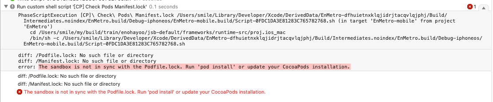
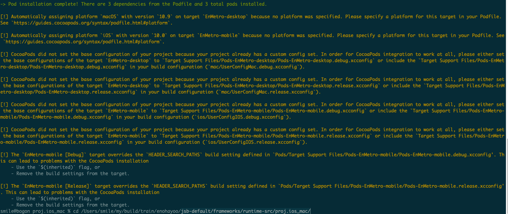
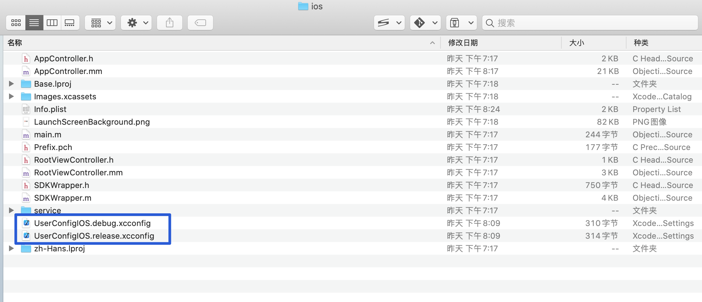

众所周知`ios`项目可以使用`cocoapods`来添加依赖，之前一直是直接添加这个依赖，这几天遇到了URL一直添加失败的问题，不知道是网络还是哪里设置不正确导致的，于是就迫不得用`cocoapods`来添加依赖库，这里初步做个简单的介绍后期好自己慢慢学习和使用，首先`cocoapods`是像NPM一样的一个依赖库(包)管理工具，添加后，必须使用它独有的项目文件打开项目才行。
<!--more-->
先介绍一下如何安装和遇到的问题

### 安装cocoapods

1. 首先全局安装 `cocoapods`

```shell
sudo gem install cocoapods
```

2. 在自己的Cocos Creator 导出的iOS项目内 比如我的是`jsb-default/frameworks/runtime-src/proj.ios_mac/` 文件夹内 执行初始化

```shell
pod init
```

此时 会生成一个 Podfile文件

打开我们查看内容：

```shell
# Uncomment the next line to define a global platform for your project
# platform :ios, '9.0'

target 'EnMetro-desktop' do
  # Comment the next line if you don't want to use dynamic frameworks
  use_frameworks!

  # Pods for EnMetro-desktop

end

target 'EnMetro-mobile' do
  # Comment the next line if you don't want to use dynamic frameworks
  use_frameworks!

  # Pods for EnMetro-mobile
end
```

然后 在 `# Pods for EnMetro-mobile` 下面添加自己要添加的依赖

比如：

```shell
target 'EnMetro-mobile' do
  # Comment the next line if you don't want to use dynamic frameworks
  use_frameworks!

  # Pods for EnMetro-mobile
  pod 'FBSDKCoreKit', '8.0.0'
  pod 'FBSDKLoginKit', '8.0.0'
  pod 'FBSDKShareKit', '8.0.0'

end
```

等待安装完毕，重新打开编译运行项目：

### 遇到的问题：

安装一切顺利，但是编译的时候遇到报错：

diff: /Podfile.lock: No such file or directory
diff: /Manifest.lock: No such file or directory

The sandbox is not in sync with the Podfile.lock. Run 'pod install' or update your CocoaPods installation.

```Objective-C
PhaseScriptExecution [CP]\ Check\ Pods\ Manifest.lock /Users/smile/Library/Developer/Xcode/DerivedData/EnMetro-dfhuietnxklqjidrjtacqvlqjphj/Build/Intermediates.noindex/EnMetro.build/Debug-iphoneos/EnMetro-mobile.build/Script-0FDC1DA3E81283C765782768.sh (in target 'EnMetro-mobile' from project 'EnMetro')
    cd /Users/smile/my/build/train/enohayoo/jsb-default/frameworks/runtime-src/proj.ios_mac
    /bin/sh -c /Users/smile/Library/Developer/Xcode/DerivedData/EnMetro-dfhuietnxklqjidrjtacqvlqjphj/Build/Intermediates.noindex/EnMetro.build/Debug-iphoneos/EnMetro-mobile.build/Script-0FDC1DA3E81283C765782768.sh

diff: /Podfile.lock: No such file or directory
diff: /Manifest.lock: No such file or directory
error: The sandbox is not in sync with the Podfile.lock. Run 'pod install' or update your CocoaPods installation.
```



网上搜索了一写错误的解决办法都没有真正解决这个问题，比如：

> #### 1、问题描述
>
> - 之前碰到过此类问题，原因是之前用了测试版本的pod，然后回归正式版本，导致找不到pod文件
>
> ```Objective-C
> 复制diff: /../Podfile.lock: No such file or directory
> diff: /Manifest.lock: No such file or directory error: The sandbox is not in sync with the Podfile.lock.
> Run 'pod install' or update your CocoaPods installation.
> ```
>
> #### 2、解决方案
>
> - ##### 2.1 方案一：
>
>   - 收先关闭xcode 然后pod install
>   - 如果不行就先删除xcworkspace Podfile.lock Pods文件夹 ~/Library/Developer/Xcode/DerivedData路径下对应工程的文件夹
>   - 然后 pod install
>
> - ##### 2.2 方案二：
>
>   - pod deintegrate --verbose
>   - pod install --verbose

试了好几遍 依旧不行

后面看了一篇链接 文章 才知道是咋回事  [Cocos Creator 报错：The sandbox is not in sync with the Podfile.lock. Run 'pod install' or update your CocoaPods installation.](https://xmanyou.com/the-sandbox-is-not-in-sync-with-the-podfile-lock-run-pod-install-or-update-your-cocoapods-installation/)

原来是我安装cocoapods 的时候 发出了警告  路径不对



```objective-c
PODS_PODFILE_DIR_PATH = ${SRCROOT}/.
PODS_ROOT = ${SRCROOT}/Pods
```


**解决方法是**：修改 `UserConfigIOS.debug.xcconfig` 和 `UserConfigIOS.release.xcconfig`文件里面的引入 



`UserConfigIOS.debug.xcconfig` 添加一行  

```shell
// Configuration settings file format documentation can be found at:
// https://help.apple.com/xcode/#/dev745c5c974

#include "../../cocos2d-x/cocos/platform/ios/CCModuleConfigIOS.debug.xcconfig"
// 添加这一行
#include "../Pods/Target Support Files/Pods-EnMetro-mobile/Pods-EnMetro-mobile.debug.xcconfig"
```

PS：`Pods-EnMetro-mobile/Pods-EnMetro-mobile.debug.xcconfig` 是自己项目的具体路径和名字

`UserConfigIOS.release.xcconfig` 添加一行 

```shell
// Configuration settings file format documentation can be found at:
// https://help.apple.com/xcode/#/dev745c5c974

#include "../../cocos2d-x/cocos/platform/ios/CCModuleConfigIOS.release.xcconfig"
// 添加这一行
#include "../Pods/Target Support Files/Pods-EnMetro-mobile/Pods-EnMetro-mobile.release.xcconfig"

```

PS：`Pods-EnMetro-mobile/Pods-EnMetro-mobile.release.xcconfig` 是自己项目的具体路径和名字

### 参考链接

- [Cocos Creator 报错：The sandbox is not in sync with the Podfile.lock. Run 'pod install' or update your CocoaPods installation.](https://xmanyou.com/the-sandbox-is-not-in-sync-with-the-podfile-lock-run-pod-install-or-update-your-cocoapods-installation/)
- [如何解决diff: /../Podfile.lock: No such file or directory 的问题](https://www.cnblogs.com/CH520/p/9720916.html)

