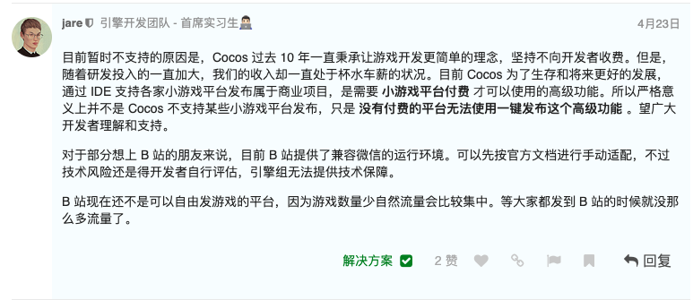
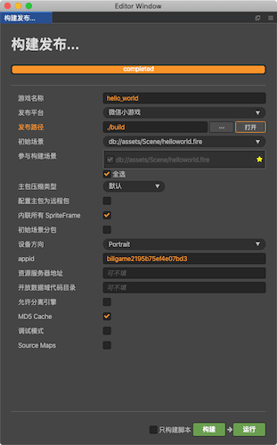
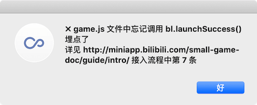
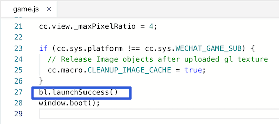
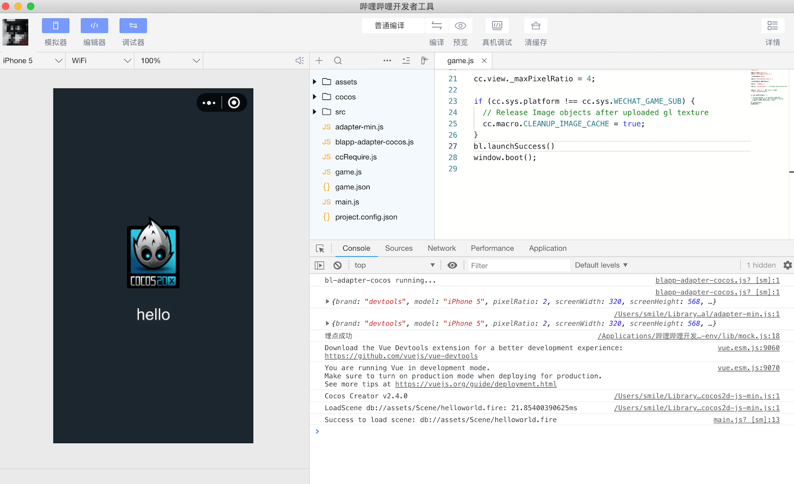
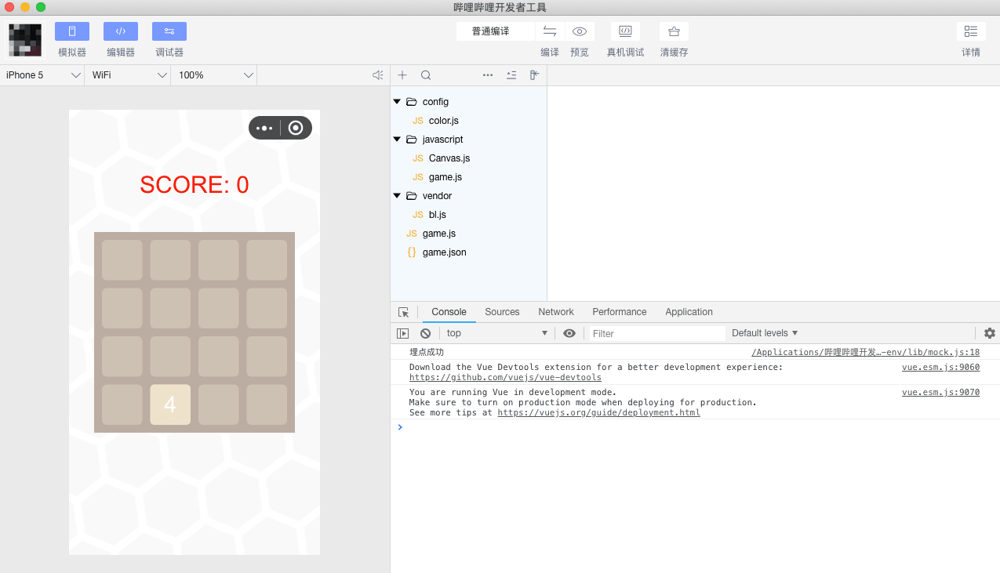
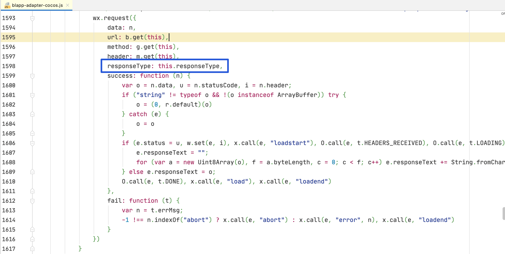

Cocos Creator 没有直接导出B站的小游戏的途径，恰好这段时间又做了好几个web平台和小游戏平台的接入，比如铠甲网络，豹趣，下面简单的说说B站小游戏接入的方法。
<!--more-->

### 环境

接到项目安排后，立即去论坛转了一圈，发现一个回复：[B站小游戏接入](https://forum.cocos.org/t/b/91852)


目前短时间内，看来官方没有接入计划，但是又去哔哩哔哩文档看了看，发现其实很容易接入的。

于是简单是说说如何接入。

- 开发者文档地址：http://miniapp.bilibili.com/small-game-doc/guide/intro/
- 开发者工具下载地址: http://miniapp.bilibili.com/small-game-doc/open/ide-update/
- 引擎环境:Cocos Creator 2.4.0

### 步骤

#### 游戏构建

- 新建一个Cocos Creator 游戏
- 导出微信小游戏
- 导出界面设置



注意：修改 appid 即可

### 从引擎导出

参考B站小游戏引导:http://miniapp.bilibili.com/small-game-doc/guide/compatibility/

### `Cocos`

> `Cocos` 引擎小游戏导出项目之后，需进行以下修改：
>
> 如果`Cocos`版本 = 2.3.X
>
> 1. 下载适配文件到导出游戏的根目录下，重命名为`blapp-adapter-cocos.js` [下载地址](http://i0.hdslb.com/bfs/mall/mall/62/a4/62a4eac925de8a677862c40a15cf148f.js)
> 2. 在game.js文件的添加所下载的适配文件
>
> ```
>     require('adapter-min.js');
> ```
>
> 1. 添加后如下
>
> ```
>     require('adapter-min.js');
>     require('blapp-adapter-cocos.js');
> ```
>
> 如果`Cocos`版本 = 2.2.X
>
> 1. 用下载地址的适配文件替换导出游戏的根目录下的 `libs/wrapper/builtin/index.js` [下载地址](http://i0.hdslb.com/bfs/mall/mall/62/a4/62a4eac925de8a677862c40a15cf148f.js)
> 2. 若有开放域且开放域中也有`libs/wrapper/builtin/index.js`，也需要做上述替换操作。
>
> 如果`Cocos`版本 = 2.1.X 或 2.0.X
>
> 1. 用下载地址的适配文件替换导出游戏的根目录下的 `libs/weapp-adapter/index.js` [下载地址](http://i0.hdslb.com/bfs/mall/mall/62/a4/62a4eac925de8a677862c40a15cf148f.js)
> 2. 若有开放域且开放域中也有`libs/weapp-adapter/index.js`，也需要做上述替换操作。

按照文档 即可:

上面操作之后发现报错：




解决办法: 在game.js内 倒数第二行添加代码



```javascript
bl.launchSuccess();
```

重新编译后效果如下：



以上哔哩哔哩小游戏接入完毕

### 小插曲

#### 新建官方自带小游戏示例

其实开发者工具提供一个新建小游戏的方法，比较隐蔽，就是在导入小游戏的时候，指定一个空目录，这样就能新建一个官方自带的小游戏，QQ小游戏是盖楼，B站小游戏是2048小游戏


然后等待：效果如下



#### 网络访问 status = 0

同事在发布哔哩哔哩小游戏后，在调试游戏的时候，发现总是连不上网络 后面发现这个 网络返回状态一直是0，这个就奇怪了，后面同事发现使用官方的 bl.request()调用接口是好的，那既然有问题，就去查找问题，解决问题。警告几次简单的测试 发现问题出现在 哔哩哔哩官网让下载的那个 `blapp-adapter-cocos.js`文件。



文档写明 responseType 的值是 text 或者 arraybuffer 默认值是 text。

**object.responseType 的合法值**

| 值          | 说明                     |
| ----------- | ------------------------ |
| text        | 响应的数据为文本         |
| arraybuffer | 响应的数据为 ArrayBuffer |

有了上面的理解之后，发现打印的 this.responseType 没有值 估计应该是"",所以可以把这注释掉：

```javascript
responseType = this.responseType,
```

亦或者：

在上面直接给this.responseType 赋值 根据自己的协议需求赋值即可。

### 总结：

目前市场上的小游戏API相似度几乎达到95%左右，主要以腾讯旗下的微信和QQ小游戏，还有字节跳动旗下的小游戏为主，剩下的第二梯度有 百度，VIVO，OPPO ，哔哩哔哩，360 支付宝等，第三梯度的厂家大都没有自己的开发者工具，要么借助于浏览器（豹趣）或者apk(铠甲)模拟一个环境，或者正在加速研发追赶大厂，比如快手这样的。基本都是以banner广告，激励视频，插屏广告为主。