众所周知，小游戏平台对加载时常和性能的要求是很高的，但是对于`Cocos Creator`这样的多个平台功能很全的引擎来讲做一些小游戏的时候显得很重，于是论坛里面有了各种技巧和方法，这里介绍一种首屏快速显示的方法。
<!--more-->
最新版本的Cocos Creator已经可以支持首屏单独处理，不过还是携带了官方的引擎文件，尽管我们知道引擎可以裁切，但裁切后的文件基本还是有`1MB`左右，对于小游戏这样的体量来讲还是大了不少，于是论坛里有人提出各种思路，众人拾柴火焰高，于是有人利用`JavaScript`代码写了一套首屏渲染的代码，可以脱离引擎，理论上其他引擎比如`Layabox`同样适用。下面我从介绍小游戏开始到如何操作详细的记录一下，有小游戏基础的，可以直接跳过看方法，本篇教程适用于`Cocos Creator 2.x` 

## 微信小游戏

**微信小游戏**是一种基于微信平台开发，不需要下载安装即可使用的全新游戏应用，体现了“用完即走”的理念，充分节省用户的手机空间。小游戏无论是开发以及使用都相当轻便快捷，同时基于微信的社交属性让小游戏具备较强的社交传播力，用户可以和朋友一起享受游戏的乐趣。期待您的加入一起构建小游戏的生态。

微信小游戏是小程序的一个类目。用户完成小程序注册后，可选择“游戏”类目并开始开发、调试小游戏。

启动可以分为两种情况，一种是**冷启动**，一种是**热启动**。

- 冷启动：如果用户首次打开，或小程序销毁后被用户再次打开，此时小程序需要重新加载启动，即冷启动。
- 热启动：如果用户已经打开过某小程序，然后在一定时间内再次打开该小程序，此时小程序并未被销毁，只是从后台状态进入前台状态，这个过程就是热启动。

### 创收方式

- 虚拟支付 道具付费充值，目前需要资质比较多，游戏需要版号等
- 广告收入，比如 Banner 插屏广告，原生广告，激励视频广告等 比较适合小团队 

### 代码审核与发布

#### 包体审核

登录微信公众平台小程序，进入开发管理，开发版本中展示已上传的代码，管理员可提交审核或是删除代码。

#### 资质审核

提交资质文档。

非文化互动二级类目需提交：《计算机软件著作权登记证书》《游戏自审自查报告》

 文化互动二级类目需提交：《商标注册证》《游戏自审自查报告》

 牌类三级类目需额外提交：《广电总局版号批文》 

开通虚拟支付游戏均需提交：《广电总局版号批文》

请根据小游戏软著授权、小游戏品牌合作等素材露出、使用他人的商标或 IP 等场景，选填上传相关授权书及授权人的权利证明。

### 背后技术相关

微信小游戏运行在多种平台上：`iOS`（`iPhone/iPad`）微信客户端、`Android` 微信客户端、PC 微信客户端、Mac 微信客户端和用于调试的微信开发者工具。

各平台脚本执行环境是各不相同的：

- 在 `iOS` 上，小程序逻辑层的 `javascript` 代码运行在 `JavaScriptCore` 中；
- 在 Android 上，小程序逻辑层的 `javascript` 代码运行在 [V8](https://developers.google.com/v8/) 中；
- 在 开发工具上，小程序逻辑层的 `javascript` 代码是运行在 [NW.js](https://nwjs.io/) 中。

#### 引擎&绑定

1. 微信客户端使用的 `V8`和`JavaScriptCore` 引擎， 小游戏对开发者暴露的是 `JS` 的接口，开发者调用某些 `JS` 函数时，最终会调用到客户端底层的原生能力。而从 `JS` 到客户端底层之间的桥接能力，就是所谓的 `JS` 绑定。

2. `JS` 绑定又分为两种：裸绑定和非裸绑定。裸绑定是通过 `V8`/`JavaScriptCore` 提供的原生接口，将某个 `JS` 函数和原生函数实现绑定到一起，这是最直接，也是最高效的绑定方式。

3. 非裸绑定是指通过某个 `JS` 和原生的通信的桥梁（`evaluate`/`prompt`/`postMessage` 等等），在此基础上再封装和转发具体的函数调用。由于存在中间一层的转发处理，会有额外的消耗。

4. 实现了自己的绑定库: `jsbinding`，公司内是开源的，未来计划对外也开源，特点：
   1. 简单易用，支持类绑定
   2. 裸绑定，性能高
   3. 同时支持 `V8` 和 `JavaScriptCore`
   4. 支持 [node addon](https://nodeaddons.com/) 绑定实现
   5. 未来甚至计划提供 [WebAssembly](https://webassembly.org/) 的绑定实现，`JsApi` 的调用链路：

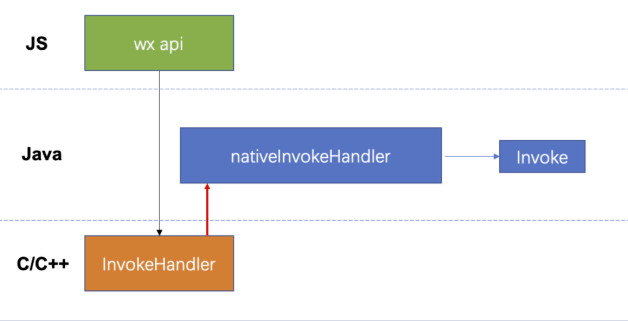

### 小游戏配置

小游戏根目录下的 `game.json` 文件用来对小游戏进行配置。文件内容为一个 JSON 对象

```json
{
  "deviceOrientation": "portrait",
  "networkTimeout": {
    "request": 5000,
    "connectSocket": 5000,
    "uploadFile": 5000,
    "downloadFile": 5000
  },
  "navigateToMiniProgramAppIdList": [
    "wxe5f52902cf4de896"
  ],
  "plugins": {
    "cocos": {
      "provider": "wx7095f7fa398a2f30",
      "version": "2.3.3",
      "path": "cocos"
    }
  },
  "subpackages": [
    {
      "name": "engine",
      "root": "engine/"
    }
  ]
}
```

### 入口文件

`minigame/game.js` - 开发者定义的小游戏入口文件。

### 全局对象

`wx` 是 小游戏 `API` 全局对象（类型`Object` ），用于承载小游戏能力相关 API。具体请参考[小游戏 API 参考文档](https://developers.weixin.qq.com/minigame/dev/api/)。

### 环境差异

尽管各运行环境是十分相似的，但是还是有些许区别：

- `JavaScript` 语法和 `API` 支持不一致：语法上开发者可以通过开启 `ES6` 转 `ES5` 的功能来规避（[详情](https://developers.weixin.qq.com/miniprogram/dev/devtools/codecompile.html#es6-转-es5)）；此外，小游戏基础库内置了必要的`Polyfill`，来弥补 `API` 的差异（[详情](https://developers.weixin.qq.com/minigame/dev/guide/runtime/js-support.html))。

### 运行限制

基于安全考虑，小程序中不支持动态执行 `JS` 代码，即：

- 不支持使用 `eval` 执行 `JS` 代码
- 不支持使用 `new Function` 创建函数

### 分包加载

- 整个小游戏所有分包大小不超过 `20M`
- 单个分包不限制大小，主包不超过 `4M`

## 运行性能

### 性能指标

> **总启动耗时**：从玩家点击小游戏到首屏渲染的总加载耗时。
>
> **总启动耗时（冷启动）**：从玩家点击小游戏到首屏渲染的总加载（需要下载号码包的情况）耗时。
>
> **启动代码包加载耗时**：小游戏启动阶段，启动代码包加载的耗时。
>
> **首屏渲染耗时**：小游戏启动阶段，首屏渲染的耗时。
>
> **代码包加载留存率（总）**：从玩家点击小游戏到代码包加载完成的留存率。
>
> **代码包加载留存率（冷启动）**：从玩家点击小游戏到代码包加载（需要下载号码包的情况）完成的留存率。
>
> **首屏打开留存率**：从玩家点击小游戏到首屏渲染界面的留存率。
>
> **性能 - 流失用户**：代码包加载阶段离开的用户。
>
> **FPS均值**：每秒采集的帧率数据平均值。
>
> **FPS方差**：每秒采集的帧率数据方差。
>
> **CPU均值**：CPU占用率均值。
>
> **内存均值**：内存占用绝对值均值。
>
> **内存增长**：内存占用相对于小游戏启动时刻增长的内存。
>
> **平均网络延迟**：请求业务服务器数据是耗时平均值。
>
> **平均包长**：请求业务服务器数据返回包大小平均值。
>
> **错误量**：请求业务服务器数据错误量。
>
> **内存异常退出次数**：小游戏运行过程中，由于内存占用过大而导致系统 KILL 掉异常退出的次数。
>
> **内存异常退出人数**：小游戏运行过程中，由于内存占用过大而导致系统 KILL 掉异常退出的人数。
>
> **网络总请求数**：统计不同接口（request,`downloadFile`）成功、失败量，此指标按5%采样率对全网所有真实数据进行采集。
>
> **网络请求错误数**：请求错误次数，HTTP Status Code : [400,599]。
>
> **网络请求错误率**：请求错误次数与总请求次数的比值，即网络请求错误数/网络总请求数，统计PV>100并根据此指标排序。
>
> **网络请求耗时**：网络接口（request,`downloadFile`）的请求耗时，是否成功（根据HTTP status code）、不同网络条件下的数据统计。
>
> **网络请求数据长度**：网络接口（request,`downloadFile`）的数据回包大小，是否成功（根据HTTP status code）、不同网络条件下的数据统计。
>
> **网络接口延迟**：网络接口（request,`downloadFile`）请求耗时均值，统计PV>100并根据此指标排序。

### 开发者需要关注哪些性能指标

主要由启动和运行两个阶段产生性能问题。

- 启动阶段：启动时长，该数据将显著影响用户打开留存率
- 运行阶段：内存峰值、Crash率、CPU占用、流畅度、网络等
- 其他兼容性问题，包括 `JS` 异常、黑屏等严重问题


### 环境评测

开发与现网两个环境进行评测。

开发阶段：

- 评测过程的客观环境更为稳定（比如固定的机型基线，网络环境等）
- Profile数据更为详细，方便掌握性能细节

现网阶段：

- 基于统计角度进行评测，从整体采样数据取反映游戏质量
- 覆盖开发测试阶段无法预估的业务场景，比如网络异常、特定条件下的 `JS` 异常等

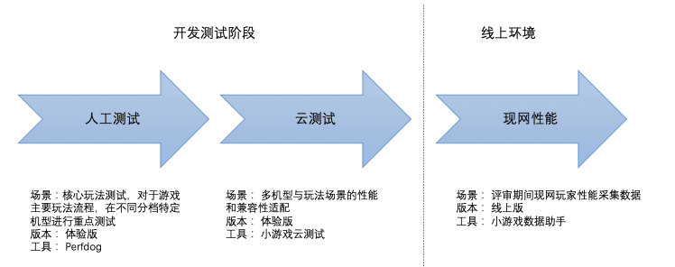


评测的方法，开发者可以利用[PerfDog](https://perfdog.qq.com/) 或[小游戏云测试](https://developers.weixin.qq.com/minigame/dev/guide/performance/perf-tools-cloudtest.html)进行数据获取

#### 性能基线

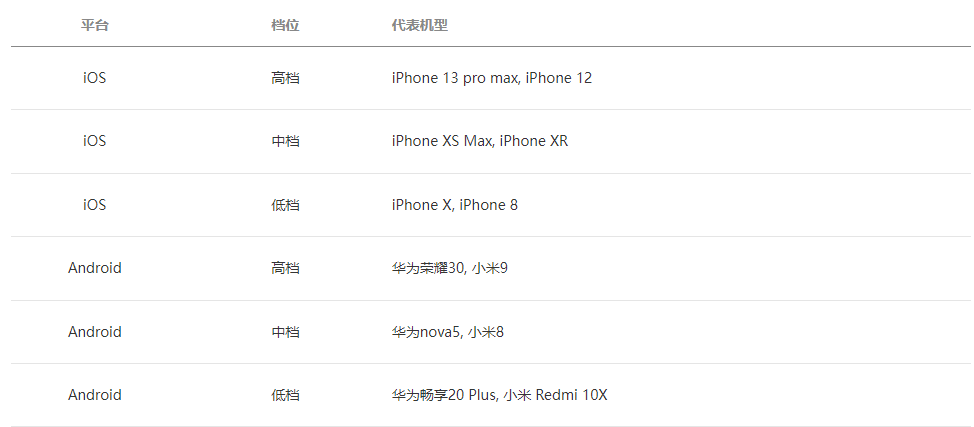


## Cocos 开发小游戏

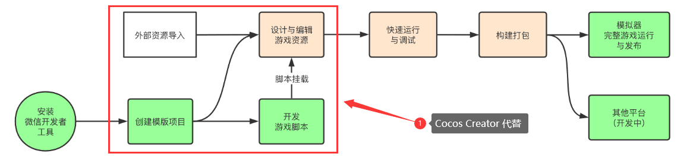

### 性能运行状况

游戏性能出现问题，可以总结为就是比较卡，不流畅。

Cocos Creator 预览运行时左下角show fps 中的指标可以直观的表现游戏的运行状况。

Cocos Creator 2.x版本

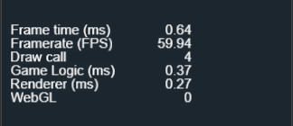

性能指标解释

Frame time（ms）： 就是 一帧所用的时间，  是  Game  Logic（ms） + Renderer（ms）的时间综合。

FPS：  (帧/秒) 每秒传输帧数 ，帧率越低越卡。

Draw Call：CPU给 GPU 发的一个渲染指令，Draw Call越多，性能越差。**特别解释**：DrawCall 中文译为“绘制调用”或“绘图指令”。Draw Call 是一种行为（指令），即 CPU 调用图形 API，命令 GPU 进行图形绘制，一般可以简称为“DC”。

game logic ：游戏每帧逻辑时间 ,时间越短越好

 renderer  ：渲染时间 ,时间越短越好

WebGL：暂未查阅到相关解释

Cocos Creator 3.x 版本

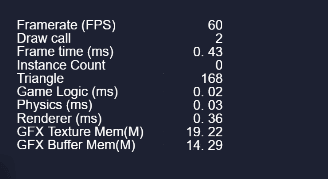

Framerate(FPS): 帧率是以帧称为单位的位图图像连续出现在显示器上的频率，物质在1s内完成周期性变化的次数叫做频率，常用f表示 f=1/T；

Draw Call：是一种行为（指令），即 CPU 调用图形 API，命令 GPU 进行图形绘制，可以了理解为渲染调用次数；详细可以参考 [查看](https://www.jianshu.com/p/c0f4598cbb20)

Frame time（ms）：每帧的时间；如果你游戏帧率是60fps,，则每帧时间为1/60=0.01666，就是16ms;

Instance Count: 实例数量

Triangle: 三角面数量，在2D游戏开发中，纹理贴图都是矩形存在的，一个矩形由两个三角形组成，所以一张纹理贴图占用两个三角面数量

Game Logic(ms): 游戏逻辑耗时

Physics(ms): 物理引擎耗时

Randerer(ms): 渲染耗时

GFX Texture Men(M): 纹理缓存

GFX Buffer Men(M): GFX 缓存
参考链接：https://www.jianshu.com/p/7ae9045043ef

## 首屏优化

### 启动优化最佳实践

优化小游戏的启动性能， 很明显需要降低启动时序中的各个步骤耗时。

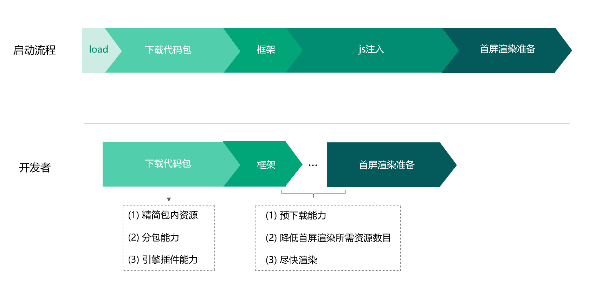

更多细节参考：[如何提升启动速度](https://developers.weixin.qq.com/minigame/dev/guide/performance/perf-action-start2.html)

### 首屏资源

核心思想：**简化首屏首个包**

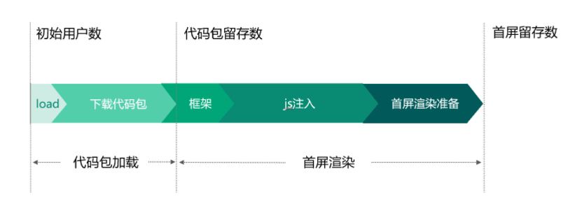

#### 方案一

微信小游戏的启动性能优化之首屏渲染

https://developers.weixin.qq.com/community/minigame/article/doc/000c86f5ee81b8c05b2bc9cc650013

开放数据域UI绘制解决方案发布 —— 轻量级的Canvas渲染引擎
https://github.com/wechat-miniprogram/minigame-canvas-engine/blob/master/demos/cocoscreator

注意：插件添加后不能移除

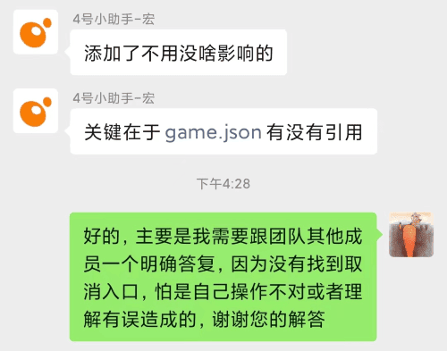

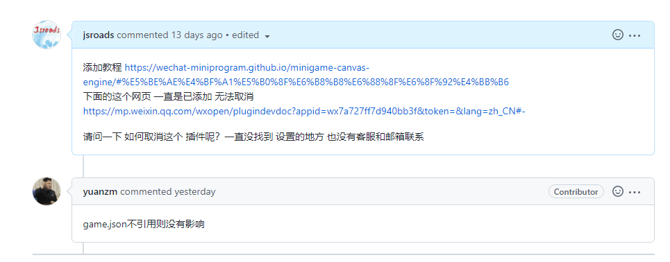

#### 方案二

使用最新的`Cocos Creator` 比如 `3.5.2` 构建小游戏 选择替换插屏 然后修改相关代码

**注意**：本次优化先探索了【方案一】方案，成功后，发现了【方案二】方案，最后使用简化版的【方案二】方案

【方案二】的论坛讨论地址  [求助 cocoscreator3.x实现的微信小游戏启动时间过长](https://forum.cocos.org/t/topic/115923/18)

后面 官方自己再 `Cocos Creator 3.x` 做了优化，于是我就借用`Cocos Creator 3.x` 让`Cocos Creator 2.x`版本还魂。最后实现了此功能

其他相关技术：


涉及的技术 `webgl` 相关的渲染库 https://pixijs.com/  关于 `pixijs` 更多了解 [如何用pixi.js开发微信小游戏](https://juejin.cn/post/6885743821825507342)【掘金】

### 游戏分包

- 分包大小的限制,[使用代码分包](https://developers.weixin.qq.com/minigame/dev/guide/base-ability/subPackage/useSubPackage.html)，目前小游戏分包大小有以下限制：
  - 整个小游戏所有分包大小不超过 `20M`
  - 单个分包不限制大小，主包不超过 `4M`
  - **Adapter 下载地址** [weapp-adapter.zip](https://res.wx.qq.com/wxdoc/dist/assets/media/weapp-adapter.9568fddf.zip)  [Adapter文档](https://developers.weixin.qq.com/minigame/dev/guide/best-practice/adapter.html)

使用方法 `game.json` 配置正常如下

```json
{
    "subpackages": [
        {
            "name": "engine",
            "root": "subpackages/engine/"
        }
    ]
}
```

### 代码优化

#### 引擎模块裁切

核心思想：去除不必要(项目内未使用)的引擎模块，比如`3d`相关、`Physics`和`TiledMap`等模块。

引擎模块功能介绍 [点击前往](https://www.jianshu.com/p/d18e2ffb7c56)

去掉不必要的模块后引擎文件减小，全部模块打包后接近`2MB`，裁切后降低到`1.1MB`，对于小游戏来讲是个不错的办法，原生平台不考虑包体情况可以忽略。

#### 首屏资源拆解（非必须）

适用于没有首屏的老项目，目前最新版已经可以勾选

#### 资源拆解

工具 ：首屏拆解插件：论坛地址：https://forum.cocos.org/t/topic/88071

插件地址：https://github.com/dylan465/plugin_internal_res_packer

关键代码：

```javascript
		// 打包启动场景资源

		// 方法1：读路径 
		// queryAssets('db://assets/Scene/LaunchScene.fire');

		// 方法2：读配置
		var startSceneUuid = options.startScene;
		copyAssets([startSceneUuid]);
```

使用方法：

1. 把该插件文件夹拷贝到{项目根目录}`/packages`下，重启`Cocos Creator`生效。如果想全局所有项目使用该插件，把插件文件夹拷贝到 `{用户名}/.CocosCreator/packages`下。

2. 构建微信小游戏项目，勾选`MD5 cache`，取消勾选调试模式（正式打包才启用该插件功能）

3. 构建完成后，会多出一个`res_internal`文件夹，这个文件夹就是内置的资源。把原本`res`文件夹资源上传到服务器后，移除`res`文件夹，最后把`res_internal`重命名为`res`。


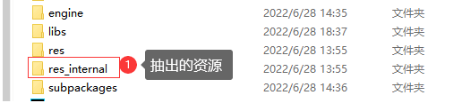

### 代码压缩

#### HDS 在线JS混淆加密器V3 可以下载离线版本

相关网站：http://www.moralsoft.com/hdojso.html

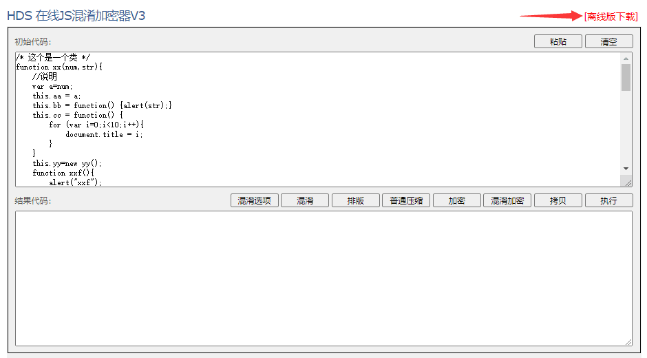

#### JavaScript Obfuscator Tool

相关网站：https://obfuscator.io/

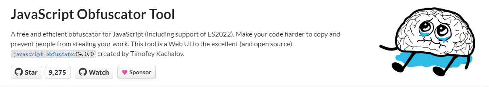

更多了解：[Javascript的压缩与混淆](https://juejin.cn/post/6844904153592889357)【掘金】

#### 代码格式化

http://jsnice.org/

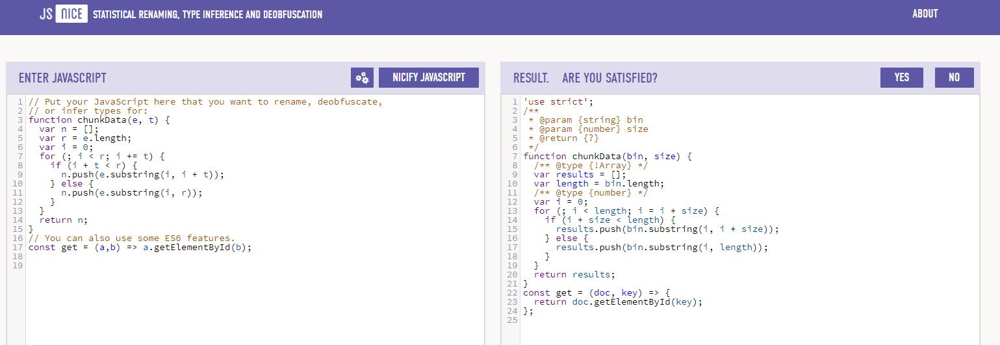

### 资源压缩

工具：**tinypng**：https://tinypng.com/


工具：改图鸭:https://www.gaituya.com/yasuo/

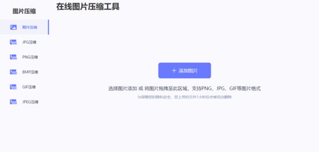

命令行工具：pngquant:https://pngquant.org

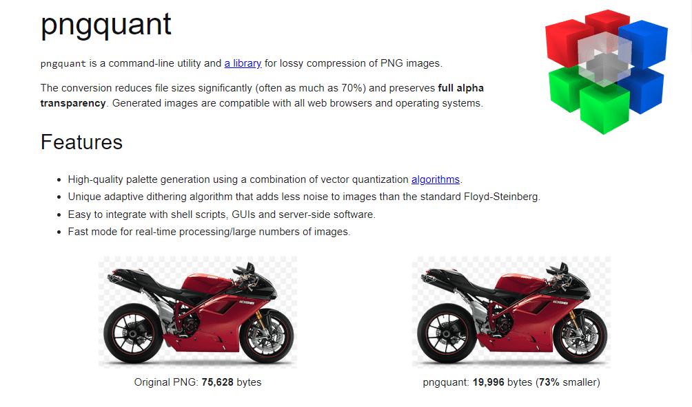

批处理工具 相关技术 https://github.com/RmondJone/PicPngquant


字体瘦身

软件 [Fontmin](http://ecomfe.github.io/fontmin/#banner)

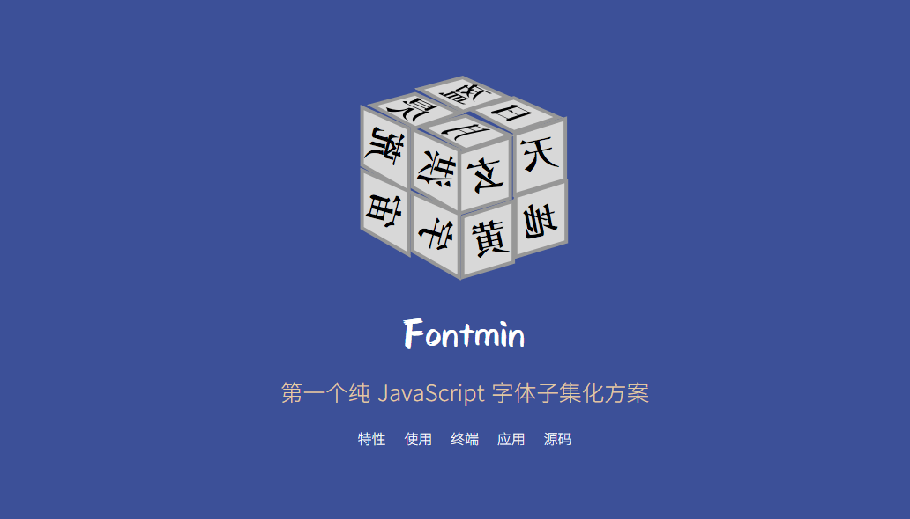

[fontmin-client](https://github.com/coderhsw/fontmin-client) 基于`Fontmin`实现的字体压缩工具

[添加游戏开发常用字体](https://github.com/DavidSheh/CommonChineseCharacter)

[3500常用字.txt](https://github.com/DavidSheh/CommonChineseCharacter/blob/master/3500常用字.txt)

[7000常用字.txt](https://github.com/DavidSheh/CommonChineseCharacter/blob/master/7000常用字.txt)

[7000常用字优化版.txt](https://github.com/DavidSheh/CommonChineseCharacter/blob/master/7000常用字优化版.txt)

[文本去除空格在线工具](http://www.esjson.com/delSpace.html)

[3500个常用汉字以及5000+ 生僻字集合](https://github.com/elephantnose/characters)

### 位图字体

在线地址： https://snowb.org/

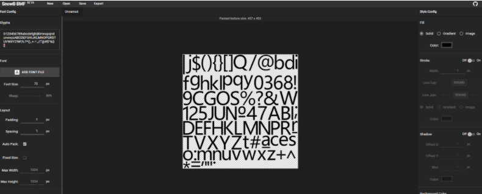

## 首屏优化插件

**小游戏启动优化**  [点击前往](https://store.cocos.com/app/detail/4442)

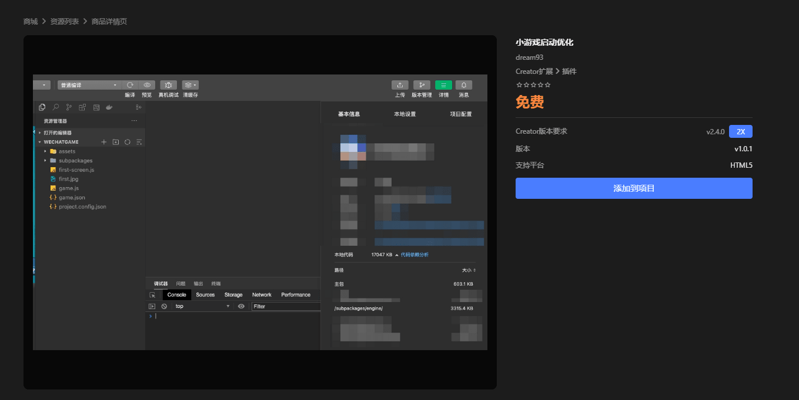

> 作用
>
> 首屏启动优化
>
> 使用方式
>
> 将首屏图片命名为`first.jpg`放入`settings`根目录,在Cocos中构建即可
>
> 支持平台
>
> 理论上微信、抖音、快手小游戏都支持，目前只测试微信
>
> 支持版本
>
> 2.4.10上测试，理论支持2.4.x，不支持其他版本
>
> 售后
>
> 代码开源，不负责任何售后，构建中出错，请卸载该插件，插件没有开关选项，推荐将插件安装在项目。
>
> 原理
>
> [Cocos Creator 微信小游戏平台启动与包体优化（首屏渲染耗时降低 50%）](https://forum.cocos.org/t/cocos-creator-50/94999) 该文作者非本人（这里是插件作者）~
>
> 


本人（这个是我本文作者）这里做了拓展功能 [点击前往](https://github.com/jsroads/mylibs/tree/main/fastFirstScreen)  建议使用 [论坛改良版本初](https://github.com/jsroads/mylibs/tree/main/fastFirstScreen/论坛改良版本初)  因[改良版本二](https://github.com/jsroads/mylibs/tree/main/fastFirstScreen/改良版本二) 是对自己的项目做了特殊处理。

## 拓展知识资源

### 微信小游戏示例

微信[小游戏示例源码](https://github.com/wechat-miniprogram/minigame-demo)，欢迎扫描以下小程序码体验。

> 提示：请使用微信开发者工具或微信客户端 6.7.2 及以上版本运行。

[](https://github.com/wechat-miniprogram/minigame-demo/blob/master/readmeImages/QR code.jpg)

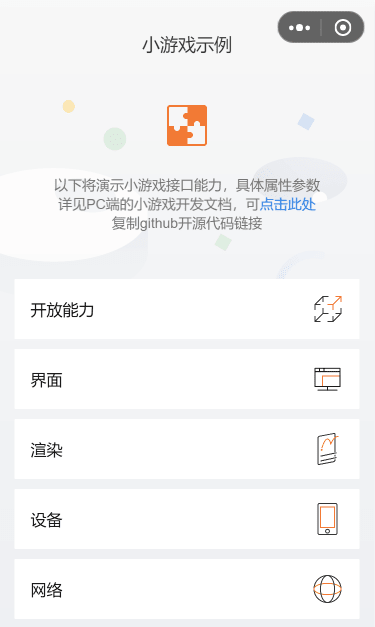

### 轻量级canvas渲染引擎


[minigame-canvas-engine](https://github.com/wechat-miniprogram/minigame-canvas-engine)相关文档 可以查看这里[点击前往](https://wechat-miniprogram.github.io/minigame-canvas-engine/)

更多相关原理 [手把手教你打造一款轻量级canvas渲染引擎](

## 其他踩坑

### 启动游戏报错

问题出现，有时候启动游戏，一开始就报错，心中不免疑惑，影响打包吗？哪里出错了？

```
Window "main" unresponsive: [object Object]
```

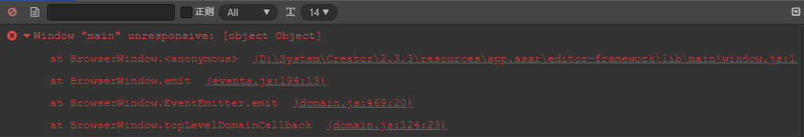

解决方案：暂无，不影响打包

群友回复
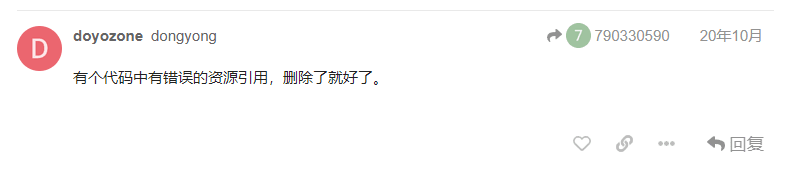

官方回复：


### 分包加载报错

```json
[项目资源引用错误] 项目资源 subpackages/firstRes/raw-assets/58/582c1f41-2b52-4d83-873f-f8adcb46f1c6.5d3ac.jpg 所在的分包尚未加载
```


报错原因：子包中的资源不要在主包中有引用关系，可以找找子包中有哪些图片在主包的场景或者预制中有挂载。不嫌麻烦就在子包的资源中查找引用，看看是否是在主包的资源上使用。

参考链接：[项目资源 subpackages/…png 所在的分包尚未加载【Cocos论坛】](https://forum.cocos.org/t/subpackages-png/93805)

### 图片尺寸过大

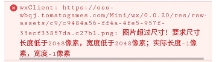

解决办法：把图切成合格的，比如2份 或者 4份

### JSON.parse方法 报错

```json
"SyntaxError: Unexpected end of JSON input
    at JSON.parse (<anonymous>)
```

```json
"SyntaxError: Unexpected token u in JSON at position 0
    at JSON.parse (<anonymous>)
```

原因是 取到了 空字符串 或者 undefined

```javascript
JSON.parse(null)//正常
JSON.parse(false)//正常
JSON.parse("[]")//正常
JSON.parse("")//异常
JSON.parse(undefined)//异常
```

其实仔细看 应该理解JSON.parse 里面必须是一个对象，双引号 里面虽然为空 但是不能正常

### 项目配置服务器地址

小游戏需要配置**资源**和**请求**服务器白名单:

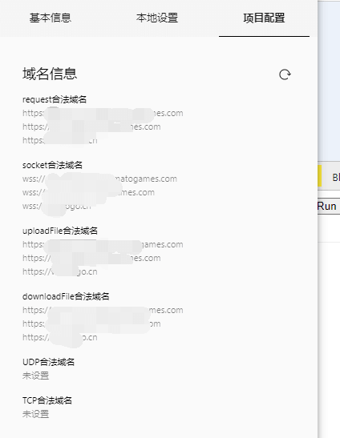

相关限制如下：https://developers.weixin.qq.com/minigame/dev/guide/base-ability/network.html

> 服务器域名请在 「小程序后台 - 开发 - 开发设置 - 服务器域名」 中进行配置，配置时需要注意：
>
> - 域名只支持 `https` ([wx.request](https://developers.weixin.qq.com/minigame/dev/api/network/request/wx.request.html)、[wx.uploadFile](https://developers.weixin.qq.com/minigame/dev/api/network/upload/wx.uploadFile.html)、[wx.downloadFile](https://developers.weixin.qq.com/minigame/dev/api/network/download/wx.downloadFile.html)) 和 `wss` ([wx.connectSocket](https://developers.weixin.qq.com/minigame/dev/api/network/websocket/wx.connectSocket.html)) 协议；
> - 域名不能使用 IP 地址（小程序的[局域网](https://developers.weixin.qq.com/miniprogram/dev/framework/ability/mDNS.html) IP 除外）或 localhost；
> - 可以配置端口，如 https://myserver.com:8080，但是配置后只能向 https://myserver.com:8080 发起请求。如果向 https://myserver.com、https://myserver.com:9091 等 URL 请求则会失败。
> - 如果不配置端口。如 https://myserver.com，那么请求的 URL 中也不能包含端口，甚至是默认的 443 端口也不可以。如果向 https://myserver.com:443 请求则会失败。
> - 域名必须经过 ICP 备案；
> - **出于安全考虑，`api.weixin.qq.com` 不能被配置为服务器域名，相关 API 也不能在小程序内调用。** 开发者应将 AppSecret 保存到后台服务器中，通过服务器使用 `getAccessToken` 接口获取 `access_token`，并调用相关 API；
> - 不支持配置父域名，使用子域名。

## 总结

对于小游戏来讲，其实无非是几点：

1. 对于用不到的资源和素材坚决不加载
2. 对于必须要用的资源，想办法复用和压缩
3. 对于可能用的资源，可以懒加载，就是用的时候再去加载