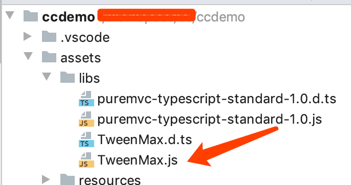

游戏开发，其中必不可少的就是动画，广义的动画其中包括动画师做的动画和程序实现的动画，动画师实现的动画有swf 和spine和龙骨动画，程序实现的动画一般都是能够用数学公式表达出来的动画，也叫叫缓动动画，对物体位置、角度，透明度这些基本属性的改变，这其中运行效率和开销成为了重中之重。作为一个搬砖几年的开发者，学会使用轮子造车是必不可少的一部分。以下就是我是如何在 Cocos Creator 项目里面使用 鼎鼎大名的 TweenMax（TweenLite同理）。

<!-- more -->

### 下载和引入TweenMax

#### 下载 TweenMax

- 官网下载我们的类库 [点击打开](https://greensock.com/) 英文好的建议去官网下载和学习

  下载地址  [https://greensock.com](https://greensock.com/)


- 中文TweenMax 网站 [点击打开](https://www.tweenmax.com.cn/) 英文不太好的可以对比官网 学习入门

​      下载地址  https://www.tweenmax.com.cn/source/

#### 引入TweenMax

我们把项目放入我们的项目



因为我们引入的是JavaScript文件，在JavaScript 项目就可以直接用了，但如果是Typescript项目，还要编写或者去网上下载对应的 声明文件，目前我没有找到合适的，就在网上找了一个别人编写的导入，修改了几行代码就用了，关于声明文件，这个可以去Typescript看，不在此篇文章内容赘述。

下面是我编写的声明文件  `TweenMax.d.ts`

```typescript
/**
 * Created by jsroads on 2019/9/3 . 2:32 下午
 * Note:
 */
declare class TweenMax {
    /**
     *构造函数
     *@param target 应该影响其属性的目标对象（或对象数组）
     *@param duration 持续时间（以秒为单位）
     *@param vars 参数对象，用于定义应该补间的每个属性的结束值以及任何特殊属性
     */
    constructor(target:any, duration:Number, vars:any );
    static to(target:any, duration:Number, vars:any ) : TweenMax;
    static from(target:any, duration:Number, vars:any ) : TweenMax;
    static fromTo(target:any, duration:Number, fromVars:any, toVars:any ) : TweenMax;
    static staggerFrom(target:any, duration:Number, fromVars:any, toVars:any ) : TweenMax;
    static staggerTo(targets:Array<any>, duration:Number, vars:any, stagger?:Number, onCompleteAll?:Function, onCompleteAllParams?:Array<any>, onCompleteAllScope?:any ) : Array<any>;
    static staggerFromTo(targets:Array<any>, duration:Number, fromVars:any, toVars:any, stagger?:Number, onCompleteAll?:Function, onCompleteAllParams?:Array<any>, onCompleteAllScope?:any ) : Array<any>
    static getTweensOf(target:any, onlyActive:Boolean );
    static delayedCall(delay:Number, callback:Function, params?:Array<any>, scope?:any, useFrames?:Boolean ) : TweenMax;
    static killDelayedCallsTo(func:Function );
    static killTweensOf(target:any, vars?:any );
    static killAll(complete?:Boolean, tweens?:Boolean, delayedCalls?:Boolean, timelines?:Boolean );
    static killChildTweensOf(parent:any, complete?:Boolean );
    static pauseAll(tweens:Boolean, delayedCalls:Boolean, timelines:Boolean );
    static resumeAll(tweens:Boolean, delayedCalls:Boolean, timelines:Boolean );
    static set(target:any, vars:any ) : TweenMax;

    isActive() : Boolean;
    delay(value?:Number ) :any;
    duration(value:Number ) :any;
    eventCallback(type:String, callback?:Function, params?:Array<any>, scope?:any ) :any;
    endTime(includeRepeats:Boolean ) : Number;
    /**
     * 刷新任何内部记录的开始/结束值，如果您想要重新启动动画而不恢复任何先前记录的起始值，这将非常有用。
     */
    invalidate();
    kill(vars?:any, target?:any ) :any;
    pause(atTime:any, suppressEvents:Boolean ) :any;
    paused(value:Boolean ) :any;
    play(from:any, suppressEvents:Boolean ) :any;
    progress(value:Number, suppressEvents:Boolean ) :any;
    /**
     * 重启
     *@param includeDelay（default =  false） - 确定重新启动时是否遵循延迟（如果有）
     *@param suppressEvents（default =  true） - 如果  true （默认值），当播放头移动到time 参数中定义的新位置时，不会触发任何事件或回调。
     */
    restart(includeDelay?:Boolean, suppressEvents?:Boolean ) :any;
    resume(from?:any, suppressEvents?:Boolean ) :any;
    /**
     * 反转播放，以便动画的所有方面都向后定向，包括例如补间的简易性。
     *@param from （default =  null） - 动画开始反向播放的时间（或TimelineLite / TimelineMax实例的标签）（如果没有定义，它将从播放头当前所在的任何地方开始播放）。要从动画的最后开始，请使用  0。负数相对于动画结束，因此-1将从结尾开始为1秒
     *@param
     */
    reverse(from?:any, suppressEvents?:Boolean ) :any;
    /**
     * 获取或设置动画的反转状态，指示是否应该向后播放动画。
     *@param value （default =  false） - 省略参数返回当前值（getter），而定义参数则设置值（setter）并返回实例本身以便于链接
     */
    reversed(value?:Boolean ) :any;

    /**
     * 重复动画
     *@param value 次数（第一次不计算在内）
     */
    repeat(value:Number ) :any;
    /**
     * 获取或设置重复之间的秒数（或基于帧的补间的帧）的时间量。
     */
    repeatDelay(value:Number ) :any;
    /**
     * 跳转到指定时间(不影响实例是暂停还是反转)
     *@param time 要去的时间
     *@param suppressEvents（default = true）-如果true（默认值），当播放头移动到time 参数中定义的新位置时，不会触发任何事件或回调。
     */
    seek(time:any, suppressEvents?:Boolean ) :any;
    startTime(value:Number ) :any;
    time(value:Number ) :any;
    timeScale(value:Number ) :any;
    /**
     * 获取或设置补间的总持续时间（以秒为单位）（或基于帧的补间的帧），包括任何重复或repeatDelay。
     *@param value （default =  NaN） - 省略参数返回当前值（getter），而定义参数则设置值（setter）并返回实例本身以便于链接。负值将从 动画的END开始解释
     */
    totalDuration(value:Number ) :any;
    totalProgress(value:Number, suppressEvents:Boolean ) :any;
    totalTime(time:Number, suppressEvents:Boolean ) :any;
    /**
     * 动态更新补间值，即使补间正在进行中，它们也会无缝地改变路线。
     *@param vars 包含应具有udpated的目标值的属性的对象。但如果你改变一个插件值，则需要完全定义它,例如，要将目标值更新x为300并将目标值更新y为500，请传递:{x:300, y:500}
     *@param resetDuration （默认值=  false） -如果补间已开始（或成品），并  resetDuration 是  true，补间将重新启动。如果  resetDuration 是  false，则补间的时间将被接受（不重启），并且将调整每个补间属性的起始值，使其看起来无缝地重定向到新的目标值
     */
    updateTo(vars:object, resetDuration?:Boolean ) :any;

    // ease: Ease;// (or Function or String);
    // onComplete: Function;
    /**可用于存储你需要的数据*/
    data: any;
    /**获取动画的目标对象*/
    target: any;
    /**获取动画的父级时间轴对象（只读）*/
    readonly timeline: any;
    /**一个存储了传递给构造器的配置变量的对象。包含动画选项和回调函数等。例如delay、paused、onComplete*/
    vars: any;
}
    class Ease {
        constructor(func?: (...args: any[]) => void, extraParams?: any[], type?: number, power?: number);

        /** Translates the tween's progress ratio into the corresponding ease ratio. */
        getRatio(p: number): number;
    }

    interface EaseLookup {
        find(name: string): Ease;
    }

    class Back extends Ease {
        static easeIn: Back;
        static easeInOut: Back;
        static easeOut: Back;
        config(overshoot: number): Elastic;
    }
    class Bounce extends Ease {
        static easeIn: Bounce;
        static easeInOut: Bounce;
        static easeOut: Bounce;
    }
    class Circ extends Ease {
        static easeIn: Circ;
        static easeInOut: Circ;
        static easeOut: Circ;
    }
    class Cubic extends Ease {
        static easeIn: Cubic;
        static easeInOut: Cubic;
        static easeOut: Cubic;
    }

    class Elastic extends Ease {
        static easeIn: Elastic;
        static easeInOut: Elastic;
        static easeOut: Elastic;
        config(amplitude: number, period: number): Elastic;
    }

    class Expo extends Ease {
        static easeIn: Expo;
        static easeInOut: Expo;
        static easeOut: Expo;
    }

    class Linear extends Ease {
        static ease: Linear;
        static easeIn: Linear;
        static easeInOut: Linear;
        static easeNone: Linear;
        static easeOut: Linear;
    }

    class Quad extends Ease {
        static easeIn: Quad;
        static easeInOut: Quad;
        static easeOut: Quad;
    }

    class Quart extends Ease {
        static easeIn: Quart;
        static easeInOut: Quart;
        static easeOut: Quart;
    }

    class Quint extends Ease {
        static easeIn: Quint;
        static easeInOut: Quint;
        static easeOut: Quint;
    }

    class Sine extends Ease {
        static easeIn: Sine;
        static easeInOut: Sine;
        static easeOut: Sine;
    }

    class SlowMo extends Ease {
        static ease: SlowMo;
        config(linearRatio: number, power: number, yoyoMode: boolean): SlowMo;
    }

    class SteppedEase extends Ease {
        constructor(staps: number);
        config(steps: number): SteppedEase;
    }

    interface RoughEaseConfig {
        clamp?: boolean;
        points?: number;
        randomize?: boolean;
        strength?: number;
        taper?: "in" | "out" | "both" | "none";
        template?: Ease;
    }

    class RoughEase extends Ease {
        static ease: RoughEase;
        constructor(vars: RoughEaseConfig);
        config(steps?: number): RoughEase;
    }

    const Power0: typeof Linear;
    const Power1: typeof Quad;
    const Power2: typeof Cubic;
    const Power3: typeof Quart;
    const Power4: typeof Quint;
    const Strong: typeof Quint;
```

到此引入工作一切正常了，但我们的项目是游戏项目所以，有关css的部分会在初始化的时候报错*“Uncaught TypeError: container.appendChild”*，这个问题通过搜索和查找发现了根源，于是乎解决并不复杂。特别是我借用了Webstorm代码折叠的功能，直接找到报错的代码块，直接注释，完美解决。

以下是我查到内容：

> Hello All,
>
> We've run into an issue using gsap with Cocos Creator native builds.  It seems like some updates they've done recently has caused conflicts with gsap.  Previous versions of Cocos Creator had no issues.
>
> From what I can tell, the Creator runtime dies when it hits:
>
> ```javascript
> _createSVG = function(type, container, attributes) {
>   var element = _doc.createElementNS("http://www.w3.org/2000/svg", type),
>       reg = /([a-z])([A-Z])/g,
>       p;
>   for (p in attributes) {
>     element.setAttributeNS(null, p.replace(reg, "$1-$2").toLowerCase(), attributes[p]);
>   }
>   container.appendChild(element);
>   return element;
> },
> ```
>
> The container.appendChild(element) line.  I get an error along the lines of: 
>
> ```javascript
> ERROR: TypeError: container.appendChild is not a function. (In 'container.appendChild(element)', 'container.appendChild' is undefined), location: src/project.dev.js:5718:34
> ```
>
> I'm wondering if there's not some DOM elements trying to be accessed that don't exists (the cocos runtime has no real DOM). 
>
> This function appears to be part of the CSSPlugin.  I'm wondering if there's a way to remove the CSSPlugin cleanly from gsap.  If anyone could point me in the right direction, I would appreciate it.  I didn't find any information regarding custom builds or removing plugins in any of the documentation.
>
> Thanks for the help, and thanks for the great lib!

地址 https://greensock.com/forums/topic/19943-possible-to-remove-plugins-from-gsap-builds

#### 用法

```typescript
TweenMax.fromTo(this.node,0.3,{scale:0},  {scale:1.0,ease:Back.easeInOut})
```

### 参考链接

- [Possible To Remove Plugins from GSAP builds](https://greensock.com/forums/topic/19943-possible-to-remove-plugins-from-gsap-builds)
- [记录TweenLite库](http://leng521.top/posts/90e70f70/)
- [TweenMax gsap error Android and Simulator](https://discuss.cocos2d-x.org/t/tweenmax-gsap-error-android-and-simulator/45824)
- [CocosCreator(TypeScript)使用TweenMax动画插件时Creator.d.ts注释补充](https://blog.csdn.net/Sam_ONE/article/details/87931299)
- [微信小游戏使用TweenLite的问题](https://forum.cocos.com/t/tweenlite/59580)

