接触到原生开发，基本不可避免的要接触热更新游戏，有时候游戏需要平台审核，这个期间需要一些时间，遇到小版本的迭代，热更新也是必不可少的一部分，下面我们就用Cocos Creator 2.2.0实现一些热更新，项目开发语言采用 Typescript，环境是Mac环境 测试 为iOS [项目源码](https://github.com/jsroads/creatorHotUpDate)最后附上。
<!--more-->

### 开发环境

- Xcode
- Cocos Creator 2.2.0
- Typescript
- Webstorm（非必须）
- Mac 一台
- ios 手机一步
- TomCat 本地服务器（也可以采用自己熟悉的服务器，比如python）

### 开发前期 预习

- Cocos 官方文档 - [资源热更新教程](https://docs.cocos.com/creator/2.2/manual/zh/advanced-topics/hot-update.html)
- Cocos 官方文档 - [热更新管理器](https://docs.cocos.com/creator/2.2/manual/zh/advanced-topics/assets-manager.html)
- Cocos 官方热更新项目 - [tutorial-hot-update](https://github.com/cocos-creator/tutorial-hot-update)

如果上面这些都已经预习完毕，那么接下来可以正常开工了。

### 开发步骤

1. 首先我们新建一个cocos的Typescript项目 名字叫  ‘creatorHotUpDate‘
2. 在项目根目录添加 version_generator.js 文件
3. 然后 添加更新面板，编写游戏热更新的逻辑
4. 先生成一个 高版本 的 游戏 把 素材 和 配置文件 上传服务器
5. 修改游戏内容，生成一个低版本的游戏 重新构建 编译 
6. 启动游戏，测试更新。

### 详细过程

##### 项目具体步骤

- 新建一个Cocos Creator (typescript)项目成功后，修改基本配置

  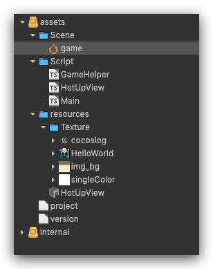

- 新建一个 展示面板 添加两个按钮（一个关闭，一个更新） 和 三个 label （两个展示进度，一个展示状态信息）

- 代码写更新逻辑，更新逻辑就是先去读取本地的配置文件，然后和远程的版本号对比，如果不一致（远程大于本地）就弹出更新游戏的面板。

  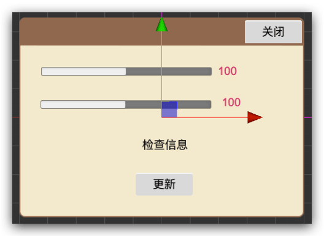

- 点击更新按钮，游戏更新开始，更新结束，重启游戏

##### 项目附加

- 需要启动一个服务器，放自己需要热更新的高版本的配置文件和游戏内容
- 需要用node 命令 生成不同版本号的项目的配置文件 
- 构建项目（如果是ios ，还需要证书申请等工作）

##### 先去下载 生成本地配置文件的 脚本  [version_generator.js](https://github.com/cocos-creator/tutorial-hot-update/blob/master/version_generator.js) 放在项目根目录下

当然了，也可以用我下面这个稍微修改了一些的脚本 

version_generator.js

```javascript
/**
 * Created by jsroads on 2019/10/29 . 1:35 下午
 * Note: 此模块用于热更新工程清单文件的生成
 * node 命令 例如
 * node version_generator.js
 *
 */
var fs = require('fs');
var path = require('path');
var crypto = require('crypto');

let native = "native";//原生平台
let platform = "ios";//ios or android
let gameName = "creatorHotUpDate";//develop or debug or release
/**
 * develop 正在开发的版本
 * debug 对内发布的测试版本
 * release 对外发布的线上版本
 * @type {string}
 */
let versionMode = "release";//develop or debug or release
let version = "1.0.1";//版本号
let cdnDir = "http://172.16.28.99:8888";
let packageUrlList = [cdnDir,gameName,native,platform,versionMode];
let remoteManifestUrlList = [cdnDir,gameName,native,platform,versionMode,"project.manifest"];
let remoteVersionUrlList = [cdnDir,gameName,native,platform,versionMode,"version.manifest"];
var manifest = {
    packageUrl: packageUrlList.join("/"),
    remoteManifestUrl: remoteManifestUrlList.join("/"),
    remoteVersionUrl: remoteVersionUrlList.join("/"),
    version: version,
    assets: {},
    searchPaths: []
};

//生成的manifest文件存放目录
var dest = 'assets/';
//项目构建后资源的目录
var src = 'build/jsb-link/';

/**
 *node version_generator.js -v 1.0.2 -u http://localhost:8888/你的游戏目录/ -s build/jsb-link/ -d assets/
 */
// Parse arguments
var i = 2;
while ( i < process.argv.length) {
    var arg = process.argv[i];

    switch (arg) {
        case '--url' :
        case '-u' :
            var url = process.argv[i+1];
            manifest.packageUrl = url;
            manifest.remoteManifestUrl = url + 'project.manifest';
            manifest.remoteVersionUrl = url + 'version.manifest';
            i += 2;
            break;
        case '--version' :
        case '-v' :
            manifest.version = process.argv[i+1];
            i += 2;
            break;
        case '--src' :
        case '-s' :
            src = process.argv[i+1];
            i += 2;
            break;
        case '--dest' :
        case '-d' :
            dest = process.argv[i+1];
            i += 2;
            break;
        default :
            i++;
            break;
    }
}


function readDir (dir, obj) {
    var stat = fs.statSync(dir);
    if (!stat.isDirectory()) {
        return;
    }
    var subpaths = fs.readdirSync(dir), subpath, size, md5, compressed, relative;
    for (var i = 0; i < subpaths.length; ++i) {
        if (subpaths[i][0] === '.') {
            continue;
        }
        subpath = path.join(dir, subpaths[i]);
        stat = fs.statSync(subpath);
        if (stat.isDirectory()) {
            readDir(subpath, obj);
        }
        else if (stat.isFile()) {
            // Size in Bytes
            size = stat['size'];
            md5 = crypto.createHash('md5').update(fs.readFileSync(subpath)).digest('hex');
            compressed = path.extname(subpath).toLowerCase() === '.zip';

            relative = path.relative(src, subpath);
            relative = relative.replace(/\\/g, '/');
            relative = encodeURI(relative);
            obj[relative] = {
                'size' : size,
                'md5' : md5
            };
            if (compressed) {
                obj[relative].compressed = true;
            }
        }
    }
}

var mkdirSync = function (path) {
    try {
        fs.mkdirSync(path);
    } catch(e) {
        if ( e.code != 'EEXIST' ) throw e;
    }
}

// Iterate res and src folder
readDir(path.join(src, 'src'), manifest.assets);
readDir(path.join(src, 'res'), manifest.assets);

var destManifest = path.join(dest, 'project.manifest');
var destVersion = path.join(dest, 'version.manifest');

mkdirSync(dest);

fs.writeFile(destManifest, JSON.stringify(manifest), (err) => {
    if (err) throw err;
    console.log('Manifest successfully generated version:',manifest.version);
});

delete manifest.assets;
delete manifest.searchPaths;
fs.writeFile(destVersion, JSON.stringify(manifest), (err) => {
    if (err) throw err;
    console.log('Version successfully generatedversion:',manifest.version);
});
```

##### 编写 更新代码 参考 

我主要用了 三部分代码 分别是 

- GameHelper.ts
- HotUpView.ts
- Main.ts

详细代码如下

GameHelper.ts

```typescript
/**
 * Created by jsroads on 2019/11/4 . 4:53 下午
 * Note:
 */
export default class GameHelper {
    public static getStoragePath(){
        return ((jsb.fileUtils ? jsb.fileUtils.getWritablePath() : '/') + 'mygame-remote-asset');
    }
    static currentVersion = "currentVersion";
}

```

HotUpView.ts

```typescript
/**
 * Created by jsroads on 2019/11/4 . 11:40 上午
 * Note:
 */
import GameHelper from "./GameHelper";

const {ccclass, property} = cc._decorator;
@ccclass
export default class HotUpView extends cc.Component {
    get storagePath() {
        return this._storagePath;
    }

    set storagePath(value) {
        this._storagePath = value;
    }

    @property({
        type: cc.Label
    })
    byteLabel = null;
    @property({
        type: cc.Label
    })
    fileLabel = null;
    @property({
        type: cc.ProgressBar
    })
    byteProgress = null;
    @property({
        type: cc.ProgressBar
    })
    fileProgress = null;
    @property({
        type: cc.Label
    })
    infoLabel = null;
    @property({
        type: cc.Asset
    })
    manifestUrl = null;

    private _am;
    private _updateListener;
    private _checkListener;
    private versionCompareHandle;
    private _updating;
    private _canRetry;
    private _storagePath;
    private _failCount;

    private info: any;

    updateCb(event) {
        var needRestart = false;
        var failed = false;
        switch (event.getEventCode()) {
            case jsb.EventAssetsManager.ERROR_NO_LOCAL_MANIFEST:
                this.infoLabel.string = 'No local manifest file found hot update skipped.';
                failed = true;
                break;
            case jsb.EventAssetsManager.UPDATE_PROGRESSION:
                this.byteProgress.progress = event.getPercent();
                this.fileProgress.progress = event.getPercentByFile();

                this.fileLabel.string = event.getDownloadedFiles() + ' / ' + event.getTotalFiles();
                this.byteLabel.string = event.getDownloadedBytes() + ' / ' + event.getTotalBytes();

                var msg = event.getMessage();
                if (msg) {
                    this.infoLabel.string = 'Updated file: ' + msg;
                    // cc.log(event.getPercent()/100 + '% : ' + msg);
                }
                break;
            case jsb.EventAssetsManager.ERROR_DOWNLOAD_MANIFEST:
            case jsb.EventAssetsManager.ERROR_PARSE_MANIFEST:
                this.infoLabel.string = 'Fail to download manifest file hot update skipped.';
                failed = true;
                break;
            case jsb.EventAssetsManager.ALREADY_UP_TO_DATE:
                this.infoLabel.string = 'Already up to date with the latest remote version.';
                failed = true;
                break;
            case jsb.EventAssetsManager.UPDATE_FINISHED:
                this.infoLabel.string = 'Update finished. ' + event.getMessage();
                needRestart = true;
                break;
            case jsb.EventAssetsManager.UPDATE_FAILED:
                this.infoLabel.string = 'Update failed. ' + event.getMessage();
                // this.panel.retryBtn.active = true;
                this._updating = false;
                this._canRetry = true;
                break;
            case jsb.EventAssetsManager.ERROR_UPDATING:
                this.infoLabel.string = 'Asset update error: ' + event.getAssetId() + ' ' + event.getMessage();
                break;
            case jsb.EventAssetsManager.ERROR_DECOMPRESS:
                this.infoLabel.string = event.getMessage();
                break;
            default:
                break;
        }

        if (failed) {
            this._am.setEventCallback(null);
            this._updateListener = null;
            this._updating = false;
        }

        if (needRestart) {
            this._am.setEventCallback(null);
            this._updateListener = null;
            // Prepend the manifest's search path
            var searchPaths = jsb.fileUtils.getSearchPaths();
            var newPaths = this._am.getLocalManifest().getSearchPaths();
            console.log(JSON.stringify(newPaths));
            Array.prototype.unshift.apply(searchPaths, newPaths);
            // This value will be retrieved and appended to the default search path during game startup
            // please refer to samples/js-tests/main.js for detailed usage.
            // !!! Re-add the search paths in main.js is very important otherwise new scripts won't take effect.
            cc.sys.localStorage.setItem('HotUpdateSearchPaths', JSON.stringify(searchPaths));
            jsb.fileUtils.setSearchPaths(searchPaths);
            let list = this.info.version.split("."), currentVersion = 0;
            list.forEach((value, index, array) => {
                if (index < array.length - 1) {
                    currentVersion += parseInt(value) * Math.pow(10, array.length - index)
                }
            });
            console.log("new currentVersion:", JSON.stringify(currentVersion));
            cc.sys.localStorage.setItem(GameHelper.currentVersion,JSON.stringify(currentVersion));
            cc.audioEngine.stopAll();
            cc.game.restart();
        }
    }

    retry() {
        if (!this._updating && this._canRetry) {
            // this.panel.retryBtn.active = false;
            this._canRetry = false;

            this.infoLabel.string = 'Retry failed Assets...';
            this._am.downloadFailedAssets();
        }
    }


    hotUpdate() {
        if (this._am && !this._updating) {
            this._am.setEventCallback(this.updateCb.bind(this));

            if (this._am.getState() === jsb.AssetsManager.State.UNINITED) {
                // Resolve md5 url
                var url = this.manifestUrl.nativeUrl;
                if (cc.loader.md5Pipe) {
                    url = cc.loader.md5Pipe.transformURL(url);
                }
                this._am.loadLocalManifest(url);
            }

            this._failCount = 0;
            this._am.update();
            // this.panel.updateBtn.active = false;
            this._updating = true;
        }
    }

    onLoad() {
        this.storagePath = GameHelper.getStoragePath();
        console.log('Storage path for remote asset : ' + this.storagePath);


        // Init with empty manifest url for testing custom manifest
        this._am = new jsb.AssetsManager('', this.storagePath, this.versionCompareHandle);

        // Setup the verification callback but we don't have md5 check function yet so only print some message
        // Return true if the verification passed otherwise return false
        this._am.setVerifyCallback((path, asset) => {
            // When asset is compressed we don't need to check its md5 because zip file have been deleted.
            var compressed = asset.compressed;
            // Retrieve the correct md5 value.
            var expectedMD5 = asset.md5;
            // asset.path is relative path and path is absolute.
            var relativePath = asset.path;
            // The size of asset file but this value could be absent.
            var size = asset.size;
            if (compressed) {
                this.infoLabel.string = "Verification passed : " + relativePath;
                return true;
            } else {
                this.infoLabel.string = "Verification passed : " + relativePath + ' (' + expectedMD5 + ')';
                return true;
            }
        });

        this.infoLabel.string = 'Hot update is ready please check or directly update.';
        if (cc.sys.os === cc.sys.OS_ANDROID) {
            // Some Android device may slow down the download process when concurrent tasks is too much.
            // The value may not be accurate please do more test and find what's most suitable for your game.
            this._am.setMaxConcurrentTask(2);
            this.infoLabel.string = "Max concurrent tasks count have been limited to 2";
        }
        this.fileProgress.progress = 0;
        this.byteProgress.progress = 0;
    }

    public initHotDate(msg: any) {
        this.info = msg;
        this.infoLabel.string = this.info.infoLabel;
    }

    public close() {
        this.node.removeFromParent();
    }

    public onDestroy() {
        if (this._updateListener) {
            this._am.setEventCallback(null);
            this._updateListener = null;
        }
    }
}

```

Main.ts

```typescript
import GameHelper from "./GameHelper";

const {ccclass, property} = cc._decorator;

@ccclass
export default class Helloworld extends cc.Component {
    get storagePath(): string {
        return this._storagePath;
    }

    set storagePath(value: string) {
        this._storagePath = value;
    }

    @property(cc.Label)
    label: cc.Label = null;

    @property
    text: string = 'hello';

    @property({
        type: cc.Asset
    })
    manifestUrl: cc.Asset = null;

    private _storagePath: string;
    private assetsManager: any;

    start() {
        // init logic
        this.label.string = this.text;
        this.check();
    }

    private check() {
        if (!cc.sys.isNative) {
            return false;
        }
        this.storagePath = GameHelper.getStoragePath();
        console.log('Storage path for remote asset : ' + this.storagePath);

        // Init with empty manifest url for testing custom manifest
        this.assetsManager = new jsb.AssetsManager('', this.storagePath, (versionA: string, versionB: string) => {
            console.log("JS Custom Version Compare: version A is " + versionA + ' version B is ' + versionB);
            let vA: Array<string> = versionA.split('.');
            let vB: Array<string> = versionB.split('.');
            for (let i = 0; i < vA.length; ++i) {
                let a = parseInt(vA[i]);
                let b = parseInt(vB[i] || "0");
                if (a === b) {
                    continue;
                } else {
                    return a - b;
                }
            }
            if (vB.length > vA.length) {
                return -1;
            } else {
                return 0;
            }
        });
        console.log('Hot update is ready please check or directly update.');

        this.assetsManager.setEventCallback((event) => {
            cc.log('Code: ' + event.getEventCode());
            switch (event.getEventCode()) {
                case jsb.EventAssetsManager.ERROR_NO_LOCAL_MANIFEST:
                    console.log("No local manifest file found hot update skipped.");
                    this.startGame();
                    break;
                case jsb.EventAssetsManager.ERROR_DOWNLOAD_MANIFEST:
                case jsb.EventAssetsManager.ERROR_PARSE_MANIFEST:
                    console.log("Fail to download manifest file hot update skipped.");
                    this.startGame();
                    break;
                case jsb.EventAssetsManager.ALREADY_UP_TO_DATE:
                    console.log("Already up to date with the latest remote version.");
                    this.startGame();
                    break;
                case jsb.EventAssetsManager.NEW_VERSION_FOUND:
                    console.log('New version found please try to update.');
                    this.showHotUpDateDialog();
                    break;
                default:
                    return;
            }
        });
        if (this.assetsManager.getState() === jsb.AssetsManager.State.UNINITED) {
            // Resolve md5 url
            let url = this.manifestUrl.nativeUrl;
            console.log("==========================================");
            console.log(url);
            if (cc.loader.md5Pipe) {
                url = cc.loader.md5Pipe.transformURL(url);
            }
            this.assetsManager.loadLocalManifest(url);
            //---------如果 版本号 倒数第二个更改了 清除缓存 小版本 才适合热更新 如果 自己不要要 可以注释这段
            //-----------注释开始
            // 之前版本保存在 local Storage 中的版本号，如果没有认为是旧版本
            let previousVersion = parseFloat(cc.sys.localStorage.getItem(GameHelper.currentVersion)) || 0;
            let list = this.assetsManager.getLocalManifest().getVersion().split("."), currentVersion = 0;
            list.forEach((value, index, array) => {
                if (index < array.length - 1) {
                    currentVersion += parseInt(value) * Math.pow(10, array.length - index)
                }
            })
            console.log("previousVersion:", previousVersion);
            console.log("currentVersion:", currentVersion);
            if (previousVersion < currentVersion) {
                // 热更新的储存路径，如果旧版本中有多个，可能需要记录在列表中，全部清理
                jsb.fileUtils.removeDirectory(this.storagePath);
            }
            //-----------注释结束
        }
        if (!this.assetsManager.getLocalManifest() || !this.assetsManager.getLocalManifest().isLoaded()) {
            console.log('Failed to load local manifest ...');
            return;
        }
        this.assetsManager.checkUpdate();
    }

    private showHotUpDateDialog(): void {
        cc.loader.loadRes("HotUpView", cc.Prefab, (error: Error, res: cc.Prefab) => {
            if (error) {
                console.log(error.message);
                return;
            }
            //开始实例化预制资源
            let prefab = cc.instantiate(res);
            this.node.addChild(prefab);
            prefab.getComponent('HotUpView').initHotDate({
                "infoLabel": "版本有更新，请点击OK按钮",
                "remoteManifestUrl": this.assetsManager.getRemoteManifest().getManifestFileUrl(),
                "packageUrl": this.assetsManager.getRemoteManifest().getPackageUrl(),
                "version": this.assetsManager.getRemoteManifest().getVersion(),
                "versionFileUrl": this.assetsManager.getRemoteManifest().getVersionFileUrl(),
                "searchPaths": this.assetsManager.getLocalManifest().getSearchPaths(),
                "manifestRoot": this.assetsManager.getLocalManifest().getManifestRoot(),
                "newPaths": this.assetsManager.getLocalManifest().getSearchPaths()
            });
        })
    }

    private startGame(): void {
        console.log("进入游戏啦");
    }
}

```

项目目录 如下

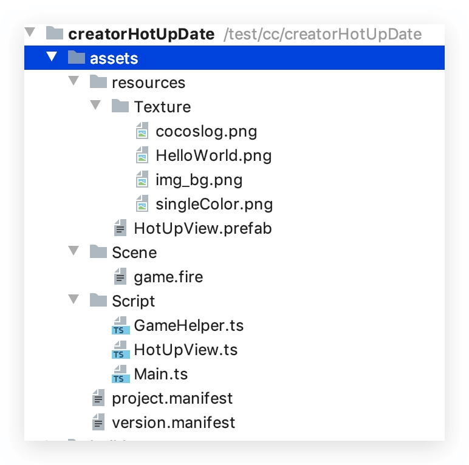

##### 搭建服务器

接下来要准备一个服务器环境，放置我们的远程资源，这里使用Tomcat环境，当然这个可以根据自己情况决定

服务器搭建好之后，打开我们的服务器目录，新建一个文件夹 放置我们的远程项目 creatorHotUpDate`

路径是：`apache-tomcat-8.5.47/webapps/creatorHotUpDate`

去bin 目录下启动我们的TomCat

`/workspace/net/apache-tomcat-8.5.47/bin/startup.sh`


##### 构建远程项目

1. 需要把我们更新逻辑写好之后，需要先构建一下我们的项目

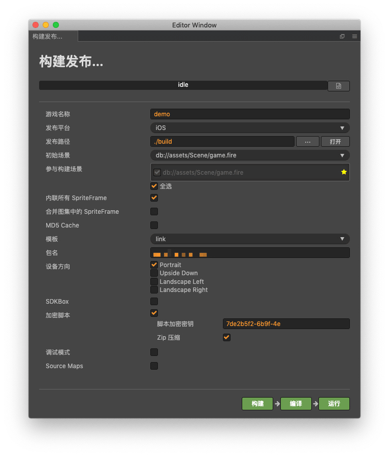

注意事项： 选择ios 发布 选择 竖屏Protrait 不要勾选 MD5

点击构建 等待构建完成！

2. 构建好之后，开始 修改我们的 version_generator.js 文件 版本号为 1.0.2


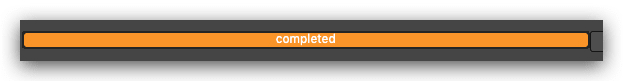


```typescript
let versionMode = "release";//develop or debug or release
let version = "1.0.2";//版本号
let cdnDir = "http://localhost:8888";
let packageUrlList = [cdnDir,gameName,native,platform,versionMode];
let remoteManifestUrlList = [cdnDir,gameName,native,platform,versionMode,"project.manifest"];
let remoteVersionUrlList = [cdnDir,gameName,native,platform,versionMode,"version.manifest"];
var manifest = {
    packageUrl: packageUrlList.join("/"),
    remoteManifestUrl: remoteManifestUrlList.join("/"),
    remoteVersionUrl: remoteVersionUrlList.join("/"),
    version: version,
    assets: {},
    searchPaths: []
};

//生成的manifest文件存放目录
var dest = 'assets/';
//项目构建后资源的目录
var src = 'build/jsb-link/';
```

正确填写我们的路径 其实这个路径 自己可以直接写成直接量 

我这里为了 后续开发 方便 分了目录 和开发版本

我们远程的目录结构如下：

```shell
.
└── native
    └── ios
        ├── debug
        ├── develop
        └── release
```

这里 把项目放在了 release目录下面

我们使用 node 命令 运行我们的脚本 也可以修改 js 文件 -v 1.0.1 可以省略

```javascript
node version_generator.js -v 1.0.2
```

执行完毕 ：

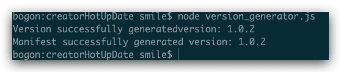

此时 在我们的根目录 的 assets 文件夹下 生成两个文件 project.manifest 和 version.manifest

此时 需要我们再构建一次目录，重新打包我们的 文件 这次打包会包含我们的 配置文件

等待构建 OK 之后，然后 把 project.manifest 和 version.manifest  和 构建好的文件目录地址下

的res 和 src 文件夹 全部 复制到 我们的服务器 release 下

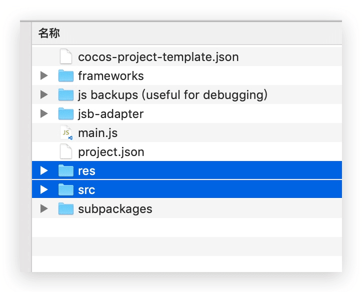

复制完成：

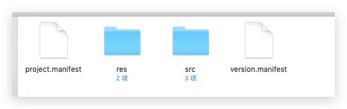

此时 再次修改我们的游戏内容，做出区分

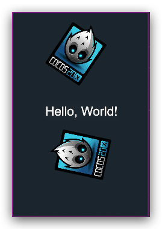

修改我们的 版本号 为1.0.1

```typescript
let versionMode = "release";//develop or debug or release
let version = "1.0.1";//版本号
let cdnDir = "http://localhost:8888";
let packageUrlList = [cdnDir,gameName,native,platform,versionMode];
let remoteManifestUrlList = [cdnDir,gameName,native,platform,versionMode,"project.manifest"];
let remoteVersionUrlList = [cdnDir,gameName,native,platform,versionMode,"version.manifest"];
var manifest = {
    packageUrl: packageUrlList.join("/"),
    remoteManifestUrl: remoteManifestUrlList.join("/"),
    remoteVersionUrl: remoteVersionUrlList.join("/"),
    version: version,
    assets: {},
    searchPaths: []
};
```

重新来一次 构建 和 用 node version_generator.js 重复上面的操作 此时构建生成新的项目

#### 解决重启后不生效 问题

其实上面的项目已经开源更新到最新的内容，但是，app 重启后又回到之前的版本，所以我们要修改我们导出的项目的 main.js

在代码的前面添加 下面代码

```javascript
 //-------------添加代码----开始---
    if (cc && cc.sys.isNative) {
        var hotUpdateSearchPaths = cc.sys.localStorage.getItem('HotUpdateSearchPaths');
        if (hotUpdateSearchPaths) {
            jsb.fileUtils.setSearchPaths(JSON.parse(hotUpdateSearchPaths));
            console.log('[main.js] 热更新SearchPath: ' + JSON.parse(hotUpdateSearchPaths));
        }else {
            console.log('[main.js] 未获取到热更新资源路径!');
        }
    }else {
        console.log('[main.js] 不是native平台!');
    }
    //-------------添加代码----结束---
```

完整代码：

```javascript
window.boot = function () {
    //-------------添加代码----开始---
    if (cc && cc.sys.isNative) {
        var hotUpdateSearchPaths = cc.sys.localStorage.getItem('HotUpdateSearchPaths');
        if (hotUpdateSearchPaths) {
            jsb.fileUtils.setSearchPaths(JSON.parse(hotUpdateSearchPaths));
            console.log('[main.js] 热更新SearchPath: ' + JSON.parse(hotUpdateSearchPaths));
        }else {
            console.log('[main.js] 未获取到热更新资源路径!');
        }
    }else {
        console.log('[main.js] 不是native平台!');
    }
    //-------------添加代码----结束---
    var settings = window._CCSettings;
    window._CCSettings = undefined;

    if ( !settings.debug ) {
        var uuids = settings.uuids;

        var rawAssets = settings.rawAssets;
        var assetTypes = settings.assetTypes;
        var realRawAssets = settings.rawAssets = {};
        for (var mount in rawAssets) {
            var entries = rawAssets[mount];
            var realEntries = realRawAssets[mount] = {};
            for (var id in entries) {
                var entry = entries[id];
                var type = entry[1];
                // retrieve minified raw asset
                if (typeof type === 'number') {
                    entry[1] = assetTypes[type];
                }
                // retrieve uuid
                realEntries[uuids[id] || id] = entry;
            }
        }

        var scenes = settings.scenes;
        for (var i = 0; i < scenes.length; ++i) {
            var scene = scenes[i];
            if (typeof scene.uuid === 'number') {
                scene.uuid = uuids[scene.uuid];
            }
        }

        var packedAssets = settings.packedAssets;
        for (var packId in packedAssets) {
            var packedIds = packedAssets[packId];
            for (var j = 0; j < packedIds.length; ++j) {
                if (typeof packedIds[j] === 'number') {
                    packedIds[j] = uuids[packedIds[j]];
                }
            }
        }

        var subpackages = settings.subpackages;
        for (var subId in subpackages) {
            var uuidArray = subpackages[subId].uuids;
            if (uuidArray) {
                for (var k = 0, l = uuidArray.length; k < l; k++) {
                    if (typeof uuidArray[k] === 'number') {
                        uuidArray[k] = uuids[uuidArray[k]];
                    }
                }
            }
        }
    }

    function setLoadingDisplay () {
        // Loading splash scene
        var splash = document.getElementById('splash');
        var progressBar = splash.querySelector('.progress-bar span');
        cc.loader.onProgress = function (completedCount, totalCount, item) {
            var percent = 100 * completedCount / totalCount;
            if (progressBar) {
                progressBar.style.width = percent.toFixed(2) + '%';
            }
        };
        splash.style.display = 'block';
        progressBar.style.width = '0%';

        cc.director.once(cc.Director.EVENT_AFTER_SCENE_LAUNCH, function () {
            splash.style.display = 'none';
        });
    }

    var onStart = function () {
        cc.loader.downloader._subpackages = settings.subpackages;

        cc.view.enableRetina(true);
        cc.view.resizeWithBrowserSize(true);

        if (cc.sys.isBrowser) {
            setLoadingDisplay();
        }

        if (cc.sys.isMobile) {
            if (settings.orientation === 'landscape') {
                cc.view.setOrientation(cc.macro.ORIENTATION_LANDSCAPE);
            }
            else if (settings.orientation === 'portrait') {
                cc.view.setOrientation(cc.macro.ORIENTATION_PORTRAIT);
            }
            cc.view.enableAutoFullScreen([
                cc.sys.BROWSER_TYPE_BAIDU,
                cc.sys.BROWSER_TYPE_WECHAT,
                cc.sys.BROWSER_TYPE_MOBILE_QQ,
                cc.sys.BROWSER_TYPE_MIUI,
            ].indexOf(cc.sys.browserType) < 0);
        }

        // Limit downloading max concurrent task to 2,
        // more tasks simultaneously may cause performance draw back on some android system / browsers.
        // You can adjust the number based on your own test result, you have to set it before any loading process to take effect.
        if (cc.sys.isBrowser && cc.sys.os === cc.sys.OS_ANDROID) {
            cc.macro.DOWNLOAD_MAX_CONCURRENT = 2;
        }

        function loadScene(launchScene) {
            cc.director.loadScene(launchScene,
                function (err) {
                    if (!err) {
                        if (cc.sys.isBrowser) {
                            // show canvas
                            var canvas = document.getElementById('GameCanvas');
                            canvas.style.visibility = '';
                            var div = document.getElementById('GameDiv');
                            if (div) {
                                div.style.backgroundImage = '';
                            }
                        }
                        cc.loader.onProgress = null;
                        console.log('Success to load scene: ' + launchScene);
                    }
                    else if (CC_BUILD) {
                        setTimeout(function () { 

    if (cc && cc.sys.isNative) { 
        var hotUpdateSearchPaths = cc.sys.localStorage.getItem('HotUpdateSearchPaths'); 
        if (hotUpdateSearchPaths) { 
            jsb.fileUtils.setSearchPaths(JSON.parse(hotUpdateSearchPaths)); 
            console.log('[main.js] 热更新SearchPath: ' + JSON.parse(hotUpdateSearchPaths));
        }else {
            console.log('[main.js] 未获取到热更新资源路径!');
        }
    }else {
        console.log('[main.js] 不是native平台!');
    }

                            loadScene(launchScene);
                        }, 1000);
                    }
                }
            );

        }

        var launchScene = settings.launchScene;

        // load scene
        loadScene(launchScene);

    };

    // jsList
    var jsList = settings.jsList;

    var bundledScript = settings.debug ? 'src/project.dev.js' : 'src/project.js';
    if (jsList) {
        jsList = jsList.map(function (x) {
            return 'src/' + x;
        });
        jsList.push(bundledScript);
    }
    else {
        jsList = [bundledScript];
    }

    var option = {
        id: 'GameCanvas',
        scenes: settings.scenes,
        debugMode: settings.debug ? cc.debug.DebugMode.INFO : cc.debug.DebugMode.ERROR,
        showFPS: settings.debug,
        frameRate: 60,
        jsList: jsList,
        groupList: settings.groupList,
        collisionMatrix: settings.collisionMatrix,
    };

    // init assets
    cc.AssetLibrary.init({
        libraryPath: 'res/import',
        rawAssetsBase: 'res/raw-',
        rawAssets: settings.rawAssets,
        packedAssets: settings.packedAssets,
        md5AssetsMap: settings.md5AssetsMap,
        subpackages: settings.subpackages
    });

    cc.game.run(option, onStart);
};

if (window.jsb) {
    var isRuntime = (typeof loadRuntime === 'function');
    if (isRuntime) {
        require('src/settings.js');
        require('src/cocos2d-runtime.js');
        require('jsb-adapter/engine/index.js');
    }
    else {
        require('src/settings.js');
        require('src/cocos2d-jsb.js');
        require('jsb-adapter/jsb-engine.js');
    }

    cc.macro.CLEANUP_IMAGE_CACHE = true;
    window.boot();
}
```

当然 如果你不想每次构建后修改，可以这样操作，在 根目录下面新建一个目录 名字叫 build-templates

然后 再新建目录 jsb-link  然后在 jsb-link 目录下 新建一个main.js,可以把我们修改好的 main.js 放到这里，这样每次构建完成，会自动覆盖。可以不用每次都去手动覆盖。

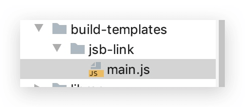

整个项目到这里都已经 OK，剩下的是我们 使用 Xcode 测试我们的项目

##### 使用 Xcode 真机测试，或者打包测试

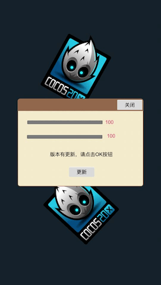

点击更新 

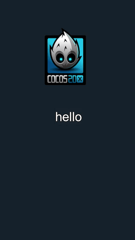

最后 附上 项目地址  [creatorHotUpDate](https://github.com/jsroads/creatorHotUpDate) [点击前往](https://github.com/jsroads/creatorHotUpDate)

用到的命令：

```
node version_generator.js -v 1.0.1
```

查询 IP

```shell
ifconfig 
```

Tomcat  启动

```shell
/workspace/net/apache-tomcat/bin/startup.sh
```

Tomcat  关闭

```shell
/workspace/net/apache-tomcat/bin/shutdown.sh
```

删除 模拟器 缓存

```shell

rm -rf /Applications/CocosCreator2_2_0.app/Contents/Resources/cocos2d-x/simulator/mac/Simulator.app/Contents/Resources/jsb.sqlite

rm -rf /Applications/CocosCreator2_2_0.app/Contents/Resources/cocos2d-x/simulator/mac/Simulator.app/Contents/Resources/mygame-remote-asset

```

如果 Tomcat 遇到 启动tomcat报错 Permission denied

在目录 执行

```shell
chmod u+x *.sh
```

### 参考

- [Cocos Creater 热更新](https://www.jianshu.com/p/a033059f376d)
- [Cocos Creator热更新](https://www.jianshu.com/p/094cd0e95e55)
- [资源热更新教程](http://docs.cocos.com/creator/manual/zh/advanced-topics/hot-update.html)

### 注意

- main.js 里添加代码的位置
- 远程文件的路径
- 版本号配置文件 要被打包到项目内（构建两次）