在开发游戏的过程中，多多少少都会采坑，有时候是自己对API理解的不够透彻，引起的误解，有时候是问题报错查找起来很费功夫，总的来讲，很多问题值得记录和分析参考，故而记下来，那么看看你再开发的过程中有没有遇到这样的坑呢？
<!--more-->
本文主要说Cocos Creator 引擎在开发游戏中遇到的点点滴滴，后面会不定时更新，及时添加遇到的新的问题。

## 常见问题

### 网页不报错，小游戏模拟器报错

```bash
Uncaught ReferenceError: loadBabelMod is not defined
```

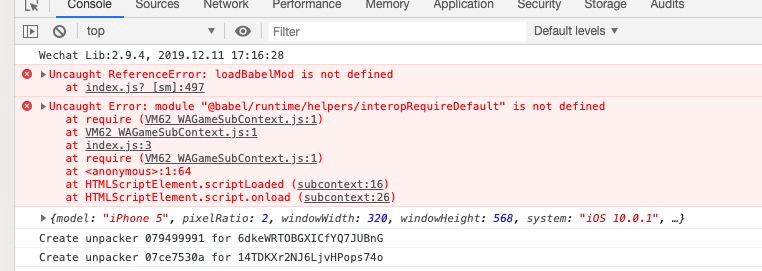

**原因：**游戏内我使用了ES6开发，编辑器内我勾选了 增强编译：

关于增强编译可以参考这个地址：[微信开发者工具 1.02.1905081 更新说明](https://developers.weixin.qq.com/community/develop/doc/00066877c54eb0ff5488b54885b801)

> 新版工具增加了`增强编译`的选项来增强`ES6转ES5`的能力，启用后会使用新的编译逻辑以及提供额外的选项供开发者使用。
>
> 启用`增强编译`后的编译能力的对比：
>
> | 特性         |    原有逻辑    |        增强编译        |
> | :----------- | :------------: | :--------------------: |
> | Babel版本    |     babel6     |         babel7         |
> | Presets      | es2015、stage0 | env {chrome:53, ios:8} |
> | Helpers      |   单文件内联   |       跨文件共享       |
> | Async/Await  |     不支持     |          支持          |
> | 严格模式开关 |     不支持     |          支持          |
> | 忽略文件目录 |     不支持     |          支持          |
> | 代码压缩     |   uglify-js    |         terser         |
> | Babel插件    |       -        |   一系列proposal`*`    |
> | polyfill     |   大部分es6    |  新增三个polyfill`*`   |
>
> - 使用`preset-env`,支持最新的`ECMAScript`语法
> - 共享helpers函数，默认放在项目`@babel/runtime`目录，可通过`项目配置文件`配置
> - 支持async/await语法，按需注入`regeneratorRuntime`，目录位置与helpers函数一致
> - 文件首行是`// use strict disable;`时，即可禁用文件严格模式
> - 可通过`项目配置文件`指定任意文件、目录不经过编译（如：miniprogram_npm）
> - 原有逻辑是支持`stage0`语法的，为了向前兼容，[引入了一系列proposal插件](https://github.com/babel/babel/blob/master/packages/babel-preset-stage-0/README.md)
> - 关于polyfill，基础库中已经引入了大量的`es6`相关的polyfill [可参考文档](https://developers.weixin.qq.com/miniprogram/dev/guide/runtime/js-support.html)，增强编译下，新增：Array.prototype.includes`(es7)`、Object.entries`(es8)`、Object.values`(es8)`
>
> ##### 开启增强编译
>
> 项目详情页中，勾选`增强编译`选项
> 
>
> 打开后，即可在项目中使用最新的js语法
>
> 
>
> 工具运行时，会按需注入一些辅助函数和regeneratorRuntime， 注入的目录路径可通过配置修改，上传代码时（包括预览时）这些文件会作为代码包的一部分
>
> 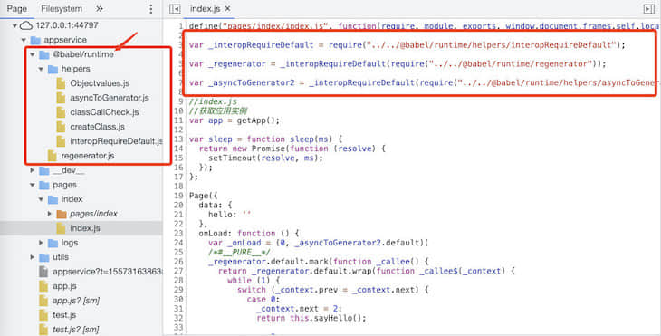
>
> ##### 其他选项
>
> 其他可选项详情请参考[项目配置文档](https://developers.weixin.qq.com/miniprogram/dev/devtools/projectconfig.html)

其实 看了上面的说明和解释，问题基本明了，就是开放域也要使用ES6 才行，解决问题大概有两个方向

- 游戏内不用ES6语法，取消勾选 增强编译
- 继续使用，语法格式保持统一

作为追求进步的编码者，肯定是想尽办法也是用第二种策略，于是我找到我开放域的代码，重新写了一遍，代码成功运行，此处，也遇到一个问题是

`this is undefined` 这个错误，之前一直都是正常的，怎么突然就报了这个错呢，后面我再阅读文档遇到了一段解释，才算是 明白了。地址（[点击前往](https://developer.mozilla.org/zh-CN/docs/Web/JavaScript/Reference/Functions/Arrow_functions)）

> 在箭头函数出现之前，每一个新函数根据它是被如何调用的来定义这个函数的this值：
>
> - 如果是该函数是一个构造函数，this指针指向一个新的对象
> - 在严格模式下的函数调用下，this指向undefined
> - 如果是该函数是一个对象的方法，则它的this指针指向这个对象
> - 等等
>
> `This`被证明是令人厌烦的面向对象风格的编程。

### Button 的 interactable 属性设置 不生效

编辑设置 这个属性，是正常的，但是在代码里 我动态调用后，输出值是正确的，但是UI没有生效

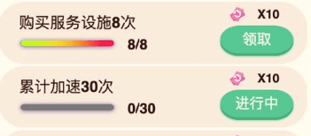

我更改后输出打印的值：

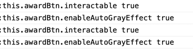

怪哉，怪哉！很奇怪，但是我再编辑器里 如果一开始设置了 就是正确的，其实后面通过我和之前正常的仔仔细细对比之后，得出结论是：

**原因：**我动态调用的代码运行在 这个脚本组件的 `onLoad` 函数之前，此时虽然我代码调用了这个属性，但是我的组件的`onLoad`函数还没有执行，我把调用的代码 放到 `onLoad` 函数调用 后 就可以正常显示！！这个是对组件的渲染和运行的模型了解不够透彻，才入坑，基本遇到后续这样的调用，都应该改成，提前调用只更改数据，等onLoad调用的时候，再去用数据 驱动UI的改变。

### 模拟器报错 Cannot read property '0' of undefined

```
Uncaught TypeError: Cannot read property '0' of undefined
```

其实从错误 我们 看不太明白是什么问题 

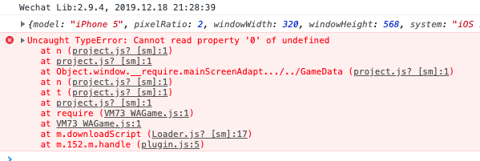

我们点击错误 看看报错的代码的地方

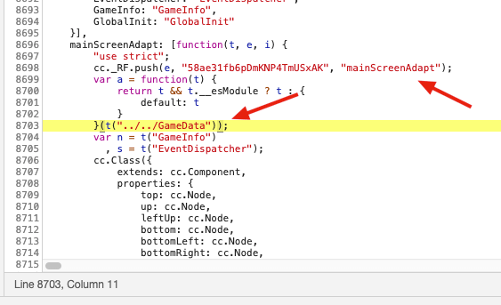

**原因：**既然直接指向了 这个组件脚本，那么肯定是这个脚本有问题，后面经过查找得知是 import的时候，文件的路径写的不正确，平时我自己写 引入 都是用 编辑器自动引入的，这个应该是别人从别的地方 复制，粘贴，导致的错误

解决办法：既然是引入错误，修复引入路径即可

```javascript
import GameData from "../../GameData";
```

修改为：

```javascript
import GameData from "../GameData";
```

其实可以看出，如果 引入路径不正确，都会引发这个错误，所以我们再引入文件对象的时候，对文件路径要仔细校对。善用工具（快捷键 or 自动引入都是比较好的办法）。

### Cannot read property ‘updateRenderData’ of null

在Chome 里面 正常的，打包发布到 微信小游戏后 报错 打印了 很多条这个信息

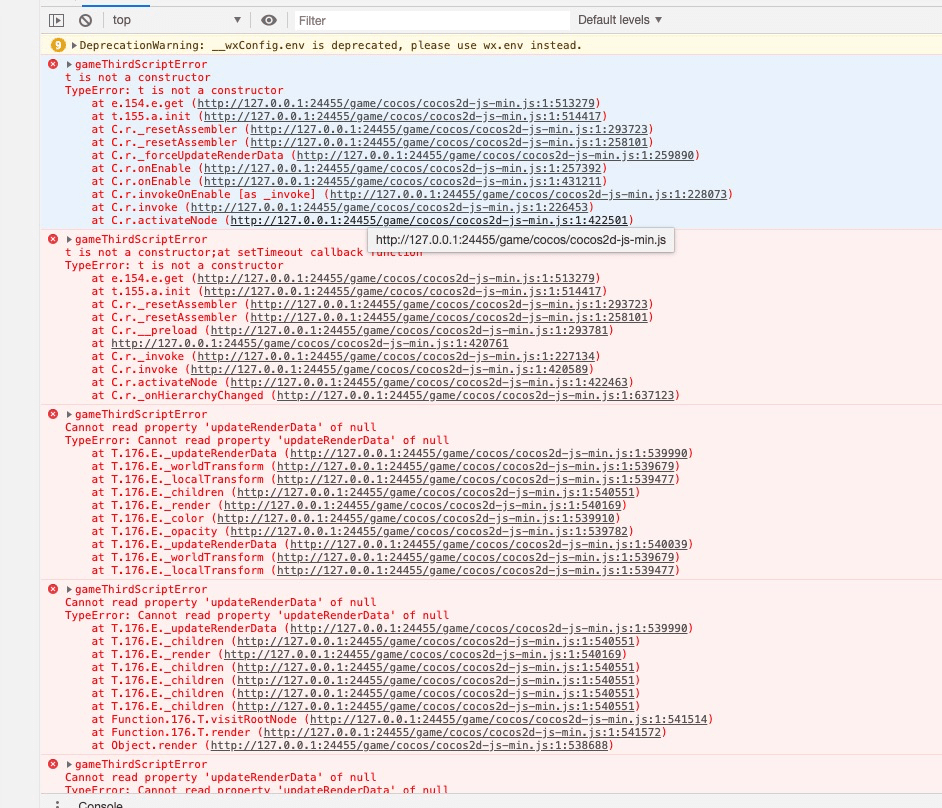

原因：

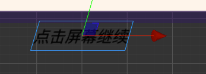

我的游戏内使用了 3D旋转的功能

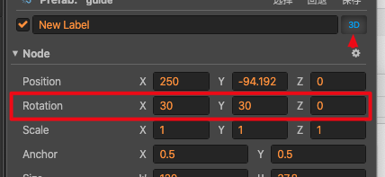

但是项目设置里面 没有勾选 这个 3D 的模块

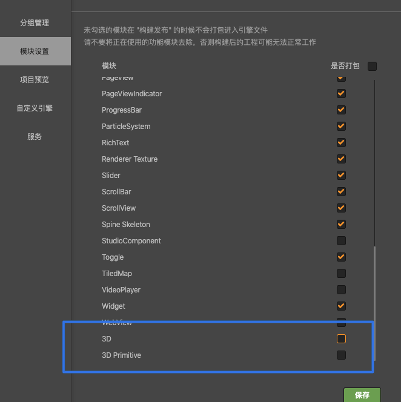

勾选这个 类库 或者 取消使用这个 功能即可。

分析 ：这类Bug 比较隐蔽，需要细心才能发觉异常，毕竟没有栈信息 看

### Creator在修改模拟器的默认显示模式

修改 ：

```text
CocosCreator\resources\cocos2d-x\simulator\win32\config.json
```

###  Cocos Creator 2.2.2 无法使用cc.Material.getBuiltinMaterial(‘gray-sprite’)

有时候我们需要让一个图片或者一个 Sprite对象 变成灰色，新版本的官方已经自带了这个功能只是按照网上给的办法调用发现报错，后面得知升级后，这个名字也改了，新版本应该这么用：

```typescript
var mat: cc.Material = null;
        if (isGray) {
            mat = cc.Material.getBuiltinMaterial('2d-gray-sprite');
        }
        else {
            mat = cc.Material.getBuiltinMaterial('2d-sprite')
        }
        sprite.setMaterial(0, mat);
```

name前面加上`2d-`即可。

### Can not find class 'cc.EditBox'

有时候游戏在本地调试环境不报错，打出web版本或者微信版本，Native包后就报 找不到某个系统自带的类，这个时候很多人都是根据栈信息去查找原因：

注意：此时最佳操作是赶紧看看我们的项目设置--->模块设置 有没有勾选 这个没有找到的class

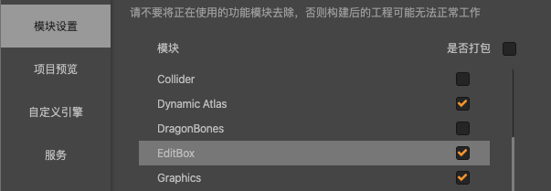

这样 就第一时间 缩短了寻找的时间。

### loadScene: Failed to load scene '1208' because 'mainMenu' is already loading

短时间内 钮触发了两次，已经在加载了  此时应该查看代码逻辑 是否有事件派发重复，或者重复执行的逻辑，应该避免此行为的发生。

### Chrome下无法用window.close()关闭非脚本打开的页面

```
  window.location.href="about:blank";
  window.close();
```

### 场景中 获取常驻节点

```javascript
cc.find("myNode");
```

或者：

```javascript
cc.director.getScene().getChildByName("你要找的常驻节点").getComponent("你的脚本");
```

注意：常驻节点的父对象 必须是根目录

### 左下角 显示 FPS信息或者关闭

```javascript
cc.debug.setDisplayStats(true)//true or false
```

```javascript
cc.debug.isDisplayStats()//获取FPS状态
```

### Cocos Creator TypeError: Cannot read property 'gizmo' of null 解决方案

1.最近在做一个微信小游戏，选择使用Cocos Creator 来制作，当项目解决尾声的时候，不知操作了什么，疯狂输出 TypeError: Cannot read property 'gizmo' of null。

2.解决办法：用记事本打开报错场景搜索    "_components": [ null ], 如有删除此项，保存再打开场景。

### 当代码混淆后， ccclass装饰过的类是能通过该方法拿到类名，但是自定义的类就拿不到

```typescript
/**
 * 将类名赋给该类
 * @param target
 */
export function cccExtensionClass(target: any) {
    let frameInfo = cc['_RF'].peek();
    let script = frameInfo.script;
    cc.js.setClassName(script, target);
}
```

### Cannot read property ‘_assembler’ of null

2020年8月------采坑

这个错误 报错显示是引擎文件报错，好多错误然后一连串的一大堆错误 后面弹出一个 

```
/Users/smile/Library…cocos2d-js-min.js:1 Uncaught TypeError: Cannot read property '_assembler' of null
    at T.193.A._updateRenderData (/Users/smile/Library…cocos2d-js-min.js:1)
    at T.193.A._worldTransform (/Users/smile/Library…cocos2d-js-min.js:1)
    at T.193.A._children (/Users/smile/Library…cocos2d-js-min.js:1)
    at T.193.A._worldTransform (/Users/smile/Library…cocos2d-js-min.js:1)
    at T.193.A._children (/Users/smile/Library…cocos2d-js-min.js:1)
    at T.193.A._render (/Users/smile/Library…cocos2d-js-min.js:1)
    at T.193.A._updateRenderData (/Users/smile/Library…cocos2d-js-min.js:1)
    at T.193.A._worldTransform (/Users/smile/Library…cocos2d-js-min.js:1)
    at T.193.A._children (/Users/smile/Library…cocos2d-js-min.js:1)
    at T.193.A._worldTransform (/Users/smile/Library…cocos2d-js-min.js:1)
/Users/smile/Library…cocos2d-js-min.js:1 Error 9000, please go to https://github.com/cocos-creator/engine/blob/master/EngineErrorMap.md#9000 to see details. Arguments: 8
/Users/smile/Library…cocos2d-js-min.js:1 Error 9000, please go to https://github.com/cocos-creator/engine/blob/master/EngineErrorMap.md#9000 to see details. Arguments: 8
/User
```

https://github.com/cocos-creator/engine/blob/master/EngineErrorMap.md#9000

我打开地址 显示 ：

```
9000
Stencil manager does not support level bigger than %d in this device.
```

于是我按图索骥，结果找了半天，没有找到解决方案，论坛倒是有人也遇到类似的，最后都模棱两可的解决，那也要继续找问题啊：

直到 看到这个帖子  我才知道我的方向错了！！！

[Cannot read property ‘_assembler’ of null,谢谢帮忙看下，谢谢](https://forum.cocos.org/t/cannot-read-property--assembler-of-null/74030)


看到这个，我就想到，这个问题只有这个分支报错，其他分支是正常的，应该是合并代码的时候，分组丢失， 去看了一下，果然如此，重新配置分组，然后编译，预览，搞定！

#### cc.assetManager.loadRemote加载不了微信头像

问题环境：升级了2.4.3，发现cc.assetManager.loadRemote这个接口微信头像加载不出来。

解决方案：

##### A方案

```typescript
public static async loadWeiXinHead(avatarurl:string){
return new Promise<cc.SpriteFrame>((resolve)=>{
cc.assetManager.loadRemote(avatarurl, {ext: ‘.png’}, (err, data:cc.Texture2D) => {
if (!err && data) {
resolve(new cc.SpriteFrame(data));
}else{
console.log("loadWeiXinHead ", err);
resolve(null);
}
});
});
}


```

##### B方案

```typescript
cc.assetManager.loadRemote<cc.Texture2D>("http://thirdwx.qlogo.cn/mmopen/vi_32/Q0j4TwGTfTJ1E1XEicr8vAj5o8DMT7GTfCtFyC6vok9TImPjf6BfKBKLFA8hKBS6Wiaz2GJyQQWoV5lA7fhqS4SA/96", {ext: '.png'}, (err, res)=>{
            var newSpriteFrame = new cc.SpriteFrame(res);
            var newNode = new cc.Node();
            newNode.addComponent(cc.Sprite).spriteFrame = newSpriteFrame;
            this.node.addChild(newNode);
        })
```

其实就是缺少 {ext: ‘.png’} 这个参数

参考链接：[cc.assetManager.loadRemote加载不了微信头像](https://forum.cocos.org/t/cc-assetmanager-loadremote/99201)

### creator 2.1.2 Label组件在字数达到一定程度会出现十分严重排版问题

是整个 Label 超过 2048 的尺寸限制了。抱歉这个目前暂时没有特别好的解决方式，建议切换至 CHAR 模式，就可以解决。

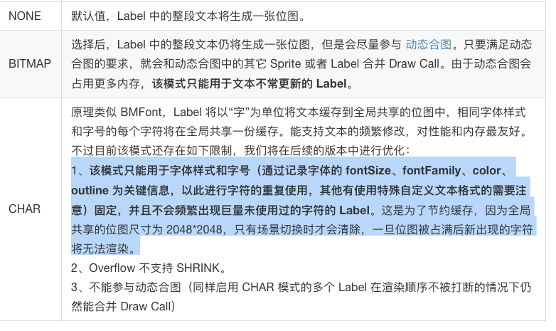

参考地址 ：https://forum.cocos.org/t/creator-2-1-2-label/81328/4

### 启动游戏报错

问题出现，有时候启动游戏，一开始就报错，心中不免疑惑，影响打包吗？哪里出错了？

```
Window "main" unresponsive: [object Object]
```


解决方案：暂无，不影响打包

群友回复


官方回复：


### 分包加载报错

```json
[项目资源引用错误] 项目资源 subpackages/firstRes/raw-assets/58/582c1f41-2b52-4d83-873f-f8adcb46f1c6.5d3ac.jpg 所在的分包尚未加载
```


报错原因：子包中的资源不要在主包中有引用关系，可以找找子包中有哪些图片在主包的场景或者预制中有挂载。不嫌麻烦就在子包的资源中查找引用，看看是否是在主包的资源上使用。

参考链接：[项目资源 subpackages/…png 所在的分包尚未加载【Cocos论坛】](https://forum.cocos.org/t/subpackages-png/93805)

### 图片尺寸过大


解决办法：把图切成合格的，比如2份 或者 4份

### JSON.parse方法 报错

```json
"SyntaxError: Unexpected end of JSON input
    at JSON.parse (<anonymous>)
```

```json
"SyntaxError: Unexpected token u in JSON at position 0
    at JSON.parse (<anonymous>)
```

原因是 取到了 空字符串 或者 undefined

```javascript
JSON.parse(null)//正常
JSON.parse(false)//正常
JSON.parse("[]")//正常
JSON.parse("")//异常
JSON.parse(undefined)//异常
```

### 总结

在开发过程中，遇到问题，不要逃避。这样问题会积少成多，后面不利于自己的技术的进步和成长，知其然，知其所以然，才是靠近真相的最佳途径。成长是一个渐进式的厚积薄发的过程，只有点点滴滴的努力，去查找，去分析，去思考问题的本质。

### 参考

- [Chrome下无法用window.close()关闭非脚本打开的页面](https://www.jianshu.com/p/9dc2752194b8)
- [Cocos Creator TypeError: Cannot read property 'gizmo' of null 解决方案](https://www.jianshu.com/p/496928553576)

