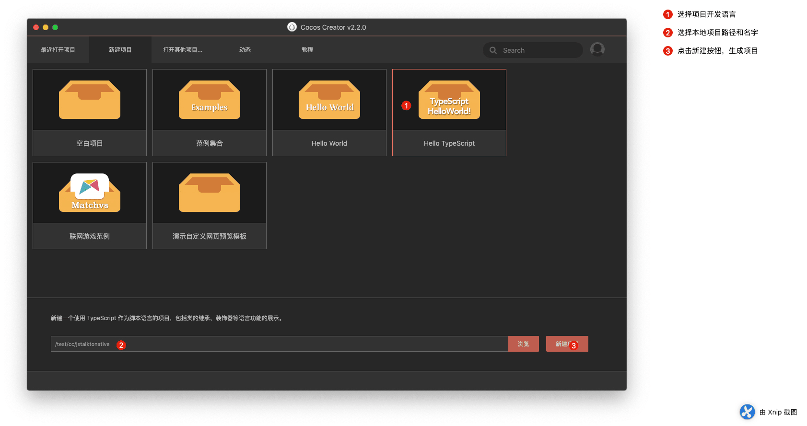
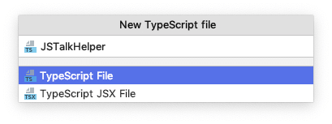
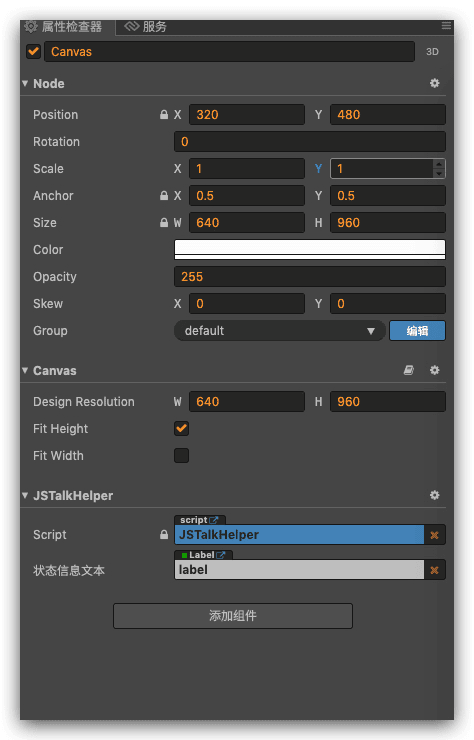
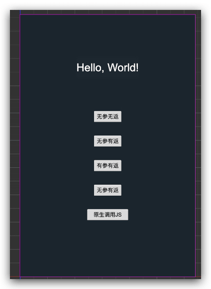
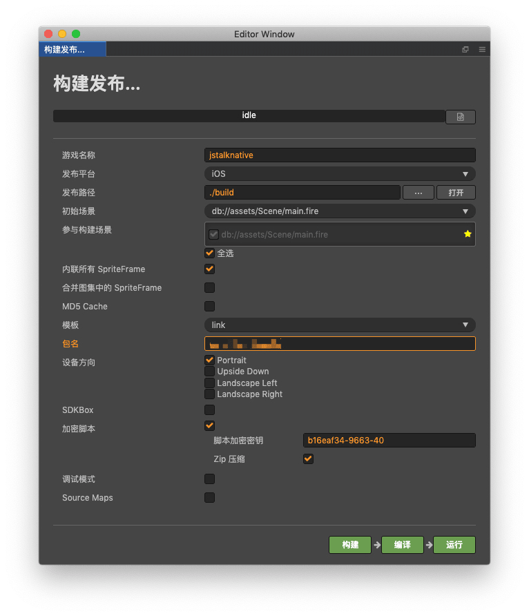
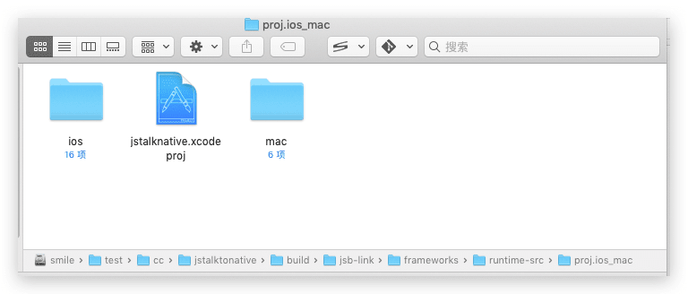

H5游戏做了许久，一直没怎么亲密接触过Native原生开发，之前接入SDK 也是用的JS版本，这些天开始用H5游戏，导出原生平台 Apk（安卓）和ipa（iOS）文件，不免用到了JavaScript和原生语言的调用，官方关于这块有两部分，一个是JSB2.0一个是原生的反射机制，由于开发时间有限，退而求其次，选择了反射机制。
<!--more-->
首先这里用Mac环境和Cocos Creator最新版本 2.2.0版本 语言使用 Typescript ，这个和js一样的，下面我将详细介绍如何从新建项目到相互调用成功。项目源码 已经上传，大家可以去 [点击](https://github.com/jsroads/jstalktonative) 查看 原生导出 项目在 jstalktonative/build/jsb-link/frameworks/runtime-src/proj.ios_mac 下面

### 步骤一：环境支持

- Cocos Creator
- Typescript
- Xcode
- Webstorm（代码编辑器 可选）

### 步骤二：流程

1. 首先我们打开我们的Cocos Creator 新建一个Typescript项目



2. 新建一个类 叫 JSTalkHelper.ts (名字自己随便起)



3. 挂载我们新建的脚本



4. 在场景里面 拖动几个按钮，好区分我们的几种方法



- 无参无返  ---> 没有参数，不返回值
- 无参有返  ---> 没有参数，有返回值
- 有参有返  ---> 有参数，有返回值
- 有参无返  ---> 有参数，无返回值
- 原生调用JS---> 原生调用 js 本例使用一个点击 触发，然后 Objective-c 使用 timer 主动调用

3. 我们操作之后，开始 构建项目  如果是安卓项目，必须配置对象的 SDK 和 NDK 



4. 使用 Xcode 打开我们的项目

   

5. 在 AppController.mm 文件 添加我们的调用代码

完整代码如下  我对 Objective C 不是很熟悉 写的最简单的 熟悉的可以自己按照最好的语法格式书写

```objective-c
/****************************************************************************
 Copyright (c) 2010-2013 cocos2d-x.org
 Copyright (c) 2013-2016 Chukong Technologies Inc.
 Copyright (c) 2017-2018 Xiamen Yaji Software Co., Ltd.
 
 http://www.cocos2d-x.org
 
 Permission is hereby granted, free of charge, to any person obtaining a copy
 of this software and associated documentation files (the "Software"), to deal
 in the Software without restriction, including without limitation the rights
 to use, copy, modify, merge, publish, distribute, sublicense, and/or sell
 copies of the Software, and to permit persons to whom the Software is
 furnished to do so, subject to the following conditions:
 
 The above copyright notice and this permission notice shall be included in
 all copies or substantial portions of the Software.
 
 THE SOFTWARE IS PROVIDED "AS IS", WITHOUT WARRANTY OF ANY KIND, EXPRESS OR
 IMPLIED, INCLUDING BUT NOT LIMITED TO THE WARRANTIES OF MERCHANTABILITY,
 FITNESS FOR A PARTICULAR PURPOSE AND NONINFRINGEMENT. IN NO EVENT SHALL THE
 AUTHORS OR COPYRIGHT HOLDERS BE LIABLE FOR ANY CLAIM, DAMAGES OR OTHER
 LIABILITY, WHETHER IN AN ACTION OF CONTRACT, TORT OR OTHERWISE, ARISING FROM,
 OUT OF OR IN CONNECTION WITH THE SOFTWARE OR THE USE OR OTHER DEALINGS IN
 THE SOFTWARE.
 ****************************************************************************/

#import "AppController.h"
#import "cocos2d.h"
#import "AppDelegate.h"
#import "RootViewController.h"
#import "SDKWrapper.h"
#import "platform/ios/CCEAGLView-ios.h"
#include "cocos/scripting/js-bindings/jswrapper/SeApi.h"


using namespace cocos2d;

@implementation AppController

Application* app = nullptr;
@synthesize window;

#pragma mark -
#pragma mark Application lifecycle

- (BOOL)application:(UIApplication *)application didFinishLaunchingWithOptions:(NSDictionary *)launchOptions {
    [[SDKWrapper getInstance] application:application didFinishLaunchingWithOptions:launchOptions];
    // Add the view controller's view to the window and display.
    float scale = [[UIScreen mainScreen] scale];
    CGRect bounds = [[UIScreen mainScreen] bounds];
    window = [[UIWindow alloc] initWithFrame: bounds];
    
    // cocos2d application instance
    app = new AppDelegate(bounds.size.width * scale, bounds.size.height * scale);
    app->setMultitouch(true);
    
    // Use RootViewController to manage CCEAGLView
    _viewController = [[RootViewController alloc]init];
#ifdef NSFoundationVersionNumber_iOS_7_0
    _viewController.automaticallyAdjustsScrollViewInsets = NO;
    _viewController.extendedLayoutIncludesOpaqueBars = NO;
    _viewController.edgesForExtendedLayout = UIRectEdgeAll;
#else
    _viewController.wantsFullScreenLayout = YES;
#endif
    // Set RootViewController to window
    if ( [[UIDevice currentDevice].systemVersion floatValue] < 6.0)
    {
        // warning: addSubView doesn't work on iOS6
        [window addSubview: _viewController.view];
    }
    else
    {
        // use this method on ios6
        [window setRootViewController:_viewController];
    }
    
    [window makeKeyAndVisible];
    
    [[UIApplication sharedApplication] setStatusBarHidden:YES];
    
    //run the cocos2d-x game scene
    app->start();
    
    return YES;
}

- (void)applicationWillResignActive:(UIApplication *)application {
    /*
     Sent when the application is about to move from active to inactive state. This can occur for certain types of temporary interruptions (such as an incoming phone call or SMS message) or when the user quits the application and it begins the transition to the background state.
     Use this method to pause ongoing tasks, disable timers, and throttle down OpenGL ES frame rates. Games should use this method to pause the game.
     */
    [[SDKWrapper getInstance] applicationWillResignActive:application];
}

- (void)applicationDidBecomeActive:(UIApplication *)application {
    /*
     Restart any tasks that were paused (or not yet started) while the application was inactive. If the application was previously in the background, optionally refresh the user interface.
     */
    [[SDKWrapper getInstance] applicationDidBecomeActive:application];
}

- (void)applicationDidEnterBackground:(UIApplication *)application {
    /*
     Use this method to release shared resources, save user data, invalidate timers, and store enough application state information to restore your application to its current state in case it is terminated later.
     If your application supports background execution, called instead of applicationWillTerminate: when the user quits.
     */
    [[SDKWrapper getInstance] applicationDidEnterBackground:application];
    app->applicationDidEnterBackground();
    
}

- (void)applicationWillEnterForeground:(UIApplication *)application {
    /*
     Called as part of  transition from the background to the inactive state: here you can undo many of the changes made on entering the background.
     */
    [[SDKWrapper getInstance] applicationWillEnterForeground:application];
    app->applicationWillEnterForeground();
    
}

- (void)applicationWillTerminate:(UIApplication *)application
{
    [[SDKWrapper getInstance] applicationWillTerminate:application];
    delete app;
    app = nil;
}


#pragma mark -
#pragma mark Memory management

- (void)applicationDidReceiveMemoryWarning:(UIApplication *)application {
    /*
     Free up as much memory as possible by purging cached data objects that can be recreated (or reloaded from disk) later.
     */
}
/**
 无参数，无返回值
 */
+(void)oneHundred{
    NSLog(@"OC收到：无参数，无返回值");

}
/**
无参数，有返回值
*/
+(int)twoHundred{
    NSLog(@"OC收到：有参数，有返回值 返回值：%d",2000);
    return 2000;
}

/**
有参数，有返回值
*/
+(NSString *)threeHundred:(NSString*)adId withContent:(int)age{
    NSLog(@"OC收到：有参数，有返回值 %@ 和 %d 返回值：hello",adId,age);
    return @"hello";
}

/**
有参数，无返回值
*/
+(void)fourHundred:(NSString*)adId withContent:(int)age{
    NSLog(@"OC收到：有参数，无返回值 %@ 和 %d",adId,age);
}

/**
启动一个timer sec秒后调用 JS
*/
+(void)fiveHundred:(int)sec{
    NSLog(@"OC收到： %d 秒后 调用JS",sec);
        NSTimer *timer = [NSTimer scheduledTimerWithTimeInterval:sec
              target:[NSBlockOperation blockOperationWithBlock:^{
            /* do this! */
            NSLog(@"时间到触发");
            [self talkJS];
        }]
              selector:@selector(main)
              userInfo:nil
              repeats:NO
        ];
    
}
+(NSString *)talkJS{
    std::string strRet = "you are niu B";
       std::string jsCallStr = cocos2d::StringUtils::format("timerTestJSCallBck(\"%s\");", strRet.c_str());
       se::Value *ret = new se::Value();
       se::ScriptEngine::getInstance()->evalString(jsCallStr.c_str() , -1 , ret);
       NSLog(@"jsCallStr = %s", jsCallStr.c_str());
       return @"hehe";
}

+(void)callJsEngineCallBack:(NSString*) funcNameStr withCmd:(NSString*) cmdStr withContent:(NSString*) contentStr
{
    NSLog(@"callJsEngineCallBack...");
    std::string funcName = [funcNameStr UTF8String];
    std::string param001 = [cmdStr UTF8String];
    std::string param002 = [contentStr UTF8String];
    std::string jsCallStr = cocos2d::StringUtils::format("%s(\"%s\",\"%s\");",funcName.c_str(), param001.c_str(),param002.c_str());
    NSLog(@"jsCallStr = %s", jsCallStr.c_str());
    se::ScriptEngine::getInstance()->evalString(jsCallStr.c_str());
}
@end

```

另外 附上 JSTalkHelper.ts 

```typescript
/**
 * Created by jsroads on 2019/11/2 . 12:30 下午
 * Note:
 */
import Browser from "./Browser";
import TalkBack from "./TalkBack";

const {ccclass, property} = cc._decorator;
@ccclass
export default class JSTalkHelper extends cc.Component {
    @property({
        type: cc.Label,
        displayName: "状态信息文本",
        tooltip: "展示操作过程的状态"
    })
    public descriptionLabel: cc.Label = null;

    protected onLoad(): void {
        TalkBack.init();
        this.descriptionLabel.string = "准备完毕，点击按钮开始通信"
    }

    public touchHandler(event: cc.Event.EventTouch, data: any): void {
        switch (data) {
            case "100":
                console.log("点击了 '无参无返' 按钮，开始调用");
                this.test100();
                break;
            case "200":
                console.log("点击了 '无参有返' 按钮，开始调用");
                this.test200();
                break;
            case "300":
                console.log("点击了 '有参有返' 按钮，开始调用");
                this.test300();
                break;
            case "400":
                console.log("点击了 '有参无返' 按钮，开始调用");
                this.test400();
                break;
            case "500":
                console.log("点击了 'OC 主动调用' 按钮，1秒后开始");
                this.test500();
                break;
            default:
        }
    }
    // 无参数，无返回值
    private test100() {
        let result: string = "";
        if (Browser.isIOS()) {
            jsb.reflection.callStaticMethod("AppController", "oneHundred");
        } else if (Browser.isAndroid()) {
            // TODO 安卓平台
        } else {
            console.log("平台不支持");
        }
    }
    // 无参数，有返回值
    private test200() {
        let result: string = "";
        if (Browser.isIOS()) {
            result = jsb.reflection.callStaticMethod("AppController", "twoHundred");
            console.log("返回值",result);
        } else if (Browser.isAndroid()) {
            // TODO 安卓平台
        } else {
            console.log("平台不支持");
        }
    }
    // 有参数，有返回值
    private test300() {
        let result: string = "",adId = "cocos10086",age = 18;
        if (Browser.isIOS()) {
            result = jsb.reflection.callStaticMethod("AppController", "threeHundred:withContent:",adId,age);
            console.log("返回值",result);
        } else if (Browser.isAndroid()) {
            // TODO 安卓平台
        } else {
            console.log("平台不支持");
        }
    }
    // 有参数，无返回值
    private test400() {
        let result: string = "",adId = "cocos10086",age = 18;
        if (Browser.isIOS()) {
            jsb.reflection.callStaticMethod("AppController", "fourHundred:withContent:",adId,age);
            console.log("无 返回值");
        } else if (Browser.isAndroid()) {
            // TODO 安卓平台
        } else {
            console.log("平台不支持");
        }
    }
    // 主动调用 timer 返回
    private test500() {
        let result: string = "",sec = 1;
        if (Browser.isIOS()) {
            result = jsb.reflection.callStaticMethod("AppController", "fiveHundred:",sec);
            console.log("返回值",result);
        } else if (Browser.isAndroid()) {
            // TODO 安卓平台
        } else {
            console.log("平台不支持");
        }
    }


}
```

TalkBack.ts

```typescript
/**
 * Created by jsroads on 2019/9/24 . 4:14 下午
 * Note:
 */
export default class TalkBack {
    static init(){
        console.log("Back init")
    }
}
window.timerTestJSCallBck = (res)=>{
        console.log("JS 成功返回 输出",JSON.stringify(res));
}
declare global {
    interface Window {
        talkBack: TalkBack
        timerTestJSCallBck:any
    }
}
```

Browser.ts

```typescript
/**
 * Created by jsroads on 2019/11/2 . 12:32 下午
 * Note:
 */
export default class Browser {
    /**
     * 系统时间
     */
    static now() {
        return cc.sys.now();
    }

    /**
     * 是否是小游戏平台
     */
    static get onMiniGame() {
        return cc.sys.browserType === cc.sys.BROWSER_TYPE_WECHAT_GAME;
    }

    static isAndroid(){
        return cc.sys.isNative&&cc.sys.os === cc.sys.OS_ANDROID;
    }

    static isIOS(){
        return cc.sys.isNative&&(cc.sys.os === cc.sys.OS_IOS || cc.sys.os === cc.sys.OS_OSX);
    }
}
```

6. 最后在Xcode 项目里 运行我们的代码 测试输出

```bash
JS: 点击了 '无参无返' 按钮，开始调用
2019-11-02 15:24:54.807695+0800 jstalknative-mobile[9058:251859] OC收到：无参数，无返回值
JS: 点击了 '无参有返' 按钮，开始调用
2019-11-02 15:24:56.726084+0800 jstalknative-mobile[9058:251859] OC收到：有参数，有返回值 返回值：2000
JS: 返回值 2000
JS: 点击了 '有参有返' 按钮，开始调用
2019-11-02 15:24:58.406802+0800 jstalknative-mobile[9058:251859] OC收到：有参数，有返回值 cocos10086 和 18 返回值：hello
JS: 返回值 hello
JS: 点击了 '有参无返' 按钮，开始调用
2019-11-02 15:24:59.356885+0800 jstalknative-mobile[9058:251859] OC收到：有参数，无返回值 cocos10086 和 18
JS: 无 返回值
JS: 点击了 'OC 主动调用' 按钮，1秒后开始
2019-11-02 15:25:00.306419+0800 jstalknative-mobile[9058:251859] OC收到： 1 秒后 调用JS
JS: 返回值 undefined
2019-11-02 15:25:01.320414+0800 jstalknative-mobile[9058:251859] 时间到触发
JS: JS 成功返回 输出 "you are niu B"
2019-11-02 15:25:01.321842+0800 jstalknative-mobile[9058:251859] jsCallStr = timerTestJSCallBck("you are niu B");
```

成功调用

### 项目源码

此项目 我已经开源放在仓库里 [点击访问](https://github.com/jsroads/jstalktonative)

#### 拓展学习：

##### Objective c 回调JS （2020-05-25 新增）

```objective-c
+(void)callJsEngineCallBackStart:(BOOL) mustUpdate {
    NSLog(@"callJsEngineCallBack...");
    NSString *funcNameStr = @"startCallBackStart";
    std::string funcName = [funcNameStr UTF8String];
    std::string mustUpdateStr = "update";
    if(mustUpdate == false){
        mustUpdateStr = "no";
    }
    std::string jsCallStr = cocos2d::StringUtils::format("%s(\"%s\");",funcName.c_str(),mustUpdateStr.c_str());
    NSLog(@"jsCallStr = %s", jsCallStr.c_str());
//    se::ScriptEngine::getInstance()->evalString(jsCallStr.c_str());
//    auto isDestroyed = _isDestroyed;
       auto scheduler = Application::getInstance()->getScheduler();
       scheduler->performFunctionInCocosThread([=](){
        se::ScriptEngine::getInstance()->evalString(jsCallStr.c_str());
        NSLog(@"performFunctionInCocosThread...");
       });
}
```

##### Objective-C 一个方法如何传递多个参数

一个方法可以包含多个参数，不过后面的参数都要写名字。

多个参数的写法

(方法的数据类型) 函数名: (参数1数据类型) 参数1值的名字 参数2的名字: (参数2数据类型) 参数2值的名字 …. ;

举个例子，一个方法的定义：

```objective-c
-(void) setKids: (NSString *)myOldestKidName secondKid: (NSString *) mySecondOldestKidName thirdKid: (NSString *) myThirdOldestKidName;
```

实现这个函数的时候：

```objective-c
-(void) setKids: (NSString *)myOldestKidName secondKid: (NSString *) mySecondOldestKidName thirdKid: (NSString *) myThirdOldestKidName{
大儿子 = myOldestKidName;
二儿子 = mySecondOldestKidName;
三儿子 = myThirdOldestKidName;
}
```

调用的时候：

```objective-c
Kids *myKids = [[Kids alloc] init];
[myKids setKids: @”张大力” secondKid: @”张二力” thirdKid: @”张小力”];
```

下面是initWithNibName方法，传入2个参数的示例代码（Objective-C）：

注意：（1）除第一个参数之外，后面的参数需要写label标签的。

##### Objective-C 方法调用

> +表示类方法，-表示实例方法
>
> 总结一下几点：
>
> 1.类（static）方法
>
> a. 类方法的调用
>
> [类名称 类方法名称];
>
> [Human toString]; 
>
> 
>
> 注意：类方法
> 1，类方法可以调用类方法。
> 2，类方法不可以调用实例方法，但是类方法可以通过创建对象来访问实例方法。
> 3，类方法不可以使用实例变量。类方法可以使用self，因为self不是实例变量。
> 4，类方法作为消息，可以被发送到类或者对象里面去（实际上，就是可以通过类或者对象调用类方法的意思）。
>
> 
>
> 2.实例方法
>
> a.实例方法的调用
>
> 首先需要实例化该类
>
> Human *man = [Human new]; 或者 Human *man = [Human alloc] init];
>
> 
>
> [类的实例  实例方法名称];
>
>  [man showSex];   
>
>
> 注意:此处实例化该类时，调用了该类的构造函数init
>
> 并且该类的构造函数调用[super init]的返回值 不等于 该类的self。
>
>
> 定义子类的实例
>
> Woman *wife = [Woman new]; 
>
> 此处实例化该类时，调用了该类的构造函数init
>
> 并且该类的构造函数调用[super init]的返回值 等于 该类的self。
>
> 
>
> 3.OverWrite方法（覆写，重载）
>
> 覆写父类的+(void)toString 
>
> 调用[Woman toString]; 
>
> 
>
> 4.属性（property）
>
> 声明一个成员变量BOOL married; 
>
> 声明set方法-(void) setMarried:(BOOL)m; 
>
> 声明get方法-(BOOL) Married; 
>

### 总结

总的来讲，这次技术摸索了很久，特别是原生的语法格式，函数调用，中间也查阅了很多API 和文档，也向公司内同事请教了很多问题，最终算是简单实现了，相互调用。

### 参考

- [Cocos Creator iOS 互相调用看我的就够了](https://www.jianshu.com/p/b92d63b2a773) -简书
- [Cocos creator ios开发—Javascript和Objective-C交互](https://www.jianshu.com/p/116826d2570c) -简书
- [Objective-C 一个方法如何传递多个参数？](https://blog.csdn.net/zhuhai__yizhi/article/details/42197473)-CSDN
- [Objective-C-类（static）方法、实例方法、overwrite（覆写）、属性（property）](https://blog.csdn.net/Mars2639/article/details/7282527)-CSDN

