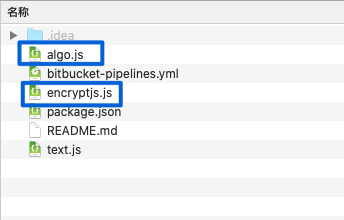
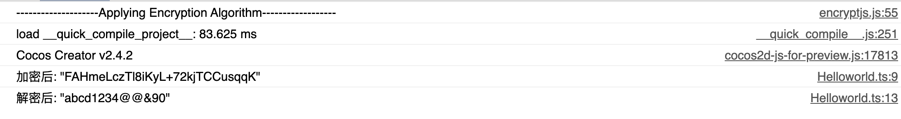

总的来说，客户端加密其实意义不是很大，毕竟加密还需要解密，自然就是无密了，看到好些项目在用，故而简单的学习一下，后期如果有用到，便可以考考这样的模式。
<!--more-->

### 步骤

加密用的是常见的[encryptjs.js](https://www.npmjs.com/package/encryptjs)库，用来对数据进行加密或者解密下面是可能涉及到的知识点：

- [encryptjs.js](https://www.npmjs.com/package/encryptjs)
- 微软的[dts-gen](https://github.com/Microsoft/dts-gen)
- Cocos Creator

首先我们下载 文件到自己的某个项目 ：

```shell
npm install encryptjs --save-dev 
```

此时 我们得到一个文件夹：



其中 蓝色框内的两个文件是我们需要的文件拷贝两个文件 到我们新建的 Cocos Creator Typescript 项目内。


上面看到 我用的是Typescript项目，所以要给 js 文件生成一个 .d.ts声明文件。这里我们使用微软的 [dts-gen](https://github.com/Microsoft/dts-gen)  

```shell
npm install -g dts-gen   // 先全局安装 dts-gen

npm install -g encryptjs     // 然后在全局安装你需要生产声明文件的库 比如 encryptjs

dts-gen -m encryptjs         // 执行命令生成文件 encryptjs.d.ts
```

在执行的文件的路径下（项目的目录libs）生成了encryptjs.d.ts

这里内容如下:

```typescript
/** Declaration file generated by dts-gen */

export const version: string;

export function decrypt(ciphertext: any, password: any, nBits: any): any;

export function encrypt(plaintext: any, password: any, nBits: any): any;

export function getTextEncryptAndSaveToJSONFile(filePath: any, password: any, nBits: any): void;

export function getTextEncryptAndSaveToTextFile(filePath: any, password: any, nBits: any): void;

export function init(): void;

export function writeCipherTextToJSON(file: any, obj: any, options: any, callback: any): any;

```

此时我们可以正常使用这个库文件了！在新建的项目的 `Helloworld` 的 `start`里写入代码：

```typescript
import {decrypt, encrypt} from "../libs/encryptjs";
const {ccclass, property} = cc._decorator;
@ccclass
export default class Helloworld extends cc.Component {
    start () {
        let secretkey = "123456",datakey = "user"
        let dataString = `abcd1234@@&90`;//要加密的字符串
        let encryptedStr = encrypt(dataString,secretkey,256);
        console.log("加密后:", JSON.stringify(encryptedStr));
        cc.sys.localStorage.setItem(datakey,encryptedStr);
        let cipherText = cc.sys.localStorage.getItem(datakey);//要解密的文本
        let dataString2= decrypt(cipherText,secretkey,256);//得到解密之后的文本
        console.log("解密后:", JSON.stringify(dataString2));
    }
}

```

此时我们运行项目



此时查看浏览器存储：


```json
{
    "user": "FAHmeLczTl8iKyL+72kjTCCusqqK"
}
```

至此，本地存储加密已经OK了，是不是很简单呢？

encryptjs 地址: https://www.npmjs.com/package/encryptjs

### 总结

本地加密意义不大，前端的代码混淆和数据加密混合使用才有价值，起码是加大破解的难度，但加密和混淆往往带来的是效率的牺牲，所以在做项目的时候，我们需要适当的选取适合项目的技术方案。

### 参考链接：

- [在creator中用encryptjs加密数据](https://blog.csdn.net/cs8646931/article/details/79976693)(CSDN)
- [TypeScript类型定义文件（*.d.ts）生成工具](https://blog.csdn.net/zdhsoft/article/details/85242631)(CSDN)
- [NODEJS笔记之dts-gen工具：Typescript声明文件生成器](https://blog.csdn.net/wlanye/article/details/85272944)(CSDN)
- [单机游戏存档的常用加密解密方法](https://www.jianshu.com/p/1158b2100513)(简书)

