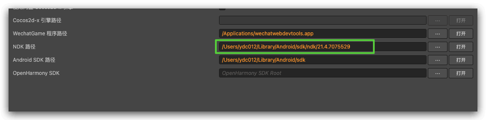
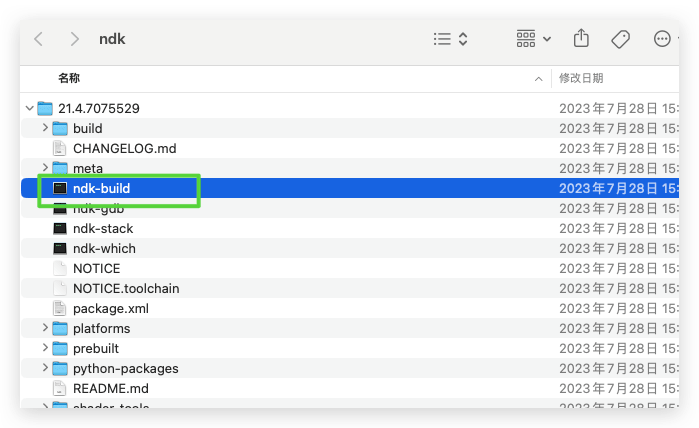

这里是你博客列表显示的摘要文字时隔两年，项目开始重新改到Android赛道上，于是再次开启了Cocos Creator和Android Studio之间的开发徘徊，下面整理一些期间遇到的问题以及解决方案，记录一下，持续更新。
<!--more-->

## 问题

### ERROR: Unknown host CPU architecture: arm64

点击游戏运行预览报错

```shell
[CXX1429] error when building with ndkBuild using /Users/ydc012/TestCase/CCC/NativeDemo/build1/jsb-default/frameworks/runtime-src/proj.android-studio/app/jni/Android.mk: ERROR: Unknown host CPU architecture: arm64

C++ build system [configure] failed while executing:
    /Users/ydc012/Library/Android/sdk/ndk/21.4.7075529/ndk-build \
      NDK_PROJECT_PATH=null \
      APP_BUILD_SCRIPT=/Users/ydc012/TestCase/CCC/NativeDemo/build1/jsb-default/frameworks/runtime-src/proj.android-studio/app/jni/Android.mk \
      NDK_APPLICATION_MK=/Users/ydc012/TestCase/CCC/NativeDemo/build1/jsb-default/frameworks/runtime-src/proj.android-studio/app/jni/Application.mk \
      APP_ABI=arm64-v8a \
      NDK_ALL_ABIS=arm64-v8a \
      APP_PLATFORM=android-16 \
      NDK_OUT=/Users/ydc012/TestCase/CCC/NativeDemo/build1/jsb-default/frameworks/runtime-src/proj.android-studio/app/build/intermediates/cxx/Debug/2h6n6n4c/obj \
      NDK_LIBS_OUT=/Users/ydc012/TestCase/CCC/NativeDemo/build1/jsb-default/frameworks/runtime-src/proj.android-studio/app/build/intermediates/cxx/Debug/2h6n6n4c/lib \
      NDK_TOOLCHAIN_VERSION=clang \
      NDK_MODULE_PATH=/Users/ydc012/TestCase/CCC/NativeDemo/build1/jsb-default/frameworks/cocos2d-x:/Users/ydc012/TestCase/CCC/NativeDemo/build1/jsb-default/frameworks/cocos2d-x/cocos:/Users/ydc012/TestCase/CCC/NativeDemo/build1/jsb-default/frameworks/cocos2d-x/external \
      -j8 \
      NDK_DEBUG=1 \
      APP_SHORT_COMMANDS=false \
      LOCAL_SHORT_COMMANDS=false \
      -B \
      -n
  from /Users/ydc012/TestCase/CCC/NativeDemo/build1/jsb-default/frameworks/runtime-src/proj.android-studio/app

```

#### 问题分析：

1. 官网默认下载的是普通的mac版本，而不是mac arm 版本，然后ndk-build前面加上arch -x86_64



2. 比如这里 需要打开 `/Users/ydc012/Library/Android/sdk/ndk/21.4.7075529`
   

3. 原内容：

```shell
#!/bin/sh
DIR="$(cd "$(dirname "$0")" && pwd)"
$DIR/build/ndk-build "$@"
```

修复后：

```shell
#!/bin/sh
DIR="$(cd "$(dirname "$0")" && pwd)"
arch -x86_64 /bin/bash $DIR/build/ndk-build "$@"
```

### 将字符串转换为整数或浮点数

将字符串转换为整数

```java
 String str = "123";
 int num = Integer.parseInt(str);  // 将字符串转换为整数
 float result = num / 100.0f;     // 将整数转换为 float 类型，注意除以 100.0f 而非 100

 System.out.println(result);      // 输出结果 1.23
```

将字符串转换为浮点数

```java
float num = 0.0f;
try {
    num = Float.parseFloat(adInfo.geteCPM());
} catch (NumberFormatException e) {
    System.out.println("字符串不是有效的浮点数");
}
```

###  that was originally registered here. Are you missing a call to unregisterReceiver()?

完整报错日志

```
Interceptor : notifyActivityDestroy: com.lark.snake.official@com.lark.snake.official.wxapi.WXEntryActivity@80731335
2024-08-05 19:06:48.689 19582-20957 ContentCatcher_catcher  
CatcherHolder : mCatcherList size: 0
2024-08-05 19:06:48.691 19582-20957 ContentCatcherManager                 
failed to get ContentCatcherService.
2024-08-05 19:06:48.695 19582-19582 ActivityThread                        
Activity com.lark.snake.official.wxapi.WXEntryActivity has leaked IntentReceiver com.lark.snake.official.wxapi.WXEntryActivity$1@aafd2f4 that was originally registered here. Are you missing a call to unregisterReceiver()?
android.app.IntentReceiverLeaked: Activity com.lark.snake.official.wxapi.WXEntryActivity has leaked IntentReceiver com.lark.snake.official.wxapi.WXEntryActivity$1@aafd2f4 that was originally registered here. Are you missing a call to unregisterReceiver()?                                                               
```

原因原代码：

```java
	// APP_ID 替换为你的应用从官方网站申请到的合法appID
private static final String APP_ID = "wx88888888";

// IWXAPI 是第三方app和微信通信的openApi接口
private IWXAPI api;

private regToWx() {
    // 通过WXAPIFactory工厂，获取IWXAPI的实例
    api = WXAPIFactory.createWXAPI(this, APP_ID, true);

    // 将应用的appId注册到微信
    api.registerApp(APP_ID);

   //建议动态监听微信启动广播进行注册到微信
  registerReceiver(new BroadcastReceiver() {
   @Override
   public void onReceive(Context context, Intent intent) {

     // 将该app注册到微信
    api.registerApp(Constants.APP_ID);
   }
  }, new IntentFilter(ConstantsAPI.ACTION_REFRESH_WXAPP));

}
```

修改后：

```java
public class WXEntryActivity extends Activity {
    private BroadcastReceiver receiver;

    @Override
    protected void onCreate(Bundle savedInstanceState) {
        super.onCreate(savedInstanceState);
        // Your existing setup code

        IntentFilter filter = new IntentFilter();
        filter.addAction("YOUR_ACTION_HERE");
        receiver = new BroadcastReceiver() {
            @Override
            public void onReceive(Context context, Intent intent) {
                // Handle the broadcast
            }
        };
        registerReceiver(receiver, filter);
    }

    @Override
    protected void onDestroy() {
        super.onDestroy();
        // Unregister receiver to prevent leaks
        if (receiver != null) {
            unregisterReceiver(receiver);
            receiver = null;
        }
    }
}
```

