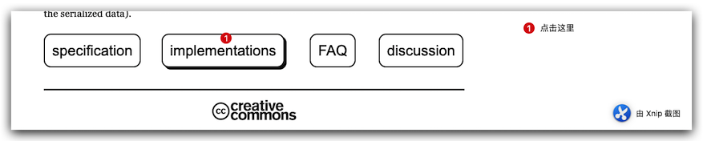
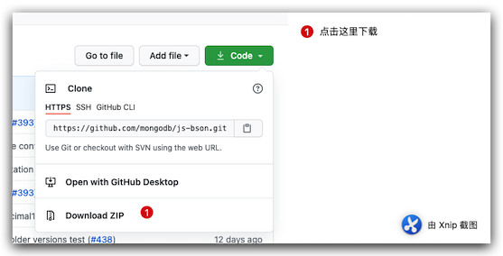
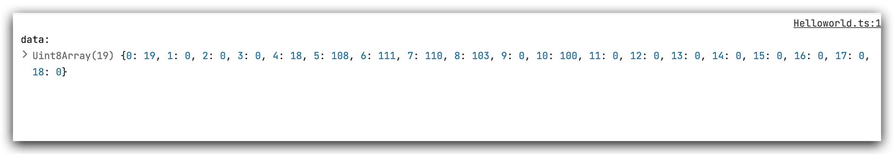
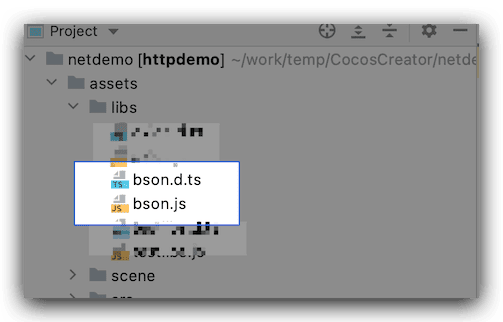
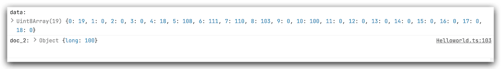

[BSON](https://bsonspec.org/)是一种二进制数据格式，官方解释是一种二进制格式的[JSON](http://json.org/)，在传输中由于数据被压缩，具有体积小，修改速度快等优势。故而得到一些应用和开发中的青睐，下面介绍一下如何在[Cocos Creator](https://www.cocos.com/)里面引入[BSON](https://bsonspec.org/)
<!--more-->

## BSON简单介绍

首先我们去官方网站，[JSON and BSON](https://www.mongodb.com/json-and-bson) 找到一些关于 `JSON` 和`BSON`的介绍和对比：

### JSON vs BSON

|              | **JSON**                       | **BSON**                                                     |
| :----------- | ------------------------------ | ------------------------------------------------------------ |
| Encoding     | UTF-8 String                   | Binary                                                       |
| Data Support | String, Boolean, Number, Array | String, Boolean, Number (Integer, Float, Long, Decimal128...), Array, Date, Raw Binary |
| Readability  | Human and Machine              | Machine Only                                                 |

了解一些信息后 我们打开 [BSON 官网](https://bsonspec.org/) 



然后可以看到很多语言的支持情况，这里我们选择 

- Node.js
  - [bson](https://github.com/mongodb/js-bson) - BSON serialization and deserialization library used by the official MongoDB Node.js driver.

接下来是具体步骤：

## 步骤

### 全局变量模式&插件导入

### 下载编译js-bson

1. 首先外面[js-bson](https://github.com/mongodb/js-bson) 到本地



2. 编译项目，生成需要的类库，需要node 环境 和 tsc 环境 

   ```shell
   npm install
   npm run build
   ```

   

### 修改生成后的文件

1. 首先我们找到 `dist` 文件夹 下的 `bson.bundle.js` 然后 修改 

原代码：

```javascript
var BSON = (function (exports) {
	'use strict';
  ......
  
  return exports;

}({}));
```

修改后：

```javascript
window.bson = (function (exports) {
	'use strict';
	'use strict';
  ......
  
  return exports;

}({}));
```

2. 然后我们找到根目录下生成的 bson.d.ts 声明文件 

原代码：

```typescript
export declare class Binary {
    _bsontype: 'Binary';
}
/** @public */
export declare type UUIDExtended = {
    $uuid: string;
};
export {};
```

修改后：

```typescript
declare global {
  declare namespace bson {
		export declare class Binary {
    	_bsontype: 'Binary';
		}
		/** @public */
		export declare type UUIDExtended = {
    		$uuid: string;
		};
  }
}
export {};
```

### 测试结果

修改完毕后 测试一下我们的结果：

```typescript
 const doc = { long: bs.Long.fromNumber(100) };
 const data = bs.serialize(doc);
 console.log('data:', data);
```

结果如下



本方法适合 `Cocos Creator 2.x` 和 `Cocos Creator 3.1.x`

最后 项目源码 地址  

- [Cocos Creator 2.x demo](https://github.com/jsroads/mylibs/tree/main/bson/2.4.x)
- [Cocos Creator 3.1.x demo](https://github.com/jsroads/mylibs/tree/main/bson/3.1.x)

### ES6 模块方式 引入

官方类库下载后 根据提示运行命令：npm install 或 npm run build 生成的 dist 目录下有四个文件，分别是四种格式，首先我们查看 根目录下的 配置文件叫做`rollup.config.js`，

```json
output: [
      {
        file: 'dist/bson.browser.umd.js',
        format: 'umd',
        name: defaultName,
        exports: 'named',
        sourcemap: true
      },
      {
        file: 'dist/bson.browser.esm.js',
        format: 'es',
        name: defaultName,
        exports: 'named',
        sourcemap: true
      },
      {
        file: 'dist/bson.bundle.js',
        format: 'iife',
        name: defaultName,
        exports: 'named',
        sourcemap: true
      }
    ]
```

其中 format 这个属性 这里我们稍作知识拓展：

> #### 格式(format *`-f`/`--output.format`*)
>
> `String` 生成包的格式。 下列之一:
>
> - `amd` – 异步模块定义，用于像RequireJS这样的模块加载器
> - `cjs` – CommonJS，适用于 Node 和 Browserify/Webpack
> - `esm` – 将软件包保存为 ES 模块文件，在现代浏览器中可以通过 `<script type=module>` 标签引入
> - `iife` – 一个自动执行的功能，适合作为`<script>`标签。（如果要为应用程序创建一个捆绑包，您可能想要使用它，因为它会使文件大小变小。）
> - `umd` – 通用模块定义，以`amd`，`cjs` 和 `iife` 为一体
> - `system` - SystemJS 加载器格式

看到这些 我们知道 dist 目录下 为我们生成了 四种不同环境下的文件，这里如果我们使用 ES6 模式就用 bson.esm.js  这个文件 记得 文件名字要重命名为 bson.js



```javascript
       import  {deserialize, Long, serialize} from "../libs/bson";
       // Serialize a document
        const doc = { long: Long.fromNumber(100) };
        const data = serialize(doc);
        console.log('data:', data);

        // De serialize it again
        const doc_2 = deserialize(data);
        console.log('doc_2:', doc_2);
```

输出结果：



## 知识拓展

Cocos 引用第三方库的两种方式：


## 总结

目前还没有真正理解 Cocos Creator 关于第三方 node库的怎么最优雅的方式使用，后续工作中会再深入探索和研究，查漏补缺的学习，这次先做个简单的引入。

## 参考

- [BSON parser](https://www.npmjs.com/package/bson)
- [Creator | TS项目中引入第三方JS库的两种方式](https://mp.weixin.qq.com/s/bSy2XtK70F7OOCpI00nGDQ)

