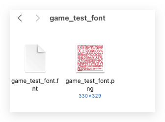
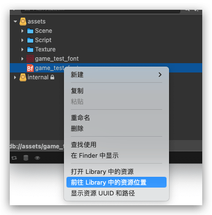
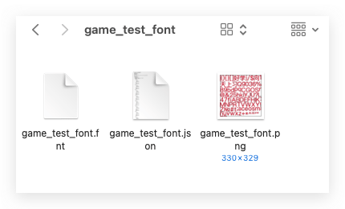
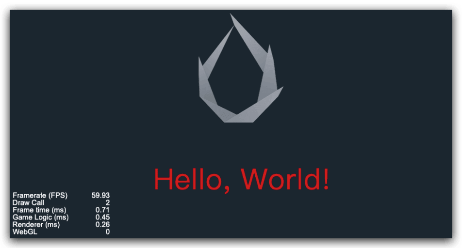

游戏开发中为了减少DrawCall的数量，有时候文本显示经常使用位图显示，就是我们常说的BMFont字体，位图字体，由 `fnt` 文件和同名的 `png` 图片文件共同组成。**位图字体（Bitmap Font）** 是一种游戏开发中常用的字体资源。下面我们就介绍一下如何通过远程加载 BMFont 来使用自定义字体，从而在游戏中使用使得渲染性能提升。
<!--more-->

## 简介

位图字体由 **fnt** 格式的字体文件和一张 **png** 图片组成，fnt 文件提供了对每一个字符小图的索引。

开发环境：Cocos Creator2.4.13

### 常用位图自己工具

- [Glyph Designer](https://71squared.com/glyphdesigner)
- [Hiero](https://github.com/libgdx/libgdx/wiki/Hiero)
- [BMFont (Windows)](http://www.angelcode.com/products/bmfont/)
- https://snowb.org/（在线网站）

## 步骤

### 素材准备

这里 使用 在线网站制作 https://snowb.org/


- `game_test_font.fnt` BMFont 主文件

- `game_test_font.png` BMFont 纹理文件

  

### BMFont JSON 文件提取

- 将 `game_test_font.fnt` 文件拖入 `Cocos Creator` 任意目录中 （爆红不用管），然后右键点击 `game_test_font`，选择前往 library中的资源位置



- 将该文件复制并重命名为 `game_test_font.json`，添加到我们的前面准备好的位图文件同目录中, 此时将 `game_test_font.json`，`game_test_font.png` 上传到CDN（云端）即可

  


- 此时`game_test_font.fnt`（可以删除）这里建议保留 便于后期继续查找问题。
- 这时我们远程资源的地址已经有了
  - http://xxxxx.com/tcs/test/minitest/game_test_font.png
  - http://xxxxx.com/tcs/test/minitest/game_test_font.json
  - http://xxxxx.com/tcs/test/minitest/game_test_font.fnt

### 核心代码

#### FontAtlas 类

- `FontAtlas` 类用于记录字母在字体图片纹理中的位置信息和在文本中的偏移量信息。

##### 属性

- `_letterDefinitions`: 记录字母信息的对象
- `_texture`: 字体图片纹理

##### 原型方法

- `addLetterDefinitions(letter, letterDefinition)`: 添加字母信息
- `cloneLetterDefinition()`: 克隆字
- `getTexture()`: 获取字体图片纹理
- `getLetter(key)`: 获取指定字母的信息
- `getLetterDefinitionForChar(char)`: 获取指定字符的字母信息
- `clear()`: 清空字母信息

####  FontLetterDefinition 类

- `FontLetterDefinition` 类用于记录字母在字体图片纹理中的位置信息和在文本中的偏移量信息。

##### 属性

- `u`: 字母在纹理图片中的 x 坐标

  `v`: 字母在纹理图片中的 y 坐标

  `w`: 字母占用纹理图片的宽度

  `h`: 字母占用纹理图片的高度

  `offsetX`: 字母在文本中的 x 偏移量

  `offsetY`: 字母在文本中的 y 偏移量

  `textureID`: 纹理图片的 ID

  `valid`: 字母是否有效

  `xAdvance`: 字母的 x 方向偏移量

`HelloWorld.ts` 代码

```typescript
import {FntConfig, IBitmapFont} from "./IBitmapFont";

const {ccclass, property} = cc._decorator;

@ccclass
export class Helloworld extends cc.Component {
    @property(cc.Label)
    label: cc.Label = null;

    private bmFontInfo: { font_texture: cc.Texture2D, font_json: cc.JsonAsset } = {font_texture:null,font_json:null};

    protected start() {
      	//注意 xxxx.xxx.com 这个要改成你自己真实的地址
        const list = [
            {url: "https://xxxx.xxx.com/tcs/test/minitest/game_test_font.png", type: "png"},
            {url: "https://xxxx.xxx.com/tcs/test/minitest/game_test_font.json", type: "json"},
        ]
        Promise.all(list.map(item => this.loadRemoteSource(item.url, item.type, true)))
            .then((res) => {
                this.showBMfont(res);
            })
            .catch(error => {
                // 处理加载资源失败的情况
                console.error("Failed to load resources:", error);
            });
    }
    private showBMfont(list: any[]) {
        list.forEach((item, index) => {
            // 判断 res 是否是 cc.Texture2D 的实例
            if (item instanceof cc.Texture2D) {
                console.log("res 是 cc.Texture2D 类型");
                this.bmFontInfo.font_texture = item;
                // 在这里可以进行 cc.Texture2D 相关的操作
            } else if (item instanceof cc.JsonAsset) {
                console.log("res 是 cc.JsonAsset 类型");
                this.bmFontInfo.font_json = item;
                // 在这里可以进行 cc.Texture2D 相关的操作
            } else {
                console.log("res 不是 cc.Texture2D 也不是 cc.JsonAsset 类型");
                // 如果不是 cc.Texture2D 类型，你可以尝试输出 res，或者进一步检查其类型
            }
        })

        //设置位图字体
        this.setLabelBMFont(this.label);

    }

    private setLabelBMFont(label: cc.Label) {
        const bmFont = new cc.BitmapFont();
        const json:IBitmapFont = <IBitmapFont>this.bmFontInfo.font_json.json;
        const texture = this.bmFontInfo.font_texture;
        const spriteFrame = new cc.SpriteFrame(texture);
        const dictionary = this.getFontDefDictionary(spriteFrame, json._fntConfig);

        bmFont["spriteFrame"] = spriteFrame;
        bmFont["fontSize"] = json.fontSize;
        bmFont["_fntConfig"] = json._fntConfig;
        bmFont["_fontDefDictionary"] = dictionary;
        label.font = bmFont;
    }

    /**
     * 加载远端字体
     * @param url
     * @param type
     * @param forceUpdate
     * @private
     */
    private loadRemoteSource(url: string, type: string, forceUpdate?: boolean) {
        const forceUpdateStr: string = forceUpdate ? `?time=${cc.sys.now()}` : "";
        url += forceUpdateStr;
        return new Promise((resolve, reject) => {
            cc.assetManager.loadRemote(url, (err, res) => {
                if (err) {
                    console.log(err);
                    return;
                }
                resolve(res)
            });
        })
    }

    private getFontDefDictionary(texture:cc.SpriteFrame, data:FntConfig) {
        const FontconstterDefinition = function FontconstterDefinition() {
            this.u = 0; // 字母在纹理图片中的 x 坐标
            this.v = 0; // 字母在纹理图片中的 y 坐标
            this.w = 0; // 字母占用纹理图片的宽度
            this.h = 0; // 字母占用纹理图片的高度
            this.offsetX = 0; // 字母在文本中的 x 偏移量
            this.offsetY = 0; // 字母在文本中的 y 偏移量
            this.textureID = 0; // 纹理图片的 ID
            this.valid = false; // 字母是否有效
            this.xAdvance = 0; // 字母的 x 方向偏移量
        };

        const FontAtlas = function FontAtlas(texture) {
            this._constterDefinitions = {};// 记录字母信息的对象
            this._texture = texture;// 字体图片纹理
        };
        // FontAtlas 的原型方法
        FontAtlas.prototype = {
            constructor: FontAtlas,
            // 添加字母信息
            addconstterDefinitions(constter, constterDefinition) {
                this._constterDefinitions[constter] = constterDefinition;
            },
            // 克隆字母信息
            cloneconstterDefinition() {
                const copyconstterDefinitions = {};
                for (const key in this._constterDefinitions) {
                    const value = new FontconstterDefinition();
                    cc.js.mixin(value, this._constterDefinitions[key]);
                    copyconstterDefinitions[key] = value;
                }
                return copyconstterDefinitions;
            },
            // 获取字体图片纹理
            getTexture() {
                return this._texture;
            },
            // 获取指定字母的信息
            getLetter(key) {
                return this._constterDefinitions[key];
            },
            // 获取指定字符的字母信息
            getLetterDefinitionForChar(char) {
                const key = char.charCodeAt(0);
                const hasKey = this._constterDefinitions.hasOwnProperty(key);
                return hasKey ? this._constterDefinitions[key] : null;
            },
            // 清空字母信息
            clear() {
                this._constterDefinitions = {};
            },
        };
        const fontAtlas = new FontAtlas(texture); // 创建字体图集对象
        const fontDict = data.fontDefDictionary;
        for (const fontDef in fontDict) {
            const constter = new FontconstterDefinition(); // 创建字母信息对象

            const rect = fontDict[fontDef].rect;
            constter.offsetX = fontDict[fontDef].xOffset;
            constter.offsetY = fontDict[fontDef].yOffset;
            constter.w = rect.width;
            constter.h = rect.height;
            constter.u = rect.x;
            constter.v = rect.y;
            //FIXME: only one texture supported for now
            constter.textureID = 0;
            constter.valid = true;
            constter.xAdvance = fontDict[fontDef].xAdvance;
            fontAtlas.addconstterDefinitions(fontDef, constter);
        }
        return fontAtlas;
    }

}
```

`IBitmapFont.ts`

```typescript
/**
 * @Description:
 * @Author: jsroads
 * @Date: 2024/5/15 20:43
 */
export interface IBitmapFont {
    __type__: string
    _name: string
    _objFlags: number
    _native: string
    fntDataStr: string
    spriteFrame: SpriteFrame
    fontSize: number
    _fntConfig: FntConfig
    _fontDefDictionary: any
}

export interface SpriteFrame {
    __uuid__: string
}

export interface FntConfig {
    commonHeight: number
    fontSize: number
    atlasName: string
    fontDefDictionary: FontDefDictionary
    kerningDict: KerningDict
}

export interface FontDefDictionary {
    [key: string]: IFontDefDictionary
}


export interface KerningDict {}

export interface IFontDefDictionary {
    rect: IFontRect
    xOffset: number
    yOffset: number
    xAdvance: number
}

export interface IFontRect {
    x: number
    y: number
    width: number
    height: number
}

```

效果：



### 其他拓展

远程加载骨骼动画的方法

```javascript
const assetRes = {
  image: null, // 存储图片资源
  ske: null, // 存储骨骼动画资源
  atlas: null, // 存储 atlas 资源
};
const urlArray = url.split('/');

const fileName = urlArray[urlArray.length - 1];

const resUrl = url + '/' + fileName;

assetRes.image = await getResource(resUrl + '.png'); // 加载图片资源
assetRes.ske = await getResource(resUrl + '.json'); // 加载骨骼动画资源
assetRes.atlas = await getResource(resUrl + '.atlas'); // 加载 atlas 资源

// 判断节点是否有骨骼
const skeletonData = new sp.SkeletonData(); // 创建骨骼数据对象
skeletonData.skeletonJson = assetRes.ske.json; // 装载骨骼动画数据
skeletonData.atlasText = assetRes.atlas.text; // 装载 atlas 数据
skeletonData.textures = [assetRes.image]; // 加载图片
skeletonData.textureNames = [fileName + '.png'];
let skeletonComponent = node.getComponent(sp.Skeleton);
if (!skeletonComponent) {
  skeletonComponent = node.addComponent(sp.Skeleton);
}

skeletonComponent.skeletonData = skeletonData;
skeletonComponent.setSkin('default');
skeletonComponent.setAnimation(0, 'animation', true);
```

## 总结

本文核心参考了原作者的核心方法，部分素材和制作流程来自笔者本人，正如原作者说的：BMFont，Skeleton 这一类都是Cocos Creator需要同时加载多个文件才可以正常运行的组件。这里需要理解Cocos Creator加载的核心逻辑，就可以实现动态远程加载自己需要的素材。

## 参考

- [Cocos Creator 远程加载 BMFont 方案](https://juejin.cn/post/7225100740380082237)
