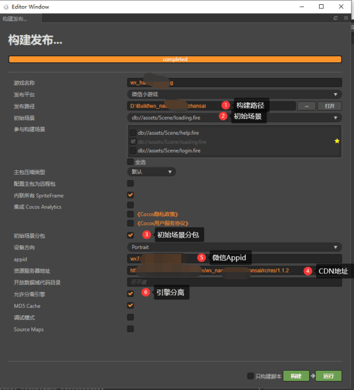
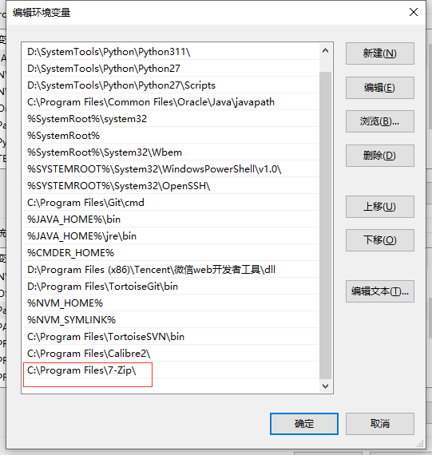

开发项目的时候，有时候需要对项目素材或者代码进行一些查找或者处理的时候，这时候就会用到插件，之前自己也买过别人的插件，但是研究不多，最近开发功能的时候，用到了几个插件，原作者的功能无法实现我的需求，于是我只能在原作者的基础上进行二次开发，于是就了解了一些插件的知识。
<!--more-->

## 内容

### 小游戏开发

现在做的还是微信小游戏和抖音小游戏，有时候为了远程可以控制游戏的一些开关，就需要把一些配置选项放到远程（CDN）服务器上，我一般使用json 做配置表，有时候需要配置一些选项或者版本号，构建发布的时候，需要修改几个地方，于是我就想到了能不能在构建的时候把这个文件修改了呢？答案是可以的。

## 插件

`package.json` 插件配置文件

```json
{
  "name": "minigame-ad-helper",
  "version": "1.0.1",
  "description": "小游戏微信切换助手",
  "author": "jsroads",
  "main": "main.js",
  "executeOrder": 100
}
```

`mfs.js` 工具类

```javascript
const fs = require('fs');
const path = require("path");

/**
 * 递归创建文件
 * @param {*} dirName 
 * @param {*} mode 
 */
function mkdirSync(dirName, mode) {
    if (fs.existsSync(dirName)) {
        return true;
    }
    if (mkdirSync(path.dirname(dirName), mode)) {
        fs.mkdirSync(dirName, mode);
        return true;
    }
}
module.exports.mkdirSync = mkdirSync;

/**
 * 递归删除
 * @param {*} src 
 */
function rmSync(src) {
    if (fs.existsSync(src)) {
        if (isFile(src)) {
            fs.unlinkSync(src);
            return;
        }
        const files = fs.readdirSync(src);
        files.forEach((file) => {
            const curPath = path.join(src, file);
            if (isDirectory(curPath)) {
                rmSync(curPath);
            } else if (isFile(curPath)) {
                fs.unlinkSync(curPath);
            }
        });
        fs.rmdirSync(src);
    } else {
        console.error("删除文件失败，给定的路径不存在，请给出正确的路径", src);
    }
}
module.exports.rmSync = rmSync;

/**
 * 递归复制文件
 * @param {*} src 
 * @param {*} dst 
 */
function copySync(src, dst) {
    if (!fs.existsSync(src)) {
        console.error('原路径不存在', src);
        return;
    }
    if (isFile(src)) {
        let dstDir = path.parse(dst).dir;
        if (!fs.existsSync(dstDir)) {
            mkdirSync(dstDir);
        }
        fs.copyFileSync(src, dst);
    } else if (isDirectory(src)) {
        const files = fs.readdirSync(src);
        files.forEach((file) => {
            const srcPath = path.join(src, file);
            const dstPath = path.join(dst, file);
            copySync(srcPath, dstPath);
        });
    }
}
module.exports.copySync = copySync;


/**
 * 获取文件夹下所有文件路径
 * @param {*} src 
 */
function readdirAllSync(src) {
    return _readdirSync(src, []);
}
module.exports.readdirAllSync = readdirAllSync;

module.exports.readdirSync = fs.readdirSync;

function _readdirSync(src, paths) {
    paths = paths || [];
    const files = fs.readdirSync(src);
    files.forEach((file) => {
        const filePath = path.join(src, file);
        if (isFile(filePath)) {
            paths.push(filePath);
        } else if (isDirectory(filePath)) {
            _readdirSync(filePath, paths);
        }
    });
    return paths;
}


/**
 * 是否是文件
 * @param {*} path 
 */
function isFile(path) {
    const stat = fs.statSync(path);
    return stat.isFile();
}

/**
 * 是否是文件夹
 * @param {*} path 
 */
function isDirectory(path) {
    const stat = fs.statSync(path);
    return stat.isDirectory();
}

function size(path) {
    const stat = fs.statSync(path);
    return stat.size;
}
module.exports.size = size;

function writeFileSync(p, data, option) {
    const dirName = path.parse(p).dir;
    if (!fs.existsSync(path)) {
        mkdirSync(dirName);
    }
    fs.writeFileSync(p, data, option);
}
module.exports.writeFileSync = writeFileSync;

module.exports.readFileSync = fs.readFileSync;

/**
 * 文件或文件夹是否存在
 * @param {*} dirName 
 */
module.exports.exists = fs.existsSync;

/**
 * 拼接路径
 */
module.exports.join = path.join;

/**
 * 读取后缀
 */
module.exports.extname = path.extname;

module.exports.relative = path.relative;

module.exports.parse = path.parse;

module.exports.existsSync = fs.existsSync;

module.exports.relative = path.relative;

```

`main.js` 核心逻辑处理

```javascript
const mfs = require("./util/mfs");
const adapterActualPlatform = ["wechatgame"];

function onBuildStart(options, callback) {
    if ("mini-game" === options.platform) {
        if (adapterActualPlatform.indexOf(options.actualPlatform) === -1) {
            callback && callback();
            return;
        }
        Editor.log("[minigame-ad-helper]", "小游戏修广告小助手修改开始 onBuildStart");
        const WeiChatConfigPath = mfs.join(options.project, "assets", "resources", "json", "WeiChatConfig.json");
        Editor.log(WeiChatConfigPath);
        const weiChatConfig = JSON.parse(mfs.readFileSync(WeiChatConfigPath));
        const versionBuildConfig = JSON.parse(mfs.readFileSync(mfs.join(options.project, "settings", `${options.actualPlatform}.json`)));
        let appid = versionBuildConfig["appid"];
        if (!appid) {
            callback && callback();
        }
        weiChatConfig["curAppid"] = appid;

        let data = JSON.stringify(weiChatConfig, null, 4);
        mfs.writeFileSync(WeiChatConfigPath, data);
        let count = 2;
        // Editor.assetdb.saveExists('db://assets/resources/json/version.json', data)
        Editor.assetdb.refresh("db://assets/resources/json/WeiChatConfig.json", function (err, results) {
            results.forEach(function (result) {
                if (result.command === "delete") {
                    Editor.log(`微信小游戏广告修改完毕为:delete`);
                } else if (result.command === "change" || result.command === "create") {
                    Editor.log(`微信小游戏广告修改完毕为:change:${appid}`);
                } else {
                    Editor.log(`微信小游戏广告修改完毕为:${result.command}`);
                }
            });
            count--;
            if (count === 0) {
                callback && callback();
            }
        });
        const gamePath = mfs.join(options.project, "assets", "resources", "json", "config.json");
        Editor.log(gamePath);
        const gameConfig = JSON.parse(mfs.readFileSync(gamePath));
        let urlList = versionBuildConfig["REMOTE_SERVER_ROOT"].split("/");
        const gameStr = urlList[urlList.length - 4];
        gameConfig["wechat"]["channel"] = gameStr;
        let gameData = JSON.stringify(gameConfig, null, 4);
        mfs.writeFileSync(gamePath, gameData);
        // Editor.assetdb.saveExists('db://assets/resources/json/version.json', data)
        Editor.assetdb.refresh("db://assets/resources/json/config.json", function (err, results) {
            results.forEach(function (result) {
                if (result.command === "delete") {
                    Editor.log(`游戏channel修改完毕为:delete`);
                } else if (result.command === "change" || result.command === "create") {
                    Editor.log(`游戏channel修改完毕为:change:${gameStr}`);
                } else {
                    Editor.log(`游戏channel修改完毕为:${result.command}`);
                }
            });
            count--;
            if (count === 0) {
                callback && callback();
            }
        });
    } else {
        callback();
    }

}

function onBuildFinish(options, callback) {
    if ("mini-game" === options.platform) {
        if (adapterActualPlatform.indexOf(options.actualPlatform) === -1) {
            callback && callback();
            return;
        }
    }
    callback();
}

module.exports = {
    load() {
        //修改
        Editor.Builder.on("build-start", onBuildStart);
        // Editor.Builder.on('build-finished', onBuildFinish);
    },
    unload() {
        //修改
        Editor.Builder.removeListener("build-start", onBuildStart);
        // Editor.Builder.removeListener('build-finished', onBuildFinish);
    }
};
```

## 解释

1. 上面的核心类 在于监听 构建前 去获取 构建参数 `options.platform`和`options.actualPlatform`  来判断构建的平台
2. 读取构建面板填写的信息 比如 CDN路径 比如版本号

```javascript
const versionBuildConfig = JSON.parse(mfs.readFileSync(mfs.join(options.project, "settings", `${options.actualPlatform}.json`)));
```

3. 然后修改我们项目内的json文件

   ```javascript
           const WeiChatConfigPath = mfs.join(options.project, "assets", "resources", "json", "WeiChatConfig.json");
           Editor.log(WeiChatConfigPath);
           const weiChatConfig = JSON.parse(mfs.readFileSync(WeiChatConfigPath));
   ```

4. 保存文件，并且刷新项目

```javascript
  Editor.assetdb.refresh("db://assets/resources/json/WeiChatConfig.json", function (err, results) {
            results.forEach(function (result) {
                if (result.command === "delete") {
                    Editor.log(`微信小游戏广告修改完毕为:delete`);
                } else if (result.command === "change" || result.command === "create") {
                    Editor.log(`微信小游戏广告修改完毕为:change:${appid}`);
                } else {
                    Editor.log(`微信小游戏广告修改完毕为:${result.command}`);
                }
            });
            count--;
            if (count === 0) {
                callback && callback();
            }
        });
```

5. 当然了这个插件是为自己的项目定制的功能，但是可以举一反三，就是我们可以选择在项目构建前或者构建后修改我们项目的文件的内容

## 小游戏快速启动

### 老生常谈的话题

1. 小游戏快速启动一直是一个常常提及的话题，最近又研究了新的构建方式，这种适合体量不大的游戏

首先我们看一下构建面板：



2. 这里跟以往不同，选择了 **引擎分离** 和 **初始场景分包** 
3. 以前做的时候不怎么使用 **引擎分离** 究其原因是，游戏体量比较大，一般使用的是先用原生Javascript绘制一个图片，然后用分包形式加载游戏的主包，采取的手段，现在游戏体量比较小，就采用新的方式。
4. 引擎分离，需要把引擎插件的 path 修改为空。具体文档可以看这里：[点击访问](https://developers.weixin.qq.com/minigame/dev/guide/base-ability/game-engine-plugin.html)

> (1) 对于 `plugins` 中有 `path` 字段的使用方式，上传/预览时，**使用**该字段指定的**路径中的文件**作为引用的插件代码并会进行合法性校验。
>
> (2) 对于 `plugins` 中无 `path` 字段的使用方式，上传/预览时，系统会直接**使用线上**已发布的全量的 `provider` 的 `version` 版本的文件作为引用的**插件代码**

5. 为了每次可以快速修改，我这里提供一个命令脚本：需要跟 `wechatgame` 同级目录 `move_and_update.bat`

```bash
@echo off

REM 获取当前wechatgame目录的路径
set "wechatgame_path=%cd%\wechatgame"

REM 检查是否存在remote文件夹
if exist "%wechatgame_path%\remote" (
    REM 移动remote文件夹到和wechatgame文件夹同目录
    move "%wechatgame_path%\remote" "%cd%\remote"
)

REM 检查是否存在cocos文件夹
if exist "%wechatgame_path%\cocos" (
    REM 删除wechatgame下的cocos文件夹及其内容
    rmdir /s /q "%wechatgame_path%\cocos"
)

REM 修改wechatgame目录下的game.json文件
if exist "%wechatgame_path%\game.json" (
    REM 使用powershell替换字符串
    powershell -Command "(Get-Content '%wechatgame_path%\game.json' -Raw) -replace '(\"version\": \"2\.4\.13\",\r?\n\s*\"path\": \"cocos\")', '\"version\": \"2.4.13\"' | Set-Content '%wechatgame_path%\game.json'"
)

```

下面再给一个 shell 脚本实现了同样的功能

```shell
#!/bin/bash

# 获取当前wechatgame目录的路径
wechatgame_path="$(pwd)/wechatgame"

# 检查是否存在remote文件夹
if [ -d "${wechatgame_path}/remote" ]; then
    # 移动remote文件夹到和wechatgame文件夹同目录
    mv "${wechatgame_path}/remote" "${wechatgame_path}/../remote"
fi

# 检查是否存在cocos文件夹
if [ -d "${wechatgame_path}/cocos" ]; then
    # 删除wechatgame下的cocos文件夹及其内容
    rm -r "${wechatgame_path}/cocos"
fi

# 修改wechatgame目录下的game.json文件
if [ -f "${wechatgame_path}/game.json" ]; then
    # 使用sed替换字符串，第一次替换
    sed -i 's/"version": "2.4.13",/"version": "2.4.13"/' "${wechatgame_path}/game.json"
    
    # 使用sed删除字符串，第二次修改
    sed -i '/"path": "cocos"/d' "${wechatgame_path}/game.json"
fi

```

脚本将执行所需的操作：移动`remote`文件夹，删除`cocos`文件夹及其内容，并分两步修改`game.json`文件。

## 小游戏备份

有时候我们游戏构建后希望备份一个zip包，有个脚本可以双击打包，带上日期时间最好不过。于是下面的脚本应运而生。

`zip_wechatgame.bat`

```bash
@echo off

REM 获取当前wechatgame目录的路径
set "wechatgame_path=%cd%\wechatgame"

REM 获取当前日期和时间，并设置输出ZIP文件名
for /f "tokens=2-4 delims=/ " %%a in ("%DATE%") do (
    set "year=%%c"
    set "month=%%a"
    set "day=%%b"
)
for /f "tokens=1-3 delims=:. " %%a in ("%TIME%") do (
    set "hour=%%a"
    set "minute=%%b"
    set "second=%%c"
)

REM 修复小时格式
if %hour% lss 10 (set "hour=0%hour:~-1%")

set "output_zip=%cd%\%year%_%month%_%day%_%hour%_%minute%_%second%_wechatgame.zip"

REM 压缩wechatgame文件夹为ZIP文件
powershell -Command "Add-Type -A 'System.IO.Compression.FileSystem'; [IO.Compression.ZipFile]::CreateFromDirectory('%wechatgame_path%', '%output_zip%')"

```

`shell` 版本 `zip_7_zip_wechatgame.sh`  我这里安装了 [7-zip](https://www.7-zip.org/) 软件 需要这个支持 配置环境变量

```shell
#!/bin/bash

# 获取当前wechatgame目录的路径
wechatgame_path="$(pwd)/wechatgame"

# 获取当前日期和时间
current_time=$(date '+%Y_%m_%d_%H_%M_%S')

# 设置输出ZIP文件名
output_zip="$(pwd)/${current_time}_wechatgame.zip"

# 使用7z命令压缩wechatgame文件夹为ZIP文件
7z a -tzip "${output_zip}" "${wechatgame_path}"

```



以上就是 把文件夹 快速压缩成带时间和日期的zip压缩包