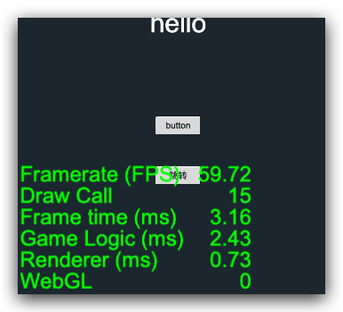

最近恰好要查找一些性能`bug`，免不了要经常使用`CCProfiler`性能显示统计信息，比如常见的左下角的`Drawcall/FPS`显示文本。官方默认的显示白色，在微信小游戏中国特别的小，有时候看不太清，于是就自己尝试着修改一下，下面记录一下修改的方式。
<!--more-->

## 修改效果



## 修改原理

修改根节点下的 性能显示字体样式：


### 修改方式

#### 自定义引擎修改

1. 如果自定义引擎这里不再赘述，详情参考这里
2. 下面就说说修改文件 `Javascript` 引擎路径下的 `cocos2d/core/utils/profiler/CCProfiler.js`
3. `CCProfiler.js`文件修改 `generateNode`方法内容如下：

```javascript
function generateNode () {
    if (_rootNode && _rootNode.isValid) return;


    _rootNode = new cc.Node('PROFILER-NODE');
    _rootNode.x = _rootNode.y = 10;

    _rootNode.groupIndex = cc.Node.BuiltinGroupIndex.DEBUG;
    cc.Camera._setupDebugCamera();

    _rootNode.zIndex = macro.MAX_ZINDEX;
    cc.game.addPersistRootNode(_rootNode);

    let left = new cc.Node('LEFT-PANEL');
    left.anchorX = left.anchorY = 0;
    let leftLabel = left.addComponent(cc.Label);
    leftLabel.fontSize = _fontSize;
    leftLabel.lineHeight = _fontSize;
    left.parent = _rootNode;
    left.color = cc.Color.GREEN;

    let right = new cc.Node('RIGHT-PANEL');
    right.anchorX = 1;
    right.anchorY = 0;
    right.x = 520;
    let rightLabel = right.addComponent(cc.Label);
    rightLabel.horizontalAlign = cc.Label.HorizontalAlign.RIGHT;
    rightLabel.fontSize = _fontSize;
    rightLabel.lineHeight = _fontSize;
    right.parent = _rootNode;
    right.color = cc.Color.GREEN;
    if (cc.sys.platform !== cc.sys.BAIDU_GAME_SUB &&
        cc.sys.platform !== cc.sys.WECHAT_GAME_SUB) {
        leftLabel.cacheMode = cc.Label.CacheMode.CHAR;
        rightLabel.cacheMode = cc.Label.CacheMode.CHAR;
    }

    _label = {
        left: leftLabel,
        right: rightLabel
    };
}
```

修改引擎优点是：所有项目都能生效。缺点是：如果要判断浏览器和小游戏手机还需要更多的代码。

#### 项目内修改

在游戏的第一个场景的 `onLoad` 方法写：

```typescript
this.scheduleOnce(() = >{
    const PROFILER_NODE = cc.find("PROFILER-NODE");
    if (cc.debug.isDisplayStats() && PROFILER_NODE) {
        const LEFT_PANEL = cc.find("LEFT-PANEL", PROFILER_NODE) const RIGHT_PANEL = cc.find("RIGHT-PANEL", PROFILER_NODE) let size = 24,
        space = 260;
        PROFILER_NODE.y = -10;
        if (cc.sys.isMobile) {
            size = 48;
            space = 520;
        }
        LEFT_PANEL.getComponent(cc.Label).fontSize = size;
        LEFT_PANEL.getComponent(cc.Label).lineHeight = size;
        LEFT_PANEL.color = cc.Color.GREEN;

        RIGHT_PANEL.x = space RIGHT_PANEL.getComponent(cc.Label).fontSize = size;
        RIGHT_PANEL.getComponent(cc.Label).lineHeight = size;
        RIGHT_PANEL.color = cc.Color.GREEN;
    }
},
0)
```

**注意：之所以使用`scheduleOnce` 延迟，是因为如果直接取，第一帧获取不到。**

## 其他拓展

有时候我们希望 `web` 端和小游戏环境更加相似所以可能要关闭动态合图：

> 启用动态合图会占用额外的内存，不同平台占用的内存大小不一样。目前在小游戏和原生平台上默认会禁用动态合图，但如果你的项目内存空间仍有富余的话建议开启。
>
> **若希望强制开启动态合图**，请在代码中加入：
>
> js
>
> ```javascript
> cc.macro.CLEANUP_IMAGE_CACHE = false;
> cc.dynamicAtlasManager.enabled = true;
> ```
>
> > **注意**：这些代码请写在项目脚本中的最外层，不要写在 `onLoad` / `start` 等类函数中，才能确保在项目加载过程中即时生效。否则如果在部分贴图缓存已经释放的情况下才启用动态图集，可能会导致报错。
>
> **若希望强制禁用动态合图**，可以直接剔除“Dynamic Atlas”模块以减小引擎包体，或者通过代码控制：
>
> js
>
> ```javascript
> cc.dynamicAtlasManager.enabled = false;
> ```


## 3.8.3方案，导入profiler即可

```javascript
this.scheduleOnce(() => {
    profiler["_ctx"].fillStyle = "#000000ff" //新颜色
    profiler["_ctx"].clearRect(0, 0, profiler["_region"].texExtent.width , profiler["_region"].texExtent.height);
    profiler["_statsDone"] = false
    profiler.generateStats()
},0.1)
```

