本来以为小游戏的教程和文章有很多，像这种一键发布的小游戏，无非就是跟微信或抖音小游戏一样，很容易接入，一般游戏`API`接入，无外乎，登陆、视频广告、`Banner`广告、支付等逻辑，一般都有一些获取启动参数，或者小游戏顶部区域适配等，却不曾想，使用`CocosCreator`构建华为快游戏的时候，还会有一些意外的踩坑和注意地方，下面就说一下，如何使用`CocosCreator`构建出华为快游戏。
<!--more-->

## 前置环境

 本文的电脑环境如下：

- `Mac`电脑
- `CocosCreator` 2.4.11
- 小米手机一部
- 华为手机一部

需要安装的软件 ：`Cocos Creator` 和 华为快游戏开发工具

首先我们给出下面几个文档地址：大家先熟悉一下大概的内容，然后进行下一步操作

- [发布到华为快游戏](https://docs.cocos.com/creator/2.4/manual/zh/publish/publish-huawei-quick-games.html)
- [Runtime快游戏开发指导](https://developer.huawei.com/consumer/cn/doc/development/quickApp-Guides/quickgame-dev-runtimegame-guide-0000001159778255)

文档熟悉后，我们这边还需要去申请相应的一些信息，这里主要是一个和微信小游戏很相似的东西叫做AppId。

### 关于签名

```bash
# 通过 openssl 命令工具生成签名文件
openssl req -newkey rsa:2048 -nodes -keyout private.pem -x509 -days 3650 -out certificate.pem
```

查看证书信息

```bash
openssl x509 -text -in certificate.pem
```

查看certificate.crt证书的到期时间

```bash
openssl x509 -in certificate.pem -noout -dates
```

## 步骤

1. 新建一个`CocosCreator`项目

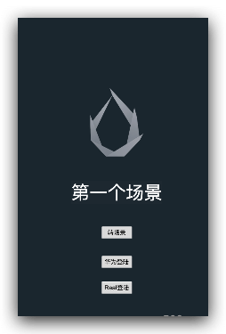


2. 这里我随便写了一个界面，然后开始构建游戏

代码如下：

```typescript
const {ccclass, property} = cc._decorator;

@ccclass
export default class AppGame extends cc.Component {

    @property(cc.Label)
    label: cc.Label = null;

    @property
    text: string = 'hello';

    start () {
        console.log("smile:🚀 ~ f:AppGame m:start l:13->", "首次场景启动");
        if(Browser.onHWMiniGame&&!GameData.ins.inited){
            const env = qg.env;
            const USER_DATA_PATH = qg.env.USER_DATA_PATH;
            console.log("smile:🚀 ~ f:AppGame m:start l:19->", env);
            console.log("smile:🚀 ~ f:AppGame m:USER_DATA_PATH l:20->", USER_DATA_PATH);
            const res = qg.getSystemInfoSync();
            console.log("on getSystemInfoSync: success =" + JSON.stringify(res));

            GameData.ins.initData();
            // qg.exitApplication({
            //     success : function () {
            //         console.log("exitApplication success" );
            //     },
            //     fail:function(){
            //         console.log("exitApplication fail");
            //     },
            //     complete:function() {
            //         console.log("exitApplication complete");
            //     }
            // });
            qg.onHide(this.onHideHandler);
            qg.onShow(this.onShowHandler);
            qg.onError(
                (res) => {console.log("onError message = " + res.message + ", stack = " + res.stack);}
            );

        }

        if (Browser.onHWMiniGame){
            const options = qg.getLaunchOptionsSync();
            console.log("smile:🚀 ~ f:AppGame m:start l:45->", JSON.stringify(options));
        }
    }

    private onShowHandler(){
        if(GameData.ins.timeStamp === 0) GameData.ins.timeStamp = cc.sys.now();
        const duration :number = cc.sys.now() - GameData.ins.timeStamp;
        GameData.ins.timeStamp = cc.sys.now();
        console.warn(`游戏进入前台 duration ${duration}ms`);
        console.log(`对象`,this);
        console.log(`对象`,this === window);
    }

    private onHideHandler(){
        const duration :number = cc.sys.now() - GameData.ins.timeStamp;
        GameData.ins.timeStamp = cc.sys.now();
        console.warn(`游戏进入后台 duration ${duration}ms`);
        console.log(`对象`,this);
        console.log(`对象`,this === window);
    }

    protected onDestroy() {
        // qg.offShow(this.onShowHandler);
        // qg.offHide(this.onHideHandler);
    }

    private transToPay(touch:cc.Event.EventTouch,data:string) {
        cc.director.loadScene("PayGame",(err,scene)=>{
            // cc.director.runScene(scene);
        })
    }

    private hwGameLoginHandler(touch:cc.Event.EventTouch,data:string) {
        console.log("smile:🚀 ->", "hwGameLoginHandler");
    }

    private hwLoginWithRealHandler(touch:cc.Event.EventTouch,data:string) {
        console.log("smile:🚀 ->", "hwLoginWithRealHandler");
    }
}

```

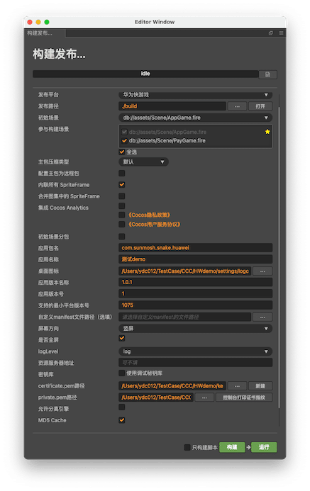

注意：这里我曾尝试 设置 logo 设置公钥、私钥的路径为相对路径，发现是无法正常构建

## 调试

1. 首先要使用USB数据线连接我们的手机， 我这里是华为手机，记得开启开发者模式，USB调试
2. 使用上面的打包方式 构建好我们需要的rpk 文件。

3. 构建成功后 我们去查看 build 下的 huawei 文件夹 下的 dist 下面的 rpk 文件

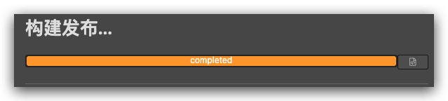


4. 我们启动 已经安装好的 开发工具

   

5. 选择打开 `rpk`

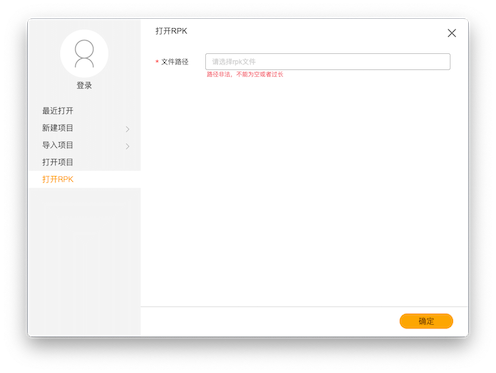

6. 选择 刚刚构建好的 `rpk` 文件  `build/dist/xxxx.rpk`


7. 点击确定 打开 文件


8. 选择 本地运行

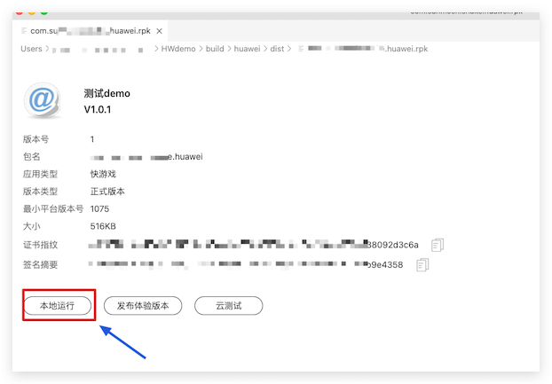

9. 继续点击 确定

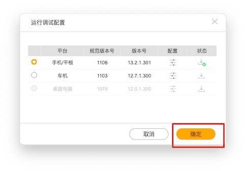

10. 继续点击 确认

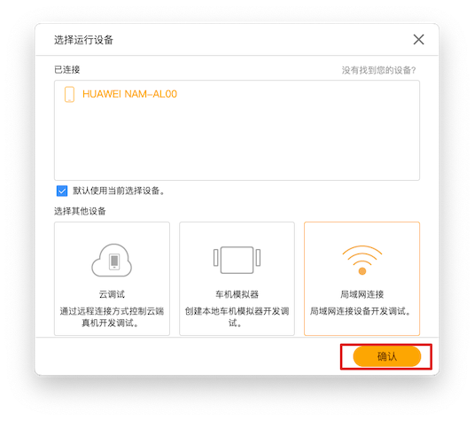

11. 我们看到 手机正常启动

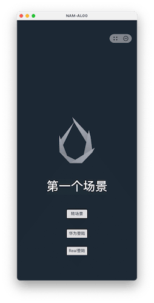

输出日志如下：

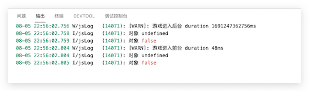

以上 就是整个游戏的构建过程。

## 注意事项

### 关于游戏报错

华为这个调试工具确实跟微信小游戏那种不一样，看起来很不方便，特别是报错信息大家看上面代码 那个全局报错监听很重要：

```typescript
qg.onError(
      (res) => {console.log("onError message = " + res.message + ", stack = " + res.stack);}
);
```

添加了这些代码，才能正常输出错误，否则很多错误，都会静默，游戏不报错，也不正常运行。

### 关于onHide onShow 方法的this

我们发现上面的输出里 this 对象为 `undefined` 但华为的 `onHide` 和 `onShow` 后面只有一个参数，并不像`Cocos Creator`一样 可以传入 this 对象，如果使用`bind` 则会产生一个新的方法。

对此我们有两种常用的解决方案：

#### 方法一 箭头函数

原来方法：

```typescript
private onShowHandler(){
    if(GameData.ins.timeStamp === 0) GameData.ins.timeStamp = cc.sys.now();
    const duration :number = cc.sys.now() - GameData.ins.timeStamp;
    GameData.ins.timeStamp = cc.sys.now();
    console.warn(`游戏进入前台 duration ${duration}ms`);
    console.log(`对象`,this);
    console.log(`对象`,this === window);
}

private onHideHandler(){
    const duration :number = cc.sys.now() - GameData.ins.timeStamp;
    GameData.ins.timeStamp = cc.sys.now();
    console.warn(`游戏进入后台 duration ${duration}ms`);
    console.log(`对象`,this);
    console.log(`对象`,this === window);
}
```

修改为：

```typescript
private onShowHandler=()=>{
    if(GameData.ins.timeStamp === 0) GameData.ins.timeStamp = cc.sys.now();
    const duration :number = cc.sys.now() - GameData.ins.timeStamp;
    GameData.ins.timeStamp = cc.sys.now();
    console.warn(`游戏进入前台 duration ${duration}ms`);
    console.log(`对象`,this);
    console.log(`对象`,this === window);
}

private onHideHandler = ()=>{
    const duration :number = cc.sys.now() - GameData.ins.timeStamp;
    GameData.ins.timeStamp = cc.sys.now();
    console.warn(`游戏进入后台 duration ${duration}ms`);
    console.log(`对象`,this);
    console.log(`对象`,this === window);
}
```

此时我们再次验证 发现已经可以正常移除 和 `this` 已经有对象

```bash
08-05 23:29:16.746 W/jsLog   (23688): [WARN]: 游戏进入后台 duration 1691249356746ms
08-05 23:29:16.746 I/jsLog   (23688): 对象 [object Object]
08-05 23:29:16.746 I/jsLog   (23688): 对象 false
08-05 23:29:23.263 W/jsLog   (23688): [WARN]: 游戏进入前台 duration 6517ms
08-05 23:29:23.263 I/jsLog   (23688): 对象 [object Object]
08-05 23:29:23.263 I/jsLog   (23688): 对象 false
08-05 23:29:30.753 I/jsLog   (23688): 取消监听
```

#### 方法提前赋值

```typescript
const {ccclass, property} = cc._decorator;
@ccclass
export default class AppGame extends cc.Component {
    private _boundOnShowHandler: Function = null;
    private _boundOnHideHandler: Function = null;

    // 如果你有构造函数，可以放在那里，如果没有，可以使用onLoad方法
    onLoad() {
        this._boundOnShowHandler = this.onShowHandler.bind(this);
        this._boundOnHideHandler = this.onHideHandler.bind(this);
    }
    start () {
        qg.onHide(this._boundOnHideHandler);
        qg.onShow(this._boundOnShowHandler);
    }

    private transToPay(touch:cc.Event.EventTouch,data:string) {
        qg.offShow(this._boundOnShowHandler);
        qg.offHide(this._boundOnHideHandler);
        console.log("取消监听")
    }
    private onShowHandler(){
        if(GameData.ins.timeStamp === 0) GameData.ins.timeStamp = cc.sys.now();
        const duration :number = cc.sys.now() - GameData.ins.timeStamp;
        GameData.ins.timeStamp = cc.sys.now();
        console.warn(`游戏进入前台 duration ${duration}ms`);
        console.log(`对象`,this);
        console.log(`对象`,this === window);
    }

    private onHideHandler(){
        const duration :number = cc.sys.now() - GameData.ins.timeStamp;
        GameData.ins.timeStamp = cc.sys.now();
        console.warn(`游戏进入后台 duration ${duration}ms`);
        console.log(`对象`,this);
        console.log(`对象`,this === window);
    }

}

```

和上面一样正常运行结果：

```bash
08-05 23:37:29.089 W/jsLog   (27058): [WARN]: 游戏进入后台 duration 1691249849089ms
08-05 23:37:29.089 I/jsLog   (27058): 对象 [object Object]
08-05 23:37:29.089 I/jsLog   (27058): 对象 false
08-05 23:37:30.880 W/jsLog   (27058): [WARN]: 游戏进入前台 duration 1790ms
08-05 23:37:30.880 I/jsLog   (27058): 对象 [object Object]
08-05 23:37:30.880 I/jsLog   (27058): 对象 false
08-05 23:37:33.002 W/jsLog   (27058): [WARN]: 游戏进入后台 duration 2111ms
08-05 23:37:33.003 I/jsLog   (27058): 对象 [object Object]
08-05 23:37:33.003 I/jsLog   (27058): 对象 false
08-05 23:37:34.343 W/jsLog   (27058): [WARN]: 游戏进入前台 duration 1353ms
08-05 23:37:34.343 I/jsLog   (27058): 对象 [object Object]
08-05 23:37:34.343 I/jsLog   (27058): 对象 false
08-05 23:37:36.130 W/jsLog   (27058): [WARN]: 游戏进入后台 duration 1787ms
08-05 23:37:36.130 I/jsLog   (27058): 对象 [object Object]
08-05 23:37:36.134 I/jsLog   (27058): 对象 false
08-05 23:37:37.110 W/jsLog   (27058): [WARN]: 游戏进入前台 duration 980ms
08-05 23:37:37.111 I/jsLog   (27058): 对象 [object Object]
08-05 23:37:37.112 I/jsLog   (27058): 对象 false
08-05 23:37:42.447 I/jsLog   (27058): 取消监听2
```

### 安全区域

我们发现华为小游戏的 `getSystemInfoSync` 方法 无法返回正确的安全区域的值。

```typescript
const res = qg.getSystemInfoSync();
console.log("on getSystemInfoSync: success =" + JSON.stringify(res,null,4));
```

打印如下：

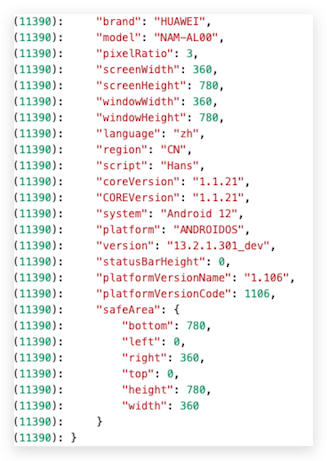

同一台手机不同的游戏

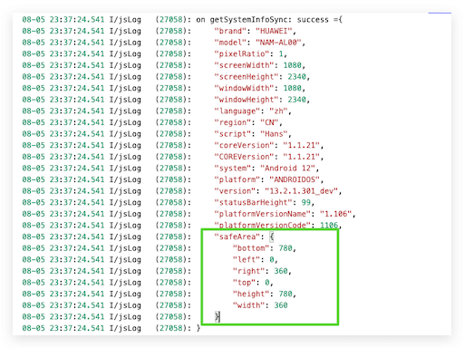

这个是华为手机 安全区域返回异常，但可以正常返回 `statusBarHeight` 的值 为`99` 

下面我再次使用另外一部小米手机测试：

其中一次

```json
{
	"brand": "Xiaomi",
	"model": "2206122SC",
	"pixelRatio": 2.625,
	"screenWidth": 411.42857142857147,
	"screenHeight": 914.2857142857143,
	"windowWidth": 411.42857142857147,
	"windowHeight": 883.4285714285715,
	"language": "zh",
	"region": "CN",
	"script": "",
	"coreVersion": "1.1.21",
	"COREVersion": "1.1.21",
	"system": "Android 13",
	"platform": "ANDROIDOS",
	"version": "13.2.1.301_dev",
	"statusBarHeight": 0,
	"platformVersionName": "1.106",
	"platformVersionCode": 1106,
	"safeArea": {
		"bottom": 914.2857142857143,
		"left": 0,
		"right": 411.42857142857147,
		"top": 30.857142857142859,
		"height": 883.4285714285715,
		"width": 411.42857142857147
	}
}
```

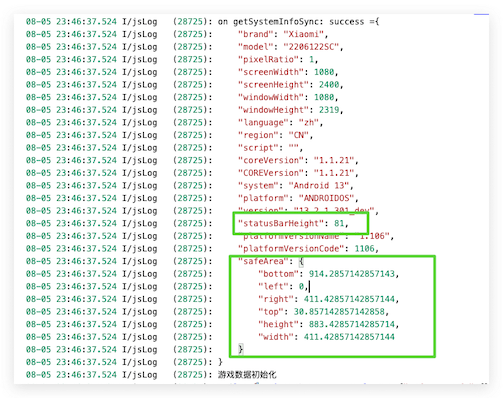

此时值又正常了，对于这个 目前还是很奇怪的，只能在 `top` 为`0` 的时候 默认给个值解决问题，这里给的 `50`