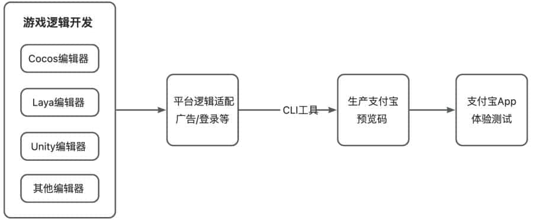
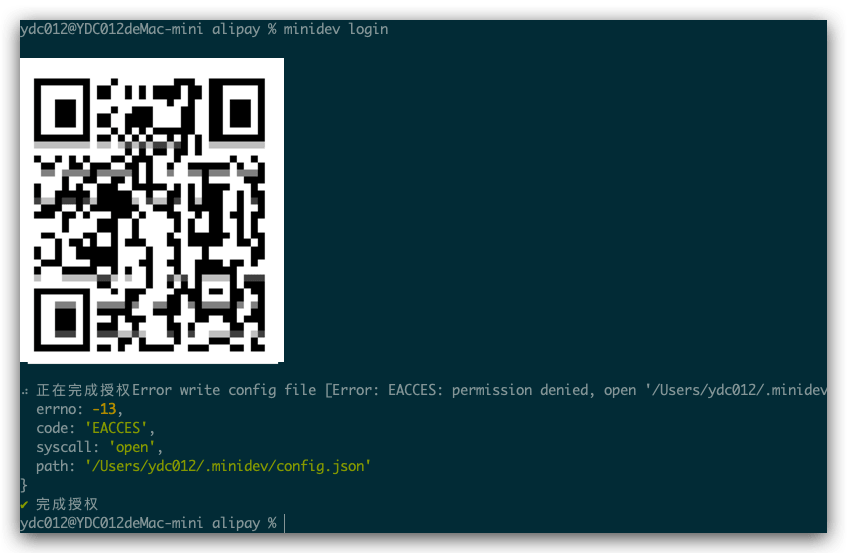
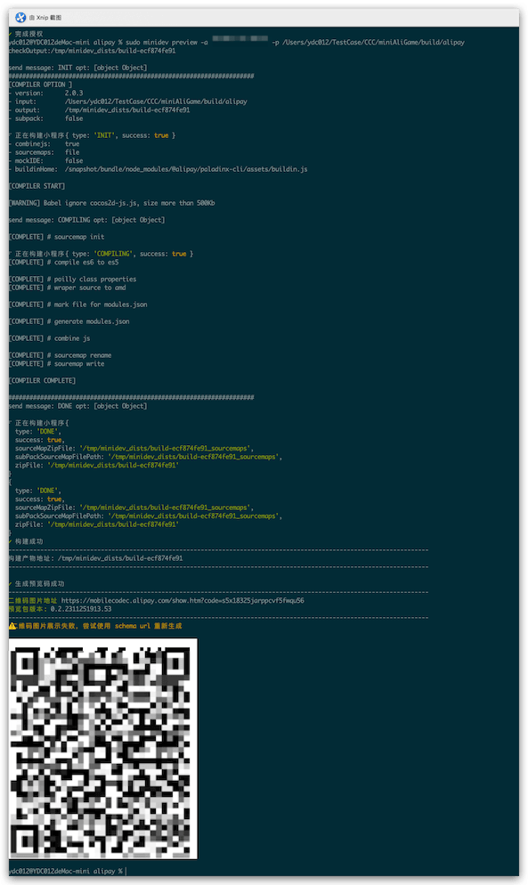
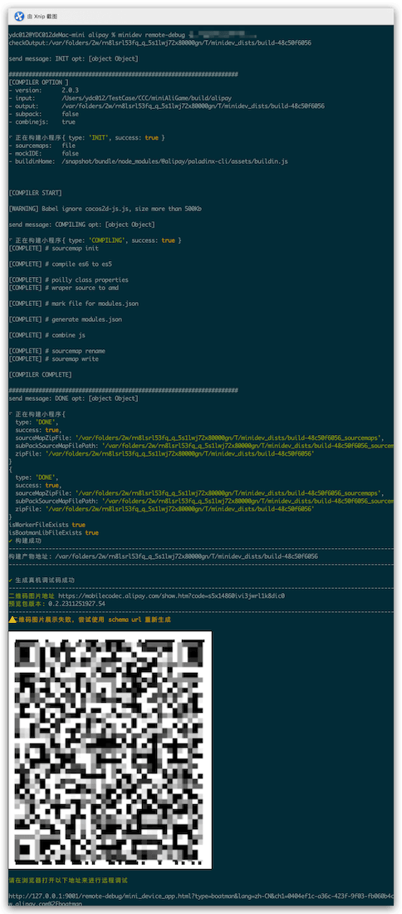

前面讲了如何构建VIVO小游戏，这次讲一下如何使用Cocos Creator2.4.x 构建出支付宝小游戏，整体来讲还算顺利，就是在Label渲染出现了一些问题，比如Label比较多的时候，界面渲染比较慢，可以考虑使用位图字体代替原来的ttf字体，基本可以满足性能要求。
<!--more-->

## 环境要求

- Cocos Creator2.4.12
- 支付宝

## 文档

Cocos Creator 构建支付游戏 文档地址：[发布到支付宝小游戏](https://docs.cocos.com/creator/2.4/manual/zh/publish/publish-alipay-mini-games.html) [点击前往](https://docs.cocos.com/creator/2.4/manual/zh/publish/publish-alipay-mini-games.html)

小游戏开发文档地址：https://open.alipay.com/

**支付宝小游戏接入文档**  [点击前往](https://www.yuque.com/zhifubaoxiaoyouxi-zromu/ts2ry9)

## 申请开发者


## 安装依赖开发工具CLI

### 小游戏的开发流程



支付宝小游戏提供了 [小游戏 CLI](https://opendocs.alipay.com/mini/02qh1f?pathHash=0b032993) 的命令行工具，来辅助开发者完成支付宝小游戏的开发工作

## 安装

```shell
npm i -g minidev
```

运行效果：

```shell
ydc012@YDC012deMac-mini alipay % npm i -g minidev
npm WARN deprecated request-promise-native@1.0.9: request-promise-native has been deprecated because it extends the now deprecated request package, see https://github.com/request/request/issues/3142
npm WARN deprecated har-validator@5.1.5: this library is no longer supported
npm WARN deprecated formidable@1.2.6: Please upgrade to latest, formidable@v2 or formidable@v3! Check these notes: https://bit.ly/2ZEqIau
npm WARN deprecated uuid@3.4.0: Please upgrade  to version 7 or higher.  Older versions may use Math.random() in certain circumstances, which is known to be problematic.  See https://v8.dev/blog/math-random for details.
npm WARN deprecated request@2.88.2: request has been deprecated, see https://github.com/request/request/issues/3142
npm WARN deprecated vm2@3.9.19: The library contains critical security issues and should not be used for production! The maintenance of the project has been discontinued. Consider migrating your code to isolated-vm.
npm WARN deprecated superagent@6.1.0: Please upgrade to v7.0.2+ of superagent.  We have fixed numerous issues with streams, form-data, attach(), filesystem errors not bubbling up (ENOENT on attach()), and all tests are now passing.  See the releases tab for more information at <https://github.com/visionmedia/superagent/releases>.

added 428 packages, and audited 429 packages in 34s

28 packages are looking for funding
  run `npm fund` for details

14 vulnerabilities (5 moderate, 3 high, 6 critical)

To address all issues (including breaking changes), run:
  npm audit fix --force

Run `npm audit` for details.
```

### 登录支付宝开发者账号

```shell
minidev login
```

1. 扫码登录开发者账号，下图是报错如图



原因是权限不足导致的 需要在授权前添加 sudo


2. 登录成功后会显示 完成授权。

3. **注意**：未执行登录或登录不成功时，开发时会出现以下报错。

   ```shell
   [Error]: 工具还未完成授权，无法调用真机预览等操作，请手动设置或通过 login 命令来完成设置。(ErrorCode: auth.NotAuthenticationConfigured)
       at n.sendAuthRequest (/Users/stevendeng/.nvm/versions/node/v16.6.0/lib/node_modules/@ali/minidev-rc/lib/index.js:2:2164145)
       at n.<anonymous> (/Users/stevendeng/.nvm/versions/node/v16.6.0/lib/node_modules/@ali/minidev-rc/lib/index.js:2:2161410)
       at Generator.next (<anonymous>)
       at a (/Users/stevendeng/.nvm/versions/node/v16.6.0/lib/node_modules/@ali/minidev-rc/lib/index.js:2:1900835)
       at processTicksAndRejections (node:internal/process/task_queues:96:5) {
     scope: 'auth',
     errorCode: 'NotAuthenticationConfigured'
   }
   ```

如果  运行 `minidev login`  出现报错 则有可能是因为本地的 node版本过低导致 ，之前电脑安装了 node 14 后面改成 16版本正常 ,具体可以参考 下面的注意事项。

### 预览

```shell
minidev preview -a ${your appId}  -p /path/to/project
```

APPID 一定是小游戏的 APPID，不然会预览失败。

| 参数                       | 是否必填 | 说明                                              |
| -------------------------- | -------- | ------------------------------------------------- |
| -a                         | 是       | 指定应用 ID。                                     |
| -p                         | 否       | 指定工程路径。当前在`game.js`同级目录时，可缺省。 |
| --ignore-http-domain-check | 否       | 忽略网络域名权限校验。                            |

示例代码

```shell
#进入你的项目目录
cd /path/to/your/project
minidev preview -a 2021xxx --ignore-http-domain-check
```




## 真机调试

```
minidev remote-debug -a ${your appId}  -p /path/to/project
```

| 参数                       | 是否必填 | 说明                                              |
| -------------------------- | -------- | ------------------------------------------------- |
| -a                         | 是       | 指定应用 ID。                                     |
| -p                         | 否       | 指定工程路径。当前在`game.js`同级目录时，可缺省。 |
| --ignore-http-domain-check | 否       | 忽略域名权限校验。                                |

```shell
# 假设你已位于项目源码目录：
minidev remote-debug -a 2021xxx --ignore-http-domain-check
```




## 上传

```shell
minidev upload -a ${your appId} -p /path/to/project --game
```

| 参数   | 是否必填 | 说明                                              |
| ------ | -------- | ------------------------------------------------- |
| -a     | 是       | 指定应用 ID。                                     |
| --game | 是       | 指定应用类型为 GAME。                             |
| -p     | 否       | 指定工程路径。当前在`game.js`同级目录时，可缺省。 |
| -v     | 否       | 指定版本。                                        |

**注意：**

当前小游戏的上传的包大小的限制是 20 M，如果超过 20 M 的包大小限制，需要将部分的游戏资源放置在服务端来进行处理，来减小首包大小。

上传完成之后，就可以去 [支付宝开放平台](https://open.alipay.com/) 去处理 **审核**、**灰度**、**上架** 相关的事情，详情请参考：小游戏发布。

## 注意事项

### 权限报错

在执行 ` minidev login` 的时候 报错：

```shell
⠴ 正在完成授权Error write config file [Error: EACCES: permission denied, open '/Users/ydc012/.minidev/config.json'] {
  errno: -13,
  code: 'EACCES',
  syscall: 'open',
  path: '/Users/ydc012/.minidev/config.json'
}
✔ 完成授权
```

### node版本过低导致无法授权

在Mac电脑上使用 nvm  当切换了 node 版本的时候 

```shell
Now using node v16.20.2 (npm v8.19.4)
ydc012@YDC012deMac-mini Desktop % nvm list
       v14.21.3
->     v16.20.2
       v18.18.2
default -> 14.21.3 (-> v14.21.3)
iojs -> N/A (default)
unstable -> N/A (default)
node -> stable (-> v18.18.2) (default)
stable -> 18.18 (-> v18.18.2) (default)
lts/* -> lts/iron (-> N/A)
lts/argon -> v4.9.1 (-> N/A)
lts/boron -> v6.17.1 (-> N/A)
lts/carbon -> v8.17.0 (-> N/A)
lts/dubnium -> v10.24.1 (-> N/A)
lts/erbium -> v12.22.12 (-> N/A)
lts/fermium -> v14.21.3
lts/gallium -> v16.20.2
lts/hydrogen -> v18.18.2
lts/iron -> v20.10.0 (-> N/A)
ydc012@YDC012deMac-mini Desktop % nvm ls
       v14.21.3
->     v16.20.2
       v18.18.2
default -> 14.21.3 (-> v14.21.3)
iojs -> N/A (default)
unstable -> N/A (default)
node -> stable (-> v18.18.2) (default)
stable -> 18.18 (-> v18.18.2) (default)
lts/* -> lts/iron (-> N/A)
lts/argon -> v4.9.1 (-> N/A)
lts/boron -> v6.17.1 (-> N/A)
lts/carbon -> v8.17.0 (-> N/A)
lts/dubnium -> v10.24.1 (-> N/A)
lts/erbium -> v12.22.12 (-> N/A)
```

当重新打开终端工具 又变回了

```shell
Last login: Sat Nov 25 17:28:01 on ttys000
ydc012@YDC012deMac-mini Desktop % nvm list
->     v14.21.3
       v16.20.2
       v18.18.2
default -> 14.21.3 (-> v14.21.3)
iojs -> N/A (default)
unstable -> N/A (default)
node -> stable (-> v18.18.2) (default)
stable -> 18.18 (-> v18.18.2) (default)
lts/* -> lts/iron (-> N/A)
lts/argon -> v4.9.1 (-> N/A)
lts/boron -> v6.17.1 (-> N/A)
lts/carbon -> v8.17.0 (-> N/A)
lts/dubnium -> v10.24.1 (-> N/A)
lts/erbium -> v12.22.12 (-> N/A)
lts/fermium -> v14.21.3
lts/gallium -> v16.20.2
lts/hydrogen -> v18.18.2
lts/iron -> v20.10.0 (-> N/A)
ydc012@YDC012deMac-mini Desktop %
```

解决方式：**设置默认 Node.js 版本**:

- 一旦您切换到期望的 Node.js 版本，可以使用命令 `nvm alias default <version>` 来设置默认版本。
- 例如，要将默认版本设置为 v16.20.2，运行 `nvm alias default 16.20.2`。

重启终端后，运行 `nvm list` 确认当前 Node.js 版本 发现已经正常切换：

```shell
Last login: Sat Nov 25 17:34:28 on ttys001
ydc012@YDC012deMac-mini Desktop % nvm list
       v14.21.3
->     v16.20.2
       v18.18.2
default -> 16.20.2 (-> v16.20.2)
iojs -> N/A (default)
unstable -> N/A (default)
node -> stable (-> v18.18.2) (default)
stable -> 18.18 (-> v18.18.2) (default)
lts/* -> lts/iron (-> N/A)
lts/argon -> v4.9.1 (-> N/A)
lts/boron -> v6.17.1 (-> N/A)
lts/carbon -> v8.17.0 (-> N/A)
lts/dubnium -> v10.24.1 (-> N/A)
lts/erbium -> v12.22.12 (-> N/A)
lts/fermium -> v14.21.3
lts/gallium -> v16.20.2
lts/hydrogen -> v18.18.2
lts/iron -> v20.10.0 (-> N/A)
```

## 总结

总的来说，小游戏目前分成了几大阵营，比如微信、抖音、QQ小游戏很相似，华为、OPPO、VIVO很相似，支付宝属于新加入的平台，目前还在努力追赶。相比于其他比较小众的百度、B站、快手，来说，目前大家都在努力分小游戏这块蛋糕。作为研发方，自然是平台越多，流量就越多，机会就越多。