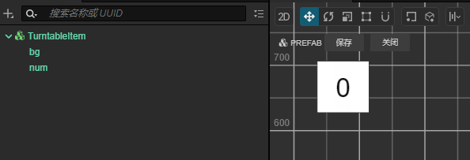

最近遇到一个面试题，是个抽奖的玩法，于是就用`CocosCreator2.4.11`和`CocosCreator3.7.2`分别实现了一下。虽然整个看起来没有什么难度，但还是有些细节值得玩味的，干脆就记录一下，后面可以嵌入到游戏的运营活动里面去。
<!--more-->

## 考题分析

### 题目要求

> 用`Cocoscreator` 实现一个简单的转盘抽奖页面。如下图：
>
> 
>
>  
>
>  要求。转盘启动后 每个数字依次顺时针被点亮为红色， 速度从每秒点亮20个数字（设定最高频率为20个/秒），持续1-3秒，逐步（中间频率自定义，每个频率的持续时间都是1-3秒之间，总频率数不得少于5个频率）降低到每秒点亮2个数字，并等待2秒后，落到最终设定的停止的位置的数字上，并显示为绿色。 转盘停止转动时 所有格子内的数字都要同时变成100。
>
> 每次启动转盘都从数字1开始，。
>
> 要求：
>
> `Cocoscreator` 任意版本均可，
>
> 交付最终的所有工程项目文件。

### 完成效果

看看最后的效果吧！

2.4.11版本


3.7.2版本


## 步骤

要使用`CocosCreator`实现一个简单的转盘抽奖页面，你需要遵循以下步骤：

1. 创建项目： 首先，使用`CocosCreator`创建一个新的项目。在编辑器中，使用Canvas节点，用作转盘的容器。

2. 设计转盘： 将转盘的背景图片和数字图片添加到Turntable节点下。创建一个名为“`TurntableItem`”的Prefab，包含一个数字精灵和一个文本标签。将这个Prefab放在Turntable节点下，并为每个数字分配一个唯一的位置。确保所有数字都是顺时针排列的。

   

3. 编写脚本： 在项目中创建一个名为“`TurntableController`”的脚本，并将其添加到Turntable节点。在脚本中，首先定义一些变量和常量来控制转盘的行为。例如，最大频率、最小频率、频率持续时间等。然后，在`start`方法中，初始化转盘的状态。

4. 控制转盘： 编写一个名为`startTurntable`的方法来启动转盘。该方法首先将所有数字设置为初始状态。然后，使用`schedule`函数来控制转盘的速度。根据要求，需要在1-3秒内从最大频率逐渐降低到最小频率。使用`Math.floor(Math.random() * (max - min + 1)) + min`计算随机持续时间。在每个频率持续时间内，将数字按顺时针顺序点亮为红色。

5. 停止转盘： 当达到最小频率时，等待2秒后，停止转盘并落到最终设定的停止位置的数字上。使用`unschedule`函数来取消计划任务。将最终停止位置的数字显示为绿色，并将所有其他数字设置为100。

6. 重置转盘： 为了确保每次启动转盘都从数字1开始，需要在`startTurntable`方法开始时重置所有数字。

这个示例脚本可作为实现这个功能的参考。您可能需要根据实际项目需求对其进行修改和优化。同时，确保已经在项目中导入了必要的资源，如数字精灵和背景图片等。

### 核心算法

`TurntableController.ts`这里只贴出`2.4`版本，`3.7` 版本最后看源码地址

```typescript
const {ccclass, property} = cc._decorator;

const GRID_SIZE: number = 80; // 转盘格子尺寸
const TURNTABLE_SIZE: number = 5; // 横向纵向格子数
@ccclass
export class TurntableController extends cc.Component {

    @property({type: cc.Prefab})
    public itemPrefab: cc.Prefab = null; // 转盘格子预制体

    @property(cc.EditBox)
    public inputField: cc.EditBox = null;
    @property(cc.Button)
    public button: cc.Button = null;


    private itemList: cc.Node[] = []; // 转盘格子节点列表
    private currentNumberIndex: number = 0; // 当前点亮的数字索引
    private targetNumberIndex: number = 0; // 转盘停止时的目标数字索引
    private remainNumberIndex: number = 0; // 倒计时个数
    private frequencyLevels: number[] = [20, 16, 12, 8, 4, 2]; // 转盘转动的频率等级
    private currentFrequencyLevel: number = 0; // 当前频率等级
    private currentBg: cc.Node = null;// 前一个显示对象

    protected start() {
        this.initTurntable(); // 初始化转盘
    }

    private initTurntable() {
        const array = this.generateArrayWithZeros(TURNTABLE_SIZE); // 生成数组
        const offsetX = (GRID_SIZE * TURNTABLE_SIZE - GRID_SIZE) / 2; // 计算x轴偏移量
        const offsetY = (GRID_SIZE * TURNTABLE_SIZE - GRID_SIZE) / 2 + 200; // 计算y轴偏移量
        for (let i = 0; i < TURNTABLE_SIZE * TURNTABLE_SIZE; i++) {
            const itemNode = cc.instantiate(this.itemPrefab); // 实例化预制体
            // 设置节点位置
            itemNode.position = cc.v3(
                GRID_SIZE * (i % TURNTABLE_SIZE) - offsetX,
                offsetY - GRID_SIZE * Math.floor(i / TURNTABLE_SIZE),
                0
            );
            this.node.addChild(itemNode); // 添加节点
            if (array[i]) {
                itemNode.getChildByName("num").getComponent(cc.Label).string = array[i] + "";
                itemNode.name = array[i] + "";
                this.itemList.push(itemNode);
            } else {
                itemNode.getChildByName("num").getComponent(cc.Label).string = "";
            }
        }
        // 对 itemList 按数字排序
        this.itemList.sort((a, b) => {
            return parseInt(a.name) - parseInt(b.name);
        });
    }

    // 开始转动转盘
    private startTurntable() {
        this.button.interactable = false;
        this.resetNumbers(); // 重置数字显示
        this.currentNumberIndex = 0; // 初始化当前数字索引
        this.currentFrequencyLevel = 0; // 初始化当前频率等级
        this.remainNumberIndex = 0; // 倒计时个数
        const inputNumber: number = parseInt(this.inputField.string);
        this.targetNumberIndex = Number.isNaN(inputNumber) ? this.calculateTargetNumberIndex() : inputNumber - 1; // 计算目标数字索引
        this.remainNumberIndex = this.targetNumberIndex;
        if (Number.isNaN(inputNumber)) console.log("没有输入数字本次随机:", inputNumber);
        console.log("幸运数字:", this.targetNumberIndex + 1);
        // 定时更新转盘
        this.schedule(this.updateTurntable, 1 / this.frequencyLevels[this.currentFrequencyLevel]);
    }

    // 重置数字显示
    private resetNumbers() {
        this.currentBg = null;
        this.itemList.forEach((value, index) => {
            const bg = value.getChildByName("bg");
            bg.color = cc.Color.WHITE;
            // 设置数字节点的文本为对应的数字
            value.getChildByName("num").getComponent(cc.Label).string = value.name;
        });
    }

    // 更新转盘状态
    private updateTurntable() {
        // 重置上一个数字颜色
        if (this.currentBg) this.currentBg.color = cc.Color.WHITE;
        // 点亮当前数字
        this.highlightNumber(this.currentNumberIndex, cc.Color.RED);
        this.currentNumberIndex++;
        if (this.currentNumberIndex >= this.itemList.length) {
            this.currentNumberIndex = 0;
            this.currentFrequencyLevel++;
            if (this.currentFrequencyLevel >= this.frequencyLevels.length - 1) {
                this.unschedule(this.updateTurntable); // 取消定时更新转盘
                // const interval = 2 / this.targetNumberIndex;
                this.schedule(this.lastTurntable, 1 / this.frequencyLevels[this.currentFrequencyLevel], this.remainNumberIndex); // 降低到每秒点亮2个数字
            } else {
                this.unschedule(this.updateTurntable); // 取消定时更新转盘
                this.schedule(this.updateTurntable, 1 / this.frequencyLevels[this.currentFrequencyLevel]);
            }
        }
    }

    private lastTurntable() {
        // 重置上一个数字颜色
        if (this.currentBg) this.currentBg.color = cc.Color.WHITE;
        // 点亮当前数字
        this.highlightNumber(this.currentNumberIndex, cc.Color.RED);
        this.remainNumberIndex--;
        console.log("转盘:", this.remainNumberIndex);
        this.currentNumberIndex++;
        if (this.remainNumberIndex < 0) {
            console.log("转盘结束:", this.remainNumberIndex);
            this.scheduleOnce(() => {
                this.stopTurntable();
            }, 2);
        }
    }

// 停止转盘
    private stopTurntable() {
        this.highlightNumber(this.targetNumberIndex, cc.Color.GREEN); // 点亮目标数字
        this.setAllNumbersTo100(); // 将所有数字设置为100
        this.button.interactable = true;
    }

// 点亮指定数字
    private highlightNumber(index: number, color: cc.Color) {
        const numberNode = this.itemList[index];
        if (numberNode) {
            const bg = numberNode.getChildByName("bg");
            bg.color = color;
            this.currentBg = bg;
        }
    }

// 计算目标数字索引
    private calculateTargetNumberIndex(): number {
        // 计算转盘最终停止位置的数字索引
        // 用您想要的逻辑替换此处
        return Math.floor(Math.random() * this.itemList.length);
    }

    private setAllNumbersTo100() {
        for (const numberNode of this.itemList) {
            // 设置数字节点的文本为100
            numberNode.getChildByName("num").getComponent(cc.Label).string = "100";
        }
    }

    // 生成带有0的数组
    private generateArrayWithZeros(size: number): number[] {
        const array = new Array(size * size).fill(0);

        let currentNum = 1;

        const fillLayer = (layer: number) => {
            const maxIndex = size - layer - 1;

            // 顶部行
            for (let x = layer; x <= maxIndex; x++) {
                array[layer * size + x] = currentNum++;
            }
            // 右侧列
            for (let y = layer + 1; y <= maxIndex; y++) {
                array[y * size + maxIndex] = currentNum++;
            }
            // 底部行
            for (let x = maxIndex - 1; x >= layer; x--) {
                array[maxIndex * size + x] = currentNum++;
            }
            // 左侧列
            for (let y = maxIndex - 1; y > layer; y--) {
                array[y * size + layer] = currentNum++;
            }
        };

        for (let layer = 0; layer < 1; layer++) {
            fillLayer(layer);
        }

        return array;
    }
}

```

其中值得一提的是这个 生成0 的数组，这里面用了一个算法，便于拓展，比如 4X4 或者6X6 这样的

当然如果仅考虑这个题目，想省事可以直接这么写：

```typescript
 generateArray(): number[] {
    const result = [
        1, 2, 3, 4, 5,
        16, 0, 0, 0, 6,
        15, 0, 0, 0, 7,
        14, 0, 0, 0, 8,
        13, 12, 11, 10, 9
    ];
    return result;
}

const generatedArray = generateArray();
console.log(generatedArray);

```

### 文本输入限制

有一个细节这边也做了一个限制，就是文本的输入，限制`EditBox`输入内容的组件，希望用户只能输入1-16之间的整数，组件实现：

您可以通过创建一个新的`TypeScript`组件并为其添加一个事件监听器来实现这一功能。以下是一个简单示例，展示了如何在`CocosCreator`中使用`TypeScript`限制`EditBox`输入内容：

1. 首先，在您的项目中创建一个新的`TypeScript`脚本，并将其命名为`InputRestrictor.ts`。
2. 打开刚刚创建的`InputRestrictor.ts`文件，并替换其内容为以下代码：

```typescript

const { ccclass, property } = cc._decorator;

@ccclass
export class InputRestrictor extends cc.Component {
    @property(cc.EditBox)
    public inputField: cc.EditBox = null;

    start() {
        this.inputField.string = "";
        this.inputField.node.on("text-changed", this.onTextChanged, this);
    }
    private onTextChanged(editbox: cc.EditBox) {
        let num = parseInt(editbox.string);
        if (isNaN(num) || num < 1 || num > 16) {
            editbox.string = ""; // 清除输入
        } else {
            editbox.string = num.toString(); // 保留有效输入
        }
    }
}

```

最后 源码地址   2.4.11 [点击前往](https://github.com/jsroads/mylibs/tree/main/TurntableDemo/Turntable24)    3.7.2 [点击前往](https://github.com/jsroads/mylibs/tree/main/TurntableDemo/Turntable)

## 总结

总的来说这个功能包含了对按钮组件，输入文本组件，定时器，循环，以及布局和随机的考察。算是一个比较经典的一个玩法测试。

