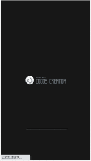
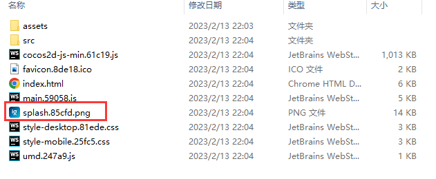
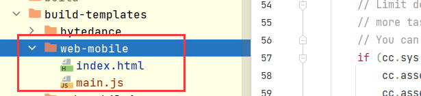
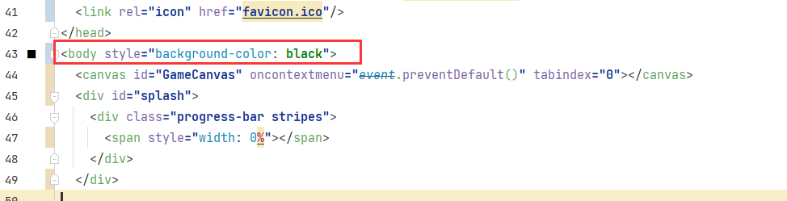
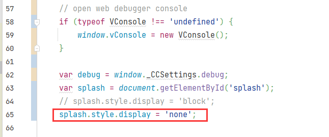
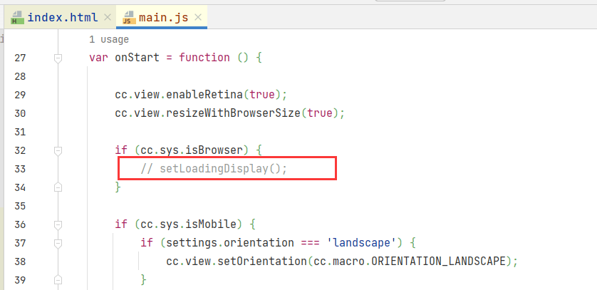
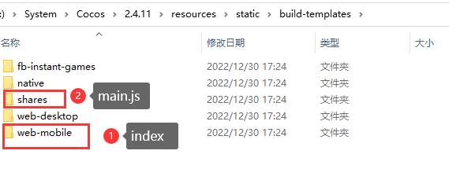

`Cocos`官方文档里有介绍如何自定义构建模板，当游戏发布为`web`版本的时候，启动的时候经常会有一个官方`logo`的启动页，那么我们如何更换或者关闭呢？下面就说一下操作的具体步骤，日后如果用到，直接查看即可。
<!--more-->

## 环境

- Cocos Creator 2.4.11
- Windows 10
- Chrome

## 具体实现

话不多讲，先看效果

原来默认效果




替换效果


去除效果


## 替换加载页

这个相对来说比较容易，就是使用官方构建模板，使用自己的logo即可



关于替换，官网已经说的比较详细，这里就不多展开介绍

## 去除加载页

首先`web-mobile`发布网页端为例，我们构建一次项目 后找到

1. 在项目目录下创建`build-templates/web-mobile`

2. 构建一次项目，并复制发布目录`build\web-mobile`下`main.js和index.html`到这个文件夹



3. 修改`index.html` 设置背景色为黑色 `style="background-color: black"`或者 `style="background-color:#000000;"`



4. 设置`splash`的`style`的`display` 属性为`none` 不显示

   

5. 修改 `main.js` 不再调用 `setLoadingDisplay()；`



6. 重新构建`web-mobile` 然后查看发现，加载页已经不再显示了


### 拓展

如果要全局修改

修改引擎下**static/build-templates** 的**`main.js`**和**`index.html`**

地址是 



下面给出我修改后的`index.html` 和`main.js`

```html
<!DOCTYPE html>
<html>
<head>
  <meta charset="utf-8">

  <title>Cocos Creator | wangengdaluandou</title>

  <!--http://www.html5rocks.com/en/mobile/mobifying/-->
  <meta name="viewport"
        content="width=device-width,user-scalable=no,initial-scale=1, minimum-scale=1,maximum-scale=1"/>

  <!--https://developer.apple.com/library/safari/documentation/AppleApplications/Reference/SafariHTMLRef/Articles/MetaTags.html-->
  <meta name="apple-mobile-web-app-capable" content="yes">
  <meta name="apple-mobile-web-app-status-bar-style" content="black-translucent">
  <meta name="format-detection" content="telephone=no">

  <!-- force webkit on 360 -->
  <meta name="renderer" content="webkit"/>
  <meta name="force-rendering" content="webkit"/>
  <!-- force edge on IE -->
  <meta http-equiv="X-UA-Compatible" content="IE=edge,chrome=1"/>
  <meta name="msapplication-tap-highlight" content="no">

  <!-- force full screen on some browser -->
  <meta name="full-screen" content="yes"/>
  <meta name="x5-fullscreen" content="true"/>
  <meta name="360-fullscreen" content="true"/>
  
  <!-- force screen orientation on some browser -->
  <meta name="screen-orientation" content="portrait"/>
  <meta name="x5-orientation" content="portrait">

  <!--fix fireball/issues/3568 -->
  <!--<meta name="browsermode" content="application">-->
  <meta name="x5-page-mode" content="app">

  <!--<link rel="apple-touch-icon" href=".png" />-->
  <!--<link rel="apple-touch-icon-precomposed" href=".png" />-->

  <link rel="stylesheet" type="text/css" href="style-mobile.css"/>
  <link rel="icon" href="favicon.ico"/>
</head>
<body style="background-color: black">
  <canvas id="GameCanvas" oncontextmenu="event.preventDefault()" tabindex="0"></canvas>
  <div id="splash">
    <div class="progress-bar stripes">
      <span style="width: 0%"></span>
    </div>
  </div>

<script src="src/settings.js" charset="utf-8"></script>

<script src="main.js" charset="utf-8"></script>

<script type="text/javascript">
(function () {
    // open web debugger console
    if (typeof VConsole !== 'undefined') {
        window.vConsole = new VConsole();
    }

    var debug = window._CCSettings.debug;
    var splash = document.getElementById('splash');
    // splash.style.display = 'block';
    splash.style.display = 'none';

    function loadScript (moduleName, cb) {
      function scriptLoaded () {
          document.body.removeChild(domScript);
          domScript.removeEventListener('load', scriptLoaded, false);
          cb && cb();
      };
      var domScript = document.createElement('script');
      domScript.async = true;
      domScript.src = moduleName;
      domScript.addEventListener('load', scriptLoaded, false);
      document.body.appendChild(domScript);
    }

    loadScript(debug ? 'cocos2d-js.js' : 'cocos2d-js-min.js', function () {
      if (CC_PHYSICS_BUILTIN || CC_PHYSICS_CANNON) {
        loadScript(debug ? 'physics.js' : 'physics-min.js', window.boot);
      }
      else {
        window.boot();
      }
    });
})();
</script>
</body>
</html>

```

```javascript
window.boot = function () {
    var settings = window._CCSettings;
    window._CCSettings = undefined;
    var onProgress = null;
    
    var RESOURCES = cc.AssetManager.BuiltinBundleName.RESOURCES;
    var INTERNAL = cc.AssetManager.BuiltinBundleName.INTERNAL;
    var MAIN = cc.AssetManager.BuiltinBundleName.MAIN;
    function setLoadingDisplay () {
        // Loading splash scene
        var splash = document.getElementById('splash');
        var progressBar = splash.querySelector('.progress-bar span');
        onProgress = function (finish, total) {
            var percent = 100 * finish / total;
            if (progressBar) {
                progressBar.style.width = percent.toFixed(2) + '%';
            }
        };
        splash.style.display = 'block';
        progressBar.style.width = '0%';

        cc.director.once(cc.Director.EVENT_AFTER_SCENE_LAUNCH, function () {
            splash.style.display = 'none';
        });
    }

    var onStart = function () {

        cc.view.enableRetina(true);
        cc.view.resizeWithBrowserSize(true);

        if (cc.sys.isBrowser) {
            // setLoadingDisplay();
        }

        if (cc.sys.isMobile) {
            if (settings.orientation === 'landscape') {
                cc.view.setOrientation(cc.macro.ORIENTATION_LANDSCAPE);
            }
            else if (settings.orientation === 'portrait') {
                cc.view.setOrientation(cc.macro.ORIENTATION_PORTRAIT);
            }
            cc.view.enableAutoFullScreen([
                cc.sys.BROWSER_TYPE_BAIDU,
                cc.sys.BROWSER_TYPE_BAIDU_APP,
                cc.sys.BROWSER_TYPE_WECHAT,
                cc.sys.BROWSER_TYPE_MOBILE_QQ,
                cc.sys.BROWSER_TYPE_MIUI,
                cc.sys.BROWSER_TYPE_HUAWEI,
                cc.sys.BROWSER_TYPE_UC,
            ].indexOf(cc.sys.browserType) < 0);
        }

        // Limit downloading max concurrent task to 2,
        // more tasks simultaneously may cause performance draw back on some android system / browsers.
        // You can adjust the number based on your own test result, you have to set it before any loading process to take effect.
        if (cc.sys.isBrowser && cc.sys.os === cc.sys.OS_ANDROID) {
            cc.assetManager.downloader.maxConcurrency = 2;
            cc.assetManager.downloader.maxRequestsPerFrame = 2;
        }

        var launchScene = settings.launchScene;
        var bundle = cc.assetManager.bundles.find(function (b) {
            return b.getSceneInfo(launchScene);
        });
        
        bundle.loadScene(launchScene, null, onProgress,
            function (err, scene) {
                if (!err) {
                    cc.director.runSceneImmediate(scene);
                    if (cc.sys.isBrowser) {
                        // show canvas
                        var canvas = document.getElementById('GameCanvas');
                        canvas.style.visibility = '';
                        var div = document.getElementById('GameDiv');
                        if (div) {
                            div.style.backgroundImage = '';
                        }
                        console.log('Success to load scene: ' + launchScene);
                    }
                }
            }
        );

    };

    var option = {
        id: 'GameCanvas',
        debugMode: settings.debug ? cc.debug.DebugMode.INFO : cc.debug.DebugMode.ERROR,
        showFPS: settings.debug,
        frameRate: 60,
        groupList: settings.groupList,
        collisionMatrix: settings.collisionMatrix,
    };

    cc.assetManager.init({ 
        bundleVers: settings.bundleVers,
        remoteBundles: settings.remoteBundles,
        server: settings.server
    });
    
    var bundleRoot = [INTERNAL];
    settings.hasResourcesBundle && bundleRoot.push(RESOURCES);

    var count = 0;
    function cb (err) {
        if (err) return console.error(err.message, err.stack);
        count++;
        if (count === bundleRoot.length + 1) {
            cc.assetManager.loadBundle(MAIN, function (err) {
                if (!err) cc.game.run(option, onStart);
            });
        }
    }

    cc.assetManager.loadScript(settings.jsList.map(function (x) { return 'src/' + x;}), cb);

    for (var i = 0; i < bundleRoot.length; i++) {
        cc.assetManager.loadBundle(bundleRoot[i], cb);
    }
};

if (window.jsb) {
    var isRuntime = (typeof loadRuntime === 'function');
    if (isRuntime) {
        require('src/settings.f7150.js');
        require('src/cocos2d-runtime.js');
        if (CC_PHYSICS_BUILTIN || CC_PHYSICS_CANNON) {
            require('src/physics.js');
        }
        require('jsb-adapter/engine/index.js');
    }
    else {
        require('src/settings.f7150.js');
        require('src/cocos2d-jsb.js');
        if (CC_PHYSICS_BUILTIN || CC_PHYSICS_CANNON) {
            require('src/physics.js');
        }
        require('jsb-adapter/jsb-engine.js');
    }

    cc.macro.CLEANUP_IMAGE_CACHE = true;
    window.boot();
}
```

## 总结

这里主要是运用了构建模板和少量的`Html`知识结合，解决了用户自定义加载页或去除官方`loading`页