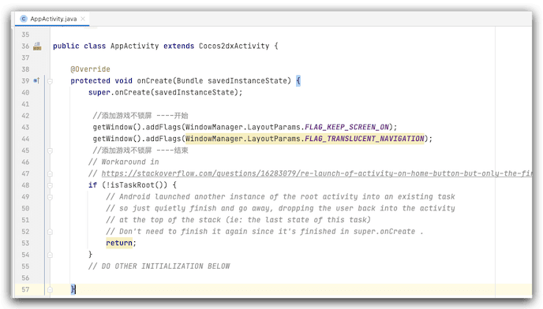

之前做小游戏的时候，环境是微信环境，没有注意这些，最近做原生游戏的时候，测试反馈，玩游戏如果不交互的情况下，手机在开着游戏的情况下活熄灭屏幕，这样的用户体验十分不友好，故而查询一下有没有解决办法，后来网上搜索了一下前辈们已经做了，于是我这里做一个简单的搬运。
<!--more-->
原生分为android和iOS，下面就一一说方法：

### Android

1. 首先找到 构建后的目录 项目名字

   路径：`/build/jsb-link/frameworks/runtime-src/proj.android-studio/app/AndroidManifest.xml`下的 `AndroidManifest.xml`文件，添加一个权限。

   ```xml
   <uses-permission android:name="android.permission.WAKE_LOCK" />
   ```

2. 找到入口文件 

   路径 `项目名字/build/jsb-link/frameworks/runtime-src/proj.android-studio/app/src/com/muyou/jjkp/AppActivity.java`

   

3. 找到 onCreate 方法 添加代码：

```java
//添加游戏不锁屏 ----开始
getWindow().addFlags(WindowManager.LayoutParams.FLAG_KEEP_SCREEN_ON);//常亮
getWindow().addFlags(WindowManager.LayoutParams.FLAG_TRANSLUCENT_NAVIGATION);//透明状态栏
//添加游戏不锁屏 ----结束
```

至此 安卓搞定

### iOS端

找到我们构建后项目下的 `AppController.mm` 文件

路径：`项目名字/build/jsb-link/frameworks/runtime-src/proj.ios_mac/ios/AppController.mm`


找到 `didFinishLaunchingWithOptions` 方法 在  `[[UIApplication sharedApplication] setStatusBarHidden:**YES**];` 后添加代码：

```objective-c
 //手机常亮 不休眠 --开始
    [[UIApplication sharedApplication] setIdleTimerDisabled:YES];
 //手机常亮 不休眠 --结束
```

至此 iOS端搞定

### 参考

- [android 屏幕保持唤醒](https://www.cnblogs.com/king_dy/archive/2010/11/11/1888134.html)
- [cocos 手机端 屏幕常亮](https://blog.csdn.net/parv2/article/details/105496750)