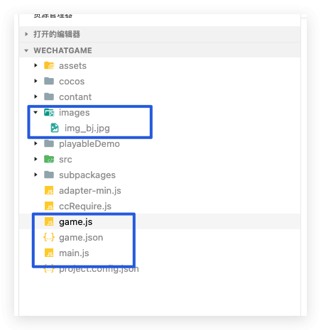
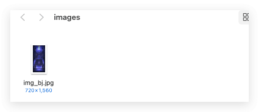

之前说过如何快速启动小游戏的首屏速度，最佳实践的普遍思路在于**不依赖游戏引擎用 WebGL 来绘制一张最简单的静态图**，不依赖游戏引擎是基于首包尽可能小的出发点，仅仅绘制一张静态图是因为如果做比较复杂一点的交互需要一个相对完善一点的渲染引擎，代码包体积又会变大。今天特意说一下如何使用微信小游戏官方文档的一片[封面插件](https://mp.weixin.qq.com/wxopen/pluginbasicprofile?action=intro&appid=wxbd990766293b9dc4&token=&lang=zh_CN)的使用方法。在制作游戏的时候多一种思考，多一种技术选择方案。
<!--more-->
首先简单的介绍一下插件优势：

1. 内置渲染引擎：官方维护，封面图阶段可以做到相对丰富的交互而无需游戏额外下载渲染引擎（基础库静默更新）；
2. 插件优势：不占游戏代码包体积，使用的游戏越多，玩家本地命中插件的概率越大；
3. 大DAU游戏验证：插件已邀请百万DAU级别游戏内测接入，可放心接入；

## 环境

- Mac
- 微信小游戏
- Cocos Creator 2.4.11

## 优化目的

**主要是对首包代码进行拆分，减小启动阶段下载量**

## 官网文档参考

地址 [封面图插件](https://developers.weixin.qq.com/minigame/dev/guide/performance/perf-action-start-loading-plugin.html)

封面插件文档：[minigameloading](https://mp.weixin.qq.com/wxopen/pluginbasicprofile?action=intro&appid=wxbd990766293b9dc4&token=&lang=zh_CN)

`Cocos creator` 插件例子 [21点游戏](https://github.com/zhangjunkunn/cocos-blackjack)

主要更改文件：三个修改（`game.json`、`game.js` 和 `main.js`） 一个新增 (`images/img_bj.jpg`)



## 主要步骤

1. 在构建后的 `wechatgame` 目录 下新建一个 `images` 文件夹 里面放置一个 图片一般来说 都是`jpg` 格式（相对`png`格式来说`jpg` 小了很多）



2. 在构建后的`game.js`的基础上修改文件，代码比较简单，这里直接给出源码

```javascript
"use strict";

require('adapter-min.js');

__globalAdapter.init();


// 判断版本号
function compareVersion(v1, v2) {
  v1 = v1.split(".");
  v2 = v2.split(".");
  var len = Math.max(v1.length, v2.length);
  while (v1.length < len) {
      v1.push("0");
  }
  while (v2.length < len) {
      v2.push("0");
  }
  for (var i = 0; i < len; i++) {
      var num1 = parseInt(v1[i]);
      var num2 = parseInt(v2[i]);
      if (num1 > num2) {
          return 1;
      }
      if (num1 < num2) {
          return -1;
      }
  }
  return 0;
}
// 注入引擎，加载游戏
var loaded = false;

function loadGame() {
    var _setting$subpackages;
    if (loaded) {
        return;
    }
    requirePlugin('cocos');

    __globalAdapter.adaptEngine();
    
    require('./ccRequire');
    
    require('./src/settings'); // Introduce Cocos Service here
    
    
    require('./main'); // TODO: move to common
    // Adjust devicePixelRatio
    
    
    cc.view._maxPixelRatio = 4;
    
    if (cc.sys.platform !== cc.sys.WECHAT_GAME_SUB) {
      // Release Image objects after uploaded gl texture
      cc.macro.CLEANUP_IMAGE_CACHE = true;
    }
    window.boot();
}

// 当基础库版本>=2.1.0才能使用分包能力，当不支持分包功能时，会下载完整包，因此不需要展示加载封面
if (compareVersion(wx.getSystemInfoSync().SDKVersion, "2.1.0") > -1) {
    try {
        // 在加载子包前，先加载封面插件
        GameGlobal.LoadingManager = requirePlugin("MinigameLoading", {
            customEnv: {
                wx: wx,
                canvas: canvas
            }
        }).default;
        GameGlobal.LoadingManager.create({
            images: [ {
                src: "images/img_bj.jpg"
            } ],
            contextType: "webgl",
            scaleMode: GameGlobal.LoadingManager.ScaleMode.FIXED_WIDTH,
            // contextAttributes在接入点封面插件前获取，不同游戏可能不同
            contextAttributes: {
                alpha: false,
                antialias: false,
                depth: true,
                desynchronized: false,
                failIfMajorPerformanceCaveat: false,
                powerPreference: "default",
                premultipliedAlpha: true,
                preserveDrawingBuffer: false,
                stencil: true,
                xrCompatible: false
            }
        }).then(function() {// 封面图已显示
        }).catch(function(err) {
            console.error("封面图显示失败");
        });
    } catch (error) {
        // 当前客户端不支持使用插件，会黑屏（占比小于1%）
        console.error("当前环境不支持使用插件", error);
    }
    loadGame();
} else {
    // 不支持分包能力
    loadGame();
}
```

3. 同样的继续根据官方文档修改我们的`main.js`文件

```javascript
"use strict";

window.boot = function () {
  var settings = window._CCSettings;
  window._CCSettings = undefined;

  var onStart = function onStart() {
    cc.view.enableRetina(true);
    cc.view.resizeWithBrowserSize(true);
    var launchScene = settings.launchScene; // load scene

    cc.director.loadScene(launchScene, null, function () {
      console.log('Success to load scene: ' + launchScene);
      // 如果不共用主屏，在场景加载完成后销毁
      if (GameGlobal.LoadingManager && !GameGlobal.LoadingManager.isMainCanvas) {
        GameGlobal.LoadingManager.destroy()
      }
    });
  };

  var isSubContext = cc.sys.platform === cc.sys.WECHAT_GAME_SUB;
  var option = {
    id: 'GameCanvas',
    debugMode: settings.debug ? cc.debug.DebugMode.INFO : cc.debug.DebugMode.ERROR,
    showFPS: !isSubContext && settings.debug,
    frameRate: 60,
    groupList: settings.groupList,
    collisionMatrix: settings.collisionMatrix
  };
  cc.assetManager.init({
    bundleVers: settings.bundleVers,
    subpackages: settings.subpackages,
    remoteBundles: settings.remoteBundles,
    server: settings.server,
    subContextRoot: settings.subContextRoot
  });
  var RESOURCES = cc.AssetManager.BuiltinBundleName.RESOURCES;
  var INTERNAL = cc.AssetManager.BuiltinBundleName.INTERNAL;
  var MAIN = cc.AssetManager.BuiltinBundleName.MAIN;
  var START_SCENE = cc.AssetManager.BuiltinBundleName.START_SCENE;
  var bundleRoot = [INTERNAL];
  settings.hasResourcesBundle && bundleRoot.push(RESOURCES);
  settings.hasStartSceneBundle && bundleRoot.push(MAIN);
  var count = 0;

  function cb(err) {
    if (err) return console.error(err.message, err.stack);
    count++;

    if (count === bundleRoot.length + 1) {
      // if there is start-scene bundle. should load start-scene bundle in the last stage
      // Otherwise the main bundle should be the last
      cc.assetManager.loadBundle(settings.hasStartSceneBundle ? START_SCENE : MAIN, function (err) {
        if (!err) {
          if (GameGlobal.LoadingManager && GameGlobal.LoadingManager.isMainCanvas) {
            // 如果共用主屏，在引擎初始化前销毁，避免gl冲突
            GameGlobal.LoadingManager.destroy().then(() => {
              cc.game.run(option, onStart);
            })
          } else {
            cc.game.run(option, onStart);
          }
        }
      });
    }
  } // load plugins


  cc.assetManager.loadScript(settings.jsList.map(function (x) {
    return 'src/' + x;
  }), cb); // load bundles

  for (var i = 0; i < bundleRoot.length; i++) {
    cc.assetManager.loadBundle(bundleRoot[i], cb);
  }
};
```

这里注意，其实核心改动主要是下面俩地方

```javascript
    cc.director.loadScene(launchScene, null, function () {
      console.log('Success to load scene: ' + launchScene);
      // 如果不共用主屏，在场景加载完成后销毁
      if (GameGlobal.LoadingManager && !GameGlobal.LoadingManager.isMainCanvas) {
        GameGlobal.LoadingManager.destroy()
      }
    });
```

```javascript
      cc.assetManager.loadBundle(settings.hasStartSceneBundle ? START_SCENE : MAIN, function (err) {
        if (!err) {
          if (GameGlobal.LoadingManager && GameGlobal.LoadingManager.isMainCanvas) {
            // 如果共用主屏，在引擎初始化前销毁，避免gl冲突
            GameGlobal.LoadingManager.destroy().then(() => {
              cc.game.run(option, onStart);
            })
          } else {
            cc.game.run(option, onStart);
          }
        }
      });
```

4. 修改我们的`game.json`文件 添加 封面插件

```json
{
    "deviceOrientation": "portrait",
    "networkTimeout": {
        "request": 15000,
        "connectSocket": 15000,
        "uploadFile": 15000,
        "downloadFile": 25000
    },
    "plugins": {
        "cocos": {
            "provider": "wx7095f7fa398a2f30",
            "version": "2.4.13",
            "path": "cocos"//这个正式环境 要删除这一行
        },
        "MinigameLoading": {
            "version": "1.0.22",
            "provider": "wxbd990766293b9dc4",
            "contexts": [
                {
                    "type": "isolatedContext"
                }
            ]
        }
    },
    "iOSHighPerformance": true
}
```

5. 至此，整个封面插件改造完毕。

## 总结

插件在微信的表现跟之前文章里提到的首屏插件加载差不多，主要是针对微信小游戏平台。缺点就是其他小游戏平台不支持，比如抖音，QQ小游戏，过于依赖平台。