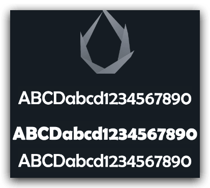
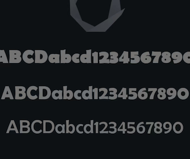
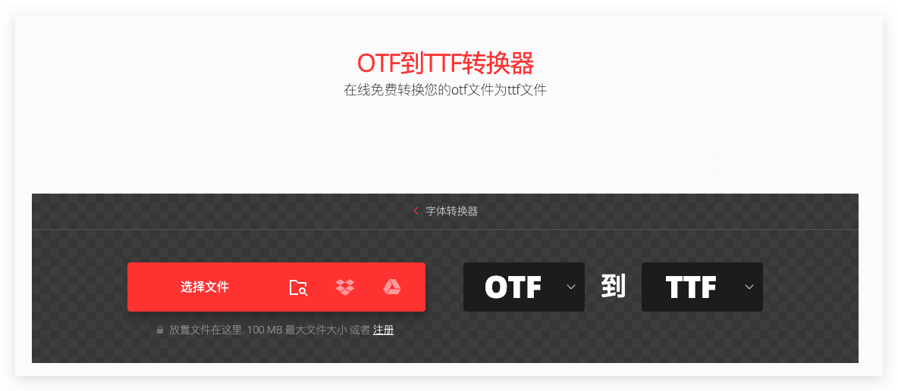

Cocos Creator支持多种字体格式，最近开发小游戏的时候发现项目内的ttf 字体在真机上无法正常显示，但是在本地Web版本和微信开发者工具里面是正常显示的，后面找到了原因和解决方法，虽然操作不难，但是有时候很难想到问题异常的关键部分。下面就简单的记录一下这个问题和解决方法。
<!--more-->

## 无效对比

首先我们先看一下 不生效的效果和生效的效果

#### 开发者工具效果

#### 真机效果

#### 修复后效果

这个现象原因是 font-family、font-name不一致导致的，使用字体修改工具修改为一致，为了避免有问题，建议删除空格，确保无误

这里推荐一个字体修改工具 [High-Logic FontCreator](https://www.high-logic.com/font-editor/fontcreator)  **注意 目前这个工具只支持windows系统**

### 拓展工具

在线免费转换otf文件为ttf文件 https://convertio.co/zh/otf-ttf/

## 参考连接

- [微信小游戏真机 TTF 字体无效](https://forum.cocos.org/t/topic/145453)
- [微信小游戏 ttf字体 无效](https://forum.cocos.org/t/topic/148371)