Cocos Creator 内置了一些常用的组件，在游戏使用的时候很方便，如果我们想要拓展一下组件，就需要简单的了解一下如何拓展，官方文档给的说明有限 [扩展 Inspector](http://docs.cocos.com/creator/manual/zh/extension/extends-inspector.html)，使得很多时候无从下手，下面简单的记录一下如何拓展组件，做一个多选组件。
<!--more-->
首先代码这里用 官方的单选按钮(cc.Toggle)和单选按钮组(`ToggleContainer`) 做基本参考，然后拓展组件。

先看一下 最终效果：

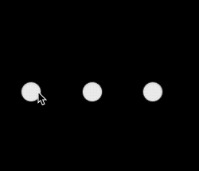

先说一下环境：

- Cocos Creator 2.3.4 （我这里用最新版2.4.6已经查看不到 Inspector）

## 步骤

### 创建项目

1. 新建一个项目，然后新建一个系统组件，这里新建一个[cc.Toggle](https://docs.cocos.com/creator/api/zh/classes/Toggle.html)

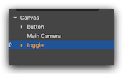

2. 选中我们的组件，然后选择Cocos Creator 的菜单 【开发者】---> 【开发者工具】

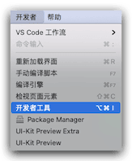

3. 然后查看【Sources】-->【inspector】-->【inspectors】-->【comps】--【toggle.js】

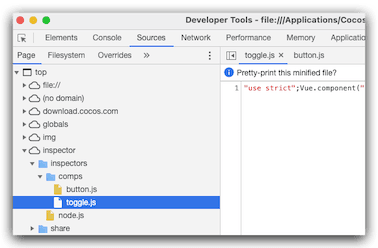

4. 然后选择代码 我们简单的格式化一下

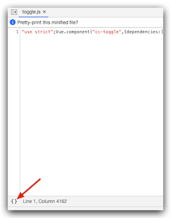

5. 格式化后变成这样 

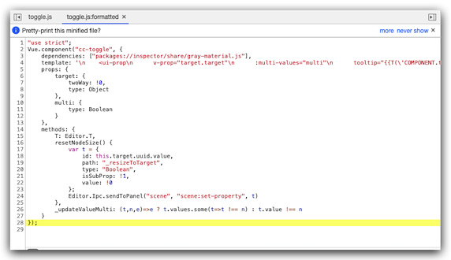

6. 保存文件到我们的自定义目录 ，这个目录是我们自定义插件的目录，自己先新建一个插件：custom-component，然后在目录下新建文件夹 inspectors/comps

7. 然后把上面 第5步 的文件保存在这个目录下 名字修改为 checkbox

   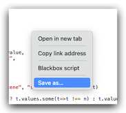

   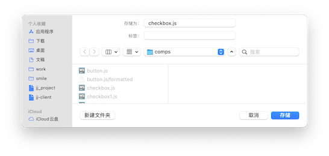

   ## 重新美化代码

   其实上面的代码已经可以继承，但是我们还是要格式化美化一下代码，这里为选择Webstorm，首先我新建了一个test.html

   然后，我把template 后面的字符串复制 然后粘贴一下，此时，编辑器帮着自动的美化了，重新拷贝回去即可。

   ```javascript
   "use strict";
   Vue.component("cc-toggle", {
       dependencies: ["packages://inspector/share/gray-material.js"],
       template: `<ui-prop
           v-prop="target.target"
           :multi-values="multi"
           tooltip="{{T('COMPONENT.toggle.target')}}"
   ></ui-prop>
   <div class="horizontal layout end-justified" style="padding:5px 0;margin-bottom:5px;">
     <ui-button class="blue tiny"
                v-disabled="multi"
                @confirm="resetNodeSize"
                :multi-values="multi"
     >
       Resize to Target
     </ui-button>
   </div>
   <ui-prop
           v-prop="target.interactable"
           :multi-values="multi"
           tooltip="{{T('COMPONENT.toggle.interactable')}}"
   ></ui-prop>
   
   
   <ui-prop
           v-prop="target.enableAutoGrayEffect"
           tooltip="{{T('COMPONENT.toggle.auto_gray_effect')}}"
           :multi-values="multi"
   ></ui-prop>
   
   <cc-gray-section
           v-if="target.enableAutoGrayEffect.value"
           :target.sync="target"
           :multi-values="multi"
   ></cc-gray-section>
   
   <ui-prop
           v-prop="target.transition"
           tooltip="{{T('COMPONENT.toggle.transition')}}"
           :multi-values="multi"
   ></ui-prop>
   <div
           v-if="!_updateValueMulti(target.transition, 1, multi)"
   >
     <ui-prop indent=1
              v-prop="target.normalColor"
              :multi-values="multi"
              tooltip="{{T('COMPONENT.toggle.normal_color')}}"></ui-prop>
     <ui-prop indent=1
              v-prop="target.pressedColor"
              :multi-values="multi"
              tooltip="{{T('COMPONENT.toggle.pressed_color')}}"
     ></ui-prop>
     <ui-prop indent=1
              v-prop="target.hoverColor"
              :multi-values="multi"
              tooltip="{{T('COMPONENT.toggle.hover_color')}}"
     ></ui-prop>
     <ui-prop indent=1
              v-prop="target.disabledColor"
              tooltip="{{T('COMPONENT.toggle.disabled_color')}}"
              :multi-values="multi"
     ></ui-prop>
     <ui-prop indent=1
              v-prop="target.duration"
              :multi-values="multi"
              tooltip="{{T('COMPONENT.toggle.duration')}}"
     ></ui-prop>
   </div>
   
   <div
           v-if="!_updateValueMulti(target.transition, 2, multi)"
   >
     <ui-prop indent=1
              v-prop="target.normalSprite"
              tooltip="{{T('COMPONENT.toggle.normal_sprite')}}"
              :multi-values="multi"
     ></ui-prop>
     <ui-prop indent=1
              v-prop="target.pressedSprite"
              tooltip="{{T('COMPONENT.toggle.pressed_sprite')}}"
              :multi-values="multi"
     ></ui-prop>
     <ui-prop indent=1
              v-prop="target.hoverSprite"
              tooltip="{{T('COMPONENT.toggle.hover_sprite')}}"
              :multi-values="multi"
     ></ui-prop>
     <ui-prop indent=1
              v-prop="target.disabledSprite"
              tooltip="{{T('COMPONENT.toggle.disabled_sprite')}}"
              :multi-values="multi"
     ></ui-prop>
   </div>
   
   <div
           v-if="!_updateValueMulti(target.transition, 3, multi)"
   >
     <ui-prop indent=1
              v-prop="target.duration"
              :multi-values="multi"
              tooltip="{{T('COMPONENT.toggle.duration')}}"
     ></ui-prop>
     <ui-prop indent=1
              v-prop="target.zoomScale"
              :multi-values="multi"
              tooltip="{{T('COMPONENT.toggle.zoom_scale')}}"
     ></ui-prop>
   </div>
   
   <ui-prop
           v-prop="target.isChecked"
           tooltip="{{T('COMPONENT.toggle.isChecked')}}"
           :multi-values="multi"
   ></ui-prop>
   <ui-prop
           v-prop="target.checkMark"
           tooltip="{{T('COMPONENT.toggle.checkMark')}}"
   ></ui-prop>
   <ui-prop
           v-prop="target.toggleGroup"
           tooltip="{{T('COMPONENT.toggle.toggleGroup')}}"
           :multi-values="multi"
   ></ui-prop>
   
   <cc-array-prop :target.sync="target.checkEvents"></cc-array-prop>
   `,
       props: {target: {twoWay: !0, type: Object}, multi: {type: Boolean}},
       methods: {
           T: Editor.T, resetNodeSize() {
               var t = {id: this.target.uuid.value, path: "_resizeToTarget", type: "Boolean", isSubProp: !1, value: !0};
               Editor.Ipc.sendToPanel("scene", "scene:set-property", t)
           }, _updateValueMulti: (t, n, e) => e ? t.values.some(t => t !== n) : t.value !== n
       }
   });
   
   ```

   ## 编写代码

   Checkbox.ts

```typescript
import {CheckboxContainer} from "./CheckboxContainer";

/**
 * Created by jsroads on 2021/10/14.11:17 上午
 * Note:多选按钮 配合 CheckboxContainer 多选按钮组用
 */
const {ccclass, inspector, property, executeInEditMode, menu} = cc._decorator;

enum EventType {
    /**
     * @event click
     * @param {Event.EventCustom} event
     * @param {Button} button - The Button component.
     */
    CLICK = 'click',
    TOGGLE = 'toggle',
}

@ccclass
@executeInEditMode
@menu("组件库/Checkbox")
@inspector("packages://custom-component/inspectors/comps/checkbox.js")
export class Checkbox extends cc.Button {
    public static EventType = EventType;
    @property({
        type: CheckboxContainer
    })
    public toggleGroup: CheckboxContainer = null!;
    /**
     * @en
     * If Toggle is clicked, it will trigger event's handler.
     *
     * @zh
     * Toggle 按钮的点击事件列表。
     */
    @property({
        type: [cc.Component.EventHandler],
        tooltip: 'i18n:toggle.check_events'
    })
    public checkEvents: cc.Component.EventHandler[] = [];

    set _resizeToTarget(value: boolean) {
        if (value) {
            this._resizeNodeToTargetNode();
        }
    }

    get _toggleContainer(): CheckboxContainer | null {
        const parent = this.node.parent!;
        if (parent.isValid) {
            return parent.getComponent('CheckboxContainer') as CheckboxContainer;
        }
        return null;
    }

    @property
    protected _isChecked = true;

    /**
     * @en
     * When this value is true, the check mark component will be enabled,
     * otherwise the check mark component will be disabled.
     *
     * @zh
     * 如果这个设置为 true，则 check mark 组件会处于 enabled 状态，否则处于 disabled 状态。
     */
    @property({
        tooltip: 'i18n:toggle.isChecked'
    })
    get isChecked() {
        return this._isChecked;
    }

    set isChecked(value) {
        this._set(value);
    }

    @property
    protected _checkMark: cc.Sprite | null = null;

    /**
     * @en
     * The image used for the checkmark.
     *
     * @zh
     * Toggle 处于选中状态时显示的图片。
     */
    @property({
        type: cc.Sprite,
        tooltip: 'i18n:toggle.checkMark'
    })
    get checkMark() {
        return this._checkMark;
    }

    set checkMark(value) {
        if (this._checkMark === value) {
            return;
        }

        this._checkMark = value;
    }

    //
    public playEffect() {
        if (this._checkMark) {
            this._checkMark.node.active = this._isChecked;
        }
    }

    /**
     * @en
     * Set isChecked without invoking checkEvents.
     *
     * @zh
     * 设置 isChecked 而不调用 checkEvents 回调。
     *
     * @param value - 是否被按下
     */
    public setIsCheckedWithoutNotify(value: boolean) {
        this._set(value, false);
    }

    public onEnable() {
        super.onEnable();
        this.playEffect();
        if (!CC_EDITOR) {
            this.node.on(Checkbox.EventType.CLICK, this._internalToggle, this);
        }
    }

    public onDisable() {
        super.onDisable();
        if (!CC_EDITOR) {
            this.node.off(Checkbox.EventType.CLICK, this._internalToggle, this);
        }
    }

    public OnDestroy() {
        const group = this._toggleContainer;
        if (group) {
            group.ensureValidState();
        }
    }

    protected _resizeNodeToTargetNode() {
        if (!this.target) {
            return;
        }
        const target = this.target || this.node;
        const contentSize = target.getContentSize();
        if (CC_EDITOR && contentSize) {
            this.node.setContentSize(contentSize);
        }
    }

    protected _internalToggle() {
        this.isChecked = !this.isChecked;
    }

    protected _set(value: boolean, emitEvent = true) {
        if (this._isChecked == value) return;

        this._isChecked = value;

        const group = this._toggleContainer;
        if (group && group.enabled && this.enabled) {
            const anyTogglesChecked = group.anyTogglesChecked();
            const allowSwitchOff = group.allowSwitchOff;
            const isCheckbox = group.isCheckbox;
            // if (value || (!anyTogglesChecked && !allowSwitchOff)) {
            if (isCheckbox) {
                group.notifyToggleCheck(this, emitEvent);
            } else {
                if (value || (!anyTogglesChecked)) {
                    this._isChecked = true;
                    group.notifyToggleCheck(this, emitEvent);
                }
            }

        }

        this.playEffect();
        if (emitEvent) {
            this._emitToggleEvents();
        }
    }

    protected _emitToggleEvents() {
        this.node.emit(Checkbox.EventType.TOGGLE, this);
        if (this.checkEvents) {
            cc.Component.EventHandler.emitEvents(this.checkEvents, this);
        }
    }
}

```

CheckboxContainer.ts

```typescript
import {Checkbox} from "./Checkbox";

/**
 * Created by jsroads on 2021/10/14.4:18 下午
 * Note:多选按钮组
 */
const {ccclass, property, executeInEditMode, menu} = cc._decorator;

@ccclass
@executeInEditMode
@menu("组件库/CheckboxContainer")
export class CheckboxContainer extends cc.Component {
    /**
     * @en
     * If Toggle is clicked, it will trigger event's handler.
     *
     * @zh
     * Toggle 按钮的点击事件列表。
     */
    @property({
        type: [cc.Component.EventHandler],
        serializable: true,
        tooltip: 'i18n:toggle_group.check_events'
    })
    public checkEvents: cc.Component.EventHandler[] = [];

    @property
    public _isCheckbox: boolean = true;

    @property({
        type: false,
        tooltip: '是否多选按钮组,否则单选'
    })

    get isCheckbox() {
        return this._isCheckbox;
    }

    set isCheckbox(value) {
        this._isCheckbox = value;
        if (value) {
            this._allowSwitchOff = value;
        }
    }

    @property
    protected _allowSwitchOff = false;

    /**
     * @en
     * If this setting is true, a toggle could be switched off and on when pressed.
     * If it is false, it will make sure there is always only one toggle could be switched on
     * and the already switched on toggle can't be switched off.
     *
     * @zh
     * 如果这个设置为 true，那么 toggle 按钮在被点击的时候可以反复地被选中和未选中。
     */
    @property({
        tooltip: 'i18n:toggle_group.allowSwitchOff',
        visible: function (this: CheckboxContainer) {
            return !this.isCheckbox;
        }
    })
    get allowSwitchOff() {
        return this._allowSwitchOff;
    }

    set allowSwitchOff(value) {
        this._allowSwitchOff = value;
    }

    /**
     * @en
     * Read only property, return the toggle items array reference managed by ToggleContainer.
     *
     * @zh
     * 只读属性，返回 toggleContainer 管理的 toggle 数组引用。
     */
    get toggleItems() {
        return this.node.children.map((item) => {
            const toggle = item.getComponent('Checkbox') as Checkbox;
            if (toggle && toggle.enabled) {
                return toggle;
            }
            return null;
        }).filter(Boolean);
    }

    public onEnable() {
        this.ensureValidState();
        this.node.on(cc.Node.EventType.CHILD_ADDED, this.ensureValidState, this);
        this.node.on(cc.Node.EventType.CHILD_REMOVED, this.ensureValidState, this);
    }

    public onDisable() {
        this.node.off(cc.Node.EventType.CHILD_ADDED, this.ensureValidState, this);
        this.node.off(cc.Node.EventType.CHILD_REMOVED, this.ensureValidState, this);
    }

    public activeToggles() {
        return this.toggleItems.filter((x) => x!.isChecked);
    }

    public anyTogglesChecked() {
        return !!this.toggleItems.find((x) => x!.isChecked);
    }

    /**
     * @en
     * Refresh the state of the managed toggles.
     *
     * @zh
     * 刷新管理的 toggle 状态。
     *
     * @param toggle - 需要被更新的 toggle。
     * @param emitEvent - 是否需要触发事件
     */
    public notifyToggleCheck(toggle: Checkbox, emitEvent = true) {
        if (!this.enabledInHierarchy) {
            return;
        }
        if (this.isCheckbox) {
            // for (let i = 0; i < this.toggleItems.length; i++) {
            //     const item = this.toggleItems[i]!;
            //     if (item === toggle) {
            //         continue;
            //     }
            //     item.setIsCheckedWithoutNotify(false);
            // }
        } else {
            for (let i = 0; i < this.toggleItems.length; i++) {
                const item = this.toggleItems[i]!;
                if (item === toggle) {
                    continue;
                }
                if (emitEvent) {
                    item.isChecked = false;
                } else {
                    item.setIsCheckedWithoutNotify(false);
                }
            }
        }
        if (emitEvent&&this.checkEvents) {
            cc.Component.EventHandler.emitEvents(this.checkEvents, toggle);
        }
    }

    public ensureValidState() {
        const toggles = this.toggleItems;
        if (!this.allowSwitchOff && !this.anyTogglesChecked() && toggles.length !== 0) {
            const toggle = toggles[0]!;
            toggle.isChecked = true;
            this.notifyToggleCheck(toggle);
        }

        const activeToggles = this.activeToggles();
        if (activeToggles.length > 1) {
            const firstToggle = activeToggles[0];
            for (let i = 0; i < activeToggles.length; ++i) {
                const toggle = activeToggles[i];
                if (toggle === firstToggle) {
                    continue;
                }
                if (this.isCheckbox) {
                    toggle!.setIsCheckedWithoutNotify(false);
                } else {
                    toggle!.isChecked = false;
                }

            }
        }
    }
}
```

然后我们拖动一个单选按钮组，测试一下：

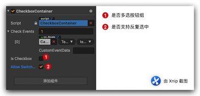

```typescript
    private checkBoxHandler(checkbox:Checkbox){
        console.log("smile----name:" + JSON.stringify(checkbox.name));
        console.log("smile----isChecked:" + JSON.stringify(checkbox.isChecked));
    }
```

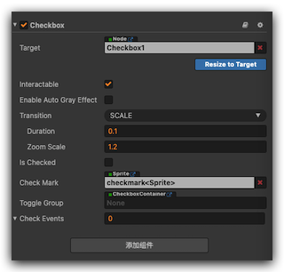


输出结果：

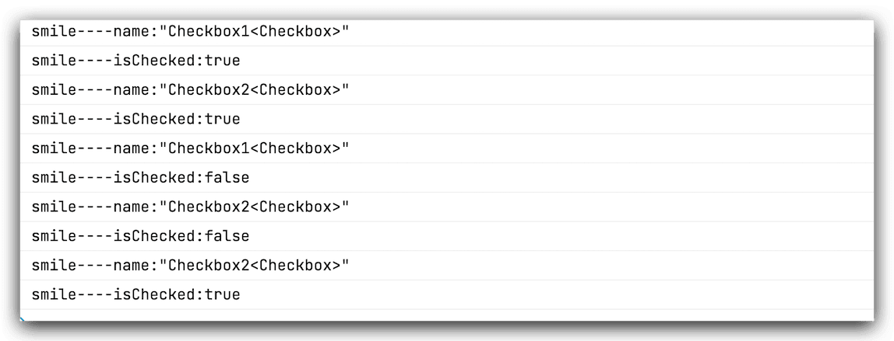

## 总结

总的来说这个实现不难，拿Cocos Creator 3.3.2的源码直接修改的，重要的是学习了一下，如何拓展内置组件的做法。

## 参考

- [Cocos Creator 扩展内置组件(含 inspector 扩展)新手教程](https://forum.cocos.org/t/cocos-creator-inspector/91178)

