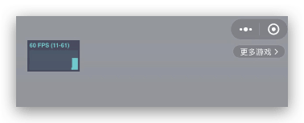
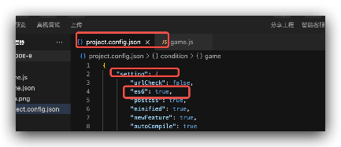

微信小游戏官方可以开启高性能模式，这个使得抖音小游戏的性能得以大大提升，目前，抖音开启了高性能的内测，相信很快就可以对外公布，启高性能模式，这里提前写一下如何设置游戏高性能模式。
<!--more-->
首先这里简单的说一下微信的高性能模式：

## 微信小游戏高性能

官方文档地址：[高性能模式](https://developers.weixin.qq.com/minigame/dev/guide/performance/perf-high-performance.html)

```javascript
// 判断当前处于高性能模式下，安卓下无此属性
if (GameGlobal.isIOSHighPerformanceMode) {
  // 这里可以针对高性能模式做一些针对性的适配
}

```

### 注意事项：

1. 业务代码的JS需要开启[严格模式](https://developer.mozilla.org/zh-CN/docs/Web/JavaScript/Reference/Strict_mode)，一般游戏引擎都会默认开启。
2. 部分接口暂不支持:
   1. `GameServerManager` 接口暂不支持；
   2. `RecorderManager` 接口暂不支持(支持中)；
   3. `VideoDecoder` 接口暂不支持；
3. 纹理支持：`iOS` 下，高性能模式不支持`ETC`和`PVRTC`压缩纹理格式，只剩`ASTC`和`ETC1`。

### 具体操作

开通高性能模式的方式为：

1. 登录微信公众平台 -> 首页能力地图模块 -> 点击进入"生产提效包" -> 点击开通高性能模式
2. 过配置 `game.json` 的 `iOSHighPerformance` 为 `true` 则可进入高性能模式
3. 通过去掉此开关可以正常回退到普通模式，以便两种模式对比。

### 判断是否在高性能模式

1. 判断是否在高性能模式主要通过调试模式下左上角的调试面板来确定，下图为高性能模式（仅`iOS`，安卓端无变化）。



## 抖音小游戏高性能模式

### 开启条件

1. 目前高性能模式还在内测阶段，需要联系抖音官方人员开通。开发者在在开发过程中，需要提供设备的`Device ID` 配置为白名单可以使用高性能模式开发，上线后，抖音会根据条件为用户开启高性能模式。

2. 用户设备需要在`iOS14.5`版本及以上

3. 需要在 `project.config.json` 文件配置 `es6` 选项为 `true` 会默认使用严格模式编译。目前默认构建后已经是`es6`严格模式

   

### 如何判断是否高性能模式

高性能模式下 `GameGlobal.isIOSHighPerformanceMode` 为 `true`，可以通过该变量判断是否为高性能模式

### 如何适配

对于 `CocosCreator` 引擎用户，还可以通过[修改引擎部分代码](https://github.com/cocos/cocos-engine/pull/16769/files)（`3.8.x`）完成适配。版本`2.4.13`用户可以按照下面的修改方式：

1. 找到 `cocos2d/core/renderer/webgl/mesh-buffer.js` 
2. 原来内容：

```javascript
let FIX_IOS14_BUFFER;
if (cc.sys.platform === cc.sys.WECHAT_GAME) {
    FIX_IOS14_BUFFER = (cc.sys.os === cc.sys.OS_IOS || cc.sys.os === cc.sys.OS_OSX) && GameGlobal?.isIOSHighPerformanceMode && /(OS 1[4-9])|(Version\/1[4-9])/.test(window.navigator.userAgent);
} else {
    FIX_IOS14_BUFFER = (cc.sys.os === cc.sys.OS_IOS || cc.sys.os === cc.sys.OS_OSX) && cc.sys.isBrowser && /(OS 1[4-9])|(Version\/1[4-9])/.test(window.navigator.userAgent);
}
```

修改后：

```javascript
let FIX_IOS14_BUFFER;
if (cc.sys.platform === cc.sys.WECHAT_GAME || cc.sys.platform === cc.sys.BYTEDANCE_GAME) {
    FIX_IOS14_BUFFER = (cc.sys.os === cc.sys.OS_IOS || cc.sys.os === cc.sys.OS_OSX) && GameGlobal?.isIOSHighPerformanceMode && /(OS 1[4-9])|(Version\/1[4-9])/.test(window.navigator.userAgent);
} else {
    FIX_IOS14_BUFFER = (cc.sys.os === cc.sys.OS_IOS || cc.sys.os === cc.sys.OS_OSX) && cc.sys.isBrowser && /(OS 1[4-9])|(Version\/1[4-9])/.test(window.navigator.userAgent);
}
```

3. 编译引擎

```shell
gulp build-dev
```

4. 设置项目自定义`Javascript`引擎 为刚刚自定义的引擎目录

### 注意事项：

1. 业务代码的JS需要开启[严格模式](https://developer.mozilla.org/zh-CN/docs/Web/JavaScript/Reference/Strict_mode)，一般游戏引擎都会默认开启。

2. 目前高性能模式还在完善中，部分 `API` 尚未实现，如有调用这些 `API`，请针对高性能模式做好特殊处理

   尚未支持的 `API` 列表：

   | 名称                           | 调用后行为                 |
   | ------------------------------ | -------------------------- |
   | getGameRecorderManager         | 抛出异常 not supported yet |
   | request/pause/resumeMicrophone | 抛出异常 not supported yet |
   | createCamera                   | 抛出异常 not supported yet |
   | createFaceDetector             | 抛出异常 not supported yet |
   | createHandDetector             | 抛出异常 not supported yet |

3. 纹理支持：高性能模式下只支持 `ASTC` 和 `ETC1` 压缩纹理，不支持 `ETC` 和 `PVRTC`