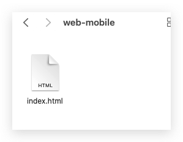
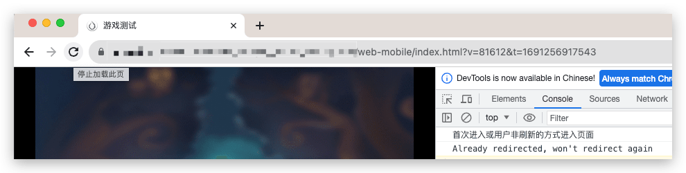

这里是你博客列表显示的摘要文字这几年虽然做的都是小游戏平台或者`App`平台的游戏，但是有时候会提前给内部测试或者外面的人看游戏的功能，就会用到`web-mobile` 版本的发布，但是`web-mobile`发布后，后续的更新，往往由于打开的人员的宿主浏览器存在缓存机制，导致有时候不会更新到最新内容，之前常见的做法有两种，一种是更换连接。另外一种是后面添加一个随机值，让浏览器重新请求，但是依旧比较麻烦，下面就记录一下，如何让用户自己直接点击刷新按钮，自动更换随机值。
<!--more-->
我们知道`CocosCreator`可以[自定义构建模板](https://docs.cocos.com/creator/2.4/manual/zh/publish/custom-project-build-template.html) 这样可以在构建完成后，自动使用我们的模板文件替换原来的文件。

这里我们就使用这个功能，实现上面的功能。

## 具体操作

1. 首先我们需要在我们的项目下 新建一个文件夹 `build-templates` 目录

```shell
project-folder
 |--assets
 |--build
 |--build-templates
      |--web-mobile
            // 用户需要添加的文件，如 index.html
            |--index.html
```

2. 这样如果当前构建的平台是 **web-mobile** 的话，那么 `build-templates/web-mobile/index.html` 就会在构建后被拷贝到 `build/web-mobile/index.html`。
3. 下面就是我们的详细的 index.html 内容。



4. `index.html` 完整内容：

```html
<!DOCTYPE html>
<html>
<head>
  <meta charset="utf-8">

  <title>游戏测试</title>

  <!--http://www.html5rocks.com/en/mobile/mobifying/-->
  <meta name="viewport"
        content="width=device-width,user-scalable=no,initial-scale=1, minimum-scale=1,maximum-scale=1"/>

  <!--https://developer.apple.com/library/safari/documentation/AppleApplications/Reference/SafariHTMLRef/Articles/MetaTags.html-->
  <meta name="apple-mobile-web-app-capable" content="yes">
  <meta name="apple-mobile-web-app-status-bar-style" content="black-translucent">
  <meta name="format-detection" content="telephone=no">

  <!-- force webkit on 360 -->
  <meta name="renderer" content="webkit"/>
  <meta name="force-rendering" content="webkit"/>
  <!-- force edge on IE -->
  <meta http-equiv="X-UA-Compatible" content="IE=edge,chrome=1"/>
  <meta name="msapplication-tap-highlight" content="no">

  <!-- force full screen on some browser -->
  <meta name="full-screen" content="yes"/>
  <meta name="x5-fullscreen" content="true"/>
  <meta name="360-fullscreen" content="true"/>
  
  <!-- force screen orientation on some browser -->
  <meta name="screen-orientation" content="portrait"/>
  <meta name="x5-orientation" content="portrait">

  <!--fix fireball/issues/3568 -->
  <!--<meta name="browsermode" content="application">-->
  <meta name="x5-page-mode" content="app">

  <!--<link rel="apple-touch-icon" href=".png" />-->
  <!--<link rel="apple-touch-icon-precomposed" href=".png" />-->

  <link rel="stylesheet" type="text/css" href="style-mobile.css"/>
  <link rel="icon" href="favicon.ico"/>
</head>
<body>
  <canvas id="GameCanvas" oncontextmenu="event.preventDefault()" tabindex="0"></canvas>
  <div id="splash">
    <div class="progress-bar stripes">
      <span style="width: 0%"></span>
    </div>
  </div>
  <script>
    // 当前URL
    let url = location.href;
    // 如果浏览器支持 window.performance 并且页面是通过刷新按钮加载的
    if (window.performance && window.performance.getEntriesByType("navigation")[0].type === "reload") {
      console.log("用户点击刷新，重新定向");
      // 生成随机数和时间戳
      const randomNumber = Math.floor(Math.random() * 100000) + 1;
      const timestamp = Date.now();
      // 如果URL已经包含查询字符串
      if (location.search) {
        // 正则替换已存在的v和t参数
        url = url.replace(/([?&])v=\d*/, '$1v=' + randomNumber);
        url = url.replace(/([?&])t=\d*/, '$1t=' + timestamp);

        // 如果URL中没有v和t参数，那么添加它们
        if (!url.includes('?v=') && !url.includes('&v=')) {
          url += '&v=' + randomNumber;
        }
        if (!url.includes('?t=') && !url.includes('&t=')) {
          url += '&t=' + timestamp;
        }
      } else {
        // 如果URL没有查询字符串，那么添加v和t参数
        url += '?v=' + randomNumber + '&t=' + timestamp;
      }
      // 重定向到新的URL
      location.href = url;
    }else {
      console.log("首次进入或用户非刷新的方式进入页面");
      // 随机数和时间戳
      const randomNumber = Math.floor(Math.random() * 100000) + 1;
      const timestamp = Date.now();
      // 如果URL已经包含查询字符串
      if (location.search) {
        // 如果URL中已经有了随机数和时间戳参数，就不再进行重定向
        if (url.includes('?v=') || url.includes('&v=') || url.includes('?t=') || url.includes('&t=')) {
          console.log("Already redirected, won't redirect again");
        } else {
          // 如果URL中没有随机数和时间戳参数，添加它们
          url += '&v=' + randomNumber;
          url += '&t=' + timestamp;
          // 重定向到新的URL
          location.href = url;
        }
      } else {
        // 如果URL没有查询字符串，那么添加随机数和时间戳参数，并进行重定向
        url += '?v=' + randomNumber;
        url += '&t=' + timestamp;
        location.href = url;
      }
    }
  </script>
<script src="src/settings.js" charset="utf-8"></script>

<script src="main.js" charset="utf-8"></script>

<script type="text/javascript">
(function () {
    // open web debugger console
    if (typeof VConsole !== 'undefined') {
        window.vConsole = new VConsole();
    }

    var debug = window._CCSettings.debug;
    var splash = document.getElementById('splash');
    splash.style.display = 'block';

    function loadScript (moduleName, cb) {
      function scriptLoaded () {
          document.body.removeChild(domScript);
          domScript.removeEventListener('load', scriptLoaded, false);
          cb && cb();
      };
      var domScript = document.createElement('script');
      domScript.async = true;
      domScript.src = moduleName;
      domScript.addEventListener('load', scriptLoaded, false);
      document.body.appendChild(domScript);
    }

    loadScript(debug ? 'cocos2d-js.js' : 'cocos2d-js-min.js', function () {
      if (CC_PHYSICS_BUILTIN || CC_PHYSICS_CANNON) {
        loadScript(debug ? 'physics.js' : 'physics-min.js', window.boot);
      }
      else {
        window.boot();
      }
    });
})();
</script>
</body>
</html>

```

5. 其中核心代码是 <script></script> 中间的内容

```javascript
 // 当前URL
    let url = location.href;
    // 如果浏览器支持 window.performance 并且页面是通过刷新按钮加载的
    if (window.performance && window.performance.getEntriesByType("navigation")[0].type === "reload") {
      console.log("用户点击刷新，重新定向");
      // 生成随机数和时间戳
      const randomNumber = Math.floor(Math.random() * 100000) + 1;
      const timestamp = Date.now();
      // 如果URL已经包含查询字符串
      if (location.search) {
        // 正则替换已存在的v和t参数
        url = url.replace(/([?&])v=\d*/, '$1v=' + randomNumber);
        url = url.replace(/([?&])t=\d*/, '$1t=' + timestamp);

        // 如果URL中没有v和t参数，那么添加它们
        if (!url.includes('?v=') && !url.includes('&v=')) {
          url += '&v=' + randomNumber;
        }
        if (!url.includes('?t=') && !url.includes('&t=')) {
          url += '&t=' + timestamp;
        }
      } else {
        // 如果URL没有查询字符串，那么添加v和t参数
        url += '?v=' + randomNumber + '&t=' + timestamp;
      }
      // 重定向到新的URL
      location.href = url;
    }else {
      console.log("首次进入或用户非刷新的方式进入页面");
      // 随机数和时间戳
      const randomNumber = Math.floor(Math.random() * 100000) + 1;
      const timestamp = Date.now();
      // 如果URL已经包含查询字符串
      if (location.search) {
        // 如果URL中已经有了随机数和时间戳参数，就不再进行重定向
        if (url.includes('?v=') || url.includes('&v=') || url.includes('?t=') || url.includes('&t=')) {
          console.log("Already redirected, won't redirect again");
        } else {
          // 如果URL中没有随机数和时间戳参数，添加它们
          url += '&v=' + randomNumber;
          url += '&t=' + timestamp;
          // 重定向到新的URL
          location.href = url;
        }
      } else {
        // 如果URL没有查询字符串，那么添加随机数和时间戳参数，并进行重定向
        url += '?v=' + randomNumber;
        url += '&t=' + timestamp;
        location.href = url;
      }
    }
```

## 效果


点击刷新或者重新按`Enter`键进入：


我们发现此时 后面的随机数字和 时间戳都发生了变化，内容就随之更新。

## 更新版本

版本更新日期：2024年07月20日

```html
<!DOCTYPE html>
<html>
<head>
  <meta charset="utf-8">

  <title>游戏测试</title>

  <!--http://www.html5rocks.com/en/mobile/mobifying/-->
  <meta name="viewport"
        content="width=device-width,user-scalable=no,initial-scale=1, minimum-scale=1,maximum-scale=1"/>

  <!--https://developer.apple.com/library/safari/documentation/AppleApplications/Reference/SafariHTMLRef/Articles/MetaTags.html-->
  <meta name="apple-mobile-web-app-capable" content="yes">
  <meta name="apple-mobile-web-app-status-bar-style" content="black-translucent">
  <meta name="format-detection" content="telephone=no">

  <!-- force webkit on 360 -->
  <meta name="renderer" content="webkit"/>
  <meta name="force-rendering" content="webkit"/>
  <!-- force edge on IE -->
  <meta http-equiv="X-UA-Compatible" content="IE=edge,chrome=1"/>
  <meta name="msapplication-tap-highlight" content="no">

  <!-- force full screen on some browser -->
  <meta name="full-screen" content="yes"/>
  <meta name="x5-fullscreen" content="true"/>
  <meta name="360-fullscreen" content="true"/>
  
  <!-- force screen orientation on some browser -->
  <meta name="screen-orientation" content="portrait"/>
  <meta name="x5-orientation" content="portrait">

  <!--fix fireball/issues/3568 -->
  <!--<meta name="browsermode" content="application">-->
  <meta name="x5-page-mode" content="app">

  <!--<link rel="apple-touch-icon" href=".png" />-->
  <!--<link rel="apple-touch-icon-precomposed" href=".png" />-->

  <link rel="stylesheet" type="text/css" href="style-mobile.css"/>
  <link rel="icon" href="favicon.ico"/>
</head>
<body>
  <canvas id="GameCanvas" oncontextmenu="event.preventDefault()" tabindex="0"></canvas>
  <div id="splash">
    <div class="progress-bar stripes">
      <span style="width: 0%"></span>
    </div>
  </div>
  <script>
    // 获取当前 URL 和查询参数
    let url = new URL(window.location.href);
    const params = url.searchParams;

    // 生成随机数和时间戳
    const randomNumber = Math.floor(Math.random() * 100000) + 1;
    const timestamp = Date.now();

    // 设置或更新查询参数 v 和 t
    params.set('v', randomNumber);
    params.set('t', timestamp);

    // 检查页面是否通过刷新按钮加载
    if (window.performance && window.performance.getEntriesByType("navigation")[0].type === "reload") {
      console.log("用户点击刷新，重新定向");
      window.location.href = url.toString(); // 重定向到更新后的 URL
    } else {
      // //方法一 --------------------- 开始
      // // 即使参数已经在脚本中更新，但由于没有执行重定向或页面刷新，
      // // 地址栏的 URL 没有显示这些更新。这是因为更改 URLSearchParams 并不会自动更新浏览器的地址栏，
      // // 如果原来没有查询字符串，也进行重定向
      // console.log("首次进入或用户非刷新的方式进入页面");
      // if (!window.location.search) {
      //   // 如果原来没有查询字符串，也进行重定向
      //   window.location.href = url.toString();
      // } else {
      //   // 如果已经有查询字符串且包含 v 或 t，不进行重定向
      //   console.log("URL 已包含更新的参数，无需重定向");
      // }
      // //方法一 --------------------- 结束


      //方法二 --------------------- 开始
      // 使用 history.replaceState： 该方法用于在不重新加载页面的情况下修改浏览器的历史记录。
      // replaceState 会替换当前的历史记录条目，使地址栏中的 URL 更新为给定的 URL，而不会触发页面重新加载。
      console.log("首次进入或用户非刷新的方式进入页面");
      if (!window.location.search || url.toString() !== window.location.href) {
        // 如果原来没有查询字符串，或参数有更新，也进行重定向
        window.history.replaceState(null, '', url.toString());  // 使用 history.replaceState 更新地址栏
      } else {
        // 如果已经有查询字符串且包含 v 或 t，不进行重定向
        console.log("URL 已包含更新的参数，无需重定向");
      }
      //方法二 --------------------- 结束
    }
  </script>

<script src="src/settings.js" charset="utf-8"></script>

<script src="main.js" charset="utf-8"></script>

<script type="text/javascript">
(function () {
    // open web debugger console
    if (typeof VConsole !== 'undefined') {
        window.vConsole = new VConsole();
    }

    var debug = window._CCSettings.debug;
    var splash = document.getElementById('splash');
    splash.style.display = 'block';

    function loadScript (moduleName, cb) {
      function scriptLoaded () {
          document.body.removeChild(domScript);
          domScript.removeEventListener('load', scriptLoaded, false);
          cb && cb();
      };
      var domScript = document.createElement('script');
      domScript.async = true;
      domScript.src = moduleName;
      domScript.addEventListener('load', scriptLoaded, false);
      document.body.appendChild(domScript);
    }

    loadScript(debug ? 'cocos2d-js.js' : 'cocos2d-js-min.js', function () {
      if (CC_PHYSICS_BUILTIN || CC_PHYSICS_CANNON) {
        loadScript(debug ? 'physics.js' : 'physics-min.js', window.boot);
      }
      else {
        window.boot();
      }
    });
})();
</script>
</body>
</html>

```

### 更新说明

方法一：即使参数已经在脚本中更新，但由于没有执行重定向或页面刷新，地址栏的 URL 没有显示这些更新。这是因为更改 `URLSearchParams` 并不会自动更新浏览器的地址栏，除非进行重定向或重新加载页面。
方法二：

1. **使用 `history.replaceState`：** 该方法用于在不重新加载页面的情况下修改浏览器的历史记录。`replaceState` 会替换当前的历史记录条目，使地址栏中的 URL 更新为给定的 URL，而不会触发页面重新加载。
2. **条件检查：** 代码中添加了检查来确定是否需要更新历史记录。如果页面首次加载并且参数实际上发生了变化（即生成的 URL 与当前的 URL 不同），则使用 `replaceState` 更新地址栏。

这样修改后，地址栏将反映出参数的更新，而不需要进行页面的重载，从而提高了用户体验并减少了不必要的服务器请求。