今天有群友问了一个关于Layabox滤镜(`laya.effect.ColorFilterSetter`,`laya.effect.GlowFilterSetter`,`laya.effect.BlurFilterSetter`)的问题，以前我自己使用滤镜大多是用代码实现的，编辑器很少用到，遇到的问题是 在编辑器用了滤镜组件后，运行项目报错。后面发现是滤镜的类没有注册，提前注册即可。下面记录一下这个问题的现象和解决办法。
<!--more-->

### 问题现象和原因分析

- 首先我们再场景里面 放一个图片 添加滤镜 

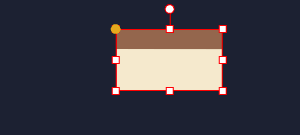


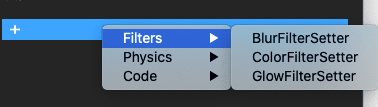

- 编辑器下，效果正常


- 接下来编译项目 运行 发现  我....F,我佛慈悲 ！！居然报错了，编译是正常通过的

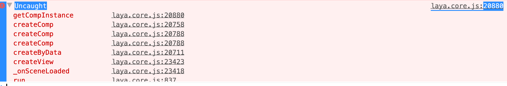

- 我们打印一下 信息 发现

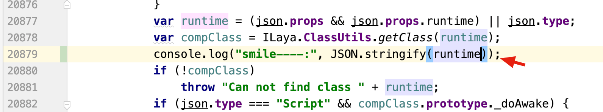

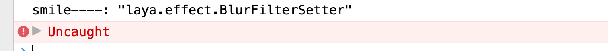

- 原来是 类不在，那么怎么让类可以正常呢，通常的做法是在编辑器里勾选我们要导入的类的类库（js文件）

但是通过查找发现 滤镜的三个雷是 在laya.core.js文件里，也就是说，默认已经加载了，那么为什么依然找不到呢？

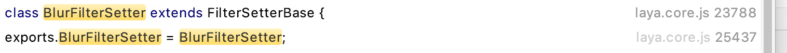

其实是因为没有把类注册进去，我们模仿其他类的注册方法，把我们需要的类也注册进去就可以了。

### 问题解决方法

- 我们看看其他的类 都是这样注册的

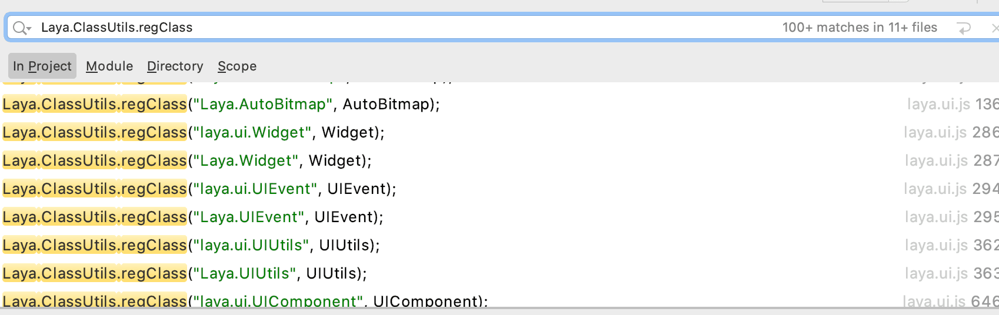

- 我们的类 在配置文件是这样被引用的

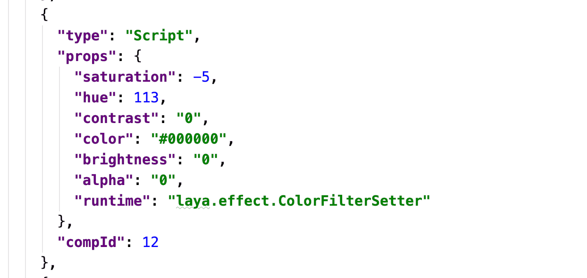

所以我们在我们的Main.ts（Typescript项目） 或者 Main.js(JavaScript项目)里提前注册即可：

代码如下：

```typescript
   Laya.ClassUtils.regClass("laya.effect.ColorFilterSetter", Laya.ColorFilterSetter);
   Laya.ClassUtils.regClass("laya.effect.GlowFilterSetter", Laya.GlowFilterSetter);
   Laya.ClassUtils.regClass("laya.effect.BlurFilterSetter", Laya.BlurFilterSetter);
```

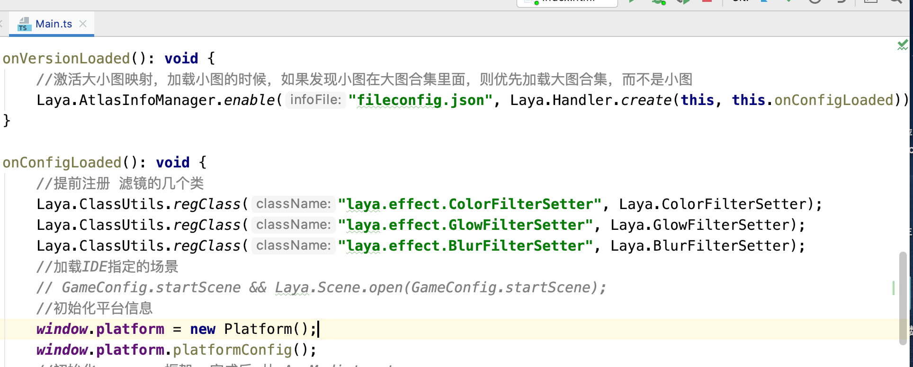

- 然后重新编译运行

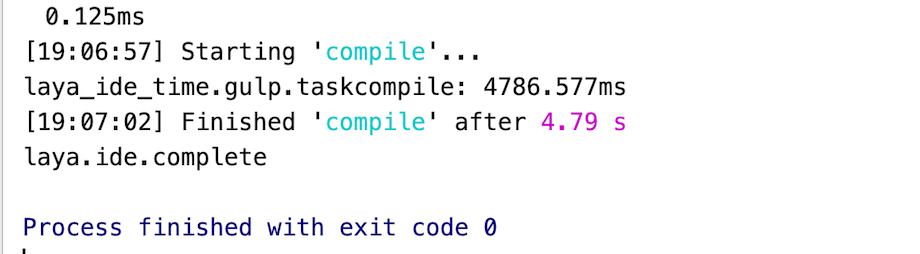

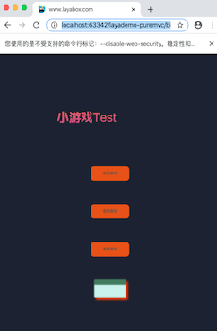

- 最后，成功运行，可以正常在编辑器里，使用我们的滤镜组件了。


