### Laya2.0 开放域简介

自从2018年秋开始，layabox 公司发布了2.0 版本，在2.0 版本里面多了一个组件，就是 `WXOpenDataViewer`组件这个歌组件是专门为 做微信小游戏 显示开放域使用的，我自己在论坛上找了很久没有找到合适的教程，官方文档也是写的模棱两可，于是自己探索了两天，终于悟得真经，准备记下来，便于以后查找，顺便分享给那些对这个组件不熟悉的开发者。

<!-- more -->

### 开发步骤

- 机器上已经安装了Layabox的2.0 版本
- 需要新建两个项目，一个主域项目，一个开放域项目（关于主域和开放域（子域）的概念此处不多说）
- 最好编译到微信预览效果

#### 新建子域（开放域）项目

- 首先打开 LayaAir 新建项目面板  新建项目 `sunDemo`

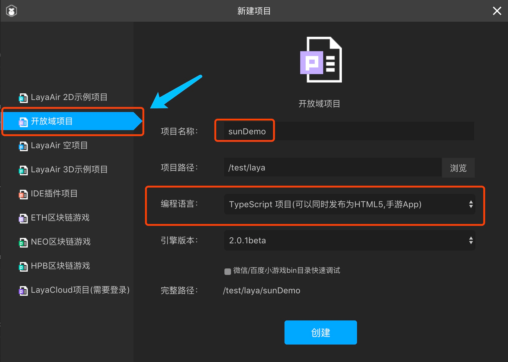

- 官方已经给我们搭建好了 基本的结构和框架，我们只需要修改部分细节即可 首先修改 Main下面的 方法

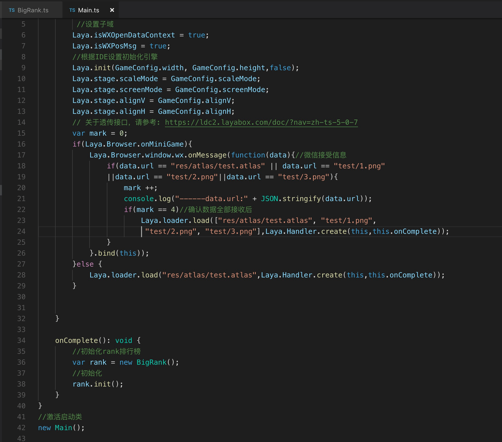

```typescript
class Main {
	constructor() {
		 //设置子域
		Laya.isWXOpenDataContext = true;
		Laya.isWXPosMsg = true;
		//根据IDE设置初始化引擎		
		Laya.init(GameConfig.width, GameConfig.height,false);
		Laya.stage.scaleMode = GameConfig.scaleMode;
		Laya.stage.screenMode = GameConfig.screenMode;
		Laya.stage.alignV = GameConfig.alignV;
		Laya.stage.alignH = GameConfig.alignH;
		// 关于透传接口，请参考: https://ldc2.layabox.com/doc/?nav=zh-ts-5-0-7
		var mark = 0;
		if(Laya.Browser.onMiniGame){
			Laya.Browser.window.wx.onMessage(function(data){//微信接受信息
				if(data.url == "res/atlas/test.atlas" || data.url == "test/1.png"
				||data.url == "test/2.png"||data.url == "test/3.png"){
					mark ++;
					console.log("------data.url:" + JSON.stringify(data.url));
					if(mark == 4)//确认数据全部接收后
						Laya.loader.load(["res/atlas/test.atlas", "test/1.png",
						 "test/2.png", "test/3.png"],Laya.Handler.create(this,this.onComplete));
				}
			}.bind(this));
		}else {
			Laya.loader.load("res/atlas/test.atlas",Laya.Handler.create(this,this.onComplete));
		}

				
	}

	onComplete(): void {
		//初始化rank排行榜
		var rank = new BigRank();
		//初始化
		rank.init();
	}
```


- 然后修改  BigRank 这个类 

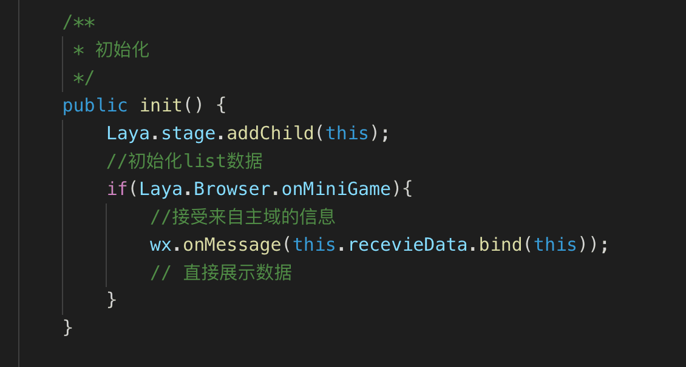

```typescript
public init() {
            Laya.stage.addChild(this);
            //初始化list数据
            if(Laya.Browser.onMiniGame){
                //接受来自主域的信息
                wx.onMessage(this.recevieData.bind(this));
                // 直接展示数据
            }
        }
        
        /**
         * 接收信息
         * @param message 收到的主域传过来的信息
         */
        private recevieData(message):void{
            var _$this =this;
            var type:String = message.type;
            switch(type)
            {   
                default:
                    break;
            }
            // this.getFriendData();
            this.setlist(this.arr);
        }
```


- 然后 记得编译 素材  Ctrl+F12   和 编译项目  ，最后 发布项目 


- 做完这些之后，准备 主域的准备

#### 主域设置

- 新建项目fatherDemo  然后 新建一个素材页面 名字叫 MyDialog,然后新建一个Ts 文件，并且 继承这个类

  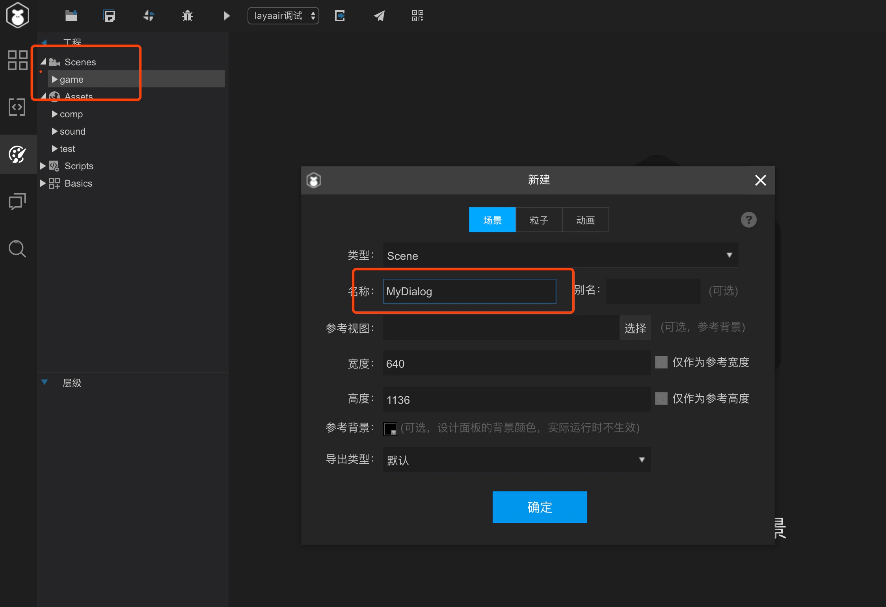

  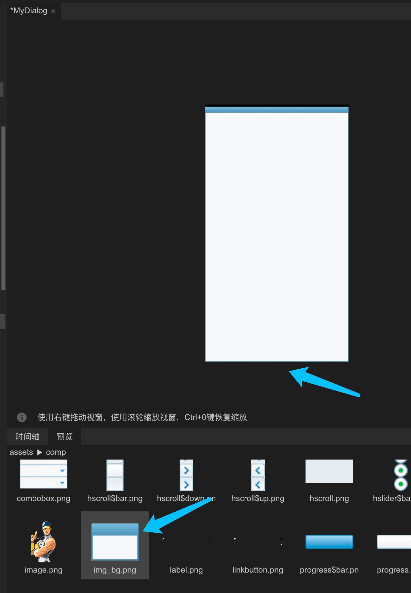

- 我们此时 做上面的 图片 做背景 是衬托，你自己可以略过此步骤


- 我们开始拖入一个  开放域组件到舞台
- 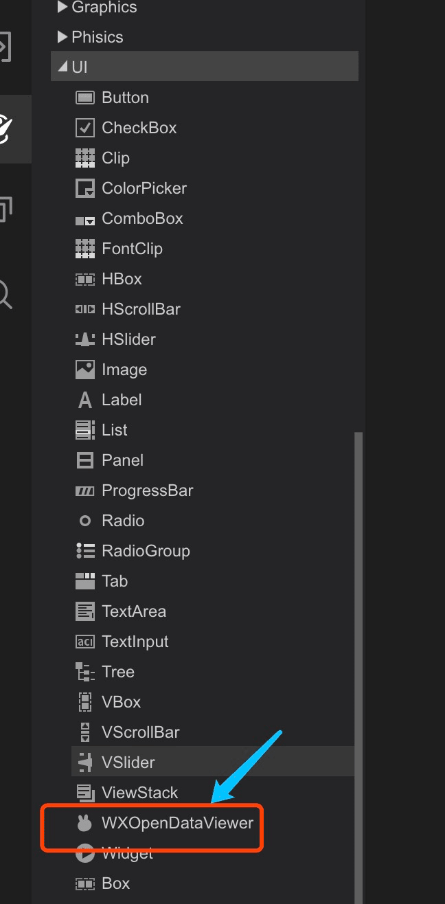
- 设置 宽高和位置

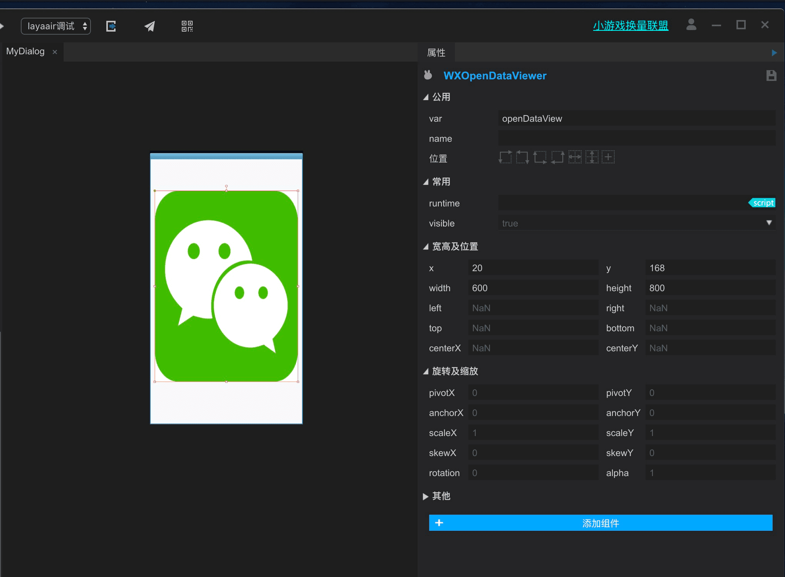

- 新建的 Typescript 文件 如下
- 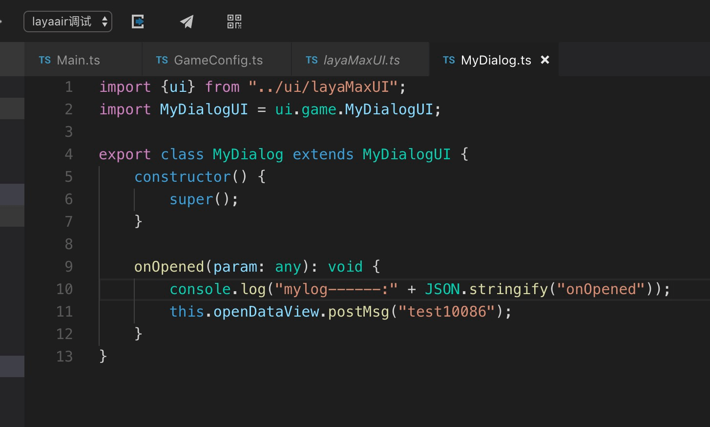

```typescript
import {ui} from "../ui/layaMaxUI";
import MyDialogUI = ui.game.MyDialogUI;

export class MyDialog extends MyDialogUI {
    constructor() {
        super();
    }

    onOpened(param: any): void {
        console.log("mylog------:" + JSON.stringify("onOpened"));
        this.openDataView.postMsg("test10086");
    }
}
```

此时 主域已经准备完毕。

#### 两个项目合并

- 把 刚刚 导出的 子域项目 sunDemo 的 导出文件夹 中的部分文件，复制到 主域项目fatherDemo 项目下面的bin 目录，并且自己新建一个目录，我这边 叫做 “open” 你可以自己定义你的目录名字

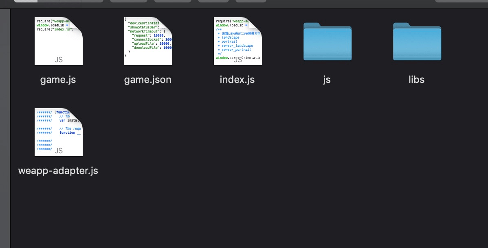

- 修改 fatherDemo 项目 bin  目录下面的 game.json 文件 添加开放域设置

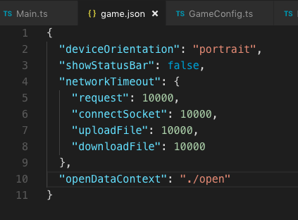

```json
{
  "deviceOrientation": "portrait",
  "showStatusBar": false,
  "networkTimeout": {
    "request": 10000,
    "connectSocket": 10000,
    "uploadFile": 10000,
    "downloadFile": 10000
  },
  "openDataContext": "./open"
}
```

- 然后 把 sunDemo 子域项目 `laya/assets`里面的 test  复制到 fatherDemo主域项目的 对应文件夹 laya/assets 下面 ，然后 编译素材 和代码 

  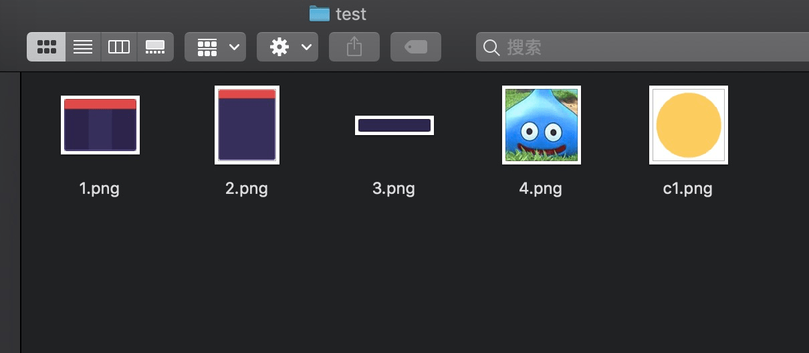

- 准备好一切后 开始 可以发布 项目 

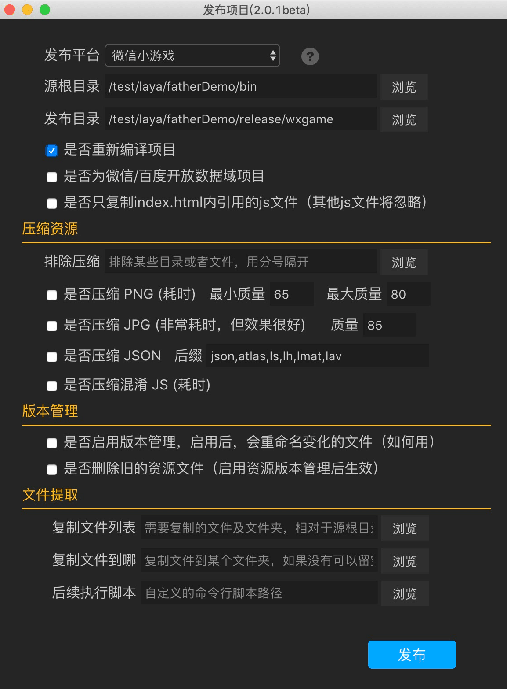

项目发布文本 ，准备用微信模拟器预览效果

#### 微信模拟器预览效果

- 打开模拟器，导入项目，如果自己没有appid 自己可以申请一个 或者自己用系统测试 Appid

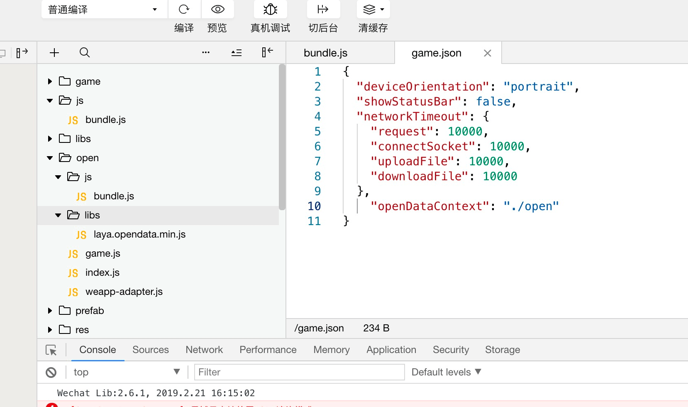

- 最后效果 如图

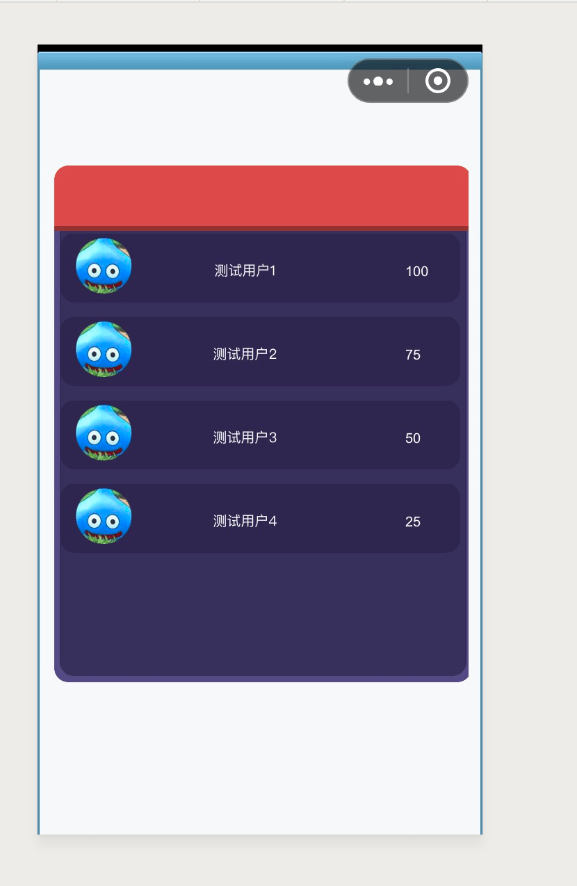

### 后续追加

**2019-08-24：**

以前在开放域里面获取自己的信息，找出哪个是自己的时候，总是从主域里面获取，这样就涉及到获取得到自己的信息，以前总是让用户去授权，然后得到自己的排行，后来发现，其实在子域里面可以直接获取自己的信息：

代码如下：

```typescript
import GameConfig from "./GameConfig";
import BigRank from "./BigRank";
import BigData from "./BigData";
export const RANK_LIST_CONST = {
	RANK_OPEN : "rank_open"
};
class Main {
	constructor() {
		 //设置子域
		Laya.isWXOpenDataContext = true;
		Laya.isWXPosMsg = true;
		//根据IDE设置初始化引擎		
		Laya.init(GameConfig.width, GameConfig.height,false);
		Laya.stage.scaleMode = GameConfig.scaleMode;
		Laya.stage.screenMode = GameConfig.screenMode;
		Laya.stage.alignV = GameConfig.alignV;
		Laya.stage.alignH = GameConfig.alignH;
		// 关于透传接口，请参考: https://ldc2.layabox.com/doc/?nav=zh-ts-5-0-7
		var mark = 0;
		if(Laya.Browser.onMiniGame){
			let path = ["res/atlas/rank.atlas", "rank/fontclip_rank.png"];
			Laya.Browser.window.wx.onMessage(function(data){//微信接受信息
				console.log("jsroads------message:" + JSON.stringify(data.url));
				if(data.url&&this.checkURL(path,data.url)){
					mark ++;
					if(mark == path.length)//确认数据全部接收后
						// console.log("smile------path:" + JSON.stringify(path));
						Laya.loader.load(path,Laya.Handler.create(this,()=>{
							console.log("jsroads------:" + JSON.stringify("子域素材传送成功"));
							wx.getUserInfo({
								openIdList: ['selfOpenId'],
								lang: 'zh_CN',
								success: (res) => {
									// console.log("userInfo"+JSON.stringify(res));
									BigData.ins.user = res.data[0];
								},
								fail: () => {
									console.log("userInfo"+JSON.stringify("fail"));
								},
								complete: () => {
									// console.log("userInfo"+JSON.stringify(selfData));
								}
							});
						}));
				}else {
					let code: string = data.code;
					if(!code)return;
					// console.log("jsroads------message.code:" + JSON.stringify(data.code));
					switch (code) {
						case RANK_LIST_CONST.RANK_OPEN:
							BigRank.ins.open(false,data);
							break;
						default:
							break;
					}
				}
			}.bind(this));
		} else{
			Laya.loader.load("res/atlas/rank.atlas",Laya.Handler.create(this,()=>{
				BigRank.ins.open(false,null);
			}));
		}
	}

	checkURL(list:Array<string>,testStr:string):boolean{
		let bool:boolean = false;
		for (let i = 0; i < list.length; i++) {
			let  str = list[i];
			if(testStr.indexOf(str)!=-1){
				bool = true;
				return bool
			}

		}

		return bool;
	}
}
//激活启动类
new Main();

```

核心代码是：

```typescript
wx.getUserInfo({
								openIdList: ['selfOpenId'],
								lang: 'zh_CN',
								success: (res) => {
									// console.log("userInfo"+JSON.stringify(res));
									BigData.ins.user = res.data[0];
								},
								fail: () => {
									console.log("userInfo"+JSON.stringify("fail"));
								},
								complete: () => {
									// console.log("userInfo"+JSON.stringify(selfData));
								}
							});
```

整理排行的代码，也做了一点更改：`BigRank.ts`

```typescript
import {ui} from "./ui/layaMaxUI"
import BigData from "./BigData";
import Browser = Laya.Browser;

export default class BigRank extends ui.rank.BigUI {
    public static AVATAR_URL: string = "";

    public static get ins(): BigRank {
        if (!this._ins) this._ins = new BigRank();
        return this._ins;
    }

    private static _ins: BigRank;
    // private  myRank: BigItem;

    /**获取好友排行榜时的key */
    private _key: String = 'test10086';
    /**list初始化使用的数据 */
    private arr: Array<any> = [
        {index: 1, avatarIP: 'rank/head.png', UserName: "测试用户1", RankValue: 100},
        {index: 2, avatarIP: 'rank/head.png', UserName: "测试用户2", RankValue: 75},
        {index: 3, avatarIP: 'rank/head.png', UserName: "测试用户3", RankValue: 50},
        {index: 4, avatarIP: 'rank/head.png', UserName: "测试用户4", RankValue: 25},
        {index: 5, avatarIP: 'rank/head.png', UserName: "测试用户5", RankValue: 15},
        {index: 6, avatarIP: 'rank/head.png', UserName: "测试用户6", RankValue: 10},
        {index: 7, avatarIP: 'rank/head.png', UserName: "测试用户7", RankValue: 5},
        {index: 8, avatarIP: 'rank/head.png', UserName: "测试用户8", RankValue: 1},
    ]

    constructor() {
        super();
    }
    onOpened(param: any): void {
        // console.log("jsroads------Sun:" + JSON.stringify("onOpened"));
        param = param||{userInfo:{nickName:"薛定谔的猫",score:100,avatarUrl:""}};
        this.size(param.width,param.height);
        this.visible = false;
        if(param.force&&BigData.ins[param.key]){
            BigRank.ins.drawRankList(BigData.ins[param.key],param.score);
        }else {
            if(Browser.onMiniGame){
                wx.getFriendCloudStorage({
                    keyList: [param.key],
                    success: function (res): void {
                        //关于拿到的数据详细情况可以产看微信文档
                        // //https://developers.weixin.qq.com/minigame/dev/api/UserGameData.html
                        console.log('-----------------getFriendCloudStorage------------');
                        // console.log("jsroads------res.data:" + JSON.stringify(res.data));
                        BigData.ins[param.key] = BigRank.ins.processData(res.data,param.key);
                        BigRank.ins.drawRankList(BigData.ins[param.key],param.score);
                    }
                    , fail: function (data): void {
                        console.log('------------------获取托管数据失败--------------------');
                        console.log(data);
                    }
                });
            }else {
                this.setlist(this.arr);
                this.visible = true;
            }

        }
    }
    /**
     * 设置list arr
     * @param arr 赋值用的arr
     */
    private setlist(arr):void{
        this._list.array =arr;
        this._list.refresh();
        Laya.stage.addChild(this);
    }
    public drawRankList(data: Array<any>,score): void {
        // console.log("drawRankList:"+ JSON.stringify(data));
        let index = 0;
        if (BigData.ins.user) {
            BigData.ins.user.score = score;
            index = this.checkWhichIsMe(data);
            if (index == -1) {
                BigData.ins.user.index = index;
            }
        }
        data.sort((one, another) => {
            if (one.score > another.score) {
                return -1
            } else {
                return 1
            }
        });
        data.forEach(function (item, index, array) {
            item.index = index;
            if (item.avatarUrl == BigData.ins.user.avatarUrl) {
                BigData.ins.user.index = index;
            }
        });
        // console.log("jsroads------last:" + JSON.stringify(data));
        // data =  data.concat(data)
        this._list.array = data;
        this._list.scrollTo(BigData.ins.user.index==-1?0:BigData.ins.user.index);
        if(data.length){
            this.initSetMyself(BigData.ins.user);
            this.container.visible = true;
        }else {
            this.container.visible = false;
        }
        this.visible = true;
    }

    /**
     *
     * @param userInfo 用户自己信息
     * @param data 数据列表
     */
    private checkWhichIsMe(data): any {
        let item: any;
        for (let i = 0; i < data.length; i++) {
            let userInfoElement = data[i];
            if (userInfoElement.avatarUrl == BigData.ins.user.avatarUrl) {
                item = userInfoElement;
                item.score = BigData.ins.user.score;
                return item.index;
            }
        }
        return -1;
    }

    private initSetMyself(userInfo:any){
        // this.container.destroyChildren();
        // this.myRank = new BigItem();
        // this.container.addChild(this.myRank);
        // this.myRank.setMyDataSource(userInfo)
    }

    public processData(data:Array<any>,_key) {
        // 根据 data 做相应处理   有成绩且成绩数据格式正确
        return data.map((player) => {
            let score = player.KVDataList.find(({key}) => key === _key);
            if (!score) return null;
            // 为避免 score.value 中出现无法解析的意外数据
            try {
                player.score = Math.floor(JSON.parse(score.value).score);
            } catch (e) {
                return null
            }
            delete player.KVDataList;
            return player
            // 剔除无效数据
        }).filter(data => data !== null).sort( // 按胜场排序
            (one, another) => {
                if (one.score > another.score) {
                    return -1
                } else {
                    return 1
                }
            }
        ).slice(0, 1000);// 取前100名
    }

    onClosed(type?: string): void {
        BigRank._ins = null;
    }
    /**
     * 接收信息
     * @param message 收到的主域传过来的信息
     */
    private recevieData(message): void {
        var _$this = this;
        var type: String = message.type;
        switch (type) {
            default:
                break;
        }
    }

    /**
     * 上报自己的数据
     * @param data 上报数据
     */
    private setSelfData(data: String): void {
        var kvDataList = [];
        var obj: any = {};
        obj.wxgame = {};
        obj.wxgame.value1 = data;
        obj.wxgame.update_time = Laya.Browser.now();
        kvDataList.push({"key": this._key, "value": JSON.stringify(obj)});
        wx.setUserCloudStorage({
            KVDataList: kvDataList,
            success: function (e): void {
                // console.log('-----success:' + JSON.stringify(e));
            },
            fail: function (e): void {
                // console.log('-----fail:' + JSON.stringify(e));
            },
            complete: function (e): void {
                // console.log('-----complete:' + JSON.stringify(e));
            }
        });
    }
}

```

`BigItem.ts`

```typescript
import {ui} from "./ui/layaMaxUI"
import BigData from "./BigData";
import {LanguageTrans} from "./LanguageTrans";

export default class BigItem extends ui.rank.BigItemUI {
    constructor() {
        super();
    }
    public set dataSource(value) {
        if (!value) return;
        this.img_head.skin = value.avatarUrl;
        this.text_name.text = value.nickname.slice(0,6);
        this.scoreText.text = LanguageTrans.fomatCNByNumber(value.score);
        this.rank_font.value = (value.index+1).toString();
        if(BigData.ins.user.avatarUrl == value.avatarUrl){
            this.bg.skin = "rank/img_1.png";
        }else {
            this.bg.skin = "rank/img_2.png";
        }
        if(value.index<3){
            this.headBorder.skin = "rank/img_rank_"+(value.index+1)+".png";
        }else {
            this.headBorder.skin = "rank/img_rank_4.png";
        }
    }
}

```

`BigData.ts`

```typescript
export default class BigData {
    get user(): any {
        return this._user;
    }

    set user(value: any) {
        this._user = value;
    }

    get rankData(): any {
        return this._rankData;
    }

    set rankData(value: any) {
        this._rankData = value;
    }

    public static get ins(): BigData {
        if (!this._ins) this._ins = new BigData();
        return this._ins;
    }

    private _rankData: any;

    private _user: any;

    private static _ins: BigData;
}
```

numberMin  方法：

```typescript
  /**
     * 得到数字 从第三位开始全部更换成0
     * @param n
     */
    public static numberMin(n: number) {
        let num = Math.floor(n);
        if (num >= LanguageTrans.K) {
            let str = num.toString();
            let headStr = str.slice(0, 2);
            let endStr = str.slice(2, str.length);
            let i = parseInt(headStr) * Math.pow(10, endStr.length);
            return i;
        } else {
            return num;
        }
    }
```

### 总结

这个项目我没有 访问微信的云，而是用了Laya官方自带的本地数据，主要是目录结构比较麻烦，如果用过LayaAir1.0版本，那么这个基本变化不大，但是要注意的是 Layabox 2.0 的Scene 的打开和加载的方式，如果打开不对，就会出现问题，我就遇到了，虽然可以正常显示，位置正确，但是 滑动交互区域不对，只有 四分之一，或者上面的一半是有效交互区域，其他区域可见，但不能交互，无法拖动，后来，我重新整理了这些，然后逐一分析，最终解决问题。

### 参考文章

- [LayaAir之小游戏开放域开发](https://blog.51cto.com/aonaufly/2315353)
- [微信开放数据域](https://ldc2.layabox.com/doc/?nav=zh-ts-5-0-7)
- [关系链数据使用指南](https://developers.weixin.qq.com/minigame/dev/tutorial/open-ability/open-data.html)
- [LayaAir之小游戏的坑之解决之道](https://blog.51cto.com/aonaufly/2315364)