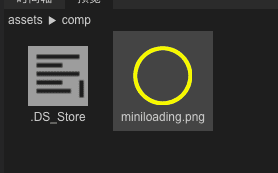
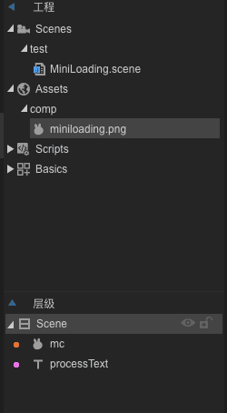
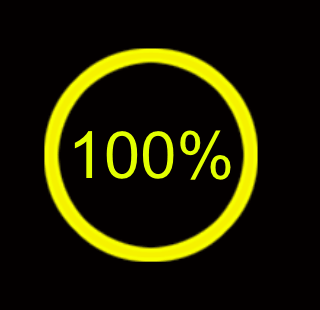
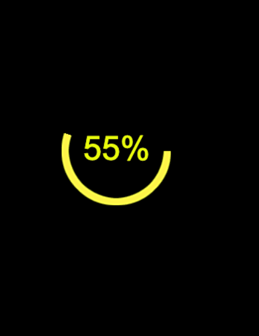

前段时间看了Laya关于进度条的实现，官方给了一个横着的，看到很多小游戏都是自定义的圆形，于是也想实现一个圆形进度条。

<!-- more -->

## 步骤

###  新建项目 铺垫素材

1. 我们需要美术制作一个圆环形，其实最好是两个，另外一个作为下面的背景环形，我这里只是说说思路，一个环形。



2. 项目结构和素材名字大概如下



3. 我们的场景`MiniLoading.scene`放入素材 并且新建一个文本 名字叫 processText 



### 编写代码逻辑

1. 我们新建一个Typescript文件，名字叫做MiniLoading.ts 继承 我们场景创建的UI，代码结构如下


2. 我们编写逻辑，代码如下所示

```typescript

import {ui} from "../ui/layaMaxUI";
import Sprite = Laya.Sprite;
import MiniLoadingUI = ui.test.MiniLoadingUI;

export class MiniLoading extends MiniLoadingUI {
    static get Ins(): MiniLoading {
        if (!this._Ins) this._Ins = new MiniLoading();
        return this._Ins;
    }

    private static _Ins: MiniLoading;

    private angle: number = 0;
    private sp: Sprite;

    constructor() {
        super()
    }

    open(closeOther?: boolean, param?: any): void {
        Laya.Scene.load("test/MiniLoading.scene", Laya.Handler.create(this, () => {
            Laya.stage.addChild(this);
            // 选择中心点 为坐标点
            this.mc.pivotX = this.mc.width * 0.5;
            this.mc.pivotY = this.mc.height * 0.5;
            this.processText.pos(this.mc.x,this.mc.y);
            this.sp = new Sprite();
            this.sp.pos(this.mc.pivotX, this.mc.pivotY);
            // this.addChild(this.sp);
            this.mc.mask = this.sp;
            let radius = Math.max(this.mc.width,this.mc.height);
            // 用timer 模拟一个加载
            Laya.timer.loop(10, this, () => {
                this.angle++;
                if(this.angle>360){
                    Laya.timer.clearAll(this);
                    console.log("Happy------:" + JSON.stringify("加载完成"));
                    //TODO
                    return;
                }
                let process = this.angle==360?"100":(this.angle/360*100).toFixed(0);
                console.log("进度------:" + JSON.stringify(process));
                this.processText.text = process+"%";
                // this.sp.graphics.clear(true);//此代码打开后 在 90 180 270 360 度的时候 会闪一下
                this.sp.graphics.drawPie(0, 0, radius, 0, this.angle, "#00ffff");
            })
        }));
    }

    onOpened(param: any): void {


    }
}
```

4. 编译 查看效果

   

   **制作完成**

## 后记

自从项目升级到Layabox2.0以后，各种新的坑也接踵而至，新的知识扑面而来，官方对于2.0的文档目前泛而不精，只有一些描述的轮廓和介绍，缺少了很多实例和讲解，有时候做东西，如果只是知其然，而不知其所以然，长此以往就会各种茫然，一旦后期遇到重构和优化，会遇到很多棘手的问题。学习要徐徐渐进，才能学有所得。

