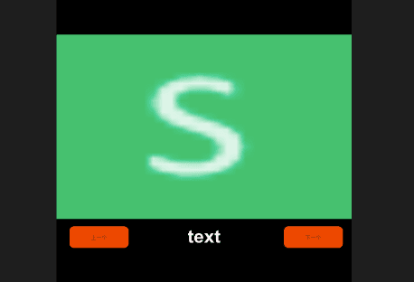
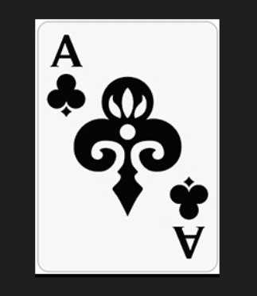

前几天技术群里有人问了一个效果，正好之前我也做过这个效果，只是我做的效果在一个页面的功能里面，当时没有进行组件拆分，既然看到有人问了，想想当时做这个效果也花费了两天时间去思考思路，后面虽然做出来了，但是游戏没有最终上线，所以今天重新整理一下思路，做出这个效果。

<!-- more -->

### 运行环境

- 引擎版本  Layabox2.0
- 编码工具 Webstorm、LayaAir
- 素材  大小相等的图片若干 我准备了几张扑克牌的素材

### 效果需求

1. 需要 滑动过程中 选择的对象 中间的 对象是逐渐变大，越靠近边缘，越变小
2. 点击 下一个  或者上一个的时候 可以每次 向前推进一个 或者向后推进一个
3. 图片要前后循环

### 最终效果

效果图如下


### 制作过程

1. 首先我们先建一个新的项目 比如我的项目叫做 "LayaScroll"的空项目
2. 然后我们创建一个我们要显示的面板 MyScorllView  类别我选择 Scene



3. 我们给 里面的对象分别命名 为 "container"、"nameText"、"leftBtn"、"rightBtn"
4. 然后 我们再新建一个 view 对象  叫做  MyScrollItem 



5. 里面的图片 我们设置 锚点 为中心 这个缩放的时候 就可以是以中心位置缩放  设置变量 为 porkImage
6. 开始编写代码 如下 MyScrollView.ts 

```typescript
/**
 * Created by jsroads on 2019-05-23.16:27
 * Note:
 */
import {ui} from "../ui/layaMaxUI";
import DataConst, {CD_SPACE, DIRECTION, IPork} from "./DataConst";
import MyScrollViewUI = ui.smile.MyScrollViewUI;
import Handler = Laya.Handler;
import Event = Laya.Event;
import Point = Laya.Point;
import GameHelper from "./GameHelper";
import MyScrollItem from "./MyScrollItem";
export const MIDDLE_SIZE = 4;
export default class MyScrollView extends MyScrollViewUI{
    public static PORK_CHANGE: string = "pork_change";//PORK改变
    private porkJson:any;
    private porkList: Array<IPork>;
    private cdViewList: Array<MyScrollItem> = [];
    private direction: number;
    private speed: number;
    private beginTime: number;
    private endTime: number;

    private beginPoint: Point;
    private tempPoint: Point;
    private endTimePoint: Point;
    private changeEvent: number;

    private cdTemptList: Array<any> = [];
    private startIndex: number = 0;
    private endIndex: number = 0;
    private currentPork: IPork;

    private rate: number = 0.95;
    constructor(){
        super();
    }
    public onAwake() {
        this.on(MyScrollView.PORK_CHANGE, this, this.cdChange);
        this.loadJSON();
        this.initEvent();
    }
    private initCD() {
        if (!DataConst.ins.startId) {
            DataConst.ins.startId = 1;
        }
        this.porkList = [];
        for (let key in this.porkJson) {
            this.porkList.push(this.porkJson[key]);
        }
        this.porkList.sort((a, b) => {
            return a.tid > b.tid ? 1 : -1;
        });
        this.startIndex = this.getPorkIndex(DataConst.ins.startId);
        this.startIndex = this.startIndex % this.porkList.length;
        this.endIndex = this.startIndex;
        this.cdTemptList.push(this.getCurMusicFromCD());
        for (let i = 0; i < MIDDLE_SIZE; i++) {
            let cd;
            cd = this.getNextMusicFromCD();
            this.cdTemptList.push(cd);
            cd = this.getPreMusicFromCD();
            this.cdTemptList.unshift(cd);
        }
        // console.log("jsroads------cdTemptList:" + JSON.stringify(this.cdTemptList));
        for (let i = 0; i < this.cdTemptList.length; i++) {
            let msg: any = this.cdTemptList[i];
            msg.index = i;
            let cdViewListElement = new MyScrollItem(msg);
            if (cdViewListElement.info.index == 4) {
                this.setCurrentMusicName(cdViewListElement.info);
            }
            this.cdViewList.push(cdViewListElement);
            this.container.addChild(cdViewListElement);
        }
    }
    public setCurrentMusicName(info: IPork) {
        // SoundMgr.Ins.playSound(SoundURL.PICK);
        this.currentPork = info;
        this.nameText.text = info.name;
    }
    public getPreMusicFromCD() {
        this.startIndex--;
        if (this.startIndex < 0) {
            this.startIndex = this.porkList.length - 1
        }
        let cd = GameHelper.ins.deepCopy(this.porkList[this.startIndex]);
        cd.p_height = this.container.height;
        cd.p_width = this.container.width;
        return cd;
    }

    public getNextMusicFromCD() {
        this.endIndex++;
        if (this.endIndex >= this.porkList.length) {
            this.endIndex = 0
        }
        let cd = GameHelper.ins.deepCopy(this.porkList[this.endIndex]);
        cd.p_height = this.container.height;
        cd.p_width = this.container.width;
        return cd;
    }
    private getPorkIndex(tid) {
        for (let i = 0; i < this.porkList.length; i++) {
            let cdListElement = this.porkList[i];
            if (tid == cdListElement.tid) {
                return i;
            }
        }
        return 0;
    }

    public getCurMusicFromCD() {
        let cd = GameHelper.ins.deepCopy(this.porkList[this.startIndex]);
        cd.p_height = this.container.height;
        cd.p_width = this.container.width;
        return cd;
    }
    private initEvent(): void {
        this.container.on(Event.MOUSE_DOWN, this, (e) => {
            Laya.timer.clear(this, this.updateTime);
            this.resetCDElement();
            this.stage.on(Event.MOUSE_OUT, this, this.onMouseUp);
            this.stage.on(Event.MOUSE_UP, this, this.onMouseUp);
            Laya.stage.on(Event.MOUSE_MOVE, this, this.onMouseMove);
            this.beginTime = Laya.Browser.now();
            this.beginPoint = new Laya.Point(e.stageX, e.stageY);
            this.tempPoint = new Laya.Point(e.stageX, e.stageY);
        });
        this.leftBtn.on(Event.CLICK, this, () => {
            this.leftMusic()
        });
        this.rightBtn.on(Event.CLICK, this, () => {
            this.rightMusic()
        });
    }
    private rightChange() {
        for (let i = 0; i < this.cdViewList.length; i++) {
            let cdViewListElement = this.cdViewList[i];
            if (cdViewListElement.x > 900) {
                return true;
            }
        }
        return false;
    }

    private leftChange() {
        for (let i = 0; i < this.cdViewList.length; i++) {
            let cdViewListElement = this.cdViewList[i];
            if (cdViewListElement.x < -260) {
                return true;
            }
        }
        return false;
    }
    private getDistance(pos1: Point, pos2: Point): number {
        let pos: Point = new Laya.Point(pos2.x - pos1.x, pos2.y - pos1.y);
        return Math.sqrt(pos.x * pos.x + pos.y * pos.y);
    }
    private setCardPosition(distance: number) {
        for (let i = 0; i < this.cdViewList.length; i++) {
            let cdViewListElement = this.cdViewList[i];
            cdViewListElement.x += Math.floor(distance);
            cdViewListElement.resetRightScale()
        }
        if (this.leftChange()) {
            this.cdChange(DIRECTION.LEFT)
        } else if (this.rightChange()) {
            this.cdChange(DIRECTION.RIGHT)
        }
    }

    /**移到事件处理*/
    onMouseMove(e: Event) {
        let point = new Laya.Point(e.stageX, e.stageY);
        let distance = point.x - this.tempPoint.x;
        this.tempPoint = point;
        this.direction = distance > 0 ? DIRECTION.RIGHT : DIRECTION.LEFT;
        this.setCardPosition(distance);

    }
    /**抬起事件处理*/
    private onMouseUp(e: Event): void {
        // console.log("jsroads------onMouseUp:" + JSON.stringify("onMouseUp"));
        Laya.stage.off(Event.MOUSE_UP, this, this.onMouseUp);
        Laya.stage.off(Event.MOUSE_OUT, this, this.onMouseUp);
        Laya.stage.off(Event.MOUSE_MOVE, this, this.onMouseMove);
        this.endTime = Laya.Browser.now();
        this.endTimePoint = new Laya.Point(e.stageX, e.stageY);
        let distance = this.getDistance(this.endTimePoint, this.beginPoint);
        if (Math.abs(distance) <= 5) {
            this.setPosToTarget();
            return;
        }
        this.speed = Math.abs(distance) / (this.endTime - this.beginTime) * 10;
        if ((this.endTimePoint.x - this.beginPoint.x) > 0) {
            this.speed *= 1;
        } else {
            this.speed *= -1;
        }
        Laya.timer.loop(10, this, this.updateTime, [])
    }

    private updateTime(timer, dt) {
        this.speed = this.speed * this.rate;
        if (Math.abs(this.speed) < 1) {
            Laya.timer.clear(this, this.updateTime);
            this.setPosToTarget();
        }
        for (let i = 0; i < this.cdViewList.length; i++) {
            let cdViewListElement = this.cdViewList[i];
            cdViewListElement.x += Math.floor(this.speed);
        }
        if (this.leftChange()) {
            this.cdChange(DIRECTION.LEFT)
        } else if (this.rightChange()) {
            this.cdChange(DIRECTION.RIGHT)
        }
    }
    onOpened(param: any): void {

    }
    loadJSON() {
        let porkURL = "json/pork.json";
        Laya.loader.load(porkURL, Handler.create(null, (success) => {
            this.porkJson = Laya.loader.getRes(porkURL);
            console.log("smile------:" + JSON.stringify(this.porkJson));

            this.initCD();
        }));
    }
    private cdChange(changeEvent) {
        this.changeEvent = changeEvent;
        if (this.changeEvent == DIRECTION.LEFT) {
            let first = this.cdViewList.shift();
            first.x = this.cdViewList[this.cdViewList.length - 1].x + CD_SPACE;
            first.info = this.getNextMusicFromCD();
            this.cdViewList.push(first);
        } else {
            let end = this.cdViewList.pop();
            end.x = this.cdViewList[0].x - CD_SPACE;
            end.info = this.getPreMusicFromCD();
            this.cdViewList.unshift(end)
        }
        this.setCDScale();
    }
    setCDScale() {
        for (let i = 0; i < this.cdViewList.length; i++) {
            let cdViewListElement = this.cdViewList[i];
            cdViewListElement.info.index = i;
            if (i == 4) {
                this.setCurrentMusicName(cdViewListElement.info);
            }
            cdViewListElement.setCDState();
            cdViewListElement.resetRightScale();
        }
    }
    resetCDElement() {
        for (let i = 0; i < this.cdViewList.length; i++) {
            let cdViewListElement = this.cdViewList[i];
            cdViewListElement.stopTime();
        }
    }

    setPosToTarget() {
        for (let i = 0; i < this.cdViewList.length; i++) {
            let cdViewListElement = this.cdViewList[i];
            cdViewListElement.setTargetPos();
        }
    }
    private leftMusic() {
        this.resetCDElement();
        this.cdChange(DIRECTION.RIGHT);
        this.setPosToTarget();
    }

    private rightMusic() {
        this.resetCDElement();
        this.cdChange(DIRECTION.LEFT);
        this.setPosToTarget();
    }
}

```

MyScrollItem.ts

```typescript
/**
 * Created by jsroads on 2019-05-23.16:28
 * Note:
 */
import {ui} from "../ui/layaMaxUI";
import {CD_GRID, CD_SPACE, IPork} from "./DataConst";
import MyScrollItemUI = ui.smile.MyScrollItemUI;
import GameHelper from "./GameHelper";

export default class MyScrollView extends MyScrollItemUI {
    public info: IPork;
    public SINGLE_SCALE: number = 640;

    constructor(data: IPork) {
        super();
        this.info = data;
        this.size(CD_GRID, CD_GRID);
        this.anchorX = this.anchorY = 0.5;
        this.SINGLE_SCALE = this.info.p_width / 80;
    }

    public onEnable() {
        this.y = this.info.p_height / 2;
        this.x = (this.info.index - 4) * CD_SPACE + this.info.p_width / 2;
        // console.log("jsroads------ this.x:" + JSON.stringify(this.x));
        this.setCDState();
        this.resetRightScale();
    }

    public setCDState() {
        this.porkImage.loadImage("pork/" + this.info.icon);
    }

    public setTargetPos() {
        Laya.Tween.clearAll(this);
        let targetX = (this.info.index - 4) * CD_SPACE + this.info.p_width / 2;
        let scale = (this.info.p_width * 0.5 - Math.abs((this.info.p_width * 0.5 - targetX))) / this.SINGLE_SCALE * 0.01 + 0.6;
        Laya.Tween.to(this, {x: targetX}, 150);
        Laya.Tween.to(this.porkImage, {scaleX: scale, scaleY: scale}, 150);
        if (this.info.index == 4) {
            Laya.timer.loop(30, this, this.updateTime, [])
        }
    }
    

    public resetRightScale() {
        let scale = (this.info.p_width * 0.5 - Math.abs((this.info.p_width * 0.5 - this.x))) / this.SINGLE_SCALE * 0.01 + 0.6;
        this.porkImage.scale(scale, scale);
        this.porkImage.scaleX;
        let zOrder = GameHelper.ins.getZorderByIndex(this.info.index);
        if (zOrder != this.zOrder) {
            this.zOrder = zOrder;
        }
    }

    public stopTime() {
        this.porkImage.rotation = 0;
        Laya.timer.clear(this, this.updateTime)
    }

    private updateTime() {
        // this.porkImage.rotation += 1;
    }

}
```

GameHelper.ts

```typescript
/**
 * Created by jsroads on 2019-05-23.17:09
 * Note:
 */
export default class GameHelper {
    static get ins(): GameHelper {
        if(!this._ins) this._ins = new GameHelper();
        return this._ins;
    }

    static set ins(value: GameHelper) {
        this._ins = value;
    }

    private static _ins: GameHelper;
    /**
     * 深度克隆
     * 对象可以完全脱离原对象
     */
    public deepCopy(source): any {
        let target: any = Array.isArray(source) ? [] : {};
        for (var k in source) {
            if (typeof source[k] === 'object') {
                target[k] = this.deepCopy(source[k])
            } else {
                target[k] = source[k]
            }
        }
        return target
    }
    public getZorderByIndex(index: number): number {
        let z: number = 0;
        switch (index) {
            case 4:
                z = 8;
                break;
            case 5:
                z = 7;
                break;
            case 3:
                z = 6;
                break;
            case 6:
                z = 5;
                break;
            case 2:
                z = 4;
                break;
            case 7:
                z = 3;
                break;
            case 1:
                z = 2;
                break;
            case 8:
                z = 1;
                break;
            case 0:
                z = 0;
                break;

        }
        return z
    }
}
```

DataConst.ts

```typescript
/**
 * Created by jsroads on 2019-05-23.16:53
 * Note:
 */
export enum DIRECTION {
    LEFT = -1,
    RIGHT = 1
}
export const CD_SPACE = 120;
export const CD_GRID = 316;

export interface IPork {
    tid: number,
    icon: string,
    show: number,
    star: number,
    name: string,
    type: number,
    url: string,
    index: number,
    p_height: number,
    p_width: number,
    percent: number,
    nextTid: number,
    open: number,
    statusType: number
}

export default class DataConst {
    get startId(): number {
        return this._startId;
    }

    set startId(value: number) {
        this._startId = value;
    }
    static get ins(): DataConst {
        if(!this._ins) this._ins = new DataConst();
        return this._ins;
    }

    static set ins(value: DataConst) {
        this._ins = value;
    }

    private _startId:number = 1;
    private static _ins: DataConst;
}
```

以上是核心代码

### 总结

如果理解了需求，根据需求去设计 需要的效果，这样可以最小化的节省 人力和效率

### 完整DEMO 地址

- [LayaScroll](https://github.com/jsroads/LayaScroll)

