关于大数字使用，前面已经系统的介绍过这个，[大数字BigNumber.js使用](http://blog.asroads.com/post/5aa84949.html)  在Laya1.x的时候也使用这个类库，只是当时项目比较忙，加上我疏于记录，后面就不了了之，昨天下班后，群里一个群友问我Layabox2.x关于([bignumber.js](https://mikemcl.github.io/bignumber.js))使用报错，才有了今天这个文章。
<!--more-->

下面就说说这个类库如何在Layabox2.x里面使用，以及报错  Error: Could not resolve '../../libs/bignumber' from ../../../../../Users/smile/my/test/laya/demo/BNTestdemo/src/script/GameUI.ts. 后如果修改

首先我们还是按照Layabox 正常的添加类库

首先我们还是按照Layabox 正常的添加类库

### 步骤

#### 新建一个项目

这里新建了一个示例项目

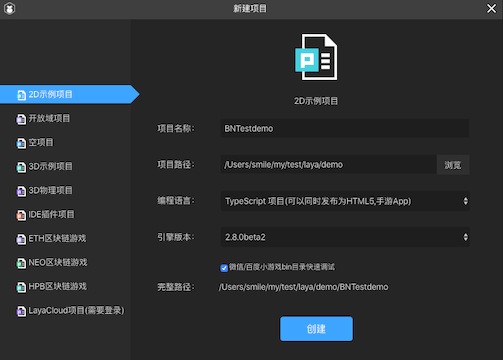

#### 下载bignumber.js

去官方地址下载 ([bignumber.js](https://mikemcl.github.io/bignumber.js))到本地

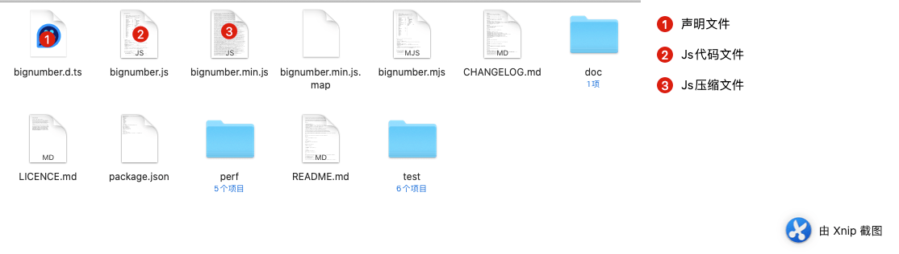

由于项目选择的是Typescript项目所以我们接下来要先把声明文件放到 项目的 libs 下面

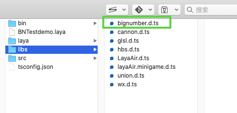

然后把 `bignumber.js`文件放到 bin下面的libs 并且去 LayaIDE里面设置 勾选类库

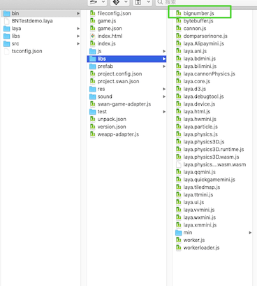

勾选类库

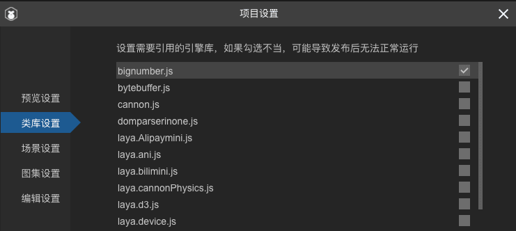

#### 项目内写测试代码

这里我们选择 GameUI.ts 文件的 onEnable 函数下写测试代码

```typescript
import { ui } from "./../ui/layaMaxUI";
import GameControl from "./GameControl"
import BigNumber from "../../libs/bignumber";
    
    ......
    ......
    
    onEnable(): void {
        this._control = this.getComponent(GameControl);
        //点击提示文字，开始游戏
        this.tipLbll.on(Laya.Event.CLICK, this, this.onTipClick);
        let bn = new BigNumber("10000")
        console.log(bn.valueOf())
    }
```

这个时候我们编译代码 发现报错！！！

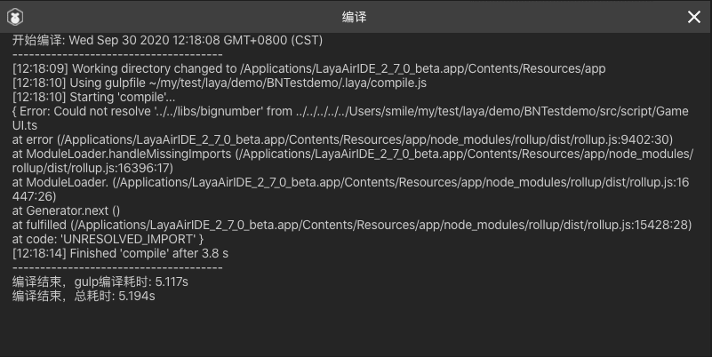

```
开始编译: Wed Sep 30 2020 12:49:29 GMT+0800 (CST)
--------------------------------------
[12:49:30] Working directory changed to /Applications/LayaAirIDE_2_7_0_beta.app/Contents/Resources/app
[12:49:31] Using gulpfile ~/my/test/laya/demo/BNTestdemo/.laya/compile.js
[12:49:31] Starting 'compile'...
{ Error: Could not resolve '../../libs/bignumber' from ../../../../../Users/smile/my/test/laya/demo/BNTestdemo/src/script/GameUI.ts
at error (/Applications/LayaAirIDE_2_7_0_beta.app/Contents/Resources/app/node_modules/rollup/dist/rollup.js:9402:30)
at ModuleLoader.handleMissingImports (/Applications/LayaAirIDE_2_7_0_beta.app/Contents/Resources/app/node_modules/rollup/dist/rollup.js:16396:17)
at ModuleLoader. (/Applications/LayaAirIDE_2_7_0_beta.app/Contents/Resources/app/node_modules/rollup/dist/rollup.js:16447:26)
at Generator.next ()
at fulfilled (/Applications/LayaAirIDE_2_7_0_beta.app/Contents/Resources/app/node_modules/rollup/dist/rollup.js:15428:28)
at code: 'UNRESOLVED_IMPORT' }
[12:49:34] Finished 'compile' after 2.87 s
--------------------------------------
编译结束，gulp编译耗时: 4.057s
编译结束，总耗时: 4.129s
```

这个 怎么回事？难道是路径错了？还是这样加载不对，经过两个小时的搜索和本地测试，发现了问题！


#### 解决方案

原来是声明文件 需要修改才行

原来的声明长这样：代码收缩后

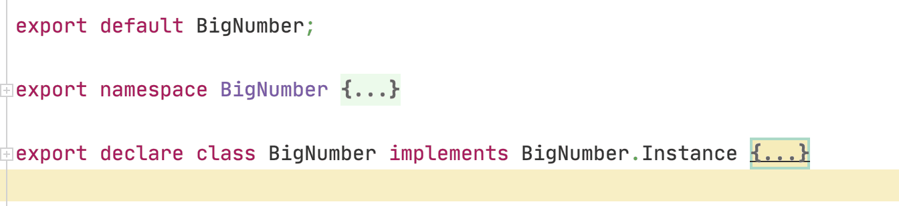

应该修改为 代码收缩后

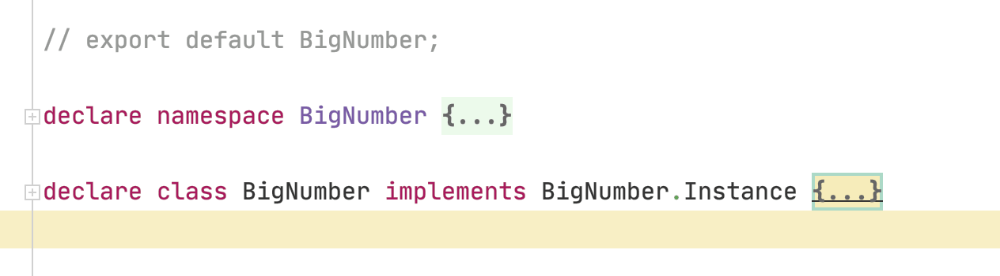

##### 主要操作 

1. 注释掉 第一行 // export default BigNumber;

2. 把 第二行的 export 修改为 declare

3. 删掉 export

然后去修改  GameUI.ts  因为类直接导出了，所以不需要 import BigNumber from "../../libs/bignumber";

##### 删除引用导入

```typescript
import { ui } from "./../ui/layaMaxUI";
import GameControl from "./GameControl"
......
......
    onEnable(): void {
        this._control = this.getComponent(GameControl);
        //点击提示文字，开始游戏
        this.tipLbll.on(Laya.Event.CLICK, this, this.onTipClick);
        let bn = new BigNumber("10000")
        console.log(bn.valueOf())
    }
```

我们再次编译 正常通过 

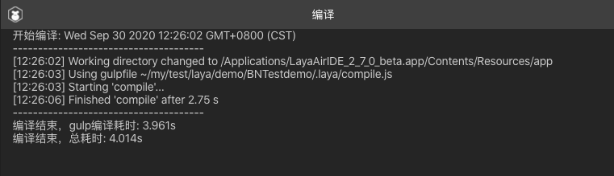

最后运行项目 查看输出

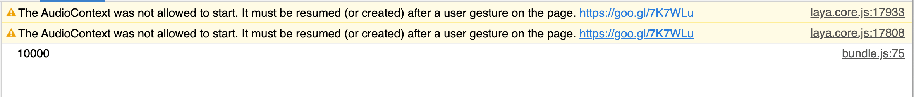

#### 2020年10月24日微信报错更新

有群友反馈 在微信平台报错 测试了一下 确实如此 在Chome环境是OK的，在微信小游戏报错

报错如下：

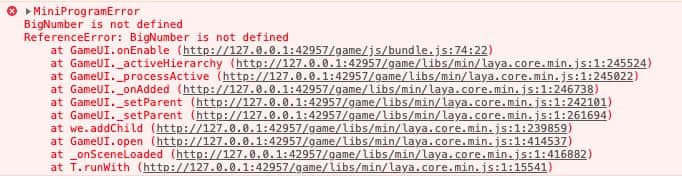

```javascript
MiniProgramError
BigNumber is not defined
ReferenceError: BigNumber is not defined
    at GameUI.onEnable (http://127.0.0.1:42957/game/js/bundle.js:74:22)
    at GameUI._activeHierarchy (http://127.0.0.1:42957/game/libs/min/laya.core.min.js:1:245524)
    at GameUI._processActive (http://127.0.0.1:42957/game/libs/min/laya.core.min.js:1:245022)
    at GameUI._onAdded (http://127.0.0.1:42957/game/libs/min/laya.core.min.js:1:246738)
    at GameUI._setParent (http://127.0.0.1:42957/game/libs/min/laya.core.min.js:1:242101)
    at GameUI._setParent (http://127.0.0.1:42957/game/libs/min/laya.core.min.js:1:261694)
    at we.addChild (http://127.0.0.1:42957/game/libs/min/laya.core.min.js:1:239859)
    at GameUI.open (http://127.0.0.1:42957/game/libs/min/laya.core.min.js:1:414537)
    at _onSceneLoaded (http://127.0.0.1:42957/game/libs/min/laya.core.min.js:1:416882)
    at T.runWith (http://127.0.0.1:42957/game/libs/min/laya.core.min.js:1:15541)
```

看到这里 相信大部分人都知道是咋回事就是全部变量里没有 `BigNumber` 这个对象，怎么回事呢？根据以往的解决经验 我们这里给出两个方案：

##### 方案一：

修改 libs/bignumber.js  文末

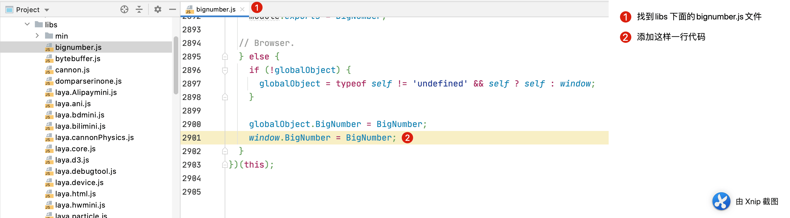

```javascript
 window.BigNumber = BigNumber;
```

修改 libs/bignumber.min.js  文末

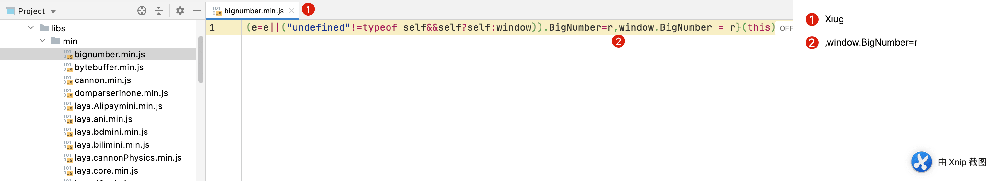


然后 重新导出项目 运行：正常啦


##### 方案二

A方法:修改 导出的小游戏项目 release目录下的 index 

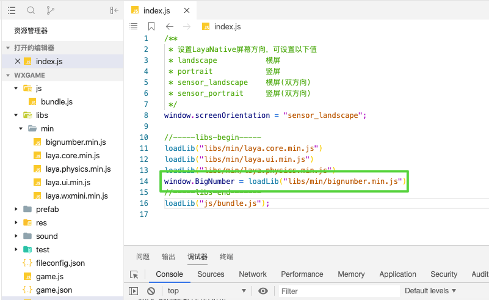

```javascript
window.BigNumber = loadLib("libs/min/bignumber.min.js")
```

B方法:或者 直接在 game.js 修改为下面这样 这个和修改 index.js 道理一样 用哪个都行

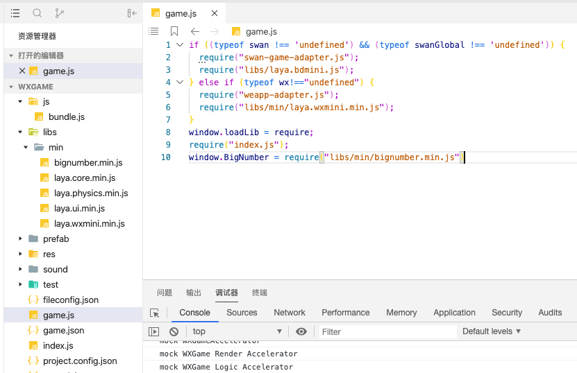

```javascript
window.BigNumber = require("libs/min/bignumber.min.js")
```

相对来讲 我更喜欢第方案一，当然方案二也不错 大家根据各自偏好 修改即可


以上 bignumber.js 正常被项目引入 项目地址：https://github.com/jsroads/LayaBoxDemos/tree/master/BNTestdemo

[点击进入](https://github.com/jsroads/LayaBoxDemos/tree/master/BNTestdemo)

### 总结

问题不是什么大问题，但对第三方库不是很了解的，特别容易采坑，一不小心就很难解决。


### 参考链接

> 
>
> ```
> import YQBCommon = require("../../libs/pb2");
> ```
>
> 引用这个没必要，而且路径也是错的。删除这行，pb2.d.ts没问题后，即可正常使用。。
>
> pb2.d.ts和protobufjs.d.ts也有问题，别用export as namespace 用 declare module
>
> 代码已改。下载改后的项目你试试。
>
> - [myLaya2D.zip](https://ask.layabox.com/file/download/file_name-bXlMYXlhMkQuemlw__url-aHR0cHM6Ly9pbWcubGF5YWJveC5jb20vYW5zd2VyLzIwMTkwMjIwLzg4ZDQ3NzdkODQ1MGRjNDJiODNjNDliNzY1M2ZkYmNm)

[laya2.0引入第三方库失败](https://ask.layabox.com/question/41139?token=37_xuvr6CbtPl4GOvU9q4mU2A6kG4ZHstwtxm8nUwj-hRXN8pR_AymqEzjVplLLUsZazfveY_TbLzTD9wNJScU11fW7oIiWnuNSQJr2npebL5k)

