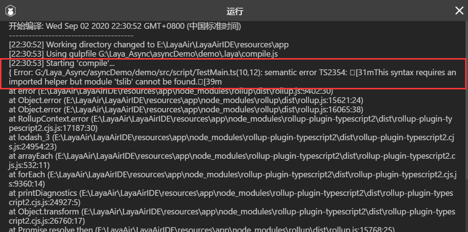
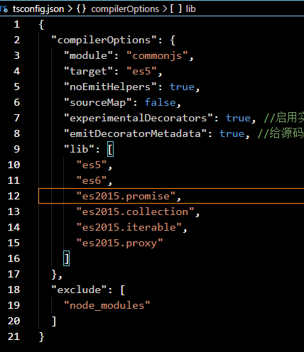

最近重新整理梳理JavaScript和Typescript的知识，开始温习异步的问题，有些疑问就和技术群里群友交流，顺便分享一下心得体会，这次说说LayaBox关于 async wait 和 Promise的使用，群友反映，新版本不能用，作为一直都在用的我，不免有些疑惑，原来当时遇到这个问题的时候已解决，但当时不清楚问题是因何触发的。今天恰好拜读了官网文档和几篇不错的文章，结合群里交流心得整理出来。
<!--more-->
其实问题就是在LayaBox里面 Typescript 或者JavaScript 使用 async wait 的时候 编译 报错：

### 问题现象

```sh
semantic error TS2354: This syntax requires an imported helper but module 'tslib' cannot be found
```



去年我遇到此问题的时候，就解决了，当时的解决方案如下: 文章链接:[Layabox2.3.0如何配置代码编辑器(WebStorm2019)](http://blog.asroads.com/post/3f34ea36.html)

#### 解决办法1

> **解决办法**：参考链接 [stackoverflow](https://stackoverflow.com/questions/52801814/this-syntax-requires-an-imported-helper-but-module-tslib-cannot-be-found-wit)
>
> > Noob mistake (which I just made). Try:
> >
> > ```
> > npm install tslib
> > ```
> >
> > or
> >
> > ```
> > npm i
> > ```
> >
> > Personally before signing off on Friday I did a `git clean -fxd`, but no `npm i` so all the npm packages were missing. Doh!
>
> 我只用了 `npm install tslib` 就成功解决问题。

这样就可以正常使用了，可以把这个案子到全局，这样就一切正常了！

#### 解决办法2 

群友用了另外一种办法也解决了，如下:



就是在 tsconfig.json 文件 添加 promise 库

### 小插曲

这样不仅让我反思了 这个问题形成的元凶，恰好最近两天读了一篇文章： [从 JavaScript 到 TypeScript - 模块化和构建](https://segmentfault.com/a/1190000008996172)

里面提到这样的一段:

> ## 常用的构建配置
>
> 我们早期项目中使用 TypeScript 的命名空间，不过最近几乎都重构成 ES6 模块方式了。由于会用到 async 函数，所以一般会配置 TypeScript 输出 ES2017 代码，再通过 Babel 转译成 ES5 代码，最后由 Webpack 打包输出。
>
> ### tsconfig.json
>
> ```
> {
>     "compilerOptions": {
>         "module": "commonjs",
>         "target": "es2017",
>         "lib": [
>             "dom",
>             "es6",
>             "dom.iterable",
>             "scripthost",
>             "es2017"
>         ],
>         "noImplicitAny": false,
>         "sourceMap": false
>     }
> }
> ```
>
> 在 `target` 为 `es5` 或 `es6` 的时候，TypeScript 会有默认的 `lib` 列表，这在[官方文档](http://www.typescriptlang.org/docs/handbook/compiler-options.html)中有详细说明。`target` 定义为 `es2017` 是为了支持 async 函数，但这个配置没有默认 `lib` 列表，所以参考官方文档对 `--target es6` 使用的 `lib` 列表，补充 `es2017` 类型库即可。

其中下面这句话 印证也说明了问题的产生原因:`target` 定义为 `es2017` 是为了支持 async 函数...

其实就是说，如果`target` 不是 `es2017` 就是不支持 async 函数，这样 上面的问题的产生，已经解决方案就显得顺利成章了！

这次的学习，说巧不巧，恰好遇到这篇文章，恰好遇到问题复现，恰好有个时间反思，故而，写下来这篇文章，让更多人少走弯路吧！！

### 参考文章

- [从 JavaScript 到 TypeScript - 模块化和构建](https://segmentfault.com/a/1190000008996172)
- [async和await:让异步编程更简单](https://developer.mozilla.org/zh-CN/docs/learn/JavaScript/%E5%BC%82%E6%AD%A5/Async_await)
- [带你玩转 JavaScript ES6 (七) - 异步](https://segmentfault.com/a/1190000013171493)

