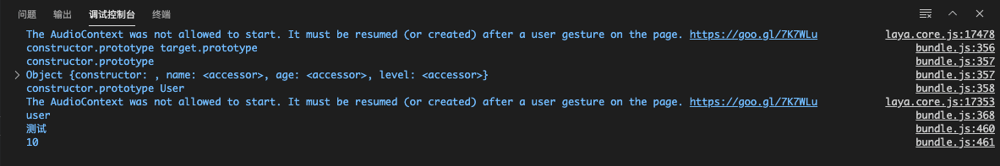
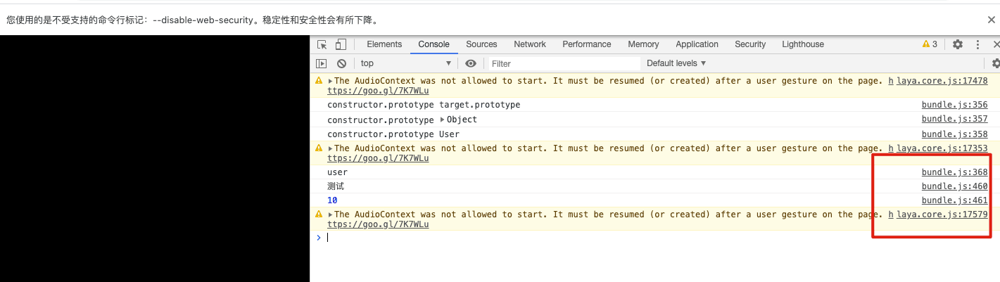
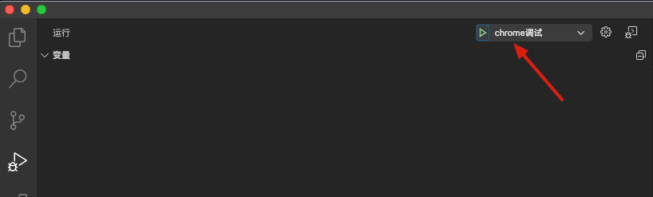
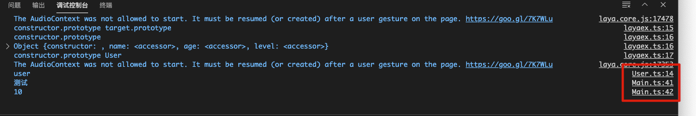
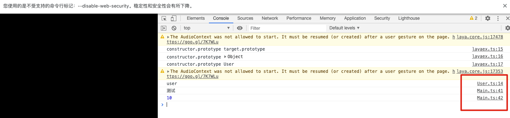
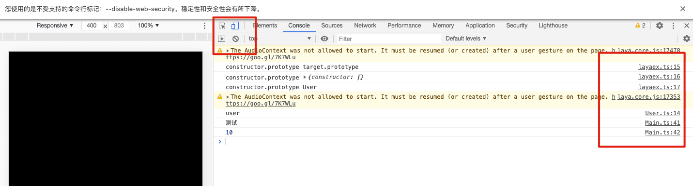

LayaBox项目新建项目的时候，如果使用VScode作为代码编辑器，显示的文件路径是编译压缩后的文件名字，这个用编辑器调试的时候很不方便，下面就说说如何修改为我们的源代码.ts文件。
<!--more-->Layabox 项目日志 显示TS文件

## 最初显示

vscode 效果



Chrome 效果




## 安装Debugger for Chrome


## 修改项目参数设置

### tsconfig.json 修改

`"sourceMap": true`

```json
{
  "compilerOptions": {
    "experimentalDecorators": true,
    "module": "es6",
    "target": "es6",
    "noEmitHelpers": true,
    "sourceMap": true
  },
  "exclude": [
    "node_modules"
  ]
}
```

### .laya文件内 compile.js

`sourcemap: true` **两处**

```json
// v1.2.3
//是否使用IDE自带的node环境和插件，设置false后，则使用自己环境(使用命令行方式执行)
const useIDENode = process.argv[0].indexOf("LayaAir") > -1 ? true : false;
const useCMDNode = process.argv[1].indexOf("layaair2-cmd") > -1 ? true : false;

function useOtherNode(){
	return useIDENode||useCMDNode;
}
//获取Node插件和工作路径
let ideModuleDir = useOtherNode() ? process.argv[1].replace("gulp\\bin\\gulp.js", "").replace("gulp/bin/gulp.js", "") : "";
let workSpaceDir = useOtherNode() ? process.argv[2].replace("--gulpfile=", "").replace("\\.laya\\compile.js", "").replace("/.laya/compile.js", "") : "./../";

const gulp = require(ideModuleDir + "gulp");
const rollup = require(ideModuleDir + "rollup");
const typescript = require(ideModuleDir + 'rollup-plugin-typescript2');//typescript2 plugin
const glsl = require(ideModuleDir + 'rollup-plugin-glsl');

// 如果是发布时调用编译功能，增加prevTasks
let prevTasks = "";
if (global.publish) {
	prevTasks = ["loadConfig"];
}

gulp.task("compile", prevTasks, function () {
	// 发布时调用编译功能，判断是否点击了编译选项
	if (global.publish && !global.config.compile) {
		return;
	} else if (global.publish && global.config.compile) {
		// 发布时调用编译，workSpaceDir使用publish.js里的变量
		workSpaceDir = global.workSpaceDir;
	}

	return rollup.rollup({
		input: workSpaceDir + '/src/Main.ts',
		onwarn:(waring,warn)=>{
			if(waring.code == "CIRCULAR_DEPENDENCY"){
				console.log("warnning Circular dependency:");
				console.log(waring);
			}
		},
		treeshake: false, //建议忽略
		plugins: [
			typescript({
				tsconfig:workSpaceDir + "/tsconfig.json",
				check: true, //Set to false to avoid doing any diagnostic checks on the code
				tsconfigOverride:{compilerOptions:{removeComments: true}},
				include:/.*.ts/,
			}),
			glsl({
				// By default, everything gets included
				include: /.*(.glsl|.vs|.fs)$/,
				sourceMap: true,
				compress:false
			}),
			/*terser({
				output: {
				},
				numWorkers:1,//Amount of workers to spawn. Defaults to the number of CPUs minus 1
				sourcemap: false
			})*/        
		]
	}).then(bundle => {
		return bundle.write({
			file: workSpaceDir + '/bin/js/bundle.js',
			format: 'iife',
			name: 'laya',
			sourcemap: true
		});
	}).catch(err=>{
			console.log(err);
		
	})
});
```

### 运行结果

1. 点击VScode 调试运行 选择 Chrome  

   

2. 

3. Chrome  对应输出也变了



4. 手机模式一样是




5. 查看日志，修改源码特别方便


以上就是整个配置过程。

## 注意事项

配置修改完毕 记得要重新编译项目运行才能生效！！！


