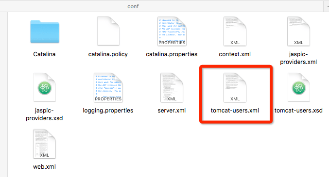
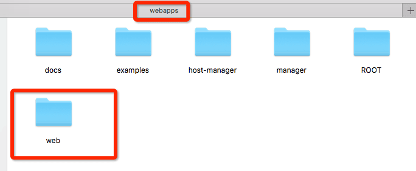
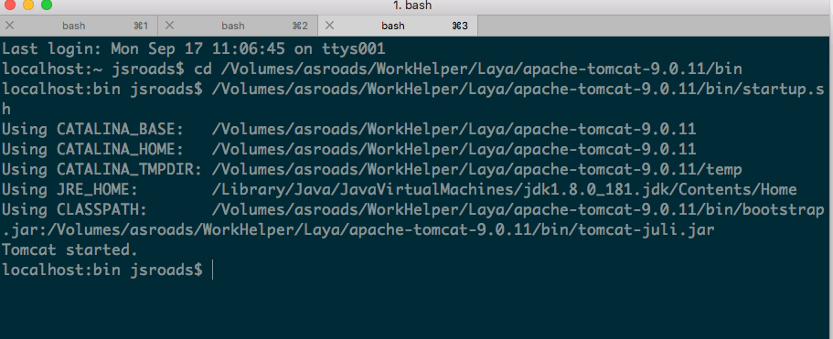
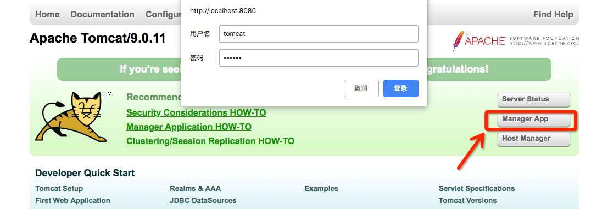
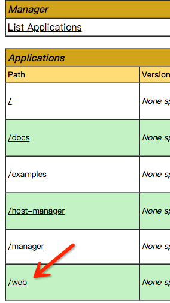

### 学习遇到的困惑

初步学习Layabox，既陌生又熟悉，遇到问题很困惑，解决问题时很兴奋。下面重点说说我这几天学习遇到的一些问题和我解决办法。

<!-- more -->

---

#### 问题一：Laya Ide 无法调试

问题描述：我刚刚装上IDE就遇到这样的悲催，实在是头疼

```
Cannot connect to runtime process,timeout after 10000ms -(reason: cannot connect to the target :connect to the target :connect Econnrefused 127.0.0.1:9222)
```

错误:Debug adapter process has terminated unexpectedly

layabox ide 无法调试 ，console.log 打印无效，不知道是什么情况！

后来才知道，原来是我第一次调试结束之后没有正常关闭页面，我需要点击工具栏的停止按钮

项目运行完后没有在LayaAirIDE上结束运行，而是直接关闭了运行效果窗口。
因为是新手，免不了直接关闭，最好是在下图上面关闭，快捷键是  Shift+F5

#### 问题二：LayaAir提示：版本不匹配!全局tsc(2.7.2)!=VS Code的语言服务(2.1.5)。可能出现不一致的编译错误

问题描述：上面的第一个问题刚刚解决，就入了第二个坑，实在是“有福啦！”

##### 第一种办法：

这个错误意思是VS Code内置的TypeScript与本地安装的TypeScript版本号不匹配；

在cmd窗口输入：tsc -v，发现当前本地的TypeScript版本号是2.7.2

为此，需要修改本地TypeScript版本号为2.1.5，在cmd中输入下面的命令重新安装下就好了：

npm install -g typescript@2.1.5

重新查看版本号，发现已经改过来了

重启LayaAir就正常了。

##### 第二种办法

因为ide内置的是2.1.5 只是用来代码提示 编译时候还是用的开发者自己电脑安装的版本，对项目编译不会造成任何影响，不用管就可以了！

用户设置里面可以配置对应的属性，配置下就好了。对应的属性是：
"typescript.tsdk": "XXX/node_modules/typescript/lib"

XXX为各位的npm酷的路径位置

如果你非要改，针对mac和windows我分别说一下：
1、mac
文件－》首选项－》用户设置，搜索typescript，会发现
"typescript.tsdk": null,这一条
在右面选中   用户设置，在下面添加这么一行：
"`typescript.tsdk":"/usr/local/lib/node_modules/typescript/lib`"
/usr/local/lib/node_modules/typescript这个路径是你安装typescript的路径，如果找不到，可以敲命令看看它安装在哪里了：npm list -g typescript
command+s保存一下

2、windows
windows和mac基本上是一样的，找到那个配置然后也是在那个用户设置区域里添加一行：
"typescript.tsdk":"C:/**path**/npm/node_modules/typescript/lib"

上面这个路径是个示例，你可以在命令行里同样敲打命令`npm list -g typescript` 来找一下你`windows`里typescript安装在了哪里。

**注意：**对于我来讲喜欢拥抱新事物，我用的是方法二的修改配置文件,另外如果是Windows系统，注意路径是`/`而不是`\`

### 问题三：Webstorm中如何指定编译后的JavaScript目录

问题描述：用了Webstorm 需要实时编译ts，而且要遵守Layabox 指定的目录，这个知识，之前我是模糊了解

这次遇到坑，找了很久才找到，其实之前看到过，知识走马观花，没有认真学习

#### 方法：

需要修改项目下的 `tsconfig.json`文件里 指定一个    "outDir": "bin/js",

```json
{
  "compilerOptions": {
    "module": "commonjs",
    "target": "es5",
    "outDir": "bin/js",
    "sourceMap": true,
    "removeComments": true
  },
  "exclude": [
    "node_modules"
  ]
}
```

### 问题四 我成功发布后的Web 却无法 在本地打开

问题描述：我本地已经把游戏调试成功，我也成功发布了Web版本，但是我打开release目录下的web 发现不能打开。

问题理解：网上说这个是因为Chome 跨域访问问题。

#### 解决方案：

我打算在本地搭建一个服务器环境，虽然对于我做前端的来讲有点陌生，但是有石头，挡住了路，就得把石头搬开啊！

使用Tomcat 解决。

- 先去下载Tomcat文件，然后解压后（需要有JDK环境）修改`conf`文件夹下面的“tomcat-users.xml”



```xml
<role rolename="manager-gui"/>
<user username="tomcat" password="tomcat" roles="manager-gui"/>
</tomcat-users>
```

添加 username 和 密码  我这里都是 “tomcat”

然后把 web项目 放到“webapps”下面



然后启动Tomcat 



（就是运行Tomcat的bin目录下的 startup.sh 或者startup.bat，shutdown.bat或shutdown.sh是关闭服务器）

现在打开 `http://localhost:8080/` 就看到



点击登录 就打开我们的项目 




