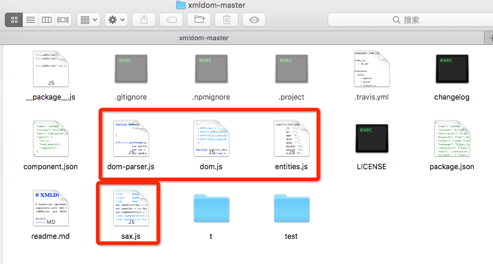
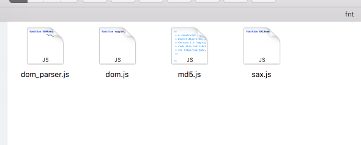

### 问题描述:Layabox中位图字体(BitmapFont)关于微信小游戏无法正常显示

- 在LayaAir和Webstorm下面都能正常显示 在Web下也可以正常显示，到了微信模拟器就消失

<!-- more -->

### 原因分析

- 在微信里面 解析fnt有问题，需要有xml 解析器

### 解决方案

1. 下载[xml解析库](http://fairygui.oss-cn-shenzhen.aliyuncs.com/js.rar)，引入方式：

```typescript
window.Parser = require("./js/dom_parser");
```

**和此库相同的还有** [xmldom库](https://github.com/jindw/xmldom)：https://github.com/jindw/xmldom

1. 需要在相应的文件目录下面放置 



------



------

### 需要配合的有

- 微信小游戏fnt 最后要远程加载
- laya官网介绍的位图字体格式 要转成 utf-8 格式（反正我这边转了之后才能用，大家看自己的环境而定）
- 因为引入了新的库导致了新的bug
- 微信模拟器下报错`“gameThirdScriptError”`错误，找到最后原因竟然是“Laya.MiniAdpter.init(true, false);”

这个方法的第一个参数为true导致。但是我又必须开放这个，如何？所以这个就是要远程加载字体的原因。

位图字体制作原生发布代码库

### 位图字体生产工具

- [Glyph Designer](https://71squared.com/glyphdesigner)
- [Hiero](https://github.com/libgdx/libgdx/wiki/Hiero)
- [BMFont (Windows)](http://www.angelcode.com/products/bmfont/)


