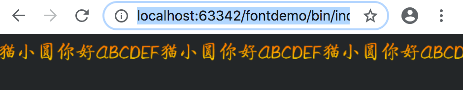

### LayaBox 位图字体 解决微信小游戏不支持xml格式

Layabox 对于微信小游戏支持 还是蛮好的，但是在位图字体上面，Layabox 使用的是 xml 格式，然后通过fnt配置文件解析 程 texture文理，然后再根据位置坐标渲染，但是微信小游戏官方不支持后缀名为xml格式的，结果我们的游戏在本地和微信开发工具都是好的，发出的体验版也是正常的，但是在微信提交审核的时候，连续被拒绝，找了很多原因，最后定位是字体不能正常从远端下载解析。所以 我就结合cocos关于位图字体的方法，二者结合，完美解决了，位图字体的问题。

<!-- more -->

### 学习背景知识

- [Layabox位图字体的制作与使用](https://ldc.layabox.com/doc/?nav=zh-ts-1-2-5)
- [Glyph Designer](https://71squared.com/glyphdesigner)（在线位图字体制作工具，收费，需要注册）
- [Hiero](https://github.com/libgdx/libgdx/wiki/Hiero)（位图字体制作工具，免费）
- [BMFont (Windows)](http://www.angelcode.com/products/bmfont/)（Windows环境位图字体制作工具，免费）
- [ShoeBox](https://link.jianshu.com/?t=http://renderhjs.net/shoebox/)（允许您从图像加载自定义的字形，然后从中创建位图字体）
- [Littera](https://link.jianshu.com/?t=http://kvazars.com/littera) - 在线位图字体生成器，具有大量的自定义内容（需要Adobe Flash）。

### 开始分析

1. 首先我们看到Layabox 关于位图字体的处理逻辑，这个在 `Laya.BitmapFont`里面，我们可以从官方的类库里，看到具体的处逻辑。

   ```javascript
   /**
   *<code>BitmapFont</code> 是位图字体类，用于定义位图字体信息。
   */
   //class laya.display.BitmapFont
   var BitmapFont=(function(){
   	function BitmapFont(){
   		this._texture=null;
   		this._fontCharDic={};
   		this._fontWidthMap={};
   		this._complete=null;
   		this._path=null;
   		this._maxWidth=0;
   		this._spaceWidth=10;
   		this._padding=null;
   		/**当前位图字体字号。*/
   		this.fontSize=12;
   		/**表示是否根据实际使用的字体大小缩放位图字体大小。*/
   		this.autoScaleSize=false;
   		/**字符间距（以像素为单位）。*/
   		this.letterSpacing=0;
   	}
   
   	__class(BitmapFont,'laya.display.BitmapFont');
   	var __proto=BitmapFont.prototype;
   	/**
   	*通过指定位图字体文件路径，加载位图字体文件，加载完成后会自动解析。
   	*@param path 位图字体文件的路径。
   	*@param complete 加载并解析完成的回调。如果成功返回this,如果失败返回null
   	*/
   	__proto.loadFont=function(path,complete){
   		this._path=path;
   		this._complete=complete;
   		Laya.loader.load([{url:this._path,type:/*laya.net.Loader.XML*/"xml"},{url:this._path.replace(".fnt",".png"),type:/*laya.net.Loader.IMAGE*/"image"}],Handler.create(this,this.onLoaded));
   	}
   
   	/**
   	*@private
   	*/
   	__proto.onLoaded=function(){
   		this.parseFont(Loader.getRes(this._path),Loader.getRes(this._path.replace(".fnt",".png")));
   		this._complete && this._complete.runWith(this._texture?this:null);
   	}
   
   	/**
   	*解析字体文件。
   	*@param xml 字体文件XML。
   	*@param texture 字体的纹理。
   	*/
   	__proto.parseFont=function(xml,texture){
   		if (xml==null || texture==null)return;
   		this._texture=texture;
   		var tX=0;
   		var tScale=1;
   		var tInfo=xml.getElementsByTagName("info");
   		if (!tInfo[0].getAttributeNode){
   			return this.parseFont2(xml,texture);
   		}
   		this.fontSize=parseInt(tInfo[0].getAttributeNode("size").nodeValue);
   		var tPadding=tInfo[0].getAttributeNode("padding").nodeValue;
   		var tPaddingArray=tPadding.split(",");
   		this._padding=[parseInt(tPaddingArray[0]),parseInt(tPaddingArray[1]),parseInt(tPaddingArray[2]),parseInt(tPaddingArray[3])];
   		var chars;
   		chars=xml.getElementsByTagName("char");
   		var i=0;
   		for (i=0;i < chars.length;i++){
   			var tAttribute=chars[i];
   			var tId=parseInt(tAttribute.getAttributeNode("id").nodeValue);
   			var xOffset=parseInt(tAttribute.getAttributeNode("xoffset").nodeValue)/ tScale;
   			var yOffset=parseInt(tAttribute.getAttributeNode("yoffset").nodeValue)/ tScale;
   			var xAdvance=parseInt(tAttribute.getAttributeNode("xadvance").nodeValue)/ tScale;
   			var region=new Rectangle();
   			region.x=parseInt(tAttribute.getAttributeNode("x").nodeValue);
   			region.y=parseInt(tAttribute.getAttributeNode("y").nodeValue);
   			region.width=parseInt(tAttribute.getAttributeNode("width").nodeValue);
   			region.height=parseInt(tAttribute.getAttributeNode("height").nodeValue);
   			var tTexture=Texture.create(texture,region.x,region.y,region.width,region.height,xOffset,yOffset);
   			this._maxWidth=Math.max(this._maxWidth,xAdvance+this.letterSpacing);
   			this._fontCharDic[tId]=tTexture;
   			this._fontWidthMap[tId]=xAdvance;
   		}
   	}
   
   	......//此处省略，需要研究的可以去 laya.core.js 下面看源码
   
   	return BitmapFont;
   })()
   ```

   以上是完整的内容，如果你嫌麻烦，可以直接跳过，其实主要的核心就是 `loadFont `这个方法，这个里面是把后缀名为fnt的当成xml 格式处理。我们只需要修改为 text格式就好。

   ```javascript
   	/**
   	*通过指定位图字体文件路径，加载位图字体文件，加载完成后会自动解析。
   	*@param path 位图字体文件的路径。
   	*@param complete 加载并解析完成的回调。如果成功返回this,如果失败返回null
   	*/
   	__proto.loadFont=function(path,complete){
   		this._path=path;
   		this._complete=complete;
   		Laya.loader.load([{url:this._path,type:/*laya.net.Loader.XML*/"xml"},{url:this._path.replace(".fnt",".png"),type:/*laya.net.Loader.IMAGE*/"image"}],Handler.create(this,this.onLoaded));
   	}
   ```

   然后是关于加载后的 xml 内容的解析，我们修改成 text 格式的解析即可

   ```
   /**
   	*解析字体文件。
   	*@param xml 字体文件XML。
   	*@param texture 字体的纹理。
   	*/
   	__proto.parseFont=function(xml,texture){
   		if (xml==null || texture==null)return;
   		this._texture=texture;
   		var tX=0;
   		var tScale=1;
   		var tInfo=xml.getElementsByTagName("info");
   		if (!tInfo[0].getAttributeNode){
   			return this.parseFont2(xml,texture);
   		}
   		this.fontSize=parseInt(tInfo[0].getAttributeNode("size").nodeValue);
   		var tPadding=tInfo[0].getAttributeNode("padding").nodeValue;
   		var tPaddingArray=tPadding.split(",");
   		this._padding=[parseInt(tPaddingArray[0]),parseInt(tPaddingArray[1]),parseInt(tPaddingArray[2]),parseInt(tPaddingArray[3])];
   		var chars;
   		chars=xml.getElementsByTagName("char");
   		var i=0;
   		for (i=0;i < chars.length;i++){
   			var tAttribute=chars[i];
   			var tId=parseInt(tAttribute.getAttributeNode("id").nodeValue);
   			var xOffset=parseInt(tAttribute.getAttributeNode("xoffset").nodeValue)/ tScale;
   			var yOffset=parseInt(tAttribute.getAttributeNode("yoffset").nodeValue)/ tScale;
   			var xAdvance=parseInt(tAttribute.getAttributeNode("xadvance").nodeValue)/ tScale;
   			var region=new Rectangle();
   			region.x=parseInt(tAttribute.getAttributeNode("x").nodeValue);
   			region.y=parseInt(tAttribute.getAttributeNode("y").nodeValue);
   			region.width=parseInt(tAttribute.getAttributeNode("width").nodeValue);
   			region.height=parseInt(tAttribute.getAttributeNode("height").nodeValue);
   			var tTexture=Texture.create(texture,region.x,region.y,region.width,region.height,xOffset,yOffset);
   			this._maxWidth=Math.max(this._maxWidth,xAdvance+this.letterSpacing);
   			this._fontCharDic[tId]=tTexture;
   			this._fontWidthMap[tId]=xAdvance;
   		}
   	}
   ```

   2. 然后我们去看 Cocos2d关于位图字体的解析 地址是[cocos2d-x](https://github.com/cocos2d/cocos2d-x)(我这里是版本是 cocos2d-x-3.17)，我们知道 cocos2d 里面位图字体处理类是 LabelBMFont 位于路径：cocos2d-x-3.17/web/cocos2d/labels/LabelBMFont.js

   3. 然后开始组装我们自己的类，首先我们自己新建一个类，继承 `Laya.BitmapFont`  我们就叫LabelBMFont.ts吧

   4. 然后 把 cocos 相关的 都copy（复制）过来，根据layabox这边对应的内容，修改

      ```typescript
      /**
       * Created by asroads on 2018/11/24.下午6:14
       * Note:
       */
      
      
      module smile {
          import Handler = Laya.Handler;
          import Rectangle = Laya.Rectangle;
          import Texture = Laya.Texture;
      
          export class LabelBMFont extends Laya.BitmapFont {
              constructor() {
                  super();
              }
      
              public loadFont = function (path, complete) {
                  this._path = path;
                  this._complete = complete;
                  Laya.loader.load([{
                      url: this._path,
                      type: Laya.Loader.TEXT
                  }, {
                      url: this._path.replace(".fnt", ".png"),
                      type: /*laya.net.Loader.IMAGE*/"image"
                  }], Handler.create(this, this.onLoaded));
              }
              public parseFont = function (xml, texture) {
                  if (xml == null || texture == null) return;
                  this._texture = texture;
                  this.fontSize = 32;//此处我直接写成32，需要修改的自己修改
                  this._padding = [0, 0, 0, 0];//此处我直接写成[0, 0, 0, 0]，需要修改的自己修改
                  let chars, tScale = 1;
                  let fntRes = Laya.loader.getRes(this._path);
                  chars = LabelBMFontHelper.parseFnt(fntRes, this._path);
                  for (let key in chars.fontDefDictionary) {
                      let tAttribute = chars.fontDefDictionary[key];
                      let tId = key;
                      let xOffset = parseInt(tAttribute["xOffset"]) / tScale;
                      let yOffset = parseInt(tAttribute["yOffset"]) / tScale;
                      let xAdvance = parseInt(tAttribute["xAdvance"]) / tScale;
                      let region = new Rectangle();
                      region.x = parseInt(tAttribute["rect"]["x"]);
                      region.y = parseInt(tAttribute["rect"]["y"]);
                      region.width = parseInt(tAttribute["rect"]["width"]);
                      region.height = parseInt(tAttribute["rect"]["height"]);
                      let tTexture = Texture.create(texture, region.x, region.y, region.width, region.height, xOffset, yOffset);
                      this._maxWidth = Math.max(this._maxWidth, xAdvance + this.letterSpacing);
                      this._fontCharDic[tId] = tTexture;
                      this._fontWidthMap[tId] = xAdvance;
                  }
              }
          }
      }
      
      ```

      5.然后 同一个文件夹内的 辅助 类 LabelBMFontHelper.ts   我基本是把 cocos2d 完全拷贝过来 ，大家需要修改的 自己根据需要修改。

      ```typescript
      /**
       * Created by asroads on 2018/11/27.下午14:38
       * Note:
       */
      
      module smile {
          export class LabelBMFontHelper {
              private static FNT_HEAD = /fntframes [^\n]*(\n|$)/gi;
              private static FNT_FRAME_NAME = /fntframe [^\n]*(\n|$)/gi;
              private static INFO_EXP = /info [^\n]*(\n|$)/gi;
              private static COMMON_EXP = /common [^\n]*(\n|$)/gi;
              private static PAGE_EXP = /page [^\n]*(\n|$)/gi;
              private static CHAR_EXP = /char [^\n]*(\n|$)/gi;
              private static KERNING_EXP = /kerning [^\n]*(\n|$)/gi;
              private static ITEM_EXP = /\w+=[^ \r\n]+/gi;
              private static INT_EXP = /^[\-]?\d+$/;
      
              public static parseFnt(fntStr, url) {
                  let fnt = {};
                  let headString = fntStr.match(LabelBMFontHelper.FNT_HEAD);
                  fnt = this.parseFntContent(fnt, fntStr, url, null);
                  return fnt;
              }
      
              private static parseStrToObj(str) {
                  let arr = str.match(LabelBMFontHelper.ITEM_EXP);
                  let obj = {};
                  if (arr) {
                      for (let i = 0, li = arr.length; i < li; i++) {
                          let tempStr = arr[i];
                          let index = tempStr.indexOf("=");
                          let key = tempStr.substring(0, index);
                          let value = tempStr.substring(index + 1);
                          if (value.match(LabelBMFontHelper.INT_EXP)) value = parseInt(value);
                          else if (value[0] === '"') value = value.substring(1, value.length - 1);
                          obj[key] = value;
                      }
                  }
                  return obj;
              }
      
              private static parseFntContent(fnt, fntStr, url, useAtlas: any) {
                  let self = this;
                  //common
                  let commonObj = self.parseStrToObj(fntStr.match(LabelBMFontHelper.COMMON_EXP)[0]);
                  fnt.commonHeight = commonObj["lineHeight"];
                  let pageObj = self.parseStrToObj(fntStr.match(LabelBMFontHelper.PAGE_EXP)[0]);
                  if (pageObj["id"] !== 0) console.log("cc.LabelBMFontHelper._parseImageFileName() : file could not be found");
                  if (!useAtlas) {
                      fnt.atlasName = SMPath.path.changeBasename(url, pageObj["file"], false);
                  } else {
                      fnt.atlasName = SMPath.path.join(SMPath.path.dirname(useAtlas.path) + pageObj["file"]);
                  }
      
                  //char
                  let charLines = fntStr.match(LabelBMFontHelper.CHAR_EXP);
                  let fontDefDictionary = fnt.fontDefDictionary = {};
                  for (let i = 0, li = charLines.length; i < li; i++) {
                      let charObj = self.parseStrToObj(charLines[i]);
                      let charId = charObj["id"];
                      fontDefDictionary[charId] = {
                          rect: {x: charObj["x"], y: charObj["y"], width: charObj["width"], height: charObj["height"]},
                          xOffset: charObj["xoffset"],
                          yOffset: charObj["yoffset"],
                          xAdvance: charObj["xadvance"]
                      };
                  }
      
                  //kerning
                  let kerningDict = fnt.kerningDict = {};
                  let kerningLines = fntStr.match(LabelBMFontHelper.KERNING_EXP);
                  if (kerningLines) {
                      for (let i = 0, li = kerningLines.length; i < li; i++) {
                          let kerningObj = self.parseStrToObj(kerningLines[i]);
                          kerningDict[(kerningObj["first"] << 16) | (kerningObj["second"] & 0xffff)] = kerningObj["amount"];
                      }
                  }
                  return fnt;
              }
          }
      
          export class SMPath {
              static get path(): sm.SMPath {
                  if (!this._Ins) this._Ins = new SMPath();
                  return this._Ins;
              }
      
              private static _Ins: SMPath;
      
              /**
               * Join strings to be a path.
               * @example
               cc.path.join("a", "b.png");//-->"a/b.png"
               cc.path.join("a", "b", "c.png");//-->"a/b/c.png"
               cc.path.join("a", "b");//-->"a/b"
               cc.path.join("a", "b", "/");//-->"a/b/"
               cc.path.join("a", "b/", "/");//-->"a/b/"
               * @returns {string}
               */
              public join(data: any) {
                  let l = arguments.length;
                  let result = "";
                  for (let i = 0; i < l; i++) {
                      result = (result + (result === "" ? "" : "/") + arguments[i]).replace(/(\/|\\\\)$/, "");
                  }
                  return result;
              }
      
              /**
               * Get the ext name of a path.
               * @example
               cc.path.extname("a/b.png");//-->".png"
               cc.path.extname("a/b.png?a=1&b=2");//-->".png"
               cc.path.extname("a/b");//-->null
               cc.path.extname("a/b?a=1&b=2");//-->null
               * @param {string} pathStr
               * @returns {*}
               */
              extname(pathStr) {
                  let temp = /(\.[^\.\/\?\\]*)(\?.*)?$/.exec(pathStr);
                  return temp ? temp[1] : null;
              }
              /**
               * Get dirname of a file path.
               * @example
               * unix
               cc.path.driname("a/b/c.png");//-->"a/b"
               cc.path.driname("a/b/c.png?a=1&b=2");//-->"a/b"
               cc.path.dirname("a/b/");//-->"a/b"
               cc.path.dirname("c.png");//-->""
               * windows
               cc.path.driname("a\\b\\c.png");//-->"a\b"
               cc.path.driname("a\\b\\c.png?a=1&b=2");//-->"a\b"
               * @param {string} pathStr
               * @returns {*}
               */
              dirname (pathStr) {
                  return pathStr.replace(/((.*)(\/|\\|\\\\))?(.*?\..*$)?/, '$2');
              }
      
              /**
               * Change extname of a file path.
               * @example
               cc.path.changeExtname("a/b.png", ".plist");//-->"a/b.plist"
               cc.path.changeExtname("a/b.png?a=1&b=2", ".plist");//-->"a/b.plist?a=1&b=2"
               * @param {string} pathStr
               * @param {string} [extname]
               * @returns {string}
               */
              changeExtname(pathStr, extname) {
                  extname = extname || "";
                  let index = pathStr.indexOf("?");
                  let tempStr = "";
                  if (index > 0) {
                      tempStr = pathStr.substring(index);
                      pathStr = pathStr.substring(0, index);
                  }
                  index = pathStr.lastIndexOf(".");
                  if (index < 0) return pathStr + extname + tempStr;
                  return pathStr.substring(0, index) + extname + tempStr;
              }
      
              /**
               * Change file name of a file path.
               * @example
               cc.path.changeBasename("a/b/c.plist", "b.plist");//-->"a/b/b.plist"
               cc.path.changeBasename("a/b/c.plist?a=1&b=2", "b.plist");//-->"a/b/b.plist?a=1&b=2"
               cc.path.changeBasename("a/b/c.plist", ".png");//-->"a/b/c.png"
               cc.path.changeBasename("a/b/c.plist", "b");//-->"a/b/b"
               cc.path.changeBasename("a/b/c.plist", "b", true);//-->"a/b/b.plist"
               * @param {String} pathStr
               * @param {String} basename
               * @param {Boolean} [isSameExt]
               * @returns {string}
               */
              changeBasename(pathStr, basename, isSameExt) {
                  if (basename.indexOf(".") === 0) return this.changeExtname(pathStr, basename);
                  let index = pathStr.indexOf("?");
                  let tempStr = "";
                  let ext = isSameExt ? this.extname(pathStr) : "";
                  if (index > 0) {
                      tempStr = pathStr.substring(index);
                      pathStr = pathStr.substring(0, index);
                  }
                  index = pathStr.lastIndexOf("/");
                  index = index <= 0 ? 0 : index + 1;
                  return pathStr.substring(0, index) + basename + ext + tempStr;
              }
      
          }
      }
      ```

      6. 然后 我们需要用字体工具制作字体，然后到处的时候，选择 text格式

      

7. 生成的格式 大概是这样的  微信和layabox 都是 utf-8格式 ，格式不对的自己转换

```xml
<?xml version="1.0"?>
<font>
  <info face="Arial" size="32" bold="0" italic="0" charset="" unicode="1" stretchH="100" smooth="1" aa="1" padding="0,0,0,0" spacing="1,1" outline="0"/>
  <common lineHeight="32" base="26" scaleW="256" scaleH="256" pages="1" packed="0" alphaChnl="1" redChnl="0" greenChnl="0" blueChnl="0"/>
  <pages>
    <page id="0" file="test2.png" />
  </pages>
  <chars count="10">
    <char id="48" x="45" y="0" width="13" height="20" xoffset="1" yoffset="6" xadvance="15" page="0" chnl="15" />
    <char id="49" x="129" y="0" width="9" height="20" xoffset="2" yoffset="6" xadvance="15" page="0" chnl="15" />
    <char id="50" x="0" y="0" width="14" height="20" xoffset="0" yoffset="6" xadvance="15" page="0" chnl="15" />
    <char id="51" x="59" y="0" width="13" height="20" xoffset="1" yoffset="6" xadvance="15" page="0" chnl="15" />
    <char id="52" x="15" y="0" width="14" height="20" xoffset="0" yoffset="6" xadvance="15" page="0" chnl="15" />
    <char id="53" x="73" y="0" width="13" height="20" xoffset="1" yoffset="6" xadvance="15" page="0" chnl="15" />
    <char id="54" x="30" y="0" width="14" height="20" xoffset="0" yoffset="6" xadvance="15" page="0" chnl="15" />
    <char id="55" x="87" y="0" width="13" height="20" xoffset="1" yoffset="6" xadvance="15" page="0" chnl="15" />
    <char id="56" x="101" y="0" width="13" height="20" xoffset="1" yoffset="6" xadvance="15" page="0" chnl="15" />
    <char id="57" x="115" y="0" width="13" height="20" xoffset="1" yoffset="6" xadvance="15" page="0" chnl="15" />
  </chars>
  <kernings count="1">
    <kerning first="49" second="49" amount="-2" />
  </kernings>
</font>

```

最后 我们写下 代码测试一下

```typescript
   var fntURL = "doms/mytest.fnt";
            this.scoreBitmapFont2 = new LabelBMFont();
            this.scoreBitmapFont2.loadFont(fntURL, Laya.Handler.create(this, function () {
                this.scoreBitmapFont2.autoScaleSize = true;
                //     this.scoreBitmapFont.letterSpacing = 5;
                console.log("asroads------:" + JSON.stringify("@@@"));
                Laya.Text.registerBitmapFont("MYFont2", this.scoreBitmapFont2);
                this.currentScoreTxt2 = new Laya.Text();
                this.currentScoreTxt2.text = "猫小圆你好ABCDEF猫小圆你好ABCDEF猫小圆你好ABCDEF";
                this.currentScoreTxt2.font = "MYFont2";
                this.addChild( this.currentScoreTxt2)
            }));
```

 效果如下



### 总结

总得 来说，这个办法不是很难，难的是 我们去探究 Layabox 和 微信小游戏对格式的转换和支持情况，另外多亏了 cocos2d 让我直接省了很多事情，不需要自己想办法去写解析。如果你的游戏里面也用到了位图字体，可以按照这个思路，去结合一下，引用就能 显示自定义的字体了。

### 参考文章

- [LibGDX图形模块之位图字体](https://www.jianshu.com/p/056ecfb133cd)