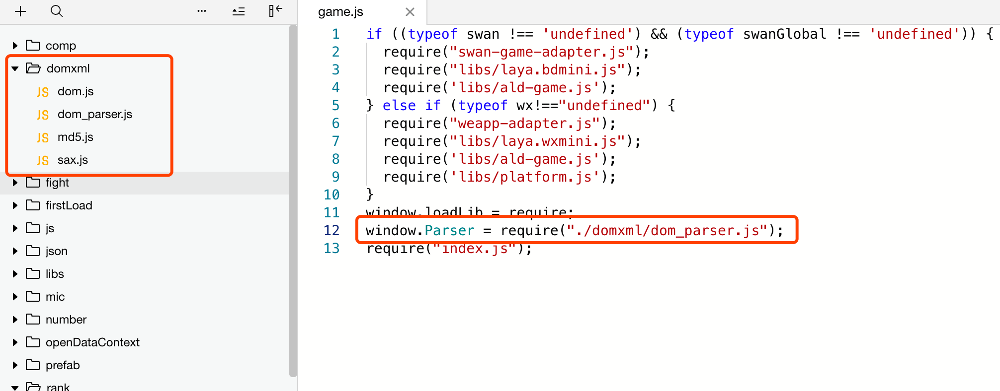
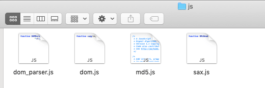

### LayaAir2.0小游戏使用 HTMLDivElement

以前刚刚学习1.0的时候，已经用过，论坛里也有人说过解决方案，大概思路就是引入xml 解析库，没有一个规范的教程，自己虽然项目里用了，但是也没有一个完整的记录，今天顺便记录下来。

<!-- more -->

#### 环境：

- Layabox项目 发布小游戏
- 微信开发工具

#### 步骤截图



#### 具体文件内容



**dom_parser.js**

```javascript
function DOMParser(t){this.options=t||{locator:{}}}function buildErrorHandler(t,e,n){function r(e){var r=t[e];!r&&i&&(r=2==t.length?function(n){t(e,n)}:t),o[e]=r&&function(t){r("[xmldom "+e+"]	"+t+_locator(n))}||function(){}}if(!t){if(e instanceof DOMHandler)return e;t=e}var o={},i=t instanceof Function;return n=n||{},r("warning"),r("error"),r("fatalError"),o}function DOMHandler(){this.cdata=!1}function position(t,e){e.lineNumber=t.lineNumber,e.columnNumber=t.columnNumber}function _locator(t){return t?"\n@"+(t.systemId||"")+"#[line:"+t.lineNumber+",col:"+t.columnNumber+"]":void 0}function _toString(t,e,n){return"string"==typeof t?t.substr(e,n):t.length>=e+n||e?new java.lang.String(t,e,n)+"":t}function appendElement(t,e){t.currentElement?t.currentElement.appendChild(e):t.doc.appendChild(e)}DOMParser.prototype.parseFromString=function(t,e){var n=this.options,r=new XMLReader,o=n.domBuilder||new DOMHandler,i=n.errorHandler,a=n.locator,c=n.xmlns||{},l={lt:"<",gt:">",amp:"&",quot:'"',apos:"'"};return a&&o.setDocumentLocator(a),r.errorHandler=buildErrorHandler(i,o,a),r.domBuilder=n.domBuilder||o,/\/x?html?$/.test(e)&&(l.nbsp=" ",l.copy="©",c[""]="http://www.w3.org/1999/xhtml"),c.xml=c.xml||"http://www.w3.org/XML/1998/namespace",t?r.parse(t,c,l):r.errorHandler.error("invalid doc source"),o.doc},DOMHandler.prototype={startDocument:function(){this.doc=(new DOMImplementation).createDocument(null,null,null),this.locator&&(this.doc.documentURI=this.locator.systemId)},startElement:function(t,e,n,r){var o=this.doc,i=o.createElementNS(t,n||e),a=r.length;appendElement(this,i),this.currentElement=i,this.locator&&position(this.locator,i);for(var c=0;a>c;c++){var t=r.getURI(c),l=r.getValue(c),n=r.getQName(c),s=o.createAttributeNS(t,n);this.locator&&position(r.getLocator(c),s),s.value=s.nodeValue=l,i.setAttributeNode(s)}},endElement:function(){{var t=this.currentElement;t.tagName}this.currentElement=t.parentNode},startPrefixMapping:function(){},endPrefixMapping:function(){},processingInstruction:function(t,e){var n=this.doc.createProcessingInstruction(t,e);this.locator&&position(this.locator,n),appendElement(this,n)},ignorableWhitespace:function(){},characters:function(t){if(t=_toString.apply(this,arguments)){if(this.cdata)var e=this.doc.createCDATASection(t);else var e=this.doc.createTextNode(t);this.currentElement?this.currentElement.appendChild(e):/^\s*$/.test(t)&&this.doc.appendChild(e),this.locator&&position(this.locator,e)}},skippedEntity:function(){},endDocument:function(){this.doc.normalize()},setDocumentLocator:function(t){(this.locator=t)&&(t.lineNumber=0)},comment:function(t){t=_toString.apply(this,arguments);var e=this.doc.createComment(t);this.locator&&position(this.locator,e),appendElement(this,e)},startCDATA:function(){this.cdata=!0},endCDATA:function(){this.cdata=!1},startDTD:function(t,e,n){var r=this.doc.implementation;if(r&&r.createDocumentType){var o=r.createDocumentType(t,e,n);this.locator&&position(this.locator,o),appendElement(this,o)}},warning:function(t){console.warn("[xmldom warning]	"+t,_locator(this.locator))},error:function(t){console.error("[xmldom error]	"+t,_locator(this.locator))},fatalError:function(t){throw console.error("[xmldom fatalError]	"+t,_locator(this.locator)),t}},"endDTD,startEntity,endEntity,attributeDecl,elementDecl,externalEntityDecl,internalEntityDecl,resolveEntity,getExternalSubset,notationDecl,unparsedEntityDecl".replace(/\w+/g,function(t){DOMHandler.prototype[t]=function(){return null}});var XMLReader=require("./sax").XMLReader,DOMImplementation=exports.DOMImplementation=require("./dom").DOMImplementation;exports.XMLSerializer=require("./dom").XMLSerializer,exports.DOMParser=DOMParser;
```

**dom.js**

```javascript
function copy(e,t){for(var n in e)t[n]=e[n]}function _extends(e,t){function n(){}var o=e.prototype;if(Object.create){var i=Object.create(t.prototype);o.__proto__=i}o instanceof t||(n.prototype=t.prototype,n=new n,copy(o,n),e.prototype=o=n),o.constructor!=e&&("function"!=typeof e&&console.error("unknow Class:"+e),o.constructor=e)}function DOMException(e,t){if(t instanceof Error)var n=t;else n=this,Error.call(this,ExceptionMessage[e]),this.message=ExceptionMessage[e],Error.captureStackTrace&&Error.captureStackTrace(this,DOMException);return n.code=e,t&&(this.message=this.message+": "+t),n}function NodeList(){}function LiveNodeList(e,t){this._node=e,this._refresh=t,_updateLiveList(this)}function _updateLiveList(e){var t=e._node._inc||e._node.ownerDocument._inc;if(e._inc!=t){var n=e._refresh(e._node);__set__(e,"length",n.length),copy(n,e),e._inc=t}}function NamedNodeMap(){}function _findNodeIndex(e,t){for(var n=e.length;n--;)if(e[n]===t)return n}function _addNamedNode(e,t,n,o){if(o?t[_findNodeIndex(t,o)]=n:t[t.length++]=n,e){n.ownerElement=e;var i=e.ownerDocument;i&&(o&&_onRemoveAttribute(i,e,o),_onAddAttribute(i,e,n))}}function _removeNamedNode(e,t,n){var o=_findNodeIndex(t,n);if(!(o>=0))throw DOMException(NOT_FOUND_ERR,new Error(e.tagName+"@"+n));for(var i=t.length-1;i>o;)t[o]=t[++o];if(t.length=i,e){var r=e.ownerDocument;r&&(_onRemoveAttribute(r,e,n),n.ownerElement=null)}}function DOMImplementation(e){if(this._features={},e)for(var t in e)this._features=e[t]}function Node(){}function _xmlEncoder(e){return"<"==e&&"&lt;"||">"==e&&"&gt;"||"&"==e&&"&amp;"||'"'==e&&"&quot;"||"&#"+e.charCodeAt()+";"}function _visitNode(e,t){if(t(e))return!0;if(e=e.firstChild)do if(_visitNode(e,t))return!0;while(e=e.nextSibling)}function Document(){}function _onAddAttribute(e,t,n){e&&e._inc++;var o=n.namespaceURI;"http://www.w3.org/2000/xmlns/"==o&&(t._nsMap[n.prefix?n.localName:""]=n.value)}function _onRemoveAttribute(e,t,n){e&&e._inc++;var o=n.namespaceURI;"http://www.w3.org/2000/xmlns/"==o&&delete t._nsMap[n.prefix?n.localName:""]}function _onUpdateChild(e,t,n){if(e&&e._inc){e._inc++;var o=t.childNodes;if(n)o[o.length++]=n;else{for(var i=t.firstChild,r=0;i;)o[r++]=i,i=i.nextSibling;o.length=r}}}function _removeChild(e,t){var n=t.previousSibling,o=t.nextSibling;return n?n.nextSibling=o:e.firstChild=o,o?o.previousSibling=n:e.lastChild=n,_onUpdateChild(e.ownerDocument,e),t}function _insertBefore(e,t,n){var o=t.parentNode;if(o&&o.removeChild(t),t.nodeType===DOCUMENT_FRAGMENT_NODE){var i=t.firstChild;if(null==i)return t;var r=t.lastChild}else i=r=t;var a=n?n.previousSibling:e.lastChild;i.previousSibling=a,r.nextSibling=n,a?a.nextSibling=i:e.firstChild=i,null==n?e.lastChild=r:n.previousSibling=r;do i.parentNode=e;while(i!==r&&(i=i.nextSibling));return _onUpdateChild(e.ownerDocument||e,e),t.nodeType==DOCUMENT_FRAGMENT_NODE&&(t.firstChild=t.lastChild=null),t}function _appendSingleChild(e,t){var n=t.parentNode;if(n){var o=e.lastChild;n.removeChild(t);var o=e.lastChild}var o=e.lastChild;return t.parentNode=e,t.previousSibling=o,t.nextSibling=null,o?o.nextSibling=t:e.firstChild=t,e.lastChild=t,_onUpdateChild(e.ownerDocument,e,t),t}function Element(){this._nsMap={}}function Attr(){}function CharacterData(){}function Text(){}function Comment(){}function CDATASection(){}function DocumentType(){}function Notation(){}function Entity(){}function EntityReference(){}function DocumentFragment(){}function ProcessingInstruction(){}function XMLSerializer(){}function nodeSerializeToString(e,t){var n=[],o=9==this.nodeType?this.documentElement:this,i=o.prefix,r=o.namespaceURI;if(r&&null==i){var i=o.lookupPrefix(r);if(null==i)var a=[{namespace:r,prefix:null}]}return serializeToString(this,n,e,t,a),n.join("")}function needNamespaceDefine(e,t,n){var o=e.prefix||"",i=e.namespaceURI;if(!o&&!i)return!1;if("xml"===o&&"http://www.w3.org/XML/1998/namespace"===i||"http://www.w3.org/2000/xmlns/"==i)return!1;for(var r=n.length;r--;){var a=n[r];if(a.prefix==o)return a.namespace!=i}return!0}function serializeToString(e,t,n,o,i){if(o){if(e=o(e),!e)return;if("string"==typeof e)return t.push(e),void 0}switch(e.nodeType){case ELEMENT_NODE:i||(i=[]);var r=(i.length,e.attributes),a=r.length,s=e.firstChild,u=e.tagName;n=htmlns===e.namespaceURI||n,t.push("<",u);for(var d=0;a>d;d++){var c=r.item(d);"xmlns"==c.prefix?i.push({prefix:c.localName,namespace:c.value}):"xmlns"==c.nodeName&&i.push({prefix:"",namespace:c.value})}for(var d=0;a>d;d++){var c=r.item(d);if(needNamespaceDefine(c,n,i)){var N=c.prefix||"",l=c.namespaceURI,p=N?" xmlns:"+N:" xmlns";t.push(p,'="',l,'"'),i.push({prefix:N,namespace:l})}serializeToString(c,t,n,o,i)}if(needNamespaceDefine(e,n,i)){var N=e.prefix||"",l=e.namespaceURI,p=N?" xmlns:"+N:" xmlns";t.push(p,'="',l,'"'),i.push({prefix:N,namespace:l})}if(s||n&&!/^(?:meta|link|img|br|hr|input)$/i.test(u)){if(t.push(">"),n&&/^script$/i.test(u))for(;s;)s.data?t.push(s.data):serializeToString(s,t,n,o,i),s=s.nextSibling;else for(;s;)serializeToString(s,t,n,o,i),s=s.nextSibling;t.push("</",u,">")}else t.push("/>");return;case DOCUMENT_NODE:case DOCUMENT_FRAGMENT_NODE:for(var s=e.firstChild;s;)serializeToString(s,t,n,o,i),s=s.nextSibling;return;case ATTRIBUTE_NODE:return t.push(" ",e.name,'="',e.value.replace(/[<&"]/g,_xmlEncoder),'"');case TEXT_NODE:return t.push(e.data.replace(/[<&]/g,_xmlEncoder));case CDATA_SECTION_NODE:return t.push("<![CDATA[",e.data,"]]>");case COMMENT_NODE:return t.push("<!--",e.data,"-->");case DOCUMENT_TYPE_NODE:var E=e.publicId,m=e.systemId;if(t.push("<!DOCTYPE ",e.name),E)t.push(' PUBLIC "',E),m&&"."!=m&&t.push('" "',m),t.push('">');else if(m&&"."!=m)t.push(' SYSTEM "',m,'">');else{var h=e.internalSubset;h&&t.push(" [",h,"]"),t.push(">")}return;case PROCESSING_INSTRUCTION_NODE:return t.push("<?",e.target," ",e.data,"?>");case ENTITY_REFERENCE_NODE:return t.push("&",e.nodeName,";");default:t.push("??",e.nodeName)}}function importNode(e,t,n){var o;switch(t.nodeType){case ELEMENT_NODE:o=t.cloneNode(!1),o.ownerDocument=e;case DOCUMENT_FRAGMENT_NODE:break;case ATTRIBUTE_NODE:n=!0}if(o||(o=t.cloneNode(!1)),o.ownerDocument=e,o.parentNode=null,n)for(var i=t.firstChild;i;)o.appendChild(importNode(e,i,n)),i=i.nextSibling;return o}function cloneNode(e,t,n){var o=new t.constructor;for(var i in t){var r=t[i];"object"!=typeof r&&r!=o[i]&&(o[i]=r)}switch(t.childNodes&&(o.childNodes=new NodeList),o.ownerDocument=e,o.nodeType){case ELEMENT_NODE:var a=t.attributes,s=o.attributes=new NamedNodeMap,u=a.length;s._ownerElement=o;for(var d=0;u>d;d++)o.setAttributeNode(cloneNode(e,a.item(d),!0));break;case ATTRIBUTE_NODE:n=!0}if(n)for(var c=t.firstChild;c;)o.appendChild(cloneNode(e,c,n)),c=c.nextSibling;return o}function __set__(e,t,n){e[t]=n}function getTextContent(e){switch(e.nodeType){case ELEMENT_NODE:case DOCUMENT_FRAGMENT_NODE:var t=[];for(e=e.firstChild;e;)7!==e.nodeType&&8!==e.nodeType&&t.push(getTextContent(e)),e=e.nextSibling;return t.join("");default:return e.nodeValue}}var htmlns="http://www.w3.org/1999/xhtml",NodeType={},ELEMENT_NODE=NodeType.ELEMENT_NODE=1,ATTRIBUTE_NODE=NodeType.ATTRIBUTE_NODE=2,TEXT_NODE=NodeType.TEXT_NODE=3,CDATA_SECTION_NODE=NodeType.CDATA_SECTION_NODE=4,ENTITY_REFERENCE_NODE=NodeType.ENTITY_REFERENCE_NODE=5,ENTITY_NODE=NodeType.ENTITY_NODE=6,PROCESSING_INSTRUCTION_NODE=NodeType.PROCESSING_INSTRUCTION_NODE=7,COMMENT_NODE=NodeType.COMMENT_NODE=8,DOCUMENT_NODE=NodeType.DOCUMENT_NODE=9,DOCUMENT_TYPE_NODE=NodeType.DOCUMENT_TYPE_NODE=10,DOCUMENT_FRAGMENT_NODE=NodeType.DOCUMENT_FRAGMENT_NODE=11,NOTATION_NODE=NodeType.NOTATION_NODE=12,ExceptionCode={},ExceptionMessage={},INDEX_SIZE_ERR=ExceptionCode.INDEX_SIZE_ERR=(ExceptionMessage[1]="Index size error",1),DOMSTRING_SIZE_ERR=ExceptionCode.DOMSTRING_SIZE_ERR=(ExceptionMessage[2]="DOMString size error",2),HIERARCHY_REQUEST_ERR=ExceptionCode.HIERARCHY_REQUEST_ERR=(ExceptionMessage[3]="Hierarchy request error",3),WRONG_DOCUMENT_ERR=ExceptionCode.WRONG_DOCUMENT_ERR=(ExceptionMessage[4]="Wrong document",4),INVALID_CHARACTER_ERR=ExceptionCode.INVALID_CHARACTER_ERR=(ExceptionMessage[5]="Invalid character",5),NO_DATA_ALLOWED_ERR=ExceptionCode.NO_DATA_ALLOWED_ERR=(ExceptionMessage[6]="No data allowed",6),NO_MODIFICATION_ALLOWED_ERR=ExceptionCode.NO_MODIFICATION_ALLOWED_ERR=(ExceptionMessage[7]="No modification allowed",7),NOT_FOUND_ERR=ExceptionCode.NOT_FOUND_ERR=(ExceptionMessage[8]="Not found",8),NOT_SUPPORTED_ERR=ExceptionCode.NOT_SUPPORTED_ERR=(ExceptionMessage[9]="Not supported",9),INUSE_ATTRIBUTE_ERR=ExceptionCode.INUSE_ATTRIBUTE_ERR=(ExceptionMessage[10]="Attribute in use",10),INVALID_STATE_ERR=ExceptionCode.INVALID_STATE_ERR=(ExceptionMessage[11]="Invalid state",11),SYNTAX_ERR=ExceptionCode.SYNTAX_ERR=(ExceptionMessage[12]="Syntax error",12),INVALID_MODIFICATION_ERR=ExceptionCode.INVALID_MODIFICATION_ERR=(ExceptionMessage[13]="Invalid modification",13),NAMESPACE_ERR=ExceptionCode.NAMESPACE_ERR=(ExceptionMessage[14]="Invalid namespace",14),INVALID_ACCESS_ERR=ExceptionCode.INVALID_ACCESS_ERR=(ExceptionMessage[15]="Invalid access",15);DOMException.prototype=Error.prototype,copy(ExceptionCode,DOMException),NodeList.prototype={length:0,item:function(e){return this[e]||null},toString:function(e,t){for(var n=[],o=0;o<this.length;o++)serializeToString(this[o],n,e,t);return n.join("")}},LiveNodeList.prototype.item=function(e){return _updateLiveList(this),this[e]},_extends(LiveNodeList,NodeList),NamedNodeMap.prototype={length:0,item:NodeList.prototype.item,getNamedItem:function(e){for(var t=this.length;t--;){var n=this[t];if(n.nodeName==e)return n}},setNamedItem:function(e){var t=e.ownerElement;if(t&&t!=this._ownerElement)throw new DOMException(INUSE_ATTRIBUTE_ERR);var n=this.getNamedItem(e.nodeName);return _addNamedNode(this._ownerElement,this,e,n),n},setNamedItemNS:function(e){var t,n=e.ownerElement;if(n&&n!=this._ownerElement)throw new DOMException(INUSE_ATTRIBUTE_ERR);return t=this.getNamedItemNS(e.namespaceURI,e.localName),_addNamedNode(this._ownerElement,this,e,t),t},removeNamedItem:function(e){var t=this.getNamedItem(e);return _removeNamedNode(this._ownerElement,this,t),t},removeNamedItemNS:function(e,t){var n=this.getNamedItemNS(e,t);return _removeNamedNode(this._ownerElement,this,n),n},getNamedItemNS:function(e,t){for(var n=this.length;n--;){var o=this[n];if(o.localName==t&&o.namespaceURI==e)return o}return null}},DOMImplementation.prototype={hasFeature:function(e,t){var n=this._features[e.toLowerCase()];return n&&(!t||t in n)?!0:!1},createDocument:function(e,t,n){var o=new Document;if(o.implementation=this,o.childNodes=new NodeList,o.doctype=n,n&&o.appendChild(n),t){var i=o.createElementNS(e,t);o.appendChild(i)}return o},createDocumentType:function(e,t,n){var o=new DocumentType;return o.name=e,o.nodeName=e,o.publicId=t,o.systemId=n,o}},Node.prototype={firstChild:null,lastChild:null,previousSibling:null,nextSibling:null,attributes:null,parentNode:null,childNodes:null,ownerDocument:null,nodeValue:null,namespaceURI:null,prefix:null,localName:null,insertBefore:function(e,t){return _insertBefore(this,e,t)},replaceChild:function(e,t){this.insertBefore(e,t),t&&this.removeChild(t)},removeChild:function(e){return _removeChild(this,e)},appendChild:function(e){return this.insertBefore(e,null)},hasChildNodes:function(){return null!=this.firstChild},cloneNode:function(e){return cloneNode(this.ownerDocument||this,this,e)},normalize:function(){for(var e=this.firstChild;e;){var t=e.nextSibling;t&&t.nodeType==TEXT_NODE&&e.nodeType==TEXT_NODE?(this.removeChild(t),e.appendData(t.data)):(e.normalize(),e=t)}},isSupported:function(e,t){return this.ownerDocument.implementation.hasFeature(e,t)},hasAttributes:function(){return this.attributes.length>0},lookupPrefix:function(e){for(var t=this;t;){var n=t._nsMap;if(n)for(var o in n)if(n[o]==e)return o;t=t.nodeType==ATTRIBUTE_NODE?t.ownerDocument:t.parentNode}return null},lookupNamespaceURI:function(e){for(var t=this;t;){var n=t._nsMap;if(n&&e in n)return n[e];t=t.nodeType==ATTRIBUTE_NODE?t.ownerDocument:t.parentNode}return null},isDefaultNamespace:function(e){var t=this.lookupPrefix(e);return null==t}},copy(NodeType,Node),copy(NodeType,Node.prototype),Document.prototype={nodeName:"#document",nodeType:DOCUMENT_NODE,doctype:null,documentElement:null,_inc:1,insertBefore:function(e,t){if(e.nodeType==DOCUMENT_FRAGMENT_NODE){for(var n=e.firstChild;n;){var o=n.nextSibling;this.insertBefore(n,t),n=o}return e}return null==this.documentElement&&e.nodeType==ELEMENT_NODE&&(this.documentElement=e),_insertBefore(this,e,t),e.ownerDocument=this,e},removeChild:function(e){return this.documentElement==e&&(this.documentElement=null),_removeChild(this,e)},importNode:function(e,t){return importNode(this,e,t)},getElementById:function(e){var t=null;return _visitNode(this.documentElement,function(n){return n.nodeType==ELEMENT_NODE&&n.getAttribute("id")==e?(t=n,!0):void 0}),t},createElement:function(e){var t=new Element;t.ownerDocument=this,t.nodeName=e,t.tagName=e,t.childNodes=new NodeList;var n=t.attributes=new NamedNodeMap;return n._ownerElement=t,t},createDocumentFragment:function(){var e=new DocumentFragment;return e.ownerDocument=this,e.childNodes=new NodeList,e},createTextNode:function(e){var t=new Text;return t.ownerDocument=this,t.appendData(e),t},createComment:function(e){var t=new Comment;return t.ownerDocument=this,t.appendData(e),t},createCDATASection:function(e){var t=new CDATASection;return t.ownerDocument=this,t.appendData(e),t},createProcessingInstruction:function(e,t){var n=new ProcessingInstruction;return n.ownerDocument=this,n.tagName=n.target=e,n.nodeValue=n.data=t,n},createAttribute:function(e){var t=new Attr;return t.ownerDocument=this,t.name=e,t.nodeName=e,t.localName=e,t.specified=!0,t},createEntityReference:function(e){var t=new EntityReference;return t.ownerDocument=this,t.nodeName=e,t},createElementNS:function(e,t){var n=new Element,o=t.split(":"),i=n.attributes=new NamedNodeMap;return n.childNodes=new NodeList,n.ownerDocument=this,n.nodeName=t,n.tagName=t,n.namespaceURI=e,2==o.length?(n.prefix=o[0],n.localName=o[1]):n.localName=t,i._ownerElement=n,n},createAttributeNS:function(e,t){var n=new Attr,o=t.split(":");return n.ownerDocument=this,n.nodeName=t,n.name=t,n.namespaceURI=e,n.specified=!0,2==o.length?(n.prefix=o[0],n.localName=o[1]):n.localName=t,n}},_extends(Document,Node),Element.prototype={nodeType:ELEMENT_NODE,hasAttribute:function(e){return null!=this.getAttributeNode(e)},getAttribute:function(e){var t=this.getAttributeNode(e);return t&&t.value||""},getAttributeNode:function(e){return this.attributes.getNamedItem(e)},setAttribute:function(e,t){var n=this.ownerDocument.createAttribute(e);n.value=n.nodeValue=""+t,this.setAttributeNode(n)},removeAttribute:function(e){var t=this.getAttributeNode(e);t&&this.removeAttributeNode(t)},appendChild:function(e){return e.nodeType===DOCUMENT_FRAGMENT_NODE?this.insertBefore(e,null):_appendSingleChild(this,e)},setAttributeNode:function(e){return this.attributes.setNamedItem(e)},setAttributeNodeNS:function(e){return this.attributes.setNamedItemNS(e)},removeAttributeNode:function(e){return this.attributes.removeNamedItem(e.nodeName)},removeAttributeNS:function(e,t){var n=this.getAttributeNodeNS(e,t);n&&this.removeAttributeNode(n)},hasAttributeNS:function(e,t){return null!=this.getAttributeNodeNS(e,t)},getAttributeNS:function(e,t){var n=this.getAttributeNodeNS(e,t);return n&&n.value||""},setAttributeNS:function(e,t,n){var o=this.ownerDocument.createAttributeNS(e,t);o.value=o.nodeValue=""+n,this.setAttributeNode(o)},getAttributeNodeNS:function(e,t){return this.attributes.getNamedItemNS(e,t)},getElementsByTagName:function(e){return new LiveNodeList(this,function(t){var n=[];return _visitNode(t,function(o){o===t||o.nodeType!=ELEMENT_NODE||"*"!==e&&o.tagName!=e||n.push(o)}),n})},getElementsByTagNameNS:function(e,t){return new LiveNodeList(this,function(n){var o=[];return _visitNode(n,function(i){i===n||i.nodeType!==ELEMENT_NODE||"*"!==e&&i.namespaceURI!==e||"*"!==t&&i.localName!=t||o.push(i)}),o})}},Document.prototype.getElementsByTagName=Element.prototype.getElementsByTagName,Document.prototype.getElementsByTagNameNS=Element.prototype.getElementsByTagNameNS,_extends(Element,Node),Attr.prototype.nodeType=ATTRIBUTE_NODE,_extends(Attr,Node),CharacterData.prototype={data:"",substringData:function(e,t){return this.data.substring(e,e+t)},appendData:function(e){e=this.data+e,this.nodeValue=this.data=e,this.length=e.length},insertData:function(e,t){this.replaceData(e,0,t)},appendChild:function(){throw new Error(ExceptionMessage[HIERARCHY_REQUEST_ERR])},deleteData:function(e,t){this.replaceData(e,t,"")},replaceData:function(e,t,n){var o=this.data.substring(0,e),i=this.data.substring(e+t);n=o+n+i,this.nodeValue=this.data=n,this.length=n.length}},_extends(CharacterData,Node),Text.prototype={nodeName:"#text",nodeType:TEXT_NODE,splitText:function(e){var t=this.data,n=t.substring(e);t=t.substring(0,e),this.data=this.nodeValue=t,this.length=t.length;var o=this.ownerDocument.createTextNode(n);return this.parentNode&&this.parentNode.insertBefore(o,this.nextSibling),o}},_extends(Text,CharacterData),Comment.prototype={nodeName:"#comment",nodeType:COMMENT_NODE},_extends(Comment,CharacterData),CDATASection.prototype={nodeName:"#cdata-section",nodeType:CDATA_SECTION_NODE},_extends(CDATASection,CharacterData),DocumentType.prototype.nodeType=DOCUMENT_TYPE_NODE,_extends(DocumentType,Node),Notation.prototype.nodeType=NOTATION_NODE,_extends(Notation,Node),Entity.prototype.nodeType=ENTITY_NODE,_extends(Entity,Node),EntityReference.prototype.nodeType=ENTITY_REFERENCE_NODE,_extends(EntityReference,Node),DocumentFragment.prototype.nodeName="#document-fragment",DocumentFragment.prototype.nodeType=DOCUMENT_FRAGMENT_NODE,_extends(DocumentFragment,Node),ProcessingInstruction.prototype.nodeType=PROCESSING_INSTRUCTION_NODE,_extends(ProcessingInstruction,Node),XMLSerializer.prototype.serializeToString=function(e,t,n){return nodeSerializeToString.call(e,t,n)},Node.prototype.toString=nodeSerializeToString;try{Object.defineProperty&&(Object.defineProperty(LiveNodeList.prototype,"length",{get:function(){return _updateLiveList(this),this.$$length}}),Object.defineProperty(Node.prototype,"textContent",{get:function(){return getTextContent(this)},set:function(e){switch(this.nodeType){case ELEMENT_NODE:case DOCUMENT_FRAGMENT_NODE:for(;this.firstChild;)this.removeChild(this.firstChild);(e||String(e))&&this.appendChild(this.ownerDocument.createTextNode(e));break;default:this.data=e,this.value=e,this.nodeValue=e}}}),__set__=function(e,t,n){e["$$"+t]=n})}catch(e){}exports.DOMImplementation=DOMImplementation,exports.XMLSerializer=XMLSerializer;
```

**md5.js**

```javascript
/* 
 * A JavaScript implementation of the RSA Data Security, Inc. MD5 Message 
 * Digest Algorithm, as defined in RFC 1321. 
 * Version 1.1 Copyright (C) Paul Johnston 1999 - 2002. 
 * Code also contributed by Greg Holt 
 * See http://pajhome.org.uk/site/legal.html for details. 
 */ 
   
/* 
 * Add integers, wrapping at 2^32. This uses 16-bit operations internally 
 * to work around bugs in some JS interpreters. 
 */ 
function safe_add(x, y)  
{  
 var lsw = (x & 0xFFFF) + (y & 0xFFFF)  
 var msw = (x >> 16) + (y >> 16) + (lsw >> 16)  
 return (msw << 16) | (lsw & 0xFFFF)  
}  
   
/* 
 * Bitwise rotate a 32-bit number to the left. 
 */ 
function rol(num, cnt)  
{  
 return (num << cnt) | (num >>> (32 - cnt))  
}  
   
/* 
 * These functions implement the four basic operations the algorithm uses. 
 */ 
function cmn(q, a, b, x, s, t)  
{  
 return safe_add(rol(safe_add(safe_add(a, q), safe_add(x, t)), s), b)  
}  
function ff(a, b, c, d, x, s, t)  
{  
 return cmn((b & c) | ((~b) & d), a, b, x, s, t)  
}  
function gg(a, b, c, d, x, s, t)  
{  
 return cmn((b & d) | (c & (~d)), a, b, x, s, t)  
}  
function hh(a, b, c, d, x, s, t)  
{  
 return cmn(b ^ c ^ d, a, b, x, s, t)  
}  
function ii(a, b, c, d, x, s, t)  
{  
 return cmn(c ^ (b | (~d)), a, b, x, s, t)  
}  
   
/* 
 * Calculate the MD5 of an array of little-endian words, producing an array 
 * of little-endian words. 
 */ 
function coreMD5(x)  
{  
 var a = 1732584193  
 var b = -271733879  
 var c = -1732584194  
 var d = 271733878  
   
 for(var i = 0; i < x.length; i += 16)  
 {  
  var olda = a  
  var oldb = b  
  var oldc = c  
  var oldd = d  
   
  a = ff(a, b, c, d, x[i+ 0], 7 , -680876936)  
  d = ff(d, a, b, c, x[i+ 1], 12, -389564586)  
  c = ff(c, d, a, b, x[i+ 2], 17, 606105819)  
  b = ff(b, c, d, a, x[i+ 3], 22, -1044525330)  
  a = ff(a, b, c, d, x[i+ 4], 7 , -176418897)  
  d = ff(d, a, b, c, x[i+ 5], 12, 1200080426)  
  c = ff(c, d, a, b, x[i+ 6], 17, -1473231341)  
  b = ff(b, c, d, a, x[i+ 7], 22, -45705983)  
  a = ff(a, b, c, d, x[i+ 8], 7 , 1770035416)  
  d = ff(d, a, b, c, x[i+ 9], 12, -1958414417)  
  c = ff(c, d, a, b, x[i+10], 17, -42063)  
  b = ff(b, c, d, a, x[i+11], 22, -1990404162)  
  a = ff(a, b, c, d, x[i+12], 7 , 1804603682)  
  d = ff(d, a, b, c, x[i+13], 12, -40341101)  
  c = ff(c, d, a, b, x[i+14], 17, -1502002290)  
  b = ff(b, c, d, a, x[i+15], 22, 1236535329)  
   
  a = gg(a, b, c, d, x[i+ 1], 5 , -165796510)  
  d = gg(d, a, b, c, x[i+ 6], 9 , -1069501632)  
  c = gg(c, d, a, b, x[i+11], 14, 643717713)  
  b = gg(b, c, d, a, x[i+ 0], 20, -373897302)  
  a = gg(a, b, c, d, x[i+ 5], 5 , -701558691)  
  d = gg(d, a, b, c, x[i+10], 9 , 38016083)  
  c = gg(c, d, a, b, x[i+15], 14, -660478335)  
  b = gg(b, c, d, a, x[i+ 4], 20, -405537848)  
  a = gg(a, b, c, d, x[i+ 9], 5 , 568446438)  
  d = gg(d, a, b, c, x[i+14], 9 , -1019803690)  
  c = gg(c, d, a, b, x[i+ 3], 14, -187363961)  
  b = gg(b, c, d, a, x[i+ 8], 20, 1163531501)  
  a = gg(a, b, c, d, x[i+13], 5 , -1444681467)  
  d = gg(d, a, b, c, x[i+ 2], 9 , -51403784)  
  c = gg(c, d, a, b, x[i+ 7], 14, 1735328473)  
  b = gg(b, c, d, a, x[i+12], 20, -1926607734)  
   
  a = hh(a, b, c, d, x[i+ 5], 4 , -378558)  
  d = hh(d, a, b, c, x[i+ 8], 11, -2022574463)  
  c = hh(c, d, a, b, x[i+11], 16, 1839030562)  
  b = hh(b, c, d, a, x[i+14], 23, -35309556)  
  a = hh(a, b, c, d, x[i+ 1], 4 , -1530992060)  
  d = hh(d, a, b, c, x[i+ 4], 11, 1272893353)  
  c = hh(c, d, a, b, x[i+ 7], 16, -155497632)  
  b = hh(b, c, d, a, x[i+10], 23, -1094730640)  
  a = hh(a, b, c, d, x[i+13], 4 , 681279174)  
  d = hh(d, a, b, c, x[i+ 0], 11, -358537222)  
  c = hh(c, d, a, b, x[i+ 3], 16, -722521979)  
  b = hh(b, c, d, a, x[i+ 6], 23, 76029189)  
  a = hh(a, b, c, d, x[i+ 9], 4 , -640364487)  
  d = hh(d, a, b, c, x[i+12], 11, -421815835)  
  c = hh(c, d, a, b, x[i+15], 16, 530742520)  
  b = hh(b, c, d, a, x[i+ 2], 23, -995338651)  
   
  a = ii(a, b, c, d, x[i+ 0], 6 , -198630844)  
  d = ii(d, a, b, c, x[i+ 7], 10, 1126891415)  
  c = ii(c, d, a, b, x[i+14], 15, -1416354905)  
  b = ii(b, c, d, a, x[i+ 5], 21, -57434055)  
  a = ii(a, b, c, d, x[i+12], 6 , 1700485571)  
  d = ii(d, a, b, c, x[i+ 3], 10, -1894986606)  
  c = ii(c, d, a, b, x[i+10], 15, -1051523)  
  b = ii(b, c, d, a, x[i+ 1], 21, -2054922799)  
  a = ii(a, b, c, d, x[i+ 8], 6 , 1873313359)  
  d = ii(d, a, b, c, x[i+15], 10, -30611744)  
  c = ii(c, d, a, b, x[i+ 6], 15, -1560198380)  
  b = ii(b, c, d, a, x[i+13], 21, 1309151649)  
  a = ii(a, b, c, d, x[i+ 4], 6 , -145523070)  
  d = ii(d, a, b, c, x[i+11], 10, -1120210379)  
  c = ii(c, d, a, b, x[i+ 2], 15, 718787259)  
  b = ii(b, c, d, a, x[i+ 9], 21, -343485551)  
   
  a = safe_add(a, olda)  
  b = safe_add(b, oldb)  
  c = safe_add(c, oldc)  
  d = safe_add(d, oldd)  
 }  
 return [a, b, c, d]  
}  
   
/* 
 * Convert an array of little-endian words to a hex string. 
 */ 
function binl2hex(binarray)  
{  
 var hex_tab = "0123456789abcdef" 
 var str = "" 
 for(var i = 0; i < binarray.length * 4; i++)  
 {  
  str += hex_tab.charAt((binarray[i>>2] >> ((i%4)*8+4)) & 0xF) +  
      hex_tab.charAt((binarray[i>>2] >> ((i%4)*8)) & 0xF)  
 }  
 return str  
}  
   
/* 
 * Convert an array of little-endian words to a base64 encoded string. 
 */ 
function binl2b64(binarray)  
{  
 var tab = "ABCDEFGHIJKLMNOPQRSTUVWXYZabcdefghijklmnopqrstuvwxyz0123456789+/" 
 var str = "" 
 for(var i = 0; i < binarray.length * 32; i += 6)  
 {  
  str += tab.charAt(((binarray[i>>5] << (i%32)) & 0x3F) |  
           ((binarray[i>>5+1] >> (32-i%32)) & 0x3F))  
 }  
 return str  
}  
   
/* 
 * Convert an 8-bit character string to a sequence of 16-word blocks, stored 
 * as an array, and append appropriate padding for MD4/5 calculation. 
 * If any of the characters are >255, the high byte is silently ignored. 
 */ 
function str2binl(str)  
{  
 var nblk = ((str.length + 8) >> 6) + 1 // number of 16-word blocks  
 var blks = new Array(nblk * 16)  
 for(var i = 0; i < nblk * 16; i++) blks[i] = 0  
 for(var i = 0; i < str.length; i++)  
  blks[i>>2] |= (str.charCodeAt(i) & 0xFF) << ((i%4) * 8)  
 blks[i>>2] |= 0x80 << ((i%4) * 8)  
 blks[nblk*16-2] = str.length * 8  
 return blks  
}  
   
/* 
 * Convert a wide-character string to a sequence of 16-word blocks, stored as 
 * an array, and append appropriate padding for MD4/5 calculation. 
 */ 
function strw2binl(str)  
{  
 var nblk = ((str.length + 4) >> 5) + 1 // number of 16-word blocks  
 var blks = new Array(nblk * 16)  
 for(var i = 0; i < nblk * 16; i++) blks[i] = 0  
 for(var i = 0; i < str.length; i++)  
  blks[i>>1] |= str.charCodeAt(i) << ((i%2) * 16)  
 blks[i>>1] |= 0x80 << ((i%2) * 16)  
 blks[nblk*16-2] = str.length * 16  
 return blks  
}  
   
/* 
 * External interface 
 */ 
function hexMD5 (str) { return binl2hex(coreMD5( str2binl(str))) }  
function hexMD5w(str) { return binl2hex(coreMD5(strw2binl(str))) }  
function b64MD5 (str) { return binl2b64(coreMD5( str2binl(str))) }  
function b64MD5w(str) { return binl2b64(coreMD5(strw2binl(str))) }  
/* Backward compatibility */ 
function calcMD5(str) { return binl2hex(coreMD5( str2binl(str))) }  
module.exports = {  
 hexMD5: hexMD5  
}  
```

**sax.js**

```javascript
function XMLReader(){}function parse(e,t,r,a,n){function s(e){if(e>65535){e-=65536;var t=55296+(e>>10),r=56320+(1023&e);return String.fromCharCode(t,r)}return String.fromCharCode(e)}function c(e){var t=e.slice(1,-1);return t in r?r[t]:"#"===t.charAt(0)?s(parseInt(t.substr(1).replace("x","0x"))):(n.error("entity not found:"+e),e)}function i(t){if(t>p){var r=e.substring(p,t).replace(/&#?\w+;/g,c);m&&o(p),a.characters(r,0,t-p),p=t}}function o(t,r){for(;t>=l&&(r=_.exec(e));)u=r.index,l=u+r[0].length,m.lineNumber++;m.columnNumber=t-u+1}for(var u=0,l=0,_=/.*(?:\r\n?|\n)|.*$/g,m=a.locator,f=[{currentNSMap:t}],d={},p=0;;){try{var T=e.indexOf("<",p);if(0>T){if(!e.substr(p).match(/^\s*$/)){var S=a.doc,h=S.createTextNode(e.substr(p));S.appendChild(h),a.currentElement=h}return}switch(T>p&&i(T),e.charAt(T+1)){case"/":var A=e.indexOf(">",T+3),g=e.substring(T+2,A),w=f.pop();0>A?(g=e.substring(T+2).replace(/[\s<].*/,""),n.error("end tag name: "+g+" is not complete:"+w.tagName),A=T+1+g.length):g.match(/\s</)&&(g=g.replace(/[\s<].*/,""),n.error("end tag name: "+g+" maybe not complete"),A=T+1+g.length);var E=w.localNSMap,N=w.tagName==g,b=N||w.tagName&&w.tagName.toLowerCase()==g.toLowerCase();if(b){if(a.endElement(w.uri,w.localName,g),E)for(var v in E)a.endPrefixMapping(v);N||n.fatalError("end tag name: "+g+" is not match the current start tagName:"+w.tagName)}else f.push(w);A++;break;case"?":m&&o(T),A=parseInstruction(e,T,a);break;case"!":m&&o(T),A=parseDCC(e,T,a,n);break;default:m&&o(T);var x=new ElementAttributes,C=f[f.length-1].currentNSMap,A=parseElementStartPart(e,T,x,C,c,n),R=x.length;if(!x.closed&&fixSelfClosed(e,A,x.tagName,d)&&(x.closed=!0,r.nbsp||n.warning("unclosed xml attribute")),m&&R){for(var O=copyLocator(m,{}),D=0;R>D;D++){var L=x[D];o(L.offset),L.locator=copyLocator(m,{})}a.locator=O,appendElement(x,a,C)&&f.push(x),a.locator=m}else appendElement(x,a,C)&&f.push(x);"http://www.w3.org/1999/xhtml"!==x.uri||x.closed?A++:A=parseHtmlSpecialContent(e,A,x.tagName,c,a)}}catch(F){n.error("element parse error: "+F),A=-1}A>p?p=A:i(Math.max(T,p)+1)}}function copyLocator(e,t){return t.lineNumber=e.lineNumber,t.columnNumber=e.columnNumber,t}function parseElementStartPart(e,t,r,a,n,s){for(var c,i,o=++t,u=S_TAG;;){var l=e.charAt(o);switch(l){case"=":if(u===S_ATTR)c=e.slice(t,o),u=S_EQ;else{if(u!==S_ATTR_SPACE)throw new Error("attribute equal must after attrName");u=S_EQ}break;case"'":case'"':if(u===S_EQ||u===S_ATTR){if(u===S_ATTR&&(s.warning('attribute value must after "="'),c=e.slice(t,o)),t=o+1,o=e.indexOf(l,t),!(o>0))throw new Error("attribute value no end '"+l+"' match");i=e.slice(t,o).replace(/&#?\w+;/g,n),r.add(c,i,t-1),u=S_ATTR_END}else{if(u!=S_ATTR_NOQUOT_VALUE)throw new Error('attribute value must after "="');i=e.slice(t,o).replace(/&#?\w+;/g,n),r.add(c,i,t),s.warning('attribute "'+c+'" missed start quot('+l+")!!"),t=o+1,u=S_ATTR_END}break;case"/":switch(u){case S_TAG:r.setTagName(e.slice(t,o));case S_ATTR_END:case S_TAG_SPACE:case S_TAG_CLOSE:u=S_TAG_CLOSE,r.closed=!0;case S_ATTR_NOQUOT_VALUE:case S_ATTR:case S_ATTR_SPACE:break;default:throw new Error("attribute invalid close char('/')")}break;case"":return s.error("unexpected end of input"),u==S_TAG&&r.setTagName(e.slice(t,o)),o;case">":switch(u){case S_TAG:r.setTagName(e.slice(t,o));case S_ATTR_END:case S_TAG_SPACE:case S_TAG_CLOSE:break;case S_ATTR_NOQUOT_VALUE:case S_ATTR:i=e.slice(t,o),"/"===i.slice(-1)&&(r.closed=!0,i=i.slice(0,-1));case S_ATTR_SPACE:u===S_ATTR_SPACE&&(i=c),u==S_ATTR_NOQUOT_VALUE?(s.warning('attribute "'+i+'" missed quot(")!!'),r.add(c,i.replace(/&#?\w+;/g,n),t)):("http://www.w3.org/1999/xhtml"===a[""]&&i.match(/^(?:disabled|checked|selected)$/i)||s.warning('attribute "'+i+'" missed value!! "'+i+'" instead!!'),r.add(i,i,t));break;case S_EQ:throw new Error("attribute value missed!!")}return o;case"€":l=" ";default:if(" ">=l)switch(u){case S_TAG:r.setTagName(e.slice(t,o)),u=S_TAG_SPACE;break;case S_ATTR:c=e.slice(t,o),u=S_ATTR_SPACE;break;case S_ATTR_NOQUOT_VALUE:var i=e.slice(t,o).replace(/&#?\w+;/g,n);s.warning('attribute "'+i+'" missed quot(")!!'),r.add(c,i,t);case S_ATTR_END:u=S_TAG_SPACE}else switch(u){case S_ATTR_SPACE:{r.tagName}"http://www.w3.org/1999/xhtml"===a[""]&&c.match(/^(?:disabled|checked|selected)$/i)||s.warning('attribute "'+c+'" missed value!! "'+c+'" instead2!!'),r.add(c,c,t),t=o,u=S_ATTR;break;case S_ATTR_END:s.warning('attribute space is required"'+c+'"!!');case S_TAG_SPACE:u=S_ATTR,t=o;break;case S_EQ:u=S_ATTR_NOQUOT_VALUE,t=o;break;case S_TAG_CLOSE:throw new Error("elements closed character '/' and '>' must be connected to")}}o++}}function appendElement(e,t,r){for(var a=e.tagName,n=null,s=e.length;s--;){var c=e[s],i=c.qName,o=c.value,u=i.indexOf(":");if(u>0)var l=c.prefix=i.slice(0,u),_=i.slice(u+1),m="xmlns"===l&&_;else _=i,l=null,m="xmlns"===i&&"";c.localName=_,m!==!1&&(null==n&&(n={},_copy(r,r={})),r[m]=n[m]=o,c.uri="http://www.w3.org/2000/xmlns/",t.startPrefixMapping(m,o))}for(var s=e.length;s--;){c=e[s];var l=c.prefix;l&&("xml"===l&&(c.uri="http://www.w3.org/XML/1998/namespace"),"xmlns"!==l&&(c.uri=r[l||""]))}var u=a.indexOf(":");u>0?(l=e.prefix=a.slice(0,u),_=e.localName=a.slice(u+1)):(l=null,_=e.localName=a);var f=e.uri=r[l||""];if(t.startElement(f,_,a,e),!e.closed)return e.currentNSMap=r,e.localNSMap=n,!0;if(t.endElement(f,_,a),n)for(l in n)t.endPrefixMapping(l)}function parseHtmlSpecialContent(e,t,r,a,n){if(/^(?:script|textarea)$/i.test(r)){var s=e.indexOf("</"+r+">",t),c=e.substring(t+1,s);if(/[&<]/.test(c))return/^script$/i.test(r)?(n.characters(c,0,c.length),s):(c=c.replace(/&#?\w+;/g,a),n.characters(c,0,c.length),s)}return t+1}function fixSelfClosed(e,t,r,a){var n=a[r];return null==n&&(n=e.lastIndexOf("</"+r+">"),t>n&&(n=e.lastIndexOf("</"+r)),a[r]=n),t>n}function _copy(e,t){for(var r in e)t[r]=e[r]}function parseDCC(e,t,r,a){var n=e.charAt(t+2);switch(n){case"-":if("-"===e.charAt(t+3)){var s=e.indexOf("-->",t+4);return s>t?(r.comment(e,t+4,s-t-4),s+3):(a.error("Unclosed comment"),-1)}return-1;default:if("CDATA["==e.substr(t+3,6)){var s=e.indexOf("]]>",t+9);return r.startCDATA(),r.characters(e,t+9,s-t-9),r.endCDATA(),s+3}var c=split(e,t),i=c.length;if(i>1&&/!doctype/i.test(c[0][0])){var o=c[1][0],u=i>3&&/^public$/i.test(c[2][0])&&c[3][0],l=i>4&&c[4][0],_=c[i-1];return r.startDTD(o,u&&u.replace(/^(['"])(.*?)\1$/,"$2"),l&&l.replace(/^(['"])(.*?)\1$/,"$2")),r.endDTD(),_.index+_[0].length}}return-1}function parseInstruction(e,t,r){var a=e.indexOf("?>",t);if(a){var n=e.substring(t,a).match(/^<\?(\S*)\s*([\s\S]*?)\s*$/);if(n){{n[0].length}return r.processingInstruction(n[1],n[2]),a+2}return-1}return-1}function ElementAttributes(){}function _set_proto_(e,t){return e.__proto__=t,e}function split(e,t){var r,a=[],n=/'[^']+'|"[^"]+"|[^\s<>\/=]+=?|(\/?\s*>|<)/g;for(n.lastIndex=t,n.exec(e);r=n.exec(e);)if(a.push(r),r[1])return a}var nameStartChar=/[A-Z_a-z\xC0-\xD6\xD8-\xF6\u00F8-\u02FF\u0370-\u037D\u037F-\u1FFF\u200C-\u200D\u2070-\u218F\u2C00-\u2FEF\u3001-\uD7FF\uF900-\uFDCF\uFDF0-\uFFFD]/,nameChar=new RegExp("[\\-\\.0-9"+nameStartChar.source.slice(1,-1)+"\\u00B7\\u0300-\\u036F\\u203F-\\u2040]"),tagNamePattern=new RegExp("^"+nameStartChar.source+nameChar.source+"*(?::"+nameStartChar.source+nameChar.source+"*)?$"),S_TAG=0,S_ATTR=1,S_ATTR_SPACE=2,S_EQ=3,S_ATTR_NOQUOT_VALUE=4,S_ATTR_END=5,S_TAG_SPACE=6,S_TAG_CLOSE=7;XMLReader.prototype={parse:function(e,t,r){var a=this.domBuilder;a.startDocument(),_copy(t,t={}),parse(e,t,r,a,this.errorHandler),a.endDocument()}},ElementAttributes.prototype={setTagName:function(e){if(!tagNamePattern.test(e))throw new Error("invalid tagName:"+e);this.tagName=e},add:function(e,t,r){if(!tagNamePattern.test(e))throw new Error("invalid attribute:"+e);this[this.length++]={qName:e,value:t,offset:r}},length:0,getLocalName:function(e){return this[e].localName},getLocator:function(e){return this[e].locator},getQName:function(e){return this[e].qName},getURI:function(e){return this[e].uri},getValue:function(e){return this[e].value}},_set_proto_({},_set_proto_.prototype)instanceof _set_proto_||(_set_proto_=function(e,t){function r(){}r.prototype=t,r=new r;for(t in e)r[t]=e[t];return r}),exports.XMLReader=XMLReader;
```

### 参考文章

- [微信小游戏解析xml适配](http://ask.layabox.com/question/10252)
- [小游戏开发必读](https://github.com/fairygui/fairygui.io/blob/b2392aeba8449afa3b10e6e5045368dd74190970/src/guide/laya/index.md)

1. 下载[xml解析库](http://fairygui.oss-cn-shenzhen.aliyuncs.com/js.rar)，引入方式：

```javascript
  window.Parser = require("./js/dom_parser");
```

