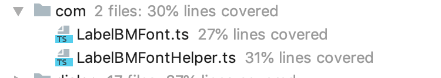
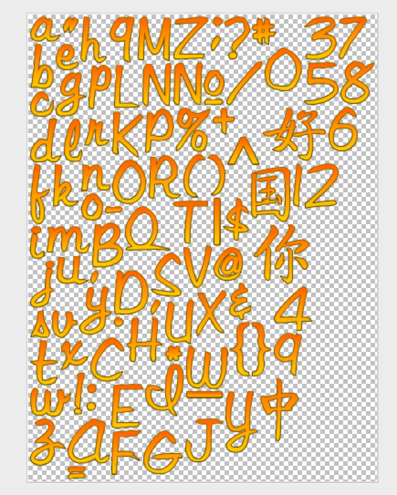

### 微信小游戏Layabox2.0位图字体

在此之前已经写过 如何 用 Layabox1.0 和 Cocos2d-x 关于位图字体的处理结合后怎么运行在微信小游戏上面（之前微信小游戏不允许后缀是xml），现在是是否可以，还不清楚，官方文档里面 还没有搜到这个格式，之前也因为这个格式导致游戏几次被拒绝，耽误工作计划，于是干脆就拿之前的方案加以修改，就可以正常使用了。

<!-- more -->

### 运行环境

- Layabox2.0Typescript项目
- 字体制作工具 [Littera](http://kvazars.com/littera/)（在线Flash制作）、[Glyph Designer](https://www.71squared.com/en/glyphdesigner)、[Bitmap Font Generator](http://www.angelcode.com/products/bmfont/) 任选其一，导出Text格式的fnt 字体文件

### 具体内容

1. 先看一个结构图



2. 然后具体的文件内容如下

**LabelBMFont.ts**

```typescript

import Handler = Laya.Handler;
import Rectangle = Laya.Rectangle;
import Texture = Laya.Texture;
import {LabelBMFontHelper} from "./LabelBMFontHelper";
import Loader = Laya.Loader;

export class LabelBMFont extends Laya.BitmapFont {
    public _texture: Texture;
    public _fontCharDic: any;
    public _fontWidthMap: any;
    public _complete: Handler;
    public _path: string;
    public _maxWidth: number;
    public _spaceWidth: number;
    public _padding: Array<any>;
    public onLoaded: Function;

    constructor() {
        super();
    }

    /**
     *
     * @param path 资源路径
     * @param complete 完成 回调
     */
     loadFont  (path, complete) {
        this._path = path;
        this._complete = complete;
        if (!path || path.indexOf(".fnt") === -1) {
            console.error('Bitmap font configuration information must be a ".fnt" file');
            return;
        }
        Laya.loader.load([{url: path, type: Laya.Loader.TEXT}, {
            url: path.replace(".fnt", ".png"),
            type:/*laya.net.Loader.IMAGE*/"image"
        }], Handler.create(this, this._onLoaded));
    }


    public _onLoaded = function () {
        this.parseFont(Loader.getRes(this._path), Loader.getRes(this._path.replace(".fnt", ".png")));
        this._complete && this._complete.run();
    }

    /**
     *
     * @param xml
     * @param texture 解析 文理
     */
    public parseFont(xml, texture) {
        if (xml == null || texture == null) return;
        this._texture = texture;
        let chars, tScale = 1;
        let fntRes = Laya.loader.getRes(this._path);
        chars = LabelBMFontHelper.parseFnt(fntRes, this._path);
        this.fontSize = chars.fontSize;
        this._padding = chars._padding;
        for (let key in chars.fontDefDictionary) {
            let tAttribute = chars.fontDefDictionary[key];
            let tId = key;
            let xOffset = parseInt(tAttribute["xoffset"]) / tScale;
            let yOffset = parseInt(tAttribute["yoffset"]) / tScale;
            let xAdvance = parseInt(tAttribute["xadvance"]) / tScale;
            let region = new Rectangle();
            region.x = parseInt(tAttribute["rect"]["x"]);
            region.y = parseInt(tAttribute["rect"]["y"]);
            region.width = parseInt(tAttribute["rect"]["width"]);
            region.height = parseInt(tAttribute["rect"]["height"]);
            let tTexture = Texture.create(texture, region.x, region.y, region.width, region.height, xOffset, yOffset);
            this._maxWidth = Math.max(this._maxWidth, xAdvance + this.letterSpacing);
            this._fontCharDic[tId] = tTexture;
            this._fontWidthMap[tId] = xAdvance;
        }
    }
}

```

**LabelBMFontHelper.ts**

```typescript

export class LabelBMFontHelper {
    private static FNT_HEAD = /fntframes [^\n]*(\n|$)/gi;
    private static FNT_FRAME_NAME = /fntframe [^\n]*(\n|$)/gi;
    private static INFO_EXP = /info [^\n]*(\n|$)/gi;
    private static COMMON_EXP = /common [^\n]*(\n|$)/gi;
    private static PAGE_EXP = /page [^\n]*(\n|$)/gi;
    private static CHAR_EXP = /char [^\n]*(\n|$)/gi;
    private static KERNING_EXP = /kerning [^\n]*(\n|$)/gi;
    private static ITEM_EXP = /\w+=[^ \r\n]+/gi;
    private static INT_EXP = /^[\-]?\d+$/;

    public static parseFnt(fntStr, url) {
        let fnt = {};
        let headString = fntStr.match(LabelBMFontHelper.FNT_HEAD);
        fnt = this.parseFntContent(fnt, fntStr, url, null);
        return fnt;
    }

    private static parseStrToObj(str) {
        let arr = str.match(LabelBMFontHelper.ITEM_EXP);
        let obj = {};
        if (arr) {
            for (let i = 0, li = arr.length; i < li; i++) {
                let tempStr = arr[i];
                let index = tempStr.indexOf("=");
                let key = tempStr.substring(0, index);
                let value = tempStr.substring(index + 1);
                if (value.match(LabelBMFontHelper.INT_EXP)) value = parseInt(value);
                else if (value[0] === '"') value = value.substring(1, value.length - 1);
                obj[key] = value;
            }
        }
        return obj;
    }

    private static parseFntContent(fnt, fntStr, url, useAtlas: any) {
        let self = this;
        //common
        let commonObj = self.parseStrToObj(fntStr.match(LabelBMFontHelper.COMMON_EXP)[0]);
        fnt.commonHeight = commonObj["lineHeight"];
        var infoObj = self.parseStrToObj(fntStr.match(self.INFO_EXP)[0]);
        fnt.fontSize = infoObj["size"];
        let padding = infoObj["padding"].split(",");
        fnt.padding =  padding.map((item:string)=>{
            if(item.indexOf(".")!=-1){
                return parseFloat(item);
            }
            return parseInt(item);
        });
        let pageObj = self.parseStrToObj(fntStr.match(LabelBMFontHelper.PAGE_EXP)[0]);
        if (pageObj["id"] !== 0) console.log("cc.LabelBMFontHelper._parseImageFileName() : file could not be found");
        if (!useAtlas) {
            fnt.atlasName = SMPath.path.changeBasename(url, pageObj["file"], false);
        } else {
            fnt.atlasName = SMPath.path.join(SMPath.path.dirname(useAtlas.path) + pageObj["file"]);
        }

        //char
        let charLines = fntStr.match(LabelBMFontHelper.CHAR_EXP);
        let fontDefDictionary = fnt.fontDefDictionary = {};
        for (let i = 0, li = charLines.length; i < li; i++) {
            let charObj = self.parseStrToObj(charLines[i]);
            let charId = charObj["id"];
            fontDefDictionary[charId] = {
                rect: {x: charObj["x"], y: charObj["y"], width: charObj["width"], height: charObj["height"]},
                xoffset: charObj["xoffset"],
                yoffset: charObj["yoffset"],
                xadvance: charObj["xadvance"]
            };
        }

        //kerning
        let kerningDict = fnt.kerningDict = {};
        let kerningLines = fntStr.match(LabelBMFontHelper.KERNING_EXP);
        if (kerningLines) {
            for (let i = 0, li = kerningLines.length; i < li; i++) {
                let kerningObj = self.parseStrToObj(kerningLines[i]);
                kerningDict[(kerningObj["first"] << 16) | (kerningObj["second"] & 0xffff)] = kerningObj["amount"];
            }
        }
        return fnt;
    }
}

export class SMPath {
    static get path(): SMPath {
        if (!this._Ins) this._Ins = new SMPath();
        return this._Ins;
    }

    private static _Ins: SMPath;

    /**
     * Join strings to be a path.
     * @example
     cc.path.join("a", "b.png");//-->"a/b.png"
     cc.path.join("a", "b", "c.png");//-->"a/b/c.png"
     cc.path.join("a", "b");//-->"a/b"
     cc.path.join("a", "b", "/");//-->"a/b/"
     cc.path.join("a", "b/", "/");//-->"a/b/"
     * @returns {string}
     */
    public join(data: any) {
        let l = arguments.length;
        let result = "";
        for (let i = 0; i < l; i++) {
            result = (result + (result === "" ? "" : "/") + arguments[i]).replace(/(\/|\\\\)$/, "");
        }
        return result;
    }

    /**
     * Get the ext name of a path.
     * @example
     cc.path.extname("a/b.png");//-->".png"
     cc.path.extname("a/b.png?a=1&b=2");//-->".png"
     cc.path.extname("a/b");//-->null
     cc.path.extname("a/b?a=1&b=2");//-->null
     * @param {string} pathStr
     * @returns {*}
     */
    extname(pathStr) {
        let temp = /(\.[^\.\/\?\\]*)(\?.*)?$/.exec(pathStr);
        return temp ? temp[1] : null;
    }

    /**
     * Get dirname of a file path.
     * @example
     * unix
     cc.path.driname("a/b/c.png");//-->"a/b"
     cc.path.driname("a/b/c.png?a=1&b=2");//-->"a/b"
     cc.path.dirname("a/b/");//-->"a/b"
     cc.path.dirname("c.png");//-->""
     * windows
     cc.path.driname("a\\b\\c.png");//-->"a\b"
     cc.path.driname("a\\b\\c.png?a=1&b=2");//-->"a\b"
     * @param {string} pathStr
     * @returns {*}
     */
    dirname(pathStr) {
        return pathStr.replace(/((.*)(\/|\\|\\\\))?(.*?\..*$)?/, '$2');
    }

    /**
     * Change extname of a file path.
     * @example
     cc.path.changeExtname("a/b.png", ".plist");//-->"a/b.plist"
     cc.path.changeExtname("a/b.png?a=1&b=2", ".plist");//-->"a/b.plist?a=1&b=2"
     * @param {string} pathStr
     * @param {string} [extname]
     * @returns {string}
     */
    changeExtname(pathStr, extname) {
        extname = extname || "";
        let index = pathStr.indexOf("?");
        let tempStr = "";
        if (index > 0) {
            tempStr = pathStr.substring(index);
            pathStr = pathStr.substring(0, index);
        }
        index = pathStr.lastIndexOf(".");
        if (index < 0) return pathStr + extname + tempStr;
        return pathStr.substring(0, index) + extname + tempStr;
    }

    /**
     * Change file name of a file path.
     * @example
     cc.path.changeBasename("a/b/c.plist", "b.plist");//-->"a/b/b.plist"
     cc.path.changeBasename("a/b/c.plist?a=1&b=2", "b.plist");//-->"a/b/b.plist?a=1&b=2"
     cc.path.changeBasename("a/b/c.plist", ".png");//-->"a/b/c.png"
     cc.path.changeBasename("a/b/c.plist", "b");//-->"a/b/b"
     cc.path.changeBasename("a/b/c.plist", "b", true);//-->"a/b/b.plist"
     * @param {String} pathStr
     * @param {String} basename
     * @param {Boolean} [isSameExt]
     * @returns {string}
     */
    changeBasename(pathStr, basename, isSameExt) {
        if (basename.indexOf(".") === 0) return this.changeExtname(pathStr, basename);
        let index = pathStr.indexOf("?");
        let tempStr = "";
        let ext = isSameExt ? this.extname(pathStr) : "";
        if (index > 0) {
            tempStr = pathStr.substring(index);
            pathStr = pathStr.substring(0, index);
        }
        index = pathStr.lastIndexOf("/");
        index = index <= 0 ? 0 : index + 1;
        return pathStr.substring(0, index) + basename + ext + tempStr;
    }

}

```

3. 然后使用方法：

```typescript
 let scoreBitmapFont: LabelBMFont; 
 let fntURL = "number/test_font.fnt";//此处是你自己的fnt 文件
        this.scoreBitmapFont = new LabelBMFont();
        this.scoreBitmapFont.loadFont(fntURL, Laya.Handler.create(this, function () {
            this.scoreBitmapFont.autoScaleSize = true;
            Laya.Text.registerBitmapFont(DataConst.LABELBMFONT_TEST, this.scoreBitmapFont);
            this.testName.font = DataConst.LABELBMFONT_TEST;//此处是你自己定义的常量 比如”test“
            this.testName.text = "V" + "123中国你好089";
        }));
```

比如我的字体是这样的



fnt文件内容

```
info face=test_font size=72 bold=0 italic=0 charset= unicode= stretchH=100 smooth=1 aa=1 padding=2,2,2,2 spacing=0,0 outline=0
common lineHeight=88 base=58 scaleW=382 scaleH=512 pages=1 packed=0
page id=0 file="test_font.png"
chars count=92
char id=97 x=2 y=2 width=34 height=28 xoffset=3 yoffset=32 xadvance=36 page=0 chnl=15
char id=98 x=2 y=32 width=26 height=50 xoffset=3 yoffset=10 xadvance=29 page=0 chnl=15
char id=99 x=2 y=84 width=26 height=28 xoffset=3 yoffset=32 xadvance=30 page=0 chnl=15
char id=100 x=2 y=114 width=35 height=48 xoffset=0 yoffset=11 xadvance=32 page=0 chnl=15
char id=101 x=30 y=32 width=25 height=29 xoffset=3 yoffset=31 xadvance=28 page=0 chnl=15
char id=102 x=2 y=164 width=23 height=66 xoffset=3 yoffset=15 xadvance=23 page=0 chnl=15
char id=103 x=30 y=63 width=34 height=49 xoffset=-1 yoffset=33 xadvance=28 page=0 chnl=15
char id=104 x=57 y=2 width=30 height=51 xoffset=1 yoffset=10 xadvance=30 page=0 chnl=15
char id=105 x=2 y=232 width=16 height=36 xoffset=2 yoffset=24 xadvance=18 page=0 chnl=15
char id=106 x=2 y=270 width=27 height=52 xoffset=-4 yoffset=24 xadvance=22 page=0 chnl=15
char id=107 x=27 y=164 width=29 height=47 xoffset=3 yoffset=13 xadvance=30 page=0 chnl=15
char id=108 x=39 y=114 width=20 height=48 xoffset=2 yoffset=12 xadvance=24 page=0 chnl=15
char id=109 x=20 y=232 width=48 height=30 xoffset=1 yoffset=31 xadvance=49 page=0 chnl=15
char id=110 x=58 y=164 width=32 height=30 xoffset=1 yoffset=30 xadvance=33 page=0 chnl=15
char id=111 x=58 y=196 width=24 height=30 xoffset=3 yoffset=30 xadvance=28 page=0 chnl=15
char id=112 x=66 y=55 width=26 height=49 xoffset=3 yoffset=31 xadvance=29 page=0 chnl=15
char id=113 x=89 y=2 width=28 height=51 xoffset=2 yoffset=32 xadvance=30 page=0 chnl=15
char id=114 x=61 y=114 width=29 height=30 xoffset=1 yoffset=29 xadvance=29 page=0 chnl=15
char id=115 x=2 y=324 width=22 height=31 xoffset=2 yoffset=29 xadvance=23 page=0 chnl=15
char id=116 x=2 y=357 width=31 height=50 xoffset=1 yoffset=10 xadvance=31 page=0 chnl=15
char id=117 x=31 y=264 width=35 height=32 xoffset=2 yoffset=29 xadvance=28 page=0 chnl=15
char id=118 x=26 y=324 width=28 height=31 xoffset=1 yoffset=29 xadvance=25 page=0 chnl=15
char id=119 x=2 y=409 width=46 height=32 xoffset=1 yoffset=28 xadvance=41 page=0 chnl=15
char id=120 x=35 y=357 width=31 height=34 xoffset=0 yoffset=28 xadvance=24 page=0 chnl=15
char id=121 x=56 y=298 width=36 height=54 xoffset=-4 yoffset=32 xadvance=27 page=0 chnl=15
char id=122 x=2 y=443 width=39 height=52 xoffset=-3 yoffset=32 xadvance=30 page=0 chnl=15
char id=65 x=43 y=443 width=46 height=50 xoffset=3 yoffset=10 xadvance=49 page=0 chnl=15
char id=66 x=70 y=228 width=34 height=50 xoffset=2 yoffset=11 xadvance=37 page=0 chnl=15
char id=67 x=68 y=354 width=38 height=49 xoffset=1 yoffset=11 xadvance=37 page=0 chnl=15
char id=68 x=94 y=280 width=38 height=50 xoffset=4 yoffset=11 xadvance=43 page=0 chnl=15
char id=69 x=91 y=405 width=35 height=49 xoffset=2 yoffset=11 xadvance=35 page=0 chnl=15
char id=70 x=91 y=456 width=33 height=49 xoffset=2 yoffset=11 xadvance=33 page=0 chnl=15
char id=71 x=126 y=456 width=44 height=48 xoffset=2 yoffset=11 xadvance=45 page=0 chnl=15
char id=72 x=108 y=332 width=40 height=49 xoffset=2 yoffset=10 xadvance=41 page=0 chnl=15
char id=73 x=128 y=383 width=43 height=58 xoffset=3 yoffset=8 xadvance=47 page=0 chnl=15
char id=74 x=172 y=443 width=42 height=48 xoffset=0 yoffset=12 xadvance=41 page=0 chnl=15
char id=75 x=92 y=106 width=34 height=51 xoffset=2 yoffset=12 xadvance=35 page=0 chnl=15
char id=76 x=94 y=55 width=29 height=48 xoffset=2 yoffset=12 xadvance=28 page=0 chnl=15
char id=77 x=119 y=2 width=38 height=49 xoffset=1 yoffset=11 xadvance=39 page=0 chnl=15
char id=78 x=125 y=53 width=32 height=48 xoffset=3 yoffset=12 xadvance=37 page=0 chnl=15
char id=79 x=92 y=159 width=38 height=49 xoffset=2 yoffset=12 xadvance=39 page=0 chnl=15
char id=80 x=128 y=103 width=32 height=49 xoffset=2 yoffset=11 xadvance=32 page=0 chnl=15
char id=81 x=106 y=210 width=50 height=49 xoffset=2 yoffset=11 xadvance=48 page=0 chnl=15
char id=82 x=132 y=154 width=36 height=48 xoffset=1 yoffset=12 xadvance=36 page=0 chnl=15
char id=83 x=134 y=261 width=34 height=49 xoffset=1 yoffset=11 xadvance=34 page=0 chnl=15
char id=84 x=158 y=204 width=39 height=47 xoffset=0 yoffset=12 xadvance=37 page=0 chnl=15
char id=85 x=150 y=312 width=32 height=49 xoffset=2 yoffset=12 xadvance=33 page=0 chnl=15
char id=86 x=170 y=253 width=31 height=47 xoffset=2 yoffset=13 xadvance=32 page=0 chnl=15
char id=87 x=173 y=363 width=46 height=48 xoffset=4 yoffset=12 xadvance=51 page=0 chnl=15
char id=88 x=184 y=302 width=34 height=51 xoffset=1 yoffset=10 xadvance=33 page=0 chnl=15
char id=89 x=216 y=413 width=36 height=68 xoffset=2 yoffset=14 xadvance=36 page=0 chnl=15
char id=90 x=159 y=2 width=39 height=48 xoffset=0 yoffset=13 xadvance=35 page=0 chnl=15
char id=33 x=50 y=393 width=12 height=46 xoffset=2 yoffset=14 xadvance=14 page=0 chnl=15
char id=8470 x=159 y=52 width=56 height=48 xoffset=9 yoffset=12 xadvance=72 page=0 chnl=15
char id=59 x=200 y=2 width=13 height=39 xoffset=3 yoffset=30 xadvance=15 page=0 chnl=15
char id=37 x=162 y=102 width=38 height=49 xoffset=0 yoffset=12 xadvance=36 page=0 chnl=15
char id=58 x=64 y=405 width=11 height=30 xoffset=4 yoffset=29 xadvance=16 page=0 chnl=15
char id=63 x=215 y=2 width=28 height=47 xoffset=2 yoffset=12 xadvance=30 page=0 chnl=15
char id=42 x=150 y=363 width=19 height=18 xoffset=1 yoffset=16 xadvance=19 page=0 chnl=15
char id=40 x=170 y=153 width=24 height=48 xoffset=1 yoffset=12 xadvance=24 page=0 chnl=15
char id=41 x=196 y=153 width=20 height=46 xoffset=3 yoffset=14 xadvance=23 page=0 chnl=15
char id=95 x=173 y=413 width=40 height=8 xoffset=-1 yoffset=61 xadvance=33 page=0 chnl=15
char id=43 x=202 y=102 width=25 height=30 xoffset=1 yoffset=23 xadvance=24 page=0 chnl=15
char id=45 x=84 y=210 width=20 height=8 xoffset=4 yoffset=36 xadvance=25 page=0 chnl=15
char id=61 x=43 y=495 width=20 height=15 xoffset=1 yoffset=35 xadvance=19 page=0 chnl=15
char id=46 x=94 y=332 width=11 height=10 xoffset=3 yoffset=50 xadvance=13 page=0 chnl=15
char id=44 x=134 y=312 width=11 height=18 xoffset=3 yoffset=50 xadvance=16 page=0 chnl=15
char id=47 x=217 y=51 width=40 height=49 xoffset=0 yoffset=11 xadvance=37 page=0 chnl=15
char id=124 x=203 y=201 width=8 height=52 xoffset=5 yoffset=8 xadvance=16 page=0 chnl=15
char id=34 x=38 y=2 width=17 height=19 xoffset=2 yoffset=14 xadvance=18 page=0 chnl=15
char id=39 x=68 y=280 width=9 height=16 xoffset=1 yoffset=12 xadvance=9 page=0 chnl=15
char id=64 x=203 y=255 width=32 height=37 xoffset=3 yoffset=23 xadvance=35 page=0 chnl=15
char id=35 x=245 y=2 width=27 height=32 xoffset=2 yoffset=23 xadvance=28 page=0 chnl=15
char id=36 x=213 y=201 width=29 height=48 xoffset=0 yoffset=12 xadvance=26 page=0 chnl=15
char id=94 x=218 y=134 width=36 height=31 xoffset=5 yoffset=19 xadvance=40 page=0 chnl=15
char id=38 x=220 y=294 width=25 height=41 xoffset=1 yoffset=15 xadvance=24 page=0 chnl=15
char id=123 x=221 y=337 width=22 height=60 xoffset=0 yoffset=10 xadvance=18 page=0 chnl=15
char id=125 x=245 y=337 width=22 height=60 xoffset=0 yoffset=10 xadvance=18 page=0 chnl=15
char id=20013 x=254 y=399 width=43 height=69 xoffset=15 yoffset=0 xadvance=72 page=0 chnl=15
char id=22269 x=244 y=167 width=44 height=61 xoffset=16 yoffset=2 xadvance=72 page=0 chnl=15
char id=20320 x=247 y=230 width=61 height=66 xoffset=5 yoffset=0 xadvance=72 page=0 chnl=15
char id=22909 x=256 y=102 width=71 height=59 xoffset=0 yoffset=6 xadvance=72 page=0 chnl=15
char id=48 x=259 y=36 width=41 height=48 xoffset=-4 yoffset=12 xadvance=29 page=0 chnl=15
char id=49 x=290 y=163 width=11 height=48 xoffset=10 yoffset=13 xadvance=29 page=0 chnl=15
char id=50 x=303 y=163 width=38 height=50 xoffset=-3 yoffset=12 xadvance=29 page=0 chnl=15
char id=51 x=302 y=2 width=36 height=48 xoffset=-2 yoffset=12 xadvance=29 page=0 chnl=15
char id=52 x=269 y=298 width=42 height=49 xoffset=-5 yoffset=10 xadvance=29 page=0 chnl=15
char id=53 x=302 y=52 width=38 height=47 xoffset=-3 yoffset=12 xadvance=29 page=0 chnl=15
char id=54 x=329 y=101 width=32 height=49 xoffset=0 yoffset=11 xadvance=29 page=0 chnl=15
char id=55 x=340 y=2 width=31 height=47 xoffset=0 yoffset=13 xadvance=29 page=0 chnl=15
char id=56 x=342 y=51 width=38 height=47 xoffset=-3 yoffset=13 xadvance=29 page=0 chnl=15
char id=57 x=269 y=349 width=31 height=48 xoffset=0 yoffset=13 xadvance=29 page=0 chnl=15
char id=32 x=0 y=0 width=0 height=0 xoffset=0 yoffset=13 xadvance=14 page=0 chnl=15
```

4. 思路就是和之前一样，就是自己写一个类，继承 `Laya.BitmapFont`类，然后更改读取的格式，更改解析的方法，其他用法和 Laya.BitmapFont 一样。

###  总结

LayaBox 2.0 总的来说 语法和类变化都不大，但内部实现和封装有所不同，在工作之余，多看看文档 多研究一下API 当然了也可以边工作边学习，多思考，肯定有意外的收获。