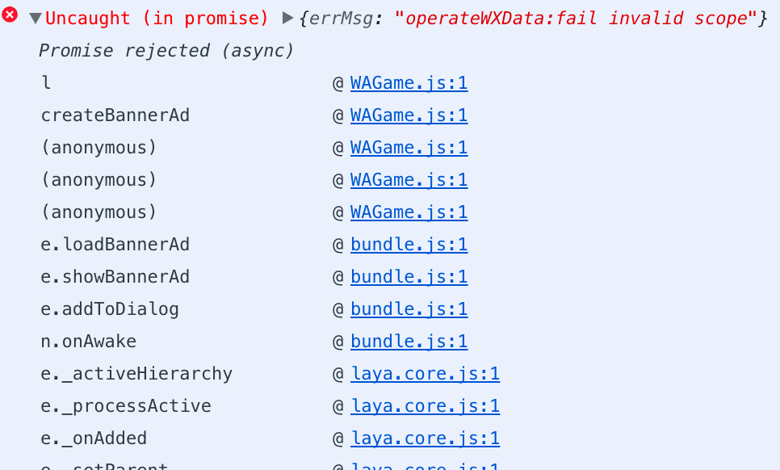

小游戏开发如火如荼，从最初的微信平台，头条平台，后面加入的小米和OPPO  都在分吃这块大蛋糕，Layabox作为三大引擎之一，也在不断版本迭代，如我所料，虽然每次版本更新都有解决了很多问题，有优化了很多体验，开发者也会踩进新的坑，这篇文章我就简单说说我再开发2.0的过程中踩过的几个坑。(持续更新)

<!-- more -->

### operateWXData:fail invalid scope"

这个问题 是在模拟器看到的，是创建微信的banner广告错位，虽然不影响游戏，但是看起来还是怪怪的，大家可以忽略这个即可，如果真想解决，两个办法

- 用真实的banner 需要的 创建id 
- 自己写个开关，没有过千用户的时候，可以自己先关闭，等到符合条件后开启

### Cannot read property 'enable' of null

报这个错误的原因有很多，我这个原因是因为我升级了Layabox 引擎，最新的引擎里面已经重新整合了核心库，我依旧引用了旧的库，造成了引用重复等相关问题，比如我的是引入了  webgl 这个库。解决办法

- 去掉旧的引擎，重新编译发布即可

### Laya.Templet is not a constructor  

我升级了引擎后突然就报了这个错，当时有点懵逼，找了许久，后来才想到查找引用库，发现是自己忘记引用对应的动画库文件了，解决方案

- 引入对应的库文件即可，比如我的是 `laya.ani.js` 

于此相似的还有  Laya.Skeleton is not a constructor 这样的报错，一旦遇到这样无法初始化的是 应该首先去查找库文件的引用。

### 做排行榜的时候，排行榜内容可以正常显示，但是不能滑动

这个问题当时也很诡异，查找了N久，后面终于找到真相，原因是 素材的类型是 Dialog，如果改成 Scene就可以正常运行，我改成了View 也是可以的，另外如果依旧想用Dialog 类型可以重写Open方法即可。

### ProgressBar 进度条，没有办法进行 不重复的显示

原因是我把素材打包导致的，我设置素材为不打包后，就可以运行了，这个可能和我加载模式有关，应该需要使用方式和加载保持一致才行。

