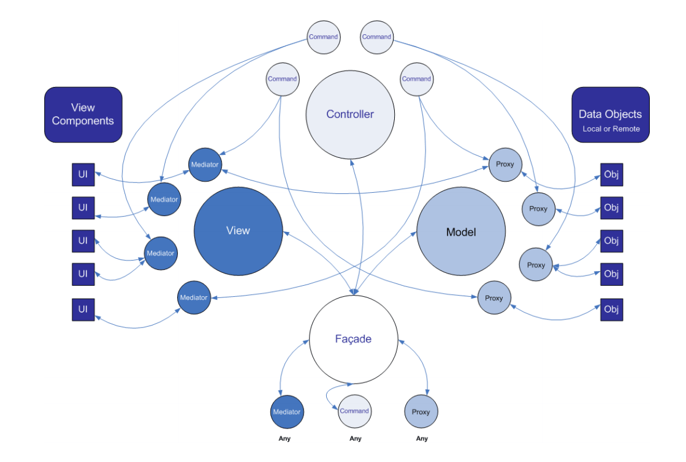
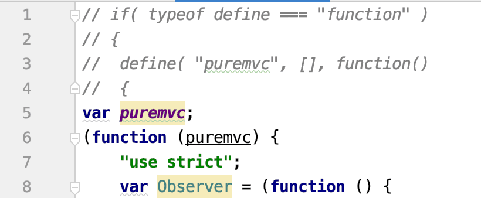
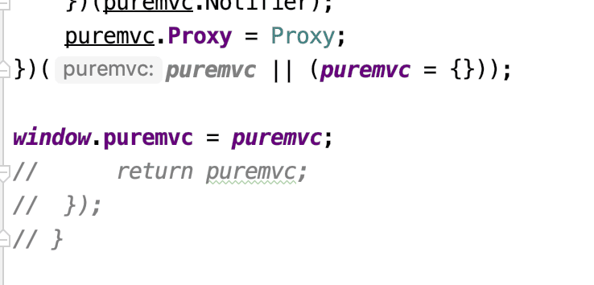

之前开发小游戏的时候，使用引擎开发，都是把每个面板写成单例，然后需要展示的时候调用起方法，相比之下之前的游戏逻辑都不复杂这样基本都够用了，后面游戏稍微复杂了，开始使用每个模块都有个对外的代理文件，这样模块之间通信都用代理和代理之间接触，加上Layabox自带的自定义事件基本能够满足需要，随着游戏开发越来越复杂，功能越来越多，上面的模式支持起来不太好了，此时需要的是解耦和消息模式，至此我想到了以前用的puremvc 框架。

<!-- more -->

### 框架介绍

[puremvc](https://puremvc.org/)框架是个轻量级的mvc框架，，目前有多个语言版本，其中常见的C++,C#,GO,Java,JavaScript,PHP,ActionScript3,TypeScript等多种语言，另外很多语言都提供了标准版本和多核版本。该框架代码开源，资料很多，上手容易，概念清晰，容易移植，类库文件很小等优点。



看上面的结构图，很容易理解，其实就是一个核心层Facade 下面分别控制着 M(model)、V(View)、C(command)实现了标准的MVC模式，通信采用了观察者模式，单例运行。

在Layabox 如何使用呢？

### 步骤

1. 首先我们去官网给出的地址，去下载框架源码 下载地址：https://github.com/PureMVC/puremvc-typescript-standard-framework（[点击下载](https://github.com/PureMVC/puremvc-typescript-standard-framework)）

2. 然后找到类库里面的puremvc.d.ts 和puremvc.js文件

3. 需要修改一下才能使用 具体修改如下：

   - 注释掉前面四行

   

   - 末尾修改如下

   

4. 然后正常引入Layabox引擎项目即可

5. 在导出微信项目的时候，puremvc 类库文件没有复制 应该laya官方有特殊的限制，我把名字修改成 `laya.puremvc.js` 后就可以成功复制，应该是他们监听了laya.类似这样的限制。

   然后再Main文件里面写：

   ```typescript
   onConfigLoaded(): void {
           //加载IDE指定的场景
           // GameConfig.startScene && Laya.Scene.open(GameConfig.startScene);
           //初始化PureMVC框架，并启动游戏 传入 Laya.stage
           let app = ApplicationFacade.getInstance();
           app.startup(Laya.stage);
       }
   ```

   `ApplicationFacade.ts`

   ```typescript
   /**
    * Created by jsroads on 2019/6/14 . 17:15
    * Note:
    */
   import StartupCommand from "./controller/StartupCommand";
   import IFacade = puremvc.IFacade;
   import Facade = puremvc.Facade;
   
   /**
    * ApplicationFacade 类对象负责初始化Controller（控制器），建立Command与Notification 名之间的映射；
    * 并执行一个Command注册所有的 Model 和View。它是PureMVC应用程序的入口。
    * @author jsroads
    */
   export class ApplicationFacade extends Facade implements IFacade {
       /**
        * 这里仅仅定义Notification（通知）常量    --    START_UP （private），标识应用程序启动
        * 其它Notification（通知）常量抽离到ApplicationConstants中定义，这样更简洁、清晰
        */
       public static START_UP: string = "start_up";
   
       constructor() {
           super()
       }
   
       public static getInstance(): ApplicationFacade {
           if (!this.instance) this.instance = new ApplicationFacade();
           return <ApplicationFacade>(this.instance);
       }
   
       /**
        * 为了ApplicationFacade结构更清晰和简洁。
        * 将注册Command、Proxy、View&Mediator的工作抽离到
        * ControllerCommands.ts、ModelPrepCommand.ts、ViewPrepCommand.ts。
        *
        * 注册应用程序启动Startup命令，应用程序启动时执行 StartupCommand
        * StartupCommand中将执行以下操作：
        * ControllerCommand -- 初始化应用程序事件与Command之间的映射关系；
        * ModelPrepCommand --    Model 初始化，初始化应用程序启动过程中需要用到的Proxy，并注册；
        * ViewPrepCommand    --    View 初始化，唯一创建并注册ApplicationMediator，它包含其他所有View Component并在启动时创建它们
        */
       public initializeFacade(): void {
           super.initializeFacade();
           this.registerCommand(ApplicationFacade.START_UP, StartupCommand);
       }
   
       /**
        * 启动PureMVC，在应用程序中调用此方法，并传递应用程序本身的引用
        * @param stage    -    PureMVC应用程序的根视图 root，包含其它所有的View Componet
        */
       public startup(stage: any): void {
           this.sendNotification(ApplicationFacade.START_UP, stage);
           this.removeCommand(ApplicationFacade.START_UP);//PureMVC初始化完成，注销STARUP命令
       }
   }
   ```

   `StartupCommand.ts`

   ```typescript
   /**
    * Created by jsroads on 2019/6/14 . 17:29
    * 应用程序启动时执行的 MacroCommand.
    * StartupCommand中将执行以下操作：
    *    ControllerCommands   --    初始化应用程序事件与Command之间的映射关系；
    *    ModelPrepCommand     --    Model 初始化，初始化应用程序启动过程中需要用到的Proxy，并注册；
    *    ViewPrepCommand      --    View 初始化，唯一创建并注册ApplicationMediator，包含其他所有View Component并在启动时创建它们
    */
   import MacroCommand = puremvc.MacroCommand;
   import ControllerCommands from "./core/ControllerCommands";
   import ModelPrepCommand from "./core/ModelPrepCommand";
   import ViewPrepCommand from "./core/ViewPrepCommand";
   
   export default class StartupCommand extends MacroCommand {
       constructor() {
           super();
       }
   
       //添加子Command 初始化MacroCommand.
       public initializeMacroCommand(): void {
           /**
            * 命令会按照“先进先出”（FIFO）的顺序被执行.
            * 在用户与数据交互之前，Model必须处于一种一致的已知的状态.
            * 一旦Model 初始化完成，View视图就可以显示数据允许用户操作与之交互.
            * 因此，一般“ 开启”（startup ）过程首先Model初始化，然后View初始化。
            */
           this.addSubCommand(ControllerCommands);
           this.addSubCommand(ModelPrepCommand);
           this.addSubCommand(ViewPrepCommand);
       }
   }
   ```

   `ControllerCommands.ts`

   ```typescript
   /**
    * Created by jsroads on 2019/6/15 . 10:35
    * Note:注册Command ，建立 Command 与Notification 之间的映射
    */
   
   import AppConstants from "../../AppConstants";
   import SimpleCommand = puremvc.SimpleCommand;
   import INotification = puremvc.INotification;
   
   export default class ControllerCommands extends SimpleCommand {
       constructor() {
           super();
       }
   
       public execute(note: INotification): void {
       		//游戏的command 都在这里注册
           //登录游戏
           this.facade.registerCommand(AppConstants.LOGIN, LoginCommand);
       }
   }
   ```

   `ModelPrepCommand.ts`

   ```typescript
   /**
    * Created by jsroads on 2019/6/14 . 18:39
    * Note: 创建Proxy 对象，并注册
    * Model的初始化通常比较简单：创建并注册在“开启”过程中需要用到的Proxy。
    * 这里Command并没有操作或初始任何的Model数据。Proxy 的职责才是取得，创建，和初始化数据对象。
    */
   import SimpleCommand = puremvc.SimpleCommand;
   import INotification = puremvc.INotification;
   
   export default class ModelPrepCommand extends SimpleCommand {
       constructor() {
           super();
       }
   
       //由MacroCommand调用
       public execute(note: INotification): void {
          		//游戏的Proxy 都在这里注册
       }
   }
   ```

   `ViewPrepCommand.ts`

   ```typescript
   /**
    * Created by jsroads on 2019/6/14 . 18:40
    * Note:创建Mediator，并把它注册到View.
    */
   
   import AppMediator from "../../AppMediator";
   import SimpleCommand = puremvc.SimpleCommand;
   
   export default class ViewPrepCommand extends SimpleCommand {
       public constructor() {
           super();
       }
   
       public execute(notification: puremvc.INotification): void {
           //游戏主舞台
           this.facade.registerMediator(new AppMediator());
       }
   }
   ```

   `AppMediator.ts`

   ```typescript
   /**
    * Created by jsroads on 2019/6/14 . 18:53
    * Note:
    */
   import AppConstants from "./AppConstants";
   import Mediator = puremvc.Mediator;
   export default class AppMediator extends Mediator {
       public static NAME: string = "AppMediator";
       constructor(mediatorName?: string, viewComponent?: any) {
           super(AppMediator.NAME);
       }
   
       public onRegister(): void {
          
       }
   
       public getViewComponent(): MainScene {
           return <MainScene>super.getViewComponent();
       }
   
       public listNotificationInterests(): string[] {
           return [
               AppConstants.LOADING_SUCCESS
           ];
       }
   
       public handleNotification(notification: puremvc.INotification): void {
           switch (notification.getName()) {
               case AppConstants.LOADING_SUCCESS:
               default:
           }
       }
   }
   ```

   以上 就是如何在Layabox2.0项目使用 puremvc 框架

### 参考

- [PureMVC 最佳实践](https://puremvc.org/docs/PureMVC_IIBP_Chinese.pdf)
- https://github.com/PureMVC/puremvc-typescript-standard-framework
- [PureMVC（AS3）剖析](https://www.cnblogs.com/skynet/archive/2012/12/29/2838303.html)