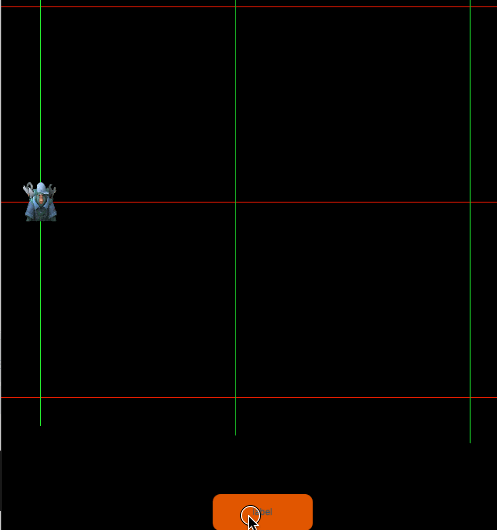

游戏开发的同学都有同感，在物体运动的时候，曲线运动一直是一个常见的需求，常见的曲线运动有规则的，比如圆周运动，椭圆运动，加速减速运动，使用Layabox引擎的时候，官方已经提供了一个关于缓动的类，Tween，作为从AS3开发起步的人，一定会想到当年的greensock缓动库，基本解决了很多头疼动画需求，而且关键是这个类库文件小，效率还高。从AS3转到H5行业后，greensock 也升级到了2.0 更改了名字。

<!-- more -->

### 引入原因：

- Laya自带的Tween类动效特别弱，仅仅相当于TweenLite的阉割版本，比如 yoyo 这样的都没有提供
- 曲线运动的时候，官方提供的Tween类显然是无力支撑
- 多个物体 做同一套动效的时候，这个时候，需要开发者自己去写一大块业务逻辑处理，如果写的粗糙，会造成动画僵硬不连贯，甚至会造成内存问题。

###  步骤

1. 首先我们去网上下载一个类库文件，我恰好搜到一个中文网站，里面文档都是中文的，作为一个英文不是很强的人，当然选择驻足学习。[Tweenmax中文网站](https://www.tweenmax.com.cn/)
2. 我们选择需要的TweenMax下载 地址是https://www.tweenmax.com.cn/source/（[点击我下载](https://www.tweenmax.com.cn/download/greensock-js-2.1.2.zip)）
3. 这个类库是JavaScript 类库，我用的是typescript 语言开发项目 所以需要编写声明文件（后面会给出）
4. 我们在项目内引入我们的TweenMax类库，查看[TweenMax文档](https://www.tweenmax.com.cn/api/tweenmax/)和[贝塞尔曲线文档](https://www.tweenmax.com.cn/BezierPlugin/)
5. 在项目内实现我们需要的功能，贝塞尔曲线如果想提前可视化 可以借助官方给的工具[贝塞尔曲线生成工具](https://www.tweenmax.com.cn/tool/bezier/)
6. 编写我们需要的效果，完成需求。

### 文档相关源文件

`TweenMax.d.ts` 声明文件

```typescript
/**
 * Created by jsroads on 2019-08-23.16:59
 * Note:
 */
declare class TweenMax {
    /**
     *构造函数
     *@param target 应该影响其属性的目标对象（或对象数组）
     *@param duration 持续时间（以秒为单位）
     *@param vars 参数对象，用于定义应该补间的每个属性的结束值以及任何特殊属性
     */
    constructor(target:any, duration:Number, vars:any );
    static to(target:any, duration:Number, vars:any ) : TweenMax;
    static from(target:any, duration:Number, vars:any ) : TweenMax;
    static fromTo(target:any, duration:Number, fromVars:any, toVars:any ) : TweenMax;
    static staggerFrom(target:any, duration:Number, fromVars:any, toVars:any ) : TweenMax;
    static staggerTo(targets:Array<any>, duration:Number, vars:any, stagger?:Number, onCompleteAll?:Function, onCompleteAllParams?:Array<any>, onCompleteAllScope?:any ) : Array<any>;
    static staggerFromTo(targets:Array<any>, duration:Number, fromVars:any, toVars:any, stagger?:Number, onCompleteAll?:Function, onCompleteAllParams?:Array<any>, onCompleteAllScope?:any ) : Array<any>
    static getTweensOf(target:any, onlyActive:Boolean );
    static delayedCall(delay:Number, callback:Function, params?:Array<any>, scope?:any, useFrames?:Boolean ) : TweenMax;
    static killDelayedCallsTo(func:Function );
    static killTweensOf(target:any, vars?:any );
    static killAll(complete?:Boolean, tweens?:Boolean, delayedCalls?:Boolean, timelines?:Boolean );
    static killChildTweensOf(parent:any, complete?:Boolean );
    static pauseAll(tweens:Boolean, delayedCalls:Boolean, timelines:Boolean );
    static resumeAll(tweens:Boolean, delayedCalls:Boolean, timelines:Boolean );
    static set(target:any, vars:any ) : TweenMax;

    isActive() : Boolean;
    delay(value?:Number ) :any;
    duration(value:Number ) :any;
    eventCallback(type:String, callback?:Function, params?:Array<any>, scope?:any ) :any;
    endTime(includeRepeats:Boolean ) : Number;
    /**
     * 刷新任何内部记录的开始/结束值，如果您想要重新启动动画而不恢复任何先前记录的起始值，这将非常有用。
     */
    invalidate();
    kill(vars?:any, target?:any ) :any;
    pause(atTime:any, suppressEvents:Boolean ) :any;
    paused(value:Boolean ) :any;
    play(from:any, suppressEvents:Boolean ) :any;
    progress(value:Number, suppressEvents:Boolean ) :any;
    /**
     * 重启
     *@param includeDelay（default =  false） - 确定重新启动时是否遵循延迟（如果有）
     *@param suppressEvents（default =  true） - 如果  true （默认值），当播放头移动到time 参数中定义的新位置时，不会触发任何事件或回调。
     */
    restart(includeDelay?:Boolean, suppressEvents?:Boolean ) :any;
    resume(from?:any, suppressEvents?:Boolean ) :any;
    /**
     * 反转播放，以便动画的所有方面都向后定向，包括例如补间的简易性。
     *@param from （default =  null） - 动画开始反向播放的时间（或TimelineLite / TimelineMax实例的标签）（如果没有定义，它将从播放头当前所在的任何地方开始播放）。要从动画的最后开始，请使用  0。负数相对于动画结束，因此-1将从结尾开始为1秒
     *@param
     */
    reverse(from?:any, suppressEvents?:Boolean ) :any;
    /**
     * 获取或设置动画的反转状态，指示是否应该向后播放动画。
     *@param value （default =  false） - 省略参数返回当前值（getter），而定义参数则设置值（setter）并返回实例本身以便于链接
     */
    reversed(value?:Boolean ) :any;

    /**
     * 重复动画
     *@param value 次数（第一次不计算在内）
     */
    repeat(value:Number ) :any;
    /**
     * 获取或设置重复之间的秒数（或基于帧的补间的帧）的时间量。
     */
    repeatDelay(value:Number ) :any;
    /**
     * 跳转到指定时间(不影响实例是暂停还是反转)
     *@param time 要去的时间
     *@param suppressEvents（default = true）-如果true（默认值），当播放头移动到time 参数中定义的新位置时，不会触发任何事件或回调。
     */
    seek(time:any, suppressEvents?:Boolean ) :any;
    startTime(value:Number ) :any;
    time(value:Number ) :any;
    timeScale(value:Number ) :any;
    /**
     * 获取或设置补间的总持续时间（以秒为单位）（或基于帧的补间的帧），包括任何重复或repeatDelay。
     *@param value （default =  NaN） - 省略参数返回当前值（getter），而定义参数则设置值（setter）并返回实例本身以便于链接。负值将从 动画的END开始解释
     */
    totalDuration(value:Number ) :any;
    totalProgress(value:Number, suppressEvents:Boolean ) :any;
    totalTime(time:Number, suppressEvents:Boolean ) :any;
    /**
     * 动态更新补间值，即使补间正在进行中，它们也会无缝地改变路线。
     *@param vars 包含应具有udpated的目标值的属性的对象。但如果你改变一个插件值，则需要完全定义它,例如，要将目标值更新x为300并将目标值更新y为500，请传递:{x:300, y:500}
     *@param resetDuration （默认值=  false） -如果补间已开始（或成品），并  resetDuration 是  true，补间将重新启动。如果  resetDuration 是  false，则补间的时间将被接受（不重启），并且将调整每个补间属性的起始值，使其看起来无缝地重定向到新的目标值
     */
    updateTo(vars:object, resetDuration?:Boolean ) :any;

    // ease: Ease;// (or Function or String);
    // onComplete: Function;
    /**可用于存储你需要的数据*/
    data: any;
    /**获取动画的目标对象*/
    target: any;
    /**获取动画的父级时间轴对象（只读）*/
    readonly timeline: any;
    /**一个存储了传递给构造器的配置变量的对象。包含动画选项和回调函数等。例如delay、paused、onComplete*/
    vars: any;
}
```

Index.js

```javascript
/**
 * 设置LayaNative屏幕方向，可设置以下值
 * landscape           横屏
 * portrait            竖屏
 * sensor_landscape    横屏(双方向)
 * sensor_portrait     竖屏(双方向)
 */
window.screenOrientation = "sensor_landscape";

//-----libs-begin-----
loadLib("libs/laya.core.js")
loadLib("libs/laya.ui.js")
loadLib("libs/laya.physics.js")
loadLib("libs/TweenMax.js")
//-----libs-end-------
loadLib("js/bundle.js");

```

测试代码：

```typescript
this.sp.pos(50,500);
        this.myBtn.on(Event.CLICK,this,()=>{
            this.sp.pos(50,500);
            TweenMax.to(this.sp, 0.75, {
                bezier:{type:"soft",values:[{x:50, y:500}, {x:300, y:300}, {x:600, y:500}], autoRotate:true},
                ease:Ease.linearOut,overwrite:true,repeat:-1,yoyo:true
            });
        })
```

最终效果如下：



### 后记

程序开发的过程中，要学会学以致用，前面的东西后面能够借用，省事省力。