Cocos Creator是个能发布多平台的引擎工具，之前一直用来发布Web项目，微信小游戏，头条小游戏，QQ小游戏的项目，今天尝试了一下如何发布Native 安卓（Android）apk和ios的ipa 文件。
<!--more-->

Cocos Creator 使用基于 cocos2d-x 引擎的 JSB 技术实现跨平台发布原生应用。在使用 Cocos Creator 打包发布到原生平台之前，需要先配置好 cocos2d-x 相关的开发环境。

## 前期准备

### 环境准备

- Android 环境（Android Studio）[点击下载](http://www.android-studio.org/)
- ios环境  （Xcode）（可以Appstore下载）[进入官网](https://developer.apple.com/xcode/)
- Cocos Creator [进入官网](https://www.cocos.com/creator)
- Python2.75+（Mac电脑自带）（[进入官网](https://www.python.org/downloads/)）
- Java SDK （JDK）[点击下载](https://www.oracle.com/technetwork/java/javase/downloads/jdk8-downloads-2133151.html)

#### 配置环境

- Java SDK

```shell
java -version
```

本地输出

```shell
Last login: Thu Oct 17 14:39:48 on ttys001
bogon:~ smile$ java -version
java version "12.0.1" 2019-04-16
Java(TM) SE Runtime Environment (build 12.0.1+12)
Java HotSpot(TM) 64-Bit Server VM (build 12.0.1+12, mixed mode, sharing)
bogon:~ smile$
```

如果不能正确输出，请重新配置JDK环境，如何配置JDK，在此不再赘述。

- Python

```shell
Python
```

本地输出

```shell
bogon:~ smile$ Python
Python 2.7.16 (v2.7.16:413a49145e, Mar  2 2019, 14:32:10)
[GCC 4.2.1 Compatible Apple LLVM 6.0 (clang-600.0.57)] on darwin
Type "help", "copyright", "credits" or "license" for more information.
>>>
```

- 安装Xcode和Android Studio

- 安装 Android Studio 完成后，参考官方文档，打开 SDK Manager

- [SDK Manager 使用说明（需要使用 VPN）](https://developer.android.com/studio/intro/update.html#sdk-manager)

  > 1. 在 SDK Platforms 分页栏，勾选你希望安装的 API Level，也就是支持安卓系统的版本，推荐选择最低兼容的 API Level 16（4.1) 和所需的主流 API Level 23（6.0）、API Level 26（8.0）和 API Level 28（9.0）。
  >
  > 2. 在 SDK Tools 分页栏，首先勾选右下角的 `Show Package Details`，显示分版本的工具选择。
  >
  > 3. 在 `Android SDK Build-Tools` 里，选择最新的 build tools 版本。
  >
  > 4. 勾选 `Android SDK Platform-Tools`, `Android SDK Tools` 和 `Android Support Library`
  >
  > 5. 勾选 `NDK`，确保版本在 r16 及以上。
  >
  > 6. 记住窗口上方所示的 Android SDK Location 指示的目录，稍后我们需要在 Cocos Creator 里填写这个 SDK 所在位置。
  >
  > 7. 点击 `OK`，根据提示完成安装。
  >
  >    Cocos2d-x 自带的编译工具 Cocos Console 需要以下运行环境：
  >
  >    - Python 2.7.5+，[下载页](https://www.python.org/downloads/)，注意不要下载 Python 3.x 版本。
  >    - Windows 下需要安装 Visual Studio 2015 或 2017 社区版，[下载页](https://www.visualstudio.com/downloads/download-visual-studio-vs)
  >    - Mac 下需要安装 Xcode 和命令行工具，[下载页](https://developer.apple.com/xcode/download/)

**注意：如果没有`Android Support Library` 那么用最后一个就可以出来Android Support Repository 就可以了**

  - 推荐几个镜像服务器：

    > [http://1.mirrors.neusoft.edu.cn](https://link.zhihu.com/?target=http%3A//1.mirrors.neusoft.edu.cn) //东软信息学院，端口：80
    >
    > [http://2.ubuntu.buct.edu.cn/ubuntu.buct.cn](https://link.zhihu.com/?target=http%3A//2.ubuntu.buct.edu.cn/ubuntu.buct.cn) //北京化工大学，端口：80
    >
    > [http://3.mirrors.opencas.cn](https://link.zhihu.com/?target=http%3A//3.mirrors.opencas.cn) ([http://mirrors.opencas.org/mirrors.opencas.ac.cn](https://link.zhihu.com/?target=http%3A//mirrors.opencas.org/mirrors.opencas.ac.cn)) //中国科学院开源协会
    >
    > [http://4.sdk.gdgshanghai.com](https://link.zhihu.com/?target=http%3A//4.sdk.gdgshanghai.com) 端口：8000 //上海GDG镜像服务器
    >
    > [http://5.mirrors.dormforce.net](https://link.zhihu.com/?target=http%3A//5.mirrors.dormforce.net) //（栋力无限）电子科技大学，端口：80

- 最终效果

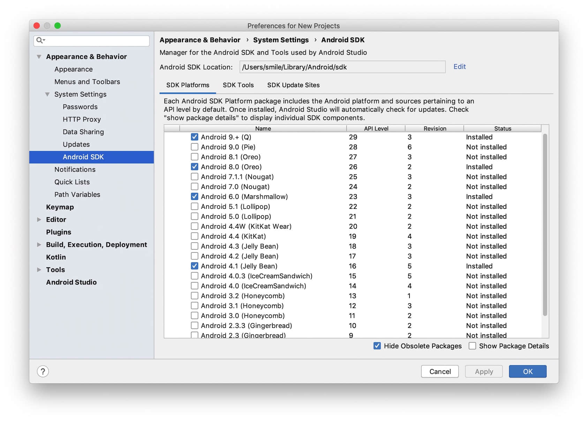

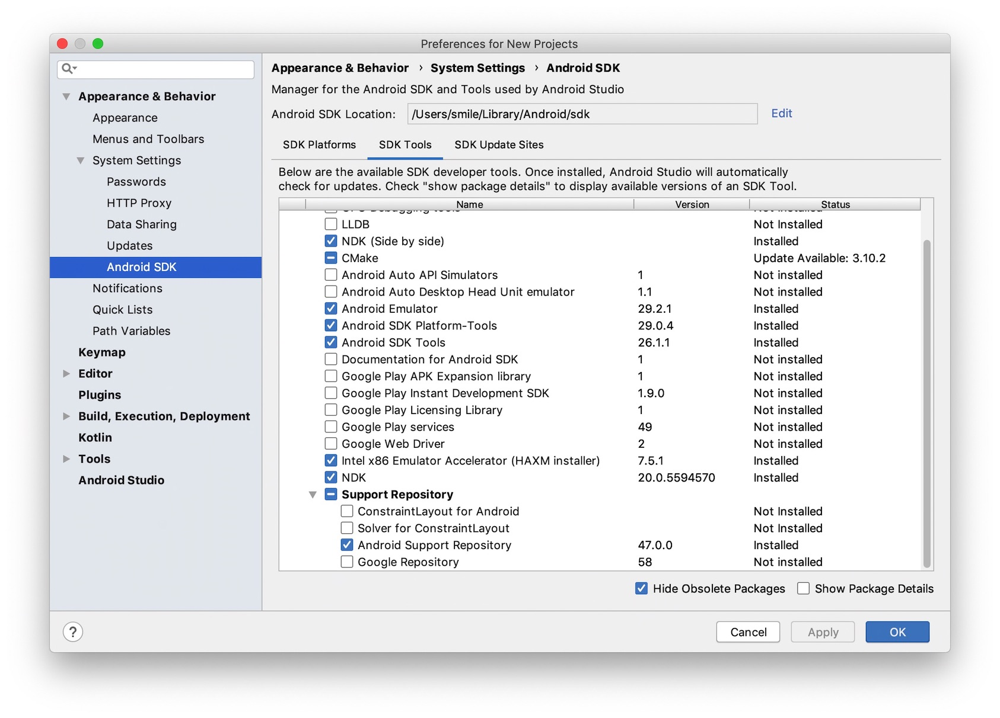

- 安装ios 需要的Xcode 

- 在这里需要配置以下两个路径：

  - **NDK 路径**，选择 `Android SDK Location` 路径下的 `ndk-bundle` 文件夹（NDK 是其根目录），不需要编译 Android 平台的话这里可以跳过。
  - **Android SDK 路径**，选择刚才在 SDK Manager 中记下的 `Android SDK Location` 路径（Android SDK 的目录下应该包含 build-tools、platforms 等文件夹），不需要编译 Android 平台的话这里可以跳过。

  配置完成后点击 **保存** 按钮，保存并关闭窗口。

  **注意**：这里的配置会在编译 **原生工程** 的时候生效。如果没有生效（一些 Mac 机器有可能出现这个情况），可能需要您尝试到 **系统环境变量** 设置这些值：`COCOS_CONSOLE_ROOT`, `NDK_ROOT`, `ANDROID_SDK_ROOT`。
  
- 如果遇到 `NDK_ROOT not defined. Please define NDK_ROOT in your environment` 这个错误

  就是环境变量的问题：

  - 问题原因：使用了`zsh ＋ iTerm2` 的配置，所以它默认启动时执行的脚本文件是 `～/.zshrc`文件

  - 解决办法：参考 [简书-DayBreakL]( https://www.jianshu.com/p/635e6cc35268)

    `vim ~/.zshrc`  //打开配置文件`.zshrc`
     `source ~/.bash_profile;`//在`.zshrc`文件末尾加上这句话，保存退出
     `source ~/.bash_profile;`//再终端中执行一次这个命令

#### 新建项目

- 我们大家Cocos Creator新建一个项目,我这里叫 mynativedemo

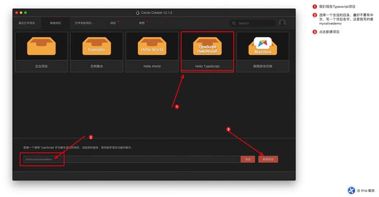

- 等待项目生成


- 我们项目生成，我们需要更改一下项目的参数设置


- 打开菜单--> 偏好设置

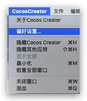

- 偏好设置-->原生开发环境配置
  - **NDK 路径**，选择 `Android SDK Location` 路径下的 `ndk-bundle` 文件夹（NDK 是其根目录）
  - **Android SDK 路径**，选择刚才在 SDK Manager 中记下的 `Android SDK Location` 路径（Android SDK 的目录下应该包含 build-tools、platforms 等文件夹）
  - 默认 `/Users/smile/Library/Android/sdk/ndk-bundle`(此处Android Studio 4.1后有改动)
  - `/Users/smile/Library/Android/sdk/ndk/21.3.6528147`
  - 默认 `/Users/smile/Library/Android/sdk`
  
  **2020-11-24 更新 --开始**
  
  升级Android Studio 4.1 关于 Android Studio 4.1这样配置会报错 
  
  A problem occurred configuring project ':app'.
  
  ```bash
  NDK is missing a “platforms” directory.
  If you are using NDK, verify the ndk.dir is set to a valid NDK directory. It is currently set to C:\DJZHAO\Workspace\Android\Sdk\ndk-bundle.
  If you are not using NDK, unset the NDK variable from ANDROID_NDK_HOME or local.properties to remove this warning.
  ```
  
  解决办法 NDK 路径不对，重新配置正确的路径 应修改为 
  
  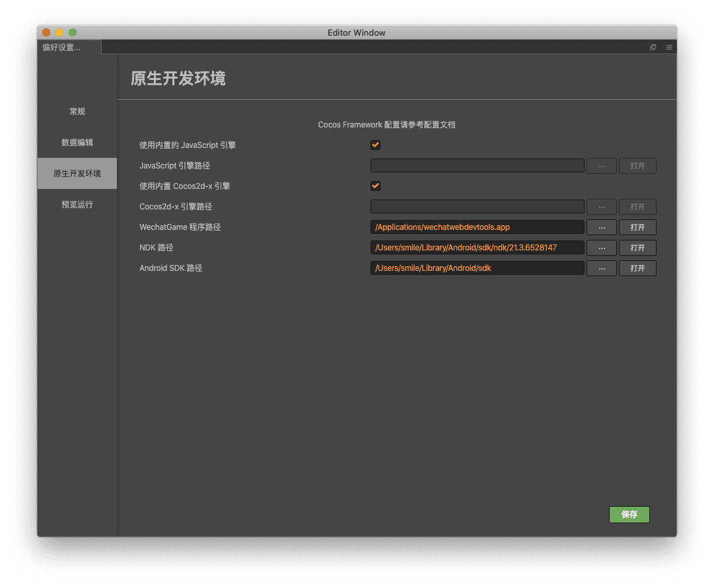
  
  `/Users/smile/Library/Android/sdk/ndk/21.3.6528147`    其中`21.3.6528147` 是自己对应下载的NDK
  
  下载ADK 
  
  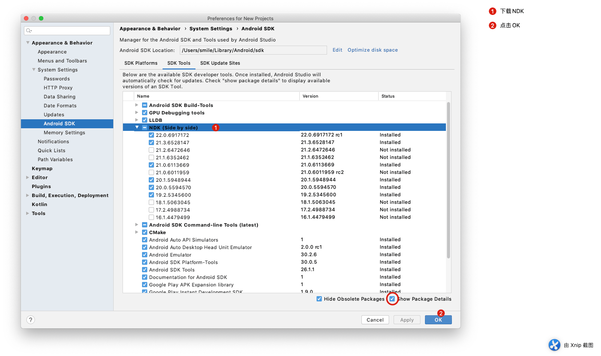
  
  **2020-11-24 更新 --结束**

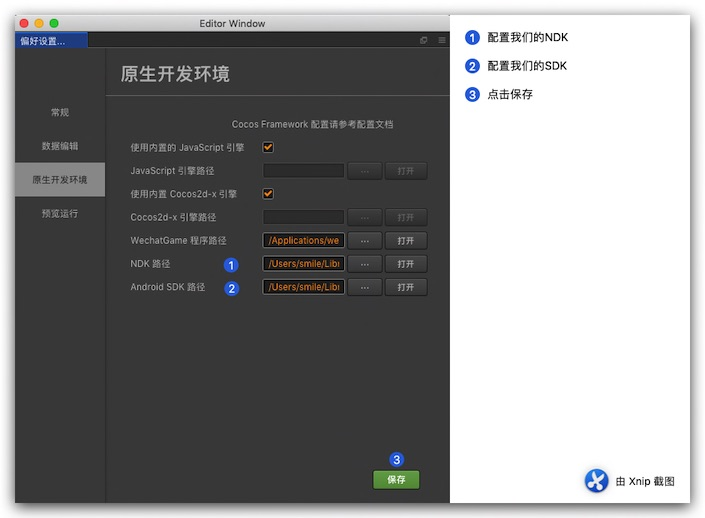

- 偏好设置-->预览运行 修改 我这里写 750 X 1334 竖屏 

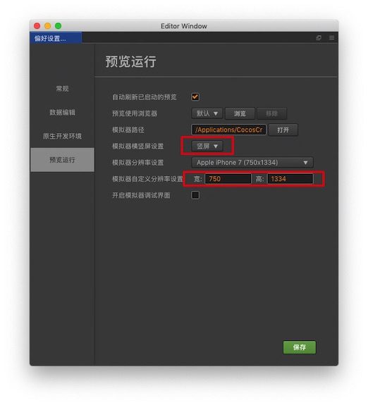

- 打开  项目-->项目设置


- 项目设置-->项目预览  设置分辨率、 适配宽度

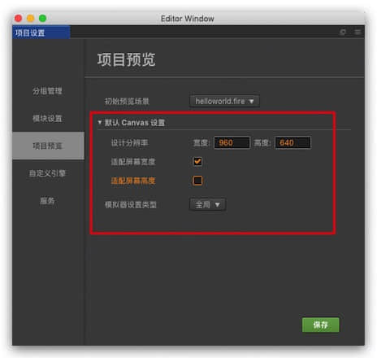

## 安卓平台（apk）

- 选择  项目-->构建发布


- 设置需要的选项

  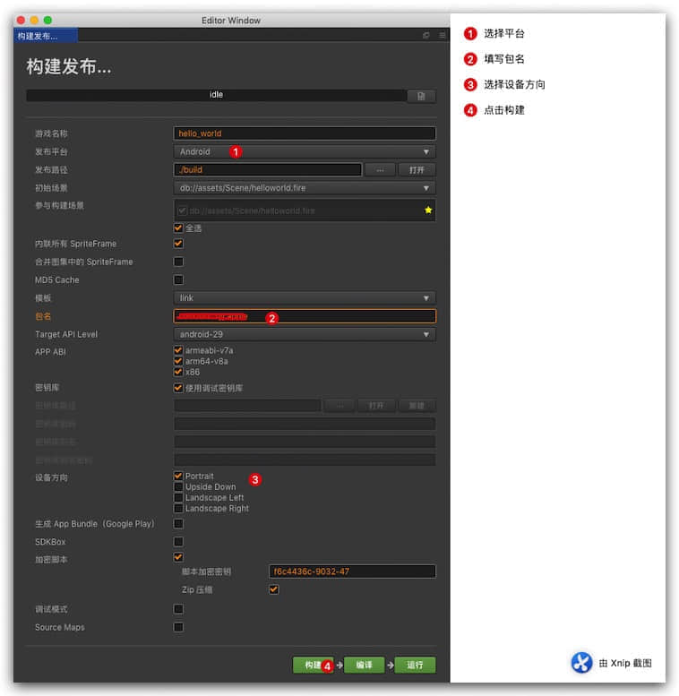

> Portrait ---> 这个是竖屏展示；
>
> Upside Down    --> 这个是手机竖屏，但是你的手机需要倒过来；
>
> Landscape Left      --> 这个是横屏，屏幕在home键左边；（常用的）
>
> Landscape Right    --> 这个也是横屏，屏幕在home右边。

附加 Android 的 API Levels对应表 大家可以根据这个表 判断自己要兼容的版本

#### Android 的 API Levels对应表

| 名称               | 版本号      | 发行日期   | API等级 |
| ------------------ | ----------- | ---------- | ------- |
| Android 11         | 11          | 2020-09-08 | 30      |
| Android 10         | 10          | 2019-09-03 | 29      |
| Pie                | 9           | 2018-08-06 | 28      |
| Oreo               | 8.0 – 8.1   | 2017-08-21 | 26 – 27 |
| Nougat             | 7.0 – 7.1.2 | 2016-08-22 | 24 – 25 |
| Marshmallow        | 6.0 – 6.0.1 | 2015-10-05 | 23      |
| Lollipop           | 5.0 – 5.1.1 | 2014-11-12 | 21 – 22 |
| KitKat             | 4.4 – 4.4.4 | 2013-10-31 | 19 – 20 |
| Jelly Bean         | 4.1 – 4.3.1 | 2012-07-09 | 16 – 18 |
| Ice Cream Sandwich | 4.0 – 4.0.4 | 2011-10-18 | 14 – 15 |
| Honeycomb          | 3.0 – 3.2.6 | 2011-02-22 | 11 – 13 |
| Gingerbread        | 2.3 – 2.3.7 | 2010-12-06 | 9 – 10  |
| Froyo              | 2.2 – 2.2.3 | 2010-05-20 | 8       |
| Eclair             | 2.0 – 2.1   | 2009-10-26 | 5 – 7   |
| Donut              | 1.6         | 2009-09-15 | 4       |
| Cupcake            | 1.5         | 2009-04-27 | 3       |
| 1.1                | 1.1         | 2009-02-09 | 2       |
| 1.0                | 1.0         | 2008-09-23 | 1       |

- 等待发布成功


控制台没有输出错误log

```bash
Start building assets
Enable "内联所有 SpriteFrame" in native platform will increase the package size used in hot update.
Finish building assets
Start building plugin scripts
Checked Python Version [2.7.16]
Built to "/test/cc/mynativedemo/build/jsb-link" successfully
```

- 此时我们的项目已经生成 在 .build 文件夹下
- 修改我们的项目 自定义部分
- 然后点击 编译按钮


- 等待项目完成


```bash
Skipping task ':hello_world:assembleRelease' as it has no actions.
:hello_world:assembleRelease (Thread[Task worker for ':' Thread 3,5,main]) completed. Took 0.0 secs.
BUILD SUCCESSFUL in 14m 13s
59 actionable tasks: 59 executed
Move apk to /test/cc/mynativedemo/build/jsb-link/publish/android
Build succeed.
Compile native project successfully.
```

路径 `build/jsb-link/publish/android`下 生成我们的APK文件

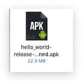

- 点击安装 运行效果


关于返回键不能正常关掉游戏的问题，此处先不谈这些，只讨论如何正确发布，这个问题，后面再说如何解决

## ios 平台（ipad）

### 准备工作

- 需要正确安装的Xcode
- 然后需要安装开发者证书
- 需要再证书添加调试设备者账号ID

### 开始构建设置

- 选择  项目-->构建发布


- 设置需要的选项

  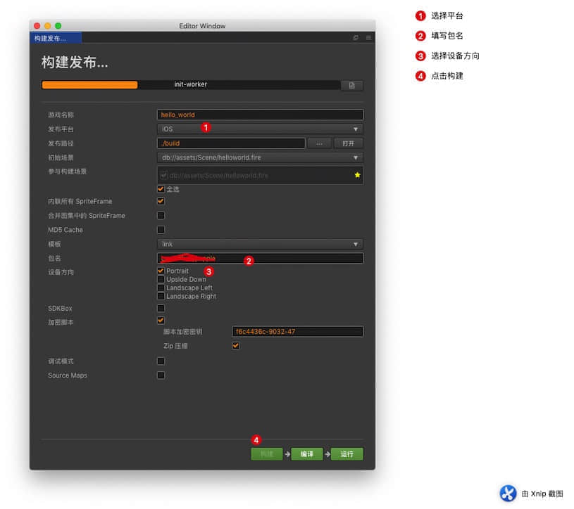

- 成功构建后


```bash
Checked Python Version [2.7.16]
Start building assets
Enable "内联所有 SpriteFrame" in native platform will increase the package size used in hot update.
Finish building assets
Start building plugin scripts
Checked Python Version [2.7.16]
Built to "/test/cc/mynativedemo/build/jsb-link" successfully
```

- 找到 构建目录.build 目录下面的 jsb-link-->frameworks-->runtime-src-->proj.ios_mac-->hello_world.xcodeproj 使用 Xcode 打开

  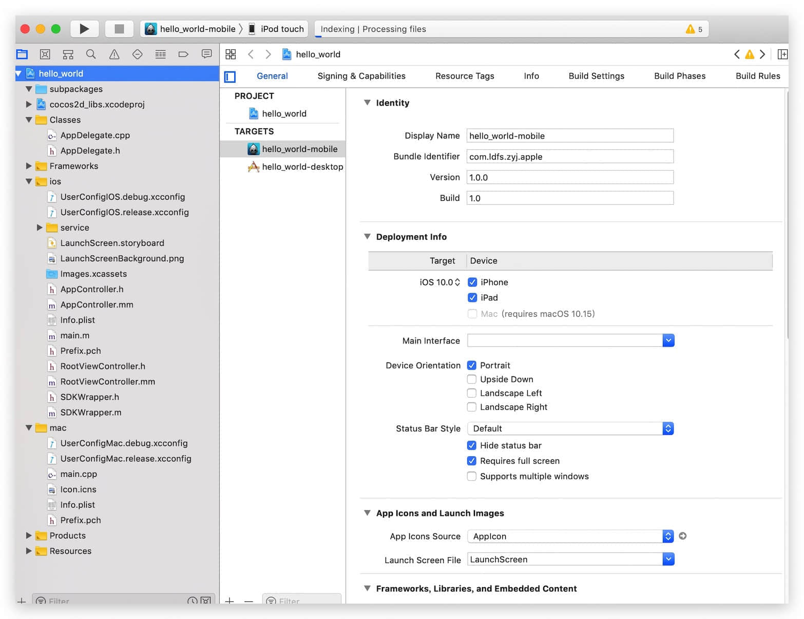

  

- 修改我们项目的配置

  - 修改秘钥

  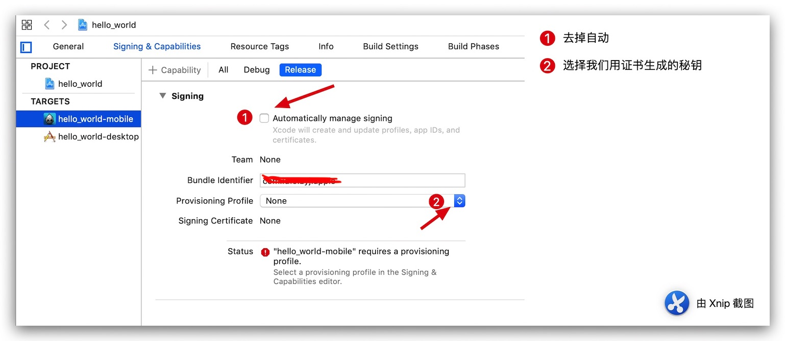

  - 修改后

    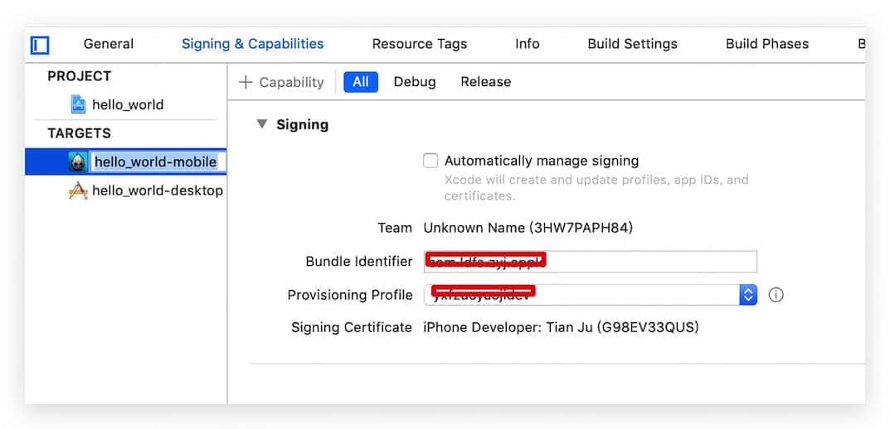

- 修改我们调试设备 Build Settings

  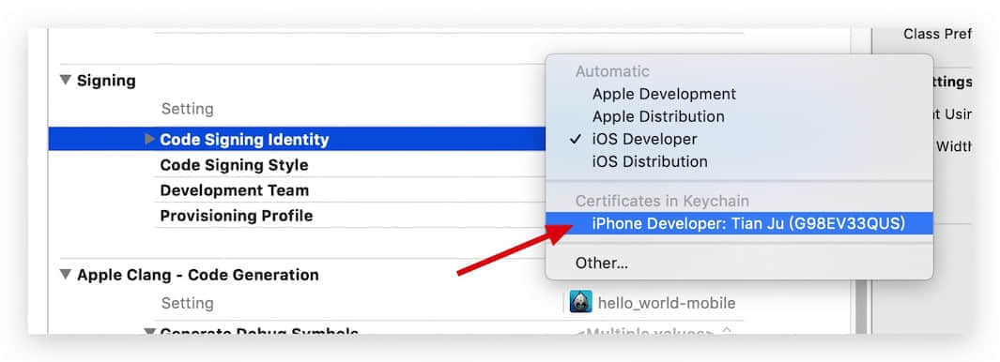

  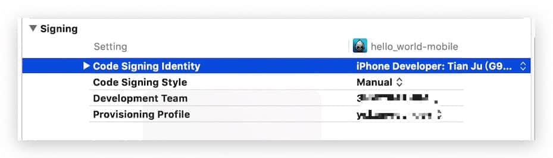

  - 连接我们的设备 然后点击运行按钮等待

  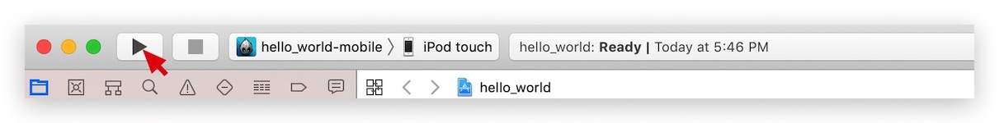

  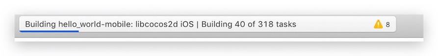

  - 编译结束

  

  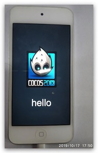

  OK 调试结束

- 导出我们的ipad 文件

  - 选择 Achieve 

    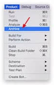

    等待编译结束

    

  - 结束后 会主动弹出一个窗口 或者我们自己打开 Window--> Organizer 打开窗口

    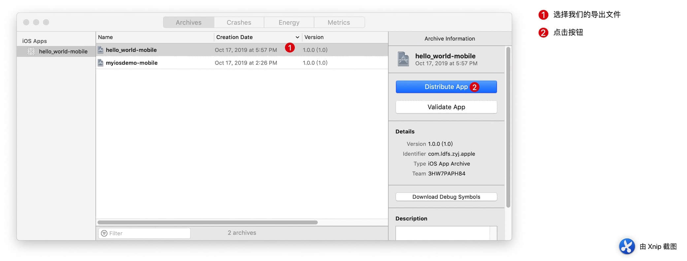

    选择 Development 点击 Next 然后 继续 Next 

    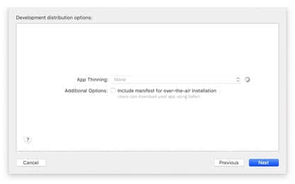

    然后选择 Profile 点击 Next

    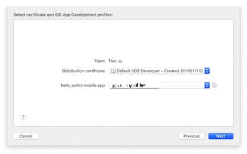

    

- 最后选择 导出 export 我们的项目

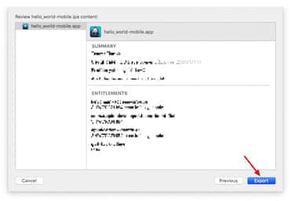

选择导出目录


最后 打开已经生成 ipa文件

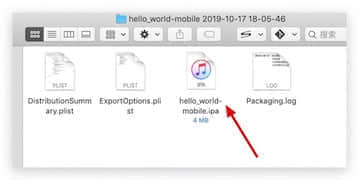

备注 导出的项目 目录 `/Users/smile/Library/Developer/Xcode/Archives` 点击小箭头 可以打开

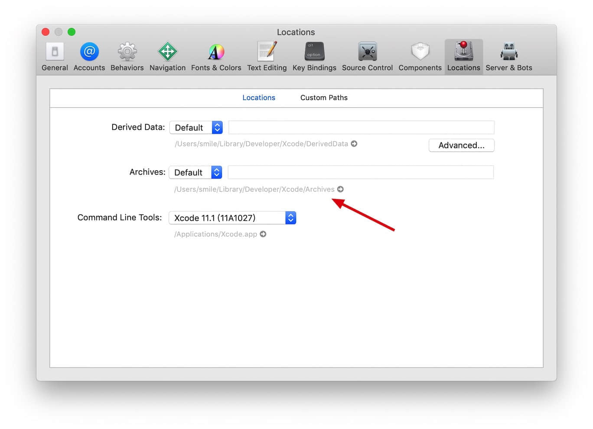


### 使用iTools 安装 ipa 文件

- 下载 iTools [进入官网](http://www.itools.cn/)
- 安装iTools
- 打开iTools软件

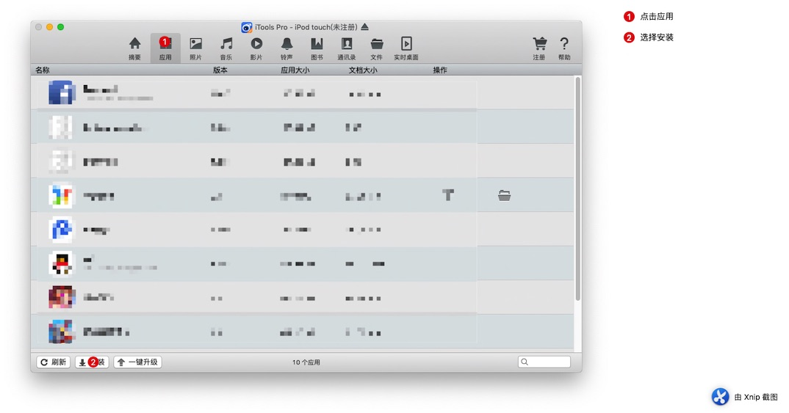

安装我们生成的ipa 文件

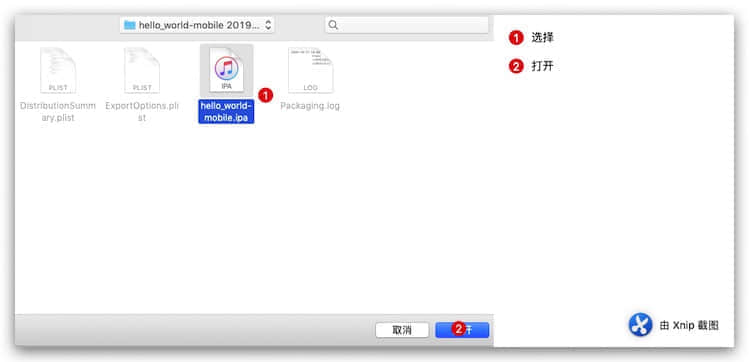

安装成功


打开运行成功


### 本地 模拟器删除缓存

删除：`/Applications/CocosCreator.app/Contents/Resources/cocos2d-x/simulator/mac/Simulator.app/Contents/Resources/jsb.sqlite` 这个文件即可

```bash
/Applications/CocosCreator.app/Contents/Resources/cocos2d-x/simulator/mac/Simulator.app/Contents/Resources/jsb.sqlite
```


**注意：删除 整个 resources 文件夹 会导致运行不起来**

关于安卓手机如何监听返回键

```javascript
 cc.systemEvent.on(cc.SystemEvent.EventType.KEY_DOWN, this.onKeyDown, this);
 onKeyDown(event) {
        switch (event.keyCode) {
            case cc.macro.KEY.back:
                cc.game.end();
                break;
            default:
        }
        // if (!this._toExitGame) {
        //     // 首次点击，重置该标记
        //     this._toExitGame = true;
        //
        //     // 发出后退消息，这里监听者来弹出提示：再次点击后退，退出游戏。
        //     // 这里要替换成自己的消息处理方法
        //     // AppFacade.getInstance().sendNotification(GAMEEVENTS.APP.TRY_EXIT);
        //
        //     // 3秒后没有再次按【后退】按钮，则重置该标记
        //     this.node.runAction(cc.sequence(cc.delayTime(3), cc.callFunc(() => {
        //         this._toExitGame = false;
        //         // this.label.string = '';
        //     })));
        // }else{
        //     // 已经点击过一次，则直接退出
        //     cc.game.end();
        //     return;
        // }
    }
```

**2021-09-24 更新**

最新版本 使用 Cocos Creator 3.3.1 版本  安卓版本 Target API Level 为 30 情况下 返回键已经无效 可以使用一个迂回的方案解决

AppActivity.java

```java
  @Override
    public boolean onKeyDown(int keyCode, KeyEvent event) {
        if(keyCode == KeyEvent.KEYCODE_BACK) {
            Cocos2dxHelper.runOnGLThread(new Runnable() {
                @Override
                public void run() { 
      Cocos2dxJavascriptJavaBridge.evalString("cc.game.jsBridge.onBackPressed();");
                }
            });
            return true;
        } else {
            return super.onKeyDown(keyCode, event);
        }
    }

```

原文链接：https://blog.csdn.net/lebsharing/article/details/110004131

JavaScript 端 写对应处理即可

```javascript
 onBackPressed() {
        console.log("----onBackPressed----");
 }
```

其他相关问题 比如 Editbox 等问题 ：

```java
@Override
public boolean onKeyDown(int keyCode, KeyEvent event) {
    if (keyCode == KeyEvent.KEYCODE_BACK){
        if(hasExitBox){//直接调用sdk的退出框
            OutFace.getInstance(this).outQuit(this);
        }else{
            JSONObject jsonObject = new JSONObject();
            try {
                jsonObject.put("status",0);
            } catch (JSONException e) {
                e.printStackTrace();
            }
            sActivity.evalStringWithJsonData("xxx.showExitAlert", jsonObject);
        }
        return true;
    }
    return super.onKeyDown(keyCode, event);
}
```

思路：就是自己把信息传到 Javascript 那边，然后处理对应的动作。

## 总结

打包Native安装包，应该了解安卓环境或者Xcode环境，熟悉项目目录结构文件配置，能更轻松顺利的解决遇到的问题。

