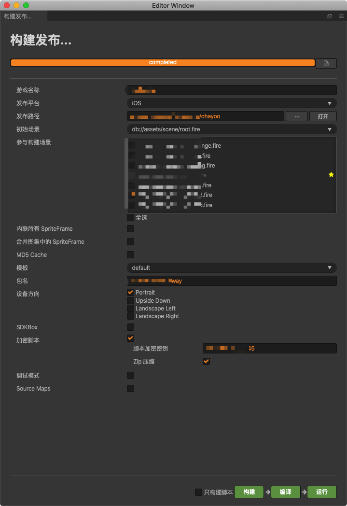
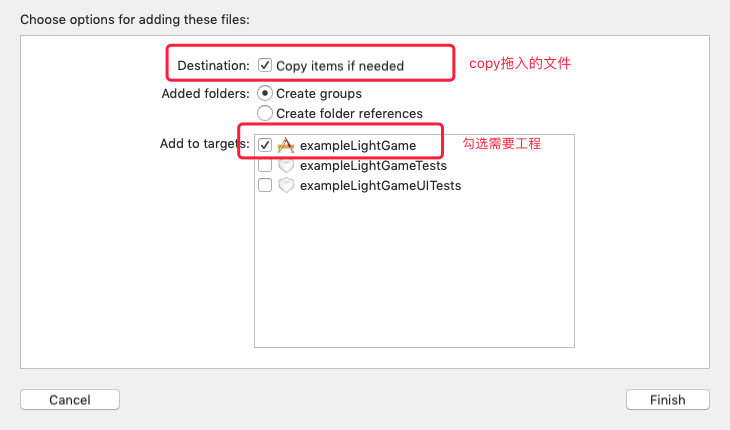
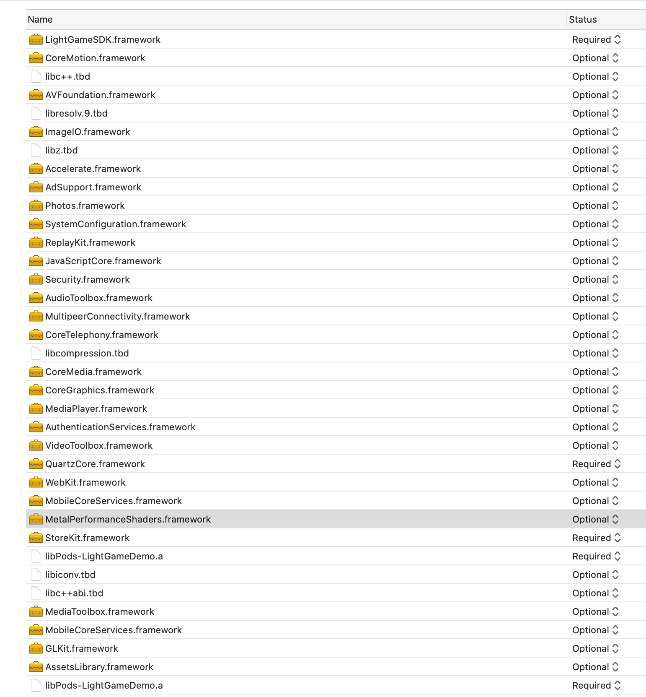
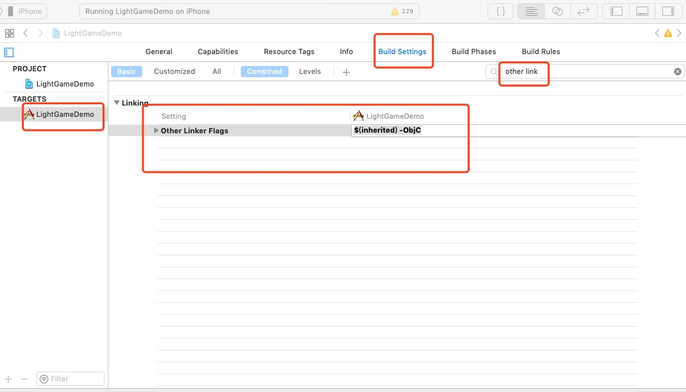
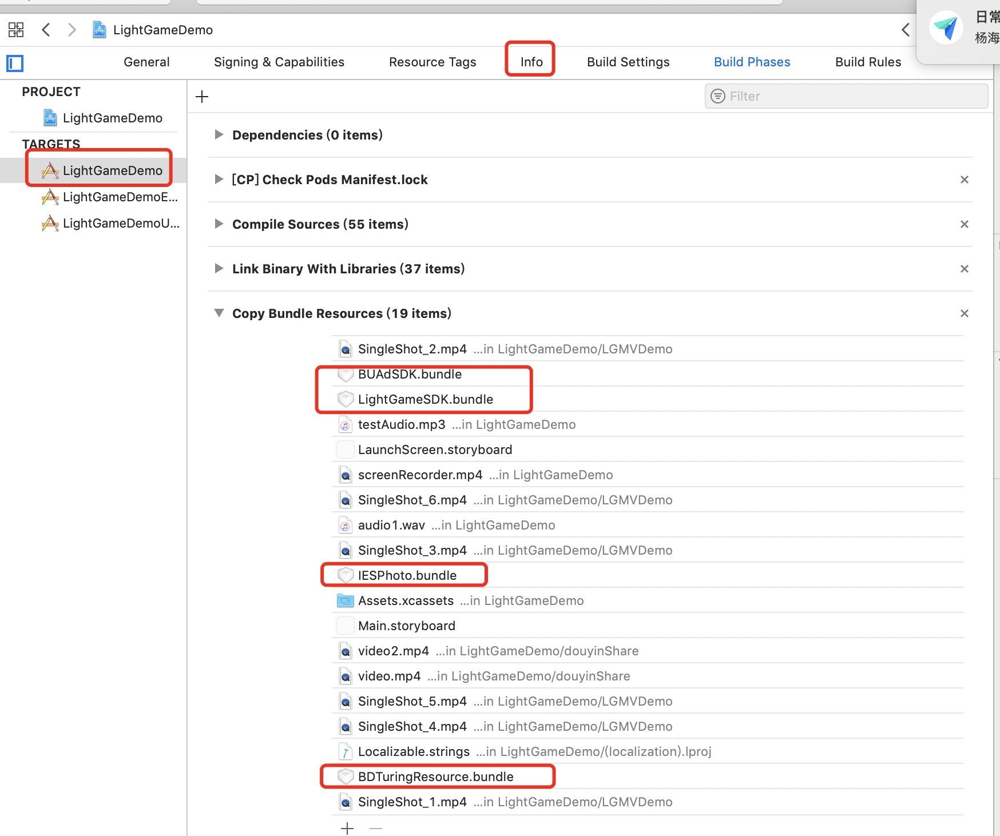
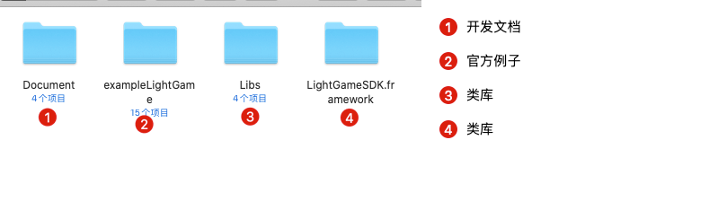
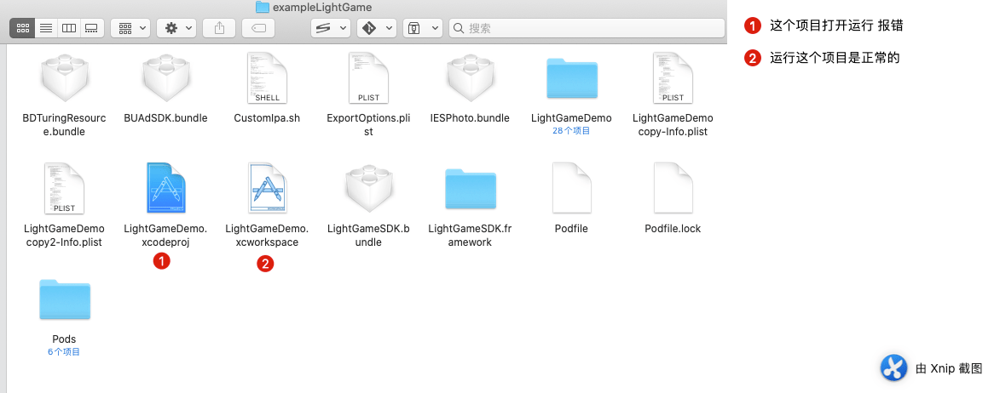
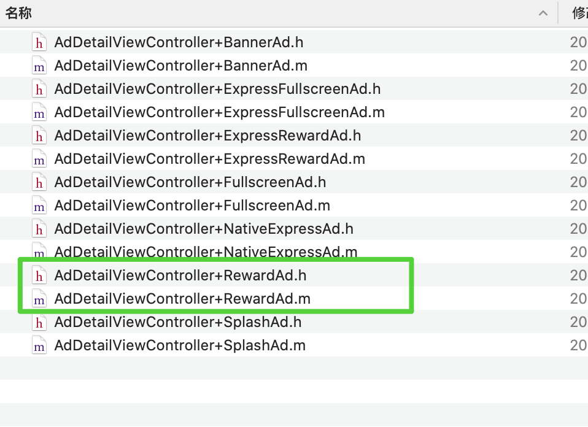

目前主流的引擎都是支持多平台发布的，一般来讲一个成功的游戏都是尽量多发几个平台，这样可以增加更多的收入，但是对于开发人员来讲，不免麻烦了许多，手里这款游戏，先后上了 App Store  快手等原生平台以及常见的几个小游戏平台，各大厂商的API 看了个遍。下面就说说Ohayoo广告变现的步骤。
<!--more-->
这边是Cocos Creator 2.3.3版本 发布的iOS工程，恰好前面接过穿山甲和腾讯的流量汇的经验，虽然对于iOS 开发不熟悉，只能依葫芦画瓢，还是顺利接成功了

### 前期代码

首先我们要做一个JavaScript环节的配置，我这边是判断是Ios的时候 初始化对应的 API实例来交互

```javascript
case PlatformPool.ohayooios://ios Ohayoo 平台
			this._api = new OhayooApi();
      break;
```

OhayooApi.js

```javascript
import {BaseApi} from "./BaseApi";
import Browser from "../base/Browser";

export class OhayooApi extends BaseApi {
    instance = null;
    static videoCallback = null;

    constructor(props) {
        super(props);
        this.NAME = "OhayooApi";
        console.log("smile----OhayooApi:", JSON.stringify("constructor"));
    }

    login(obj) {
        super.login(obj);
        this.initRewardedVideoAd();
    }

    loadRewardedVideoAd() {

    }
    initRewardedVideoAd () {
        if (!Browser.isIOS) return;
        let result = jsb.reflection.callStaticMethod("AppController", "initRewardVideo:",this.user_uuid);
        console.log("initRewardedVideoAd 返回值", result);
    }
	  showRewardedVideoAd(curUnitId, callback, aldType) {
        console.log("ios Ohayoo平台:播放广告");
        // callback && callback("success");
        OhayooApi.videoCallback = callback;
        let result = jsb.reflection.callStaticMethod("AppController", "createVideoAdIOS:",this.user_uuid);
        console.log("showRewardedVideoAd 返回值", result);
    }
    showBannerAd(curUnitId, winWidth, position) {
        console.log("ios Ohayoo平台:显示Banner");
    }

    hideBannerAd() {
        console.log("ios Ohayoo平台:关闭Banner");
    }
}

window.finishRewardVideo = (flag)=> {
    console.log("IOS 原生返回 finishRewardVideo:", flag);
    Browser.isIOS&&OhayooApi.videoCallback&&OhayooApi.videoCallback(flag);
    OhayooApi.videoCallback = null;
}
```

BaseApi.js

```javascript
/**
 * Created by jsroads 
 * Note:
 */
export class BaseApi {
    i = null;//平台全局对象实例
    NAME = "BaseApi";
    constructor(props) {
    }
    _user_uuid = "";//用户唯一标识
    login(obj) {
        this.user_uuid = this.localStorageGetUuid("uuid");
        obj.success({
            param: this.user_uuid,
        });
    }
    /**
     *  版本号比较 compareVersion('1.11.0', '1.9.9') // 1
     * @param v1
     * @param v2
     * @returns {number}
     */
    compareVersion(v1, v2) {
        v1 = v1.split('.');
        v2 = v2.split('.');
        const len = Math.max(v1.length, v2.length);
        while (v1.length < len) {
            v1.push('0')
        }
        while (v2.length < len) {
            v2.push('0')
        }
        for (let i = 0; i < len; i++) {
            const num1 = parseInt(v1[i]);
            const num2 = parseInt(v2[i]);
            if (num1 > num2) {
                return 1
            } else if (num1 < num2) {
                return -1
            }
        }
        return 0
    }
    getSystemInfo() {
        if (this.i) {
            return this.i.getSystemInfoSync();
        }
        return null;
    }
}
```

Browser.js

```javascript
/**
 * Created by jsroads
 * Note: 客户端 基本信息
 */
export default class Browser {
    static get now() {
        return cc.sys.now();
    }
    static get browserType() {
        if (Browser.usrWithKey) {
            return "password";//特殊 平台修改这里
        } else if (Browser.isAndroid) {
            return "android";//android 平台修改这里
        }else if (Browser.isIOS) {
            return "ohayooios";//ios 平台修改这里
        } else if (cc.sys.browserType === cc.sys.BROWSER_TYPE_WECHAT_GAME) {
            return "wx";//小游戏 平台修改这里
        } else {
            return "web";
        }
    }

    static get isMiniGame() {
        return cc.sys.platform === cc.sys.WECHAT_GAME;
        // return cc.sys.browserType === cc.sys.BROWSER_TYPE_WECHAT_GAME;
    }
    static get isAndroid() {
        if (cc.sys.isNative) {
            // console.log("本地平台");
            if (cc.sys.isMobile) {
                // console.log("本地移动平台");
                if (cc.sys.os == cc.sys.OS_ANDROID) {
                    // console.log("本地Android平台");
                    return true;
                } else if (cc.sys.os == cc.sys.OS_IOS) {
                    // console.log("本地ios平台");
                    return false;
                }
            } else {
                // console.log("Web平台");
                return false;
            }
        } else {
            return false;
        }
    }

    static get isIOS() {
        if (cc.sys.isNative) {
            // console.log("本地平台");
            if (cc.sys.isMobile) {
                // console.log("本地移动平台");
                if (cc.sys.os == cc.sys.OS_ANDROID) {
                    // console.log("本地Android平台");
                    return false;
                } else if (cc.sys.os == cc.sys.OS_IOS) {
                    // console.log("本地ios平台");
                    return true;
                }
            } else {
                // console.log("Web平台");
                return false;
            }
        } else {
            return false;
        }
    }
}
```

我们交互的时候调用的是  `OhayooApi.js`  initRewardedVideoAd（初始化加载广告 不播放）  和 showRewardedVideoAd（加载广告并播放）

### 导出项目

 

### 导入类库 和配置环境

我们可以先下载 demo  对照demo 去实现 更容易

#### framework导入



加入所需依赖库后如下



在你的工程文件中选择Build Setting，在"Other Linker Flags"中加入"$(inherited) -ObjC"



确认LightGameSDK.framework在TARGETS->Build Phases->Link Binary With Libraries下且status为required；同时，确保LightGameSDK.bundle在TARGETS->Build Phases->Copy Bundle Resources下才能正常使用SDK部分功能！添加以下bundle文件到主工程Target里：



#### SDK初始化

AppController初始化代码
在AppController.mm中`#import <LightGameSDK/LightGameSDK.h>`头文件，并在你的程序启动后注册你的AppID（深度转化SDK的初始化配置，要在调用初始化之前）

`didFinishLaunchingWithOptions` 方法

```c++
    // 设置debug log 方便查找问题.仅调试使⽤用。release版本请设置为 NO
    [LightGameManager isDebuLog:YES];
    // 设置debug log 默认为中文，You can change to English:LGDebugLogType_English
    [LightGameManager debugType:LGDebugLogType_Chinese];
    
    // 深度转化相关功能配置
    LGBDConfig *bdCfg = [[LGBDConfig alloc] init];
    
    // 域名默认国内
    // LGBDAutoTrackServiceVendorSG,         // 新加坡
    // LGBDAutoTrackServiceVendorVA,         // 美东
    bdCfg.serviceVendor = LGBDAutoTrackServiceVendorCN;
    // 是否在控制台输出⽇日志，仅调试使⽤用。release版本请设置为 NO
    bdCfg.showDebugLog = NO;
    // 是否加密⽇日志，默认加密。release版本请设置为 YES
    bdCfg.logNeedEncrypt = YES;
    // ⾃自定义 “⽤用户公共属性”
    bdCfg.customHeaderBlock = ^NSDictionary<NSString *,id> * _Nonnull{
        
        return @{@"gender":@"female"};
    };
    
//    [LightGameManager sharedInstance].platformAppId = @"768";
    
    [LightGameManager startWithAppID:@"你申请到的AppID" appName:@"你的AppName" channel:@"App Store"];
```

AppController 下面后面 添加方法：

```c++
#import "AdNetSDKHelper.h"

/**
 初始化视频
有参数，有返回值
*/
+(NSString *)initRewardVideo:(NSString*)videoId{
    NSLog(@"OC收到：有参数，有返回值 %@：hello",videoId);
    AdNetSDKHelper *sdk = AdNetSDKHelper::Singleton();
    sdk->Init();
    sdk->initRewardVideo("initRewardVideo");
    return @"initRewardVideo";
}

/**
 有参数，有返回值
 点击显示视频
*/
+(NSString *)createVideoAdIOS:(NSString*)videoId{
    NSLog(@"OC收到：有参数，有返回值 %@：createVideoAdIOS",videoId);
    AdNetSDKHelper *sdk = AdNetSDKHelper::Singleton();
    sdk->playRewardVideo("playRewardVideo");
    return @"hello";
}

```

需要添加几个文件

AdNetSDKHelper.h 、AdNetSDKHelper.mm、AdSdkConnector.h、AdSdkConnector.mm

AdNetSDKHelper.h

```c++
#ifndef SanGuo_xy_ChannelSDK_h
#define SanGuo_xy_ChannelSDK_h
#include "cocos2d.h"

USING_NS_CC;
#include <string>

class AdNetSDKHelper
{
public:
    
    
    static AdNetSDKHelper* Singleton();
    virtual void Init();
    virtual void Login();
    virtual void initRewardVideo(std::string name);
    virtual void playRewardVideo(std::string name);
    std::string channelName;
    bool        ok;
    bool        needLogin;
    bool        isLogin;
    int         user_id;
private:
    static AdNetSDKHelper* __instance__;
};
#endif
```

AdNetSDKHelper.mm

```c++
#include "cocos2d.h"
#include "AdSdkConnector.h"
#include "AdNetSDKHelper.h"
#ifdef  CHANNEL_MUYOUZYJ
@interface AdNetSDKHelperCallbackHandler:UIViewController
#else
@interface AdNetSDKHelperCallbackHandler:UIViewController
#endif
+ (AdNetSDKHelperCallbackHandler*)sharedHandler;
@end
static NSString *kGDTMobSDKAppId = @"19xxxx21";//你的 iOS id
static NSString *kGDTMobSDKVideoId = @"94xxxx56";// 激励视频 id
AdNetSDKHelper* AdNetSDKHelper::__instance__ = NULL;
AdNetSDKHelper* AdNetSDKHelper::Singleton(){
     if(AdNetSDKHelper::__instance__ == NULL)
     {
         AdNetSDKHelper::__instance__ = new AdNetSDKHelper();
     }
     return AdNetSDKHelper::__instance__;
};
 void AdNetSDKHelper::Init(){
     NSLog(@"AdNetSDKHelper::Init");
    AdSdkConnector *adsdk = [AdSdkConnector getInstance];
    [adsdk initBuAdSdkWarpper:kGDTMobSDKVideoId];

 };
void AdNetSDKHelper::initRewardVideo(std::string name){
    AdSdkConnector *adsdk = [AdSdkConnector getInstance];
    [adsdk loadVideo:kGDTMobSDKVideoId autoPlay:@"not play"];
}

void AdNetSDKHelper::playRewardVideo(std::string name){
    AdSdkConnector *adsdk = [AdSdkConnector getInstance];
    [adsdk playVideo:kGDTMobSDKVideoId];
}
```

AdSdkConnector.h

```c++
#include <string>
//#import "GDTRewardVideoAd.h"
#import "RootViewController.h"
#import <LightGameSDK/LGRewardedVideoAd.h>
@interface AdSdkConnector  : RootViewController<LGRewardedVideoAdDelegate>{
        bool isRewardedVideoPlayFinish;
        bool isRewardedVideoAutoPlay;
        NSString* rewardPlacementId;
}
//@property (nonatomic, strong) LGRewardedVideoAd *rewardVideoAd;
+ (AdSdkConnector *) getInstance;            //用来获取实例的方法
- (void) loadVideo: (NSString *)placementId autoPlay: (NSString *)autoPlayFlag;
- (void) initBuAdSdkWarpper: (NSString *)placementId;
- (void) playVideo: (NSString *)placementId;
@end
```

AdSdkConnector.mm

```c++
#import "AppController.h"
#import "RootViewController.h"
#include "cocos/scripting/js-bindings/jswrapper/SeApi.h"
#import "cocos2d.h"

#import "objc/runtime.h"

#import "AdSdkConnector.h"

static NSString *AdDetail_rewardedVideoAdKey = @"AdDetail_rewardedVideoAdKey";

static AdSdkConnector *instance;    //这里声明一下静态实例，方便javascript层调用
@implementation AdSdkConnector


//获取实例的方法，方便javascript层调用
+(AdSdkConnector *) getInstance{
    if (!instance) {
           instance = [[AdSdkConnector alloc] init];
       }
       return instance;
}

- (id)init{
    return self;
}
//
//打开激励视频的方法
-(void) initBuAdSdkWarpper: (NSString *)placementId{
// NSString* appidString = [[NSString alloc] initWithUTF8String: name];
// NSLog(@"initBuAdSdkWarppers %@",appidString);
    NSLog(@"initBuAdSdkWarppers");
    rewardPlacementId = placementId;
//    self.rewardedVideoAd.delegate = self;
}

-(void) loadVideo: (NSString *)placementId autoPlay: (NSString *)autoPlayFlag{
    NSLog(@"loadVideo %@",placementId);
    BOOL res =  [autoPlayFlag isEqualToString:@"play"];
    if(res){
        isRewardedVideoAutoPlay = res;
            NSLog(@"需要播放广告了");
    }else{
         isRewardedVideoAutoPlay = res;
          NSLog(@"不需要播放广告");
    }
    [self __loadRewardedVideoADWithSlotID:placementId];
}

- (void)__loadRewardedVideoADWithSlotID:(NSString *)slotID {
    LGRewardedVideoModel *rewardModel = [[LGRewardedVideoModel alloc] init];
    // 必填参数 这里使用 官方 demo自带的 参数
    rewardModel.userId = @"900546826";
    
    // 选填参数
    rewardModel.rewardName = @"特大激励";
    rewardModel.rewardAmount = 10;
    rewardModel.extra = @"serializedString.";
    
    self.rewardedVideoAd = [[LGRewardedVideoAd alloc] initWithSlotID:slotID rewardedVideoModel:rewardModel];
    self.rewardedVideoAd.delegate = self;
    [self.rewardedVideoAd loadAdData];
}

- (LGRewardedVideoAd *)rewardedVideoAd {
    return objc_getAssociatedObject(self, &AdDetail_rewardedVideoAdKey);
}
- (void)setRewardedVideoAd:(LGRewardedVideoAd *)rewardedVideoAd {
    objc_setAssociatedObject(self, &AdDetail_rewardedVideoAdKey, rewardedVideoAd, OBJC_ASSOCIATION_RETAIN_NONATOMIC);
}


// 确认激励视频广告有效性之后，在合适的时机展示广告
- (void)playVideo: (NSString *)placementId {
    NSLog(@"playVideo placementId...%@",placementId);
    if (!self.rewardedVideoAd.isAdValid) {
        NSLog(@"广告失效!，请重新拉取");
        [self loadVideo:placementId autoPlay:@"play"];
        return;
    }
    [self showRewardAd];
}

///展示激励视频广告
- (void)showRewardAd {
    NSLog(@"showRewardAd ...");
    if ([self.rewardedVideoAd isAdValid]) {
        // 视频内容load成功后才能展示广告
        NSLog(@"showAdFromRootViewController ...");
//        [self.rewardedVideoAd showAdFromRootViewController:self.navigationController];
        UIViewController *rootViewController = [UIApplication sharedApplication].keyWindow.rootViewController;
        if (rootViewController != nil) {
            isRewardedVideoPlayFinish = false;
            NSLog(@"isRewardedVideoPlayFinish ...");
            [self.rewardedVideoAd showAdFromRootViewController:rootViewController];
        }else{
            NSLog(@"视图空了 拉取");
        }
    }
}

///在场景中展示激励视频广告
- (void)showRewardAdWithScene {
    NSLog(@"showRewardAdWithScene ...");
    if ([self.rewardedVideoAd isAdValid]) {
        // 视频内容load成功后才能展示广告
        NSLog(@"showAdFromRootViewController ..BURitSceneType_custom.");
        [self.rewardedVideoAd showAdFromRootViewController:self.navigationController ritScene:BURitSceneType_custom ritSceneDescribe:@"BURitSceneType_custom"];
    }
}


#pragma <LGRewardedVideoAdDelegate>
///以下代理按需实现
- (void)rewardedVideoAdDidLoad:(LGRewardedVideoAd *)rewardedVideoAd {
    NSLog(@"rewardedVideoAd DidLoad...\n");
    // 物料加载后广告才会可用
    [self.rewardedVideoAd isAdValid];
}
    

- (void)rewardedVideoAd:(LGRewardedVideoAd *)rewardedVideoAd didFailWithError:(NSError *)error {
    NSLog(@"rewardedVideoAd didFailWithError--%ld:%@\n", (long)error.code, error.localizedDescription);
}


- (void)rewardedVideoAdVideoDidLoad:(LGRewardedVideoAd *)rewardedVideoAd {
    NSLog(@"rewardedVideoAd VideoDidLoad...\n");
    NSLog(@"rewardedVideoAd 加载好了...\n");
    if(isRewardedVideoAutoPlay){
        NSLog(@"需要播放广告了!!");
        isRewardedVideoAutoPlay = NO;
        UIViewController *rootViewController = [UIApplication sharedApplication].keyWindow.rootViewController;
        if (rootViewController != nil) {
            isRewardedVideoPlayFinish = false;
            [self.rewardedVideoAd showAdFromRootViewController:rootViewController];
        }else{
            NSLog(@"视图空了 拉取");
        }
      }else{
        NSLog(@"不需要播放广告!!");
      }
}


- (void)rewardedVideoAdWillVisible:(LGRewardedVideoAd *)rewardedVideoAd {
    NSLog(@"rewardedVideoAd WillVisible...\n");
}

- (void)rewardedVideoAdDidVisible:(LGRewardedVideoAd *)rewardedVideoAd {
     NSLog(@"rewardedVideoAd DidVisible...\n");
}

- (void)rewardedVideoAdWillClose:(LGRewardedVideoAd *)rewardedVideoAd {
    NSLog(@"rewardedVideoAd WillClose...\n");
}

- (void)rewardedVideoAdDidClose:(LGRewardedVideoAd *)rewardedVideoAd {
    NSLog(@"rewardedVideoAd DidClose...\n");
//    [self.navigationController popViewControllerAnimated:YES];
    
//    self.rewardedVideoAd = nil;
    NSLog(@"广告已关闭");
//    [GDTAction logAction:GDTSDKActionNameCompleteOrder actionParam:@{@"value":@"COMPLETE_ORDER"}];
    [self callJsEngineCallBack:isRewardedVideoPlayFinish name:@"video"];
    [self loadVideo:rewardPlacementId autoPlay:@"not play"];
}

- (void)rewardedVideoAdDidClick:(LGRewardedVideoAd *)rewardedVideoAd {
    NSLog(@"rewardedVideoAd DidClick...\n");
}

- (void)rewardedVideoAdDidPlayFinish:(LGRewardedVideoAd *)rewardedVideoAd didFailWithError:(NSError *)error {
    NSLog(@"rewardedVideoAd DidPlayFinish... errer---%ld:%@\n", error.code, error.localizedDescription);
}

- (void)rewardedVideoAdServerRewardDidSucceed:(LGRewardedVideoAd *)rewardedVideoAd verify:(BOOL)verify {
    NSLog(@"rewardedVideoAdServerRewardDidSucceed verify...\n");
    isRewardedVideoPlayFinish = true;
}

- (void)rewardedVideoAdServerRewardDidFail:(LGRewardedVideoAd *)rewardedVideoAd {
    NSLog(@"rewardedVideoAd ServerRewardDidFail...\n");
}

- (void)rewardedVideoAdDidClickSkip:(LGRewardedVideoAd *)rewardedVideoAd {
    NSLog(@"rewardedVideoAd DidClickSkip...\n");
}

-(void)callJsEngineCallBack:(BOOL) successful  name:(NSString*) name {
    NSLog(@"callJsEngineCallBack...");
    NSString *funcNameStr = @"finishRewardVideo";
    std::string funcName = [funcNameStr UTF8String];
//    NSNumber *successfulNumber = [NSNumber numberWithBool:successful];
    std::string finish = "fail";
    if(successful == true){
        finish = "success";
    }
    std::string jsCallStr = cocos2d::StringUtils::format("%s(\"%s\");",funcName.c_str(),finish.c_str());
    NSLog(@"jsCallStr = %s", jsCallStr.c_str());
    se::ScriptEngine::getInstance()->evalString(jsCallStr.c_str());
}
@end
```

以上 这些 就是代码的基本逻辑


### 注意

主要是两个地方 一个是获取 UIViewController 的实例

```c++
 UIViewController *rootViewController = [UIApplication sharedApplication].keyWindow.rootViewController;
        if (rootViewController != nil) {
            isRewardedVideoPlayFinish = false;
            NSLog(@"isRewardedVideoPlayFinish ...");
            [self.rewardedVideoAd showAdFromRootViewController:rootViewController];
        }else{
            NSLog(@"视图空了 拉取");
        }
```

另外一个 回调 JS 代码

```c++
-(void)callJsEngineCallBack:(BOOL) successful  name:(NSString*) name {
    NSLog(@"callJsEngineCallBack...");
    NSString *funcNameStr = @"finishRewardVideo";
    std::string funcName = [funcNameStr UTF8String];
//    NSNumber *successfulNumber = [NSNumber numberWithBool:successful];
    std::string finish = "fail";
    if(successful == true){
        finish = "success";
    }
    std::string jsCallStr = cocos2d::StringUtils::format("%s(\"%s\");",funcName.c_str(),finish.c_str());
    NSLog(@"jsCallStr = %s", jsCallStr.c_str());
    se::ScriptEngine::getInstance()->evalString(jsCallStr.c_str());
}
```

上面就是 整个代码的核心逻辑

官方的demo 下载后 是这样的



直接运行 Xcode 项目是错的



官方的例子 代码在exampleLightGame/LightGameDemo/Home/Categories/Ad/Detail 下面的 



这两个文件，然后根据官方例子 比着写要容易的多。

### 小插曲

如果遇到错误 

> rewardedVideoAd didFailWithError--40016:代码位ID 与应用ID 不匹配或者应用ID 缺失。初始化时需要填写appid，在activity中需要填写代码位ID。媒体要确保这两个填写正确且匹配。

原因是 没有进行游戏初始化工作 需要 初始化

```C++
[LightGameManager startWithAppID:@"KMFzTCk4EJ1daUVjQswhG15abNQjM38ALrhxby08H8MjC1RYe+ceEEFHeLRaQy8pcdkwHk9hVt4tHVJoVswiGlpNdMBlZgIALpdZW39PeYBuRhIdLaVcFQVSPKRNQFFPf8FmXCk4EJ1daUVjQo1lHFxYPNczfmoAP4YiLTtXJj+KdUACBg==" appName:@"light_game_sdk" channel:@"App Store"];
```

### 总结

总来来说，不论是流量汇或者Ohayoo激励视频 都和 穿山甲很相似，这其中数穿山甲官方教程最为详细，反正就是几个文档结合着看吧 基本都是播放广告后添加一个监听，在视频广告结束后关闭的时候 下发奖励并且加载下一个广告，这样下次可以直接播放，不会出现加载的短暂黑屏。


### 常见问题汇总

| **序号** | **问题类型**  | **问题描述**           | **影响**               | **解决方案**                                                 |
| -------- | ------------- | ---------------------- | ---------------------- | ------------------------------------------------------------ |
| 1        | 深度转化  SDK | appname 与预期不一致   | 影响数据分析           | cp接入sdk的初始化代码中的appname=开平后台的游戏中文名=提供给测试的appname |
| 2        | 深度转化 SDK  | app_version 非 3 段式  | 数据分析时无法区分版本 | cp 修改版本号为 X.X.X 三段式                                 |
| 3        | 深度转化 SDK  | channel 与预期不一致   | 影响数据分析           | iOS 一定是 App StoreAndroid：一定不能是 App Store必须是英文官方渠道是 jrtt，其他请自行确认，避免使用 test |
| 4        | 深度转化 SDK  | Android缺少appname上报 | 无                     | Android的深度转化由于设计原因，不需要上报appname             |


### 参考

- [前端SDK概述](https://ohayoo.cn/sdk/document/1642/18852/)
- [Ohayoo SDK服务器文档](https://bytedance.feishu.cn/docs/doccnWUsiA5tsiCcmcIvan3z10c#)